# JVM

## JVM架构

* 类加载器
* 运行时数据区
* 执行引擎

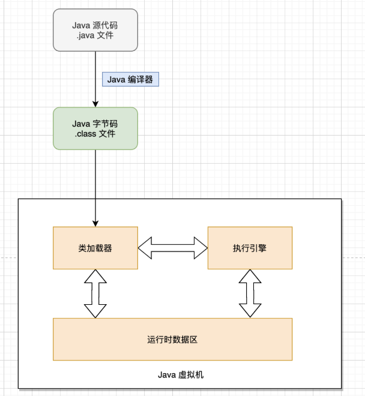

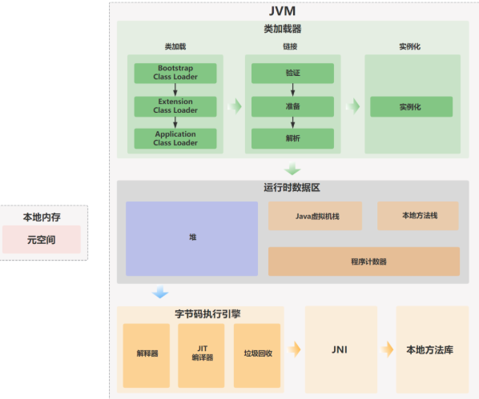

### 类加载器

* 加载.class文件
* 将字节码加载到内存中
* 加载--连接--实例化

### 执行引擎

* 将字节码指令解释为平台本地机器指令
* 将高级语言翻译为机器语言
* 解释器：读取字节码，然后执行指令。因为它是一行一行地解释和执行指令，所以它可以很快地解释字节码，但是执行起来会比较慢 。
* 即时编译器：选择性的把一些热点代码编译成本地代码。执行本地代码比一条一条进行解释执行的速度快很多，因为本地代码是保存在缓存里的。
* 垃圾回收器，用来回收堆内存中的垃圾对象。

## Java内存区域

### 运行时数据区

* JDK1.7：
* 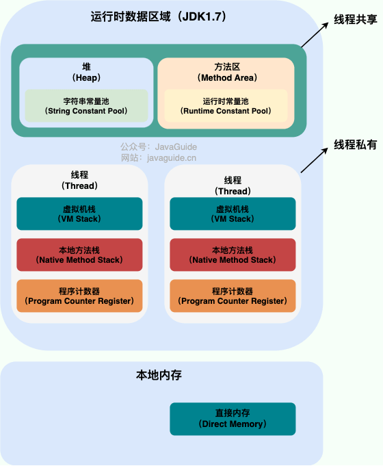
* JDK1.8，将方法区和运行时常量池迁移到本地内存
* 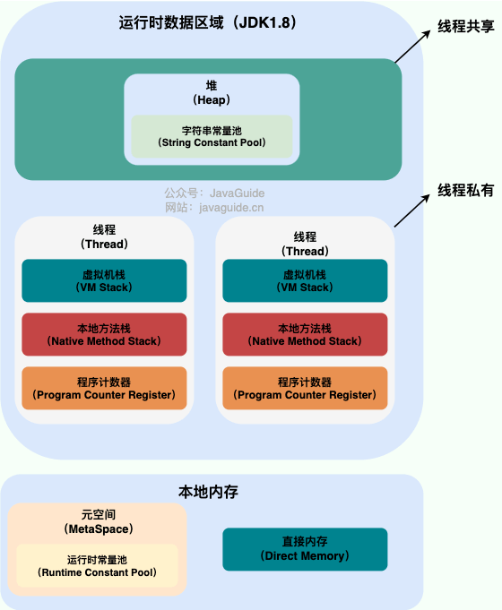
* 线程私有：程序计数器、虚拟机栈、本地方法栈
* 线程共享：堆、方法区、直接内存

### 程序计数器

* 实现代码流程控制（顺序、选择、循环、异常处理等）
* 多线程环境下，记录当前线程的执行位置

### Java虚拟机栈

* 除了Native方法，其他Java方法都是通过栈实现的
* 栈由一个个栈帧组成，每个栈帧包括：
  * 局部变量表
  * 操作数栈
  * 动态链接
  * 方法返回地址
* 局部变量表
  * 存放编译期间可知的各种数据类型（int、long等）、对象引用
* 操作数栈
  * 用于存放方法执行过程中产生的中间计算结果和计算过程中产生的临时变量
* 动态链接
  * 在 Class 文件中，方法调用以**符号引用**的形式存在于常量池。为了执行调用，需要被转换为内存中的**直接引用**
  * 对于需要根据对象实际类型才能确定具体实现的 **虚方法** （这是实现多态的基础），这个转换过程则被推迟到 **程序运行期间** ，由**动态链接**来完成

### 本地方法栈

* 为Native方法服务，存放本地方法的局部变量表、操作数栈、动态链接、出口信息。

### 堆

* **此内存区域的唯一目的就是存放对象实例，几乎所有的对象实例以及数组都在这里分配内存。**
* 从 JDK 1.7 开始已经默认开启逃逸分析，如果某些方法中的对象引用没有被返回或者未被外面使用，那么对象可以直接在栈上分配内存。
* 垃圾收集器管理的主要区域

### 方法区

* 主要存储以下数据：
  * 类的元数据
  * 方法的字节码
  * 运行时常量池
* 不存储在方法区内的：
  * 静态变量：堆
  * 字符串常量池：堆
  * 代码缓存：缓存

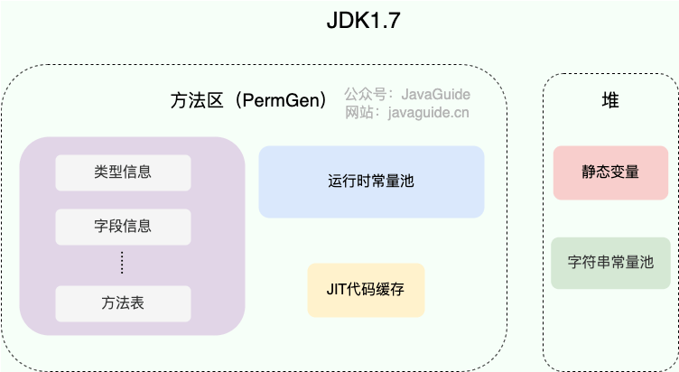

* 方法区/永久代变为元空间：
  * 整个永久代有一个 JVM 本身设置的固定大小上限，无法进行调整，而元空间使用的是本地内存
  * 元空间里面存放的是类的元数据，能加载的类更多
  * 永久代会为 GC 带来不必要的复杂度，并且回收效率偏低

### 运行时常量池

### 字符串常量池

* 避免字符串的重复创建

### 直接内存

## HotSpot虚拟机

### 创建对象

* 1.类加载检查

  * 虚拟机遇到一条 new 指令时
  * 首先将检查这个指令的参数是否能在常量池中定位到这个类的符号引用，并且检查这个符号引用代表的类是否已被加载过、解析和初始化过。
  * 如果没有，那必须先执行相应的类加载过程。
* 2.分配内存

  * 对象所需的内存大小在类加载完成后便可确定
  * 把一块确定大小的内存从 Java 堆中划分出来
* 3.初始化零值

  * 虚拟机将分配到的内存空间都初始化为零值
* 4.设置对象头

  * 对对象进行设置，例如这个对象是哪个类的实例、如何才能找到类的元数据信息
* 5.执行init方法

  * 此时从 Java 程序的视角来看，对象创建才刚开始，`<init>` 方法还没有执行，所有的字段都还为零
  * 执行 `<init>` 方法，把对象按照程序员的意愿进行初始化
* 内存分配两种方式

  * 指针碰撞
    * 适用场合：堆内存规整（即没有内存碎片）的情况下。
    * 原理：用过的内存全部整合到一边，没有用过的内存放在另一边，中间有一个分界指针，只需要向着没用过的内存方向将该指针移动对象内存大小位置即可。
  * 空闲列表
    * 适用场合：堆内存不规整的情况下。
    * 原理：虚拟机会维护一个列表，该列表中会记录哪些内存块是可用的，在分配的时候，找一块儿足够大的内存块儿来划分给对象实例，最后更新列表记录。
* 内存分配并发问题

  * **CAS+失败重试：** CAS 是乐观锁的一种实现方式。所谓乐观锁就是，每次不加锁而是假设没有冲突而去完成某项操作，如果因为冲突失败就重试，直到成功为止。**虚拟机采用 CAS 配上失败重试的方式保证更新操作的原子性。**
  * **TLAB：** 为每一个线程预先在 Eden 区分配一块儿内存，JVM 在给线程中的对象分配内存时，首先在 TLAB 分配，当对象大于 TLAB 中的剩余内存或 TLAB 的内存已用尽时，再采用上述的 CAS 进行内存分配

### 对象内存布局

* **对象头（Header）** 、 **实例数据（Instance Data）**和**对齐填充（Padding）** 。
* 对象头：
  * 标记字段：用于存储对象自身的运行时数据
  * 类型指针：对象指向它的类元数据的指针，虚拟机通过这个指针来确定这个对象是哪个类的实例。
* 实例数据：**对象真正存储的有效信息** ，也是在程序中所定义的各种类型的字段内容
* 对齐填充：占位，类似高程

### 对象访问定位

* 使用句柄
  * Java 堆中将会划分出一块内存来作为句柄池，reference 中存储的就是对象的句柄地址，而句柄中包含了对象实例数据与对象类型数据各自的具体地址信息。
  * 优点：稳定，对象被移动后只需要改变示例数据指针
  * 
* 直接指针
  * 如果使用直接指针访问，reference 中存储的直接就是对象的地址。
  * 优点：速度快
  * 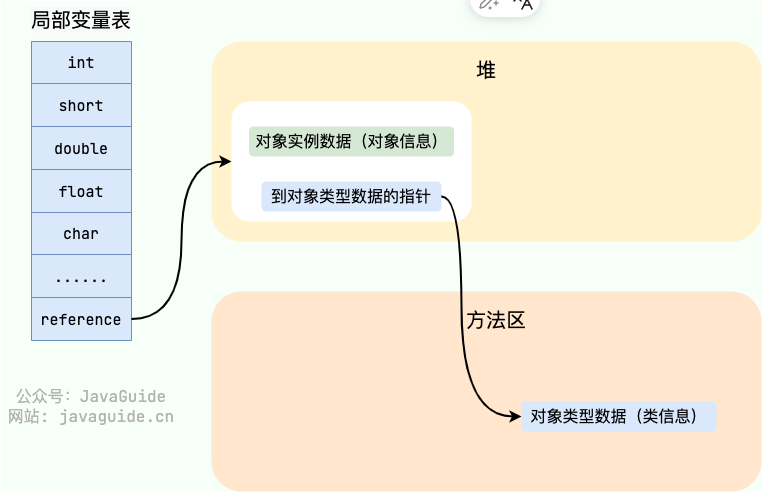

## Java垃圾回收

### 堆空间基本结构

在 JDK 7 版本及 JDK 7 版本之前，堆内存被通常分为下面三部分：

1. 新生代内存(Young Generation)
2. 老生代(Old Generation)
3. 永久代(Permanent Generation)

**JDK 8 版本之后 PermGen(永久) 已被 Metaspace(元空间) 取代，元空间使用的是直接内存** 。

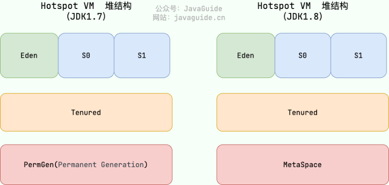

### 内存分配回收原则

* 对象优先在Eden区分配
  * 大多数情况下，对象在新生代中 Eden 区分配。
  * 当 Eden 区没有足够空间进行分配时，虚拟机将发起一次 Minor GC
* 大对象直接进入老年代
  * 大对象：需要大量连续内存空间的对象（比如：字符串、数组）
  * 该行为由虚拟机决定
* 长期存活的对象进入老年代
  * 虚拟机给每个对象一个对象年龄（Age）计数器
  * 如果对象在 Eden 出生并经过第一次 Minor GC 后仍然能够存活，并且能被 Survivor 容纳的话，将被移动到 Survivor 空间（s0 或者 s1）中，并将对象年龄设为 1
  * 对象在 Survivor 中每熬过一次 MinorGC,年龄就增加 1 岁，当它的年龄增加到一定程度（默认为 15 岁），就会被晋升到老年代中

### 主要进行gc的区域

* 部分收集 (Partial GC)：

  * 新生代收集（Minor GC / Young GC）：只对新生代进行垃圾收集；
  * 老年代收集（Major GC / Old GC）：只对老年代进行垃圾收集。需要注意的是 Major GC 在有的语境中也用于指代整堆收集；
  * 混合收集（Mixed GC）：对整个新生代和部分老年代进行垃圾收集。

整堆收集 (Full GC)：收集整个 Java 堆和方法区。

### 空间分配担保

* 确保在 Minor GC 之前老年代本身还有容纳新生代所有对象的剩余空间

## 死亡对象判断方法

* 引用计数法
  * 过程

    * 给对象中添加一个引用计数器：
    * 每当有一个地方引用它，计数器就加 1；
    * 当引用失效，计数器就减 1；
    * 任何时候计数器为 0 的对象就是不可能再被使用的。
  * 优点：简单、效率高
  * 缺点：难以解决对象循环引用的问题
* 可达性分析算法
  * 过程
    * 通过一系列的称为 **“GC Roots”** 的对象作为起点
    * 从这些节点开始向下搜索，节点所走过的路径称为引用
    * 当一个对象到 GC Roots 没有任何引用链相连的话，则证明此对象是不可用的，需要被回收。（如图中Object6-Object10
    * 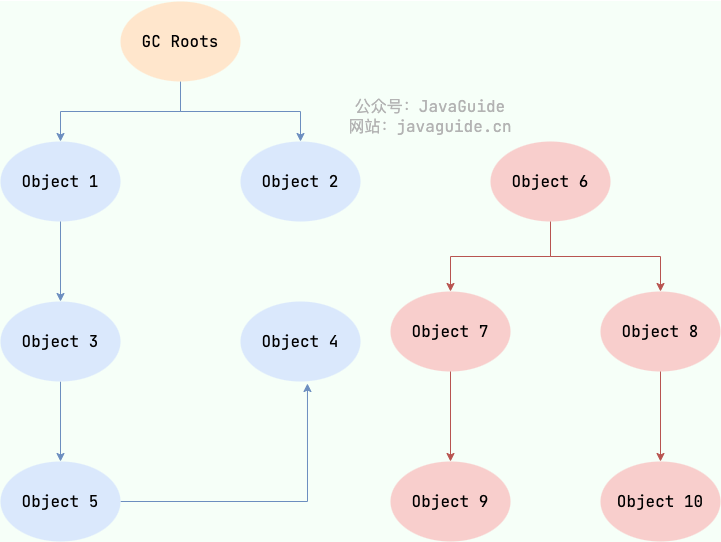
* 对象可以被回收，不代表一定会被回收

### 引用类型总结

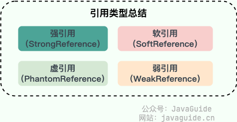

* 强引用（Java中普通对象）
  * `String strongReference = new String("abc");`
  * 如果一个对象具有强引用，垃圾回收器绝不会回收它。
  * 当内存空间不足，Java 虚拟机宁愿抛出 OutOfMemoryError 错误，使程序异常终止，也不会靠随意回收具有强引用的对象来解决内存不足问题。
* 软引用
  * ```java
    // 软引用
    String str = new String("abc");
    SoftReference<String> softReference = new SoftReference<String>(str);
    ```
  * 如果内存空间不足了，就会回收这些对象的内存
  * 软引用可用来实现内存敏感的高速缓存
* 弱引用
  * ```java
    String str = new String("abc");
    WeakReference<String> weakReference = new WeakReference<>(str);
    str = null; //str变成软引用，可以被收集
    ```
  * 只具有弱引用的对象拥有更短暂的生命周期
  * 在垃圾回收器线程扫描内存区域的过程中，一旦发现了只具有弱引用的对象，都会回收它的内存
* 虚引用
  * ```java
    String str = new String("abc");
    ReferenceQueue queue = new ReferenceQueue();
    // 创建虚引用，要求必须与一个引用队列关联
    PhantomReference pr = new PhantomReference(str, queue);
    ```
  * **虚引用主要用来跟踪对象被垃圾回收的活动** 。
  * 虚引用必须和引用队列（ReferenceQueue）联合使用
  * 当垃圾回收器准备回收一个对象时，如果发现它还有虚引用，就会在回收对象的内存之前，把这个虚引用加入到与之关联的引用队列中
  * 程序可以通过判断引用队列中是否已经加入了虚引用，来了解被引用的对象是否将要被垃圾回收
* 常用软引用、另外两个不常用
* **软引用可以加速 JVM 对垃圾内存的回收速度，可以维护系统的运行安全，防止内存溢出（OutOfMemory）等问题的产生**、

### 如何判断常量是废弃变量

* 没有任何对象引用该常量

### 如何判断一个类是无用的类

* 需要同时满足：
  * 该类所有的实例都已经被回收，也就是 Java 堆中不存在该类的任何实例。
  * 加载该类的 `ClassLoader` 已经被回收。
  * 该类对应的 `java.lang.Class` 对象没有在任何地方被引用，无法在任何地方通过反射访问该类的方法。

## 垃圾回收算法

### 标记-清除算法

* 分为“标记（Mark）”和“清除（Sweep）”阶段

  * 首先标记出所有不需要回收的对象
  * 在标记完成后统一回收掉所有没有被标记的对象。
* 缺点

  * **效率问题** ：标记和清除两个过程效率都不高。
  * **空间问题** ：标记清除后会产生大量不连续的内存碎片。


### 复制算法

* 为了解决标记-清除算法的效率和内存碎片问题

  * 将内存分为大小相同的两块，每次使用其中的一块
  * 当这一块的内存使用完后，就将还存活的对象复制到另一块去，然后再把使用的空间一次清理掉
* 问题

  * **可用内存变小** ：可用内存缩小为原来的一半。
  * **不适合老年代** ：如果存活对象数量比较大，复制性能会变得很差。

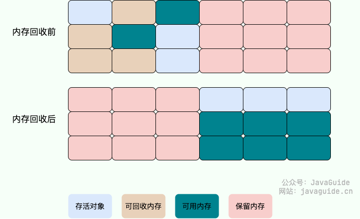

### 标记-整理算法

* 根据老年代的特点提出的一种标记算法
* 标记过程仍然与“标记-清除”算法一样
* 后续让所有存活的对象向一端移动，然后直接清理掉端边界以外的内存。
* 多了一步整理、效率也不高

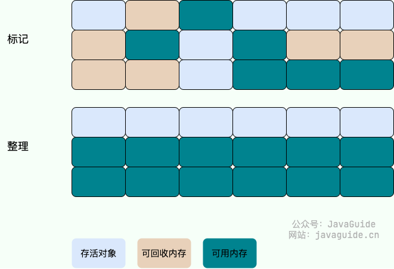

### 分代收集算法

* 根据对象存活周期的不同将内存分为几块，根据对象存活周期的不同将内存分为几块
* 新生代：复制算法
* 老年代：标记-整理或标记-清除

## 垃圾收集器

### Serial收集器

* 特征：单线程，进行垃圾收集工作的时候必须暂停其他所有的工作线程
* 新生代：标记-复制算法
* 老年代：标记-整理算法
* 缺点：暂停工作线程
* 优点：简单高效

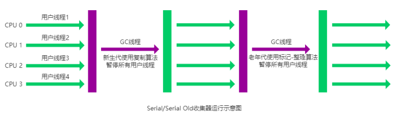

### ParNew收集器

* 特征：Serial收集器的多线程版本，并行状态
* 新生代：标记-复制算法
* 老年代：标记-整理算法
* **并行（Parallel）** ：指多条垃圾收集线程并行工作，但此时用户线程仍然处于等待状态。
* **并发（Concurrent）** ：指用户线程与垃圾收集线程同时执行（但不一定是并行，可能会交替执行），用户程序在继续运行，而垃圾收集器运行在另一个 CPU 上。


### Parallel Scavenge 收集器

* JDK1.8默认收集器
* 特点：多线程、吞吐量大
* 新生代：标记-复制算法
* 老年代：标记-整理算法

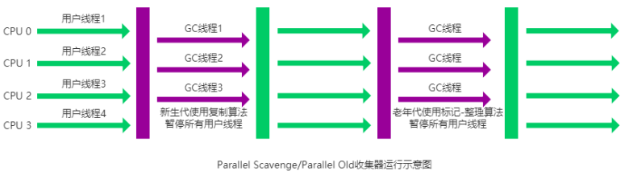

### Serial Old 收集器

* Serial 收集器老年代版本
* 在 JDK1.5 以及以前的版本中与 Parallel Scavenge 收集器搭配使用
* 作为 CMS 收集器的后备方案

### Parallel Old 收集器

* **Parallel Scavenge 收集器的老年代版本**

### CMS 收集器

* **以获取最短回收停顿时间为目标的收集器**
* 第一款真正意义上的并发收集器，**第一次实现了让垃圾收集线程与用户线程（基本上）同时工作。**
* 运作过程

  * **初始标记：** 短暂停顿，标记直接与 root 相连的对象（根对象）；
  * **并发标记：** 同时开启 GC 和用户线程，用一个闭包结构去记录可达对象。但在这个阶段结束，这个闭包结构并不能保证包含当前所有的可达对象。因为用户线程可能会不断的更新引用域，所以 GC 线程无法保证可达性分析的实时性。所以这个算法里会跟踪记录这些发生引用更新的地方。
  * **重新标记：** 重新标记阶段就是为了修正并发标记期间因为用户程序继续运行而导致标记产生变动的那一部分对象的标记记录，这个阶段的停顿时间一般会比初始标记阶段的时间稍长，远远比并发标记阶段时间短
  * **并发清除：** 开启用户线程，同时 GC 线程开始对未标记的区域做清扫。

  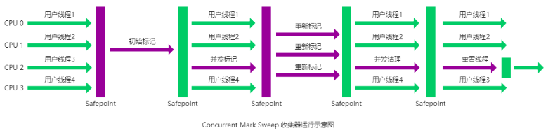
* 缺点
* * **对 CPU 资源敏感；**
  * **无法处理浮动垃圾；**
  * **“标记-清除”算法会导致收集结束时会有大量空间碎片产生。**
* 在Java9中被标记过时，在Java14中被移除

### G1收集器

* **面向服务器的垃圾收集器,主要针对配备多颗处理器及大容量内存的机器. 以极高概率满足 GC 停顿时间要求的同时,还具备高吞吐量性能特征。**
* 特征

  * 并行+并发
  * 分代手机
  * 空间整合：标记-整理算法
  * 可预测停顿：能让使用者明确指定在一个长度为 M 毫秒的时间片段内，消耗在垃圾收集上的时间不得超过 N 毫秒。
* 运作过程

  * **初始标记** ： 短暂停顿（Stop-The-World，STW），标记从 GC Roots 可直接引用的对象，即标记所有直接可达的活跃对象
  * **并发标记** ：与应用并发运行，标记所有可达对象。 这一阶段可能持续较长时间，取决于堆的大小和对象的数量。
  * **最终标记** ： 短暂停顿（STW），处理并发标记阶段结束后残留的少量未处理的引用变更。
  * **筛选回收** ：根据标记结果，选择回收价值高的区域，复制存活对象到新区域，回收旧区域内存。这一阶段包含一个或多个停顿（STW），具体取决于回收的复杂度。
* JDK9开始成为默认垃圾收集器

## 类加载过程

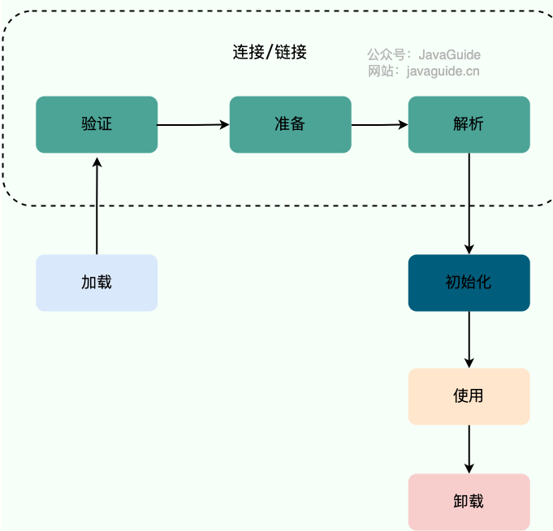

### 加载

* 将字节码从不同的数据源（可能是 class 文件、也可能是 jar 包，甚至网络）转化为二进制字节流加载到内存中，并生成一个代表该类的 `java.lang.Class` 对象

### 验证

* 对二进制字节流进行校验，符合JVM字节码规范才能被执行
* 检查内容：
  * 确保二进制字节流格式符合预期（比如说是否以 `cafe babe` 开头）
  * 是否所有方法都遵守[访问控制关键字](https://javabetter.cn/oo/access-control.html)的限定（protected、private 那些）
  * 方法调用的参数个数和类型是否正确。
  * 确保变量在使用之前被正确初始化了。
  * 检查变量是否被赋予恰当类型的值。

### 准备

* 对类变量（`static`）分配内存并初始化

```java
public String chenmo = "沉默";
public static String wanger = "王二";
public static final String cmower = "沉默王二";
```

* chenmo 不会被分配内存，而 wanger 会；但 wanger 的初始值不是“王二”而是 `null`
* `static final` 修饰的变量被称作为常量，和类变量不同。常量一旦赋值就不会改变了，所以 cmower 在准备阶段的值为“沉默王二”而不是 `null`。

### 解析

* 将常量池中的符号引用转化为直接引用
* 符号引用：以符号描述所引用的目标（可以无歧义定位到目标）
* 直接引用：通过对符号解析，找到引用的实际内存地址

### 初始化

* 在准备阶段，类变量已经被赋过默认初始值，而在初始化阶段，类变量将被赋值为代码期望赋的值。
* 对变量进行实例化
* 初始化时机：
  * 创建类的实例时。
  * 访问类的静态方法或静态字段时（除了 final 常量，它们在编译期就已经放入常量池）。
  * 使用 java.lang.reflect 包的方法对类进行反射调用时。
  * 初始化一个类的子类（首先会初始化父类）。
  * JVM 启动时，用户指定的主类（包含 main 方法的类）将被初始化。

### 卸载

* 卸载类需要满足的三个要求：
  * 该类的所有的实例对象都已被 GC，也就是说堆不存在该类的实例对象。
  * 该类没有在其他任何地方被引用
  * 该类的类加载器的实例已被 GC

## 类加载器

* 赋予了Java类可以被动态加载到JVM中并执行的能力
* 类加载器是一个负责加载类的对象，用于实现类加载过程中的**加载**这一步。
* 每个 Java 类都有一个引用指向加载它的 `ClassLoader`。
* 数组类不是通过 `ClassLoader` 创建的（数组类没有对应的二进制字节流），是由 JVM 直接生成的。
* **类加载器的主要作用就是动态加载 Java 类的字节码（ `.class` 文件）到 JVM 中（在内存中生成一个代表该类的 `Class` 对象）。**

### 加载规则

* 并不会一次性加载所有的类，而是根据需要去动态加载
* 已经加载的类会被放在 `ClassLoader` 中。在类加载的时候，系统会首先判断当前类是否被加载过。已经被加载的类会直接返回，否则才会尝试加载

### JVM的类加载器

* **`BootstrapClassLoader`(启动类加载器)** ：最顶层的加载类，由 C++实现，通常表示为 null，并且没有父级，主要用来加载 JDK 内部的核心类库（ `%JAVA_HOME%/lib`目录下的 `rt.jar`、`resources.jar`、`charsets.jar`等 jar 包和类）
* **`ExtensionClassLoader`(扩展类加载器)** ：主要负责加载 `%JRE_HOME%/lib/ext` 目录下的 jar 包和类以及被 `java.ext.dirs` 系统变量所指定的路径下的所有类。
* **`AppClassLoader`(应用程序类加载器)** ：面向用户的加载器，负责加载当前应用 classpath 下的所有 jar 包和类。
* 除了 `BootstrapClassLoader` 是 JVM 自身的一部分之外，其他所有的类加载器都是在 JVM 外部实现的，并且全都继承自 `ClassLoader`抽象类。
* 这样做的好处是用户可以自定义类加载器，以便让应用程序自己决定如何去获取所需的类

## 双亲委派模型

* `ClassLoader` 类使用委托模型来搜索类和资源。
* 双亲委派模型要求除了顶层的启动类加载器外，其余的类加载器都应有自己的父类加载器。
* `ClassLoader` 实例会在试图亲自查找类或资源之前，将搜索类或资源的任务委托给其父类加载器。


### 双亲委派模型执行过程

* 在类加载的时候，首先判断当前类是否被加载过。已经被加载的类会直接返回，否则才会尝试加载（每个父类加载器都会走一遍这个流程）。
* 类加载器在进行类加载的时候，它首先不会自己去尝试加载这个类，而是把这个请求委派给父类加载器去完成（调用父加载器 `loadClass()`方法来加载类）。这样的话，所有的请求最终都会传送到顶层的启动类加载器 `BootstrapClassLoader` 中。
* 只有当父加载器反馈自己无法完成这个加载请求（它的搜索范围中没有找到所需的类）时，子加载器才会尝试自己去加载（调用自己的 `findClass()` 方法来加载类）。
* 如果子类加载器也无法加载这个类，那么它会抛出一个 `ClassNotFoundException` 异常。
* 判断两个类是否相同：

  * 类的全名是否相同
  * 类的加载器是否一样

### 双亲委派模型的好处

* 避免类的重复加载和防止核心 API 被篡改
