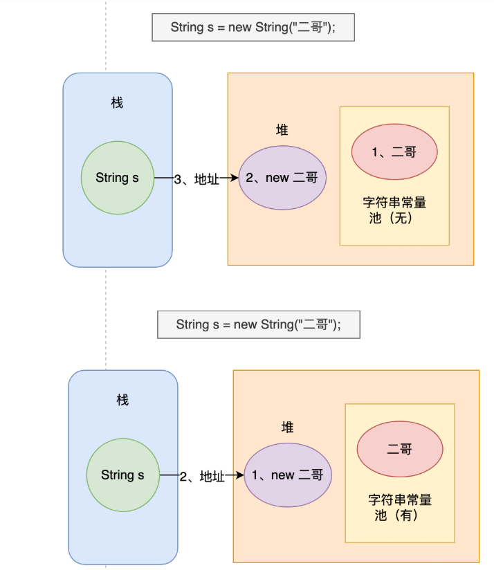
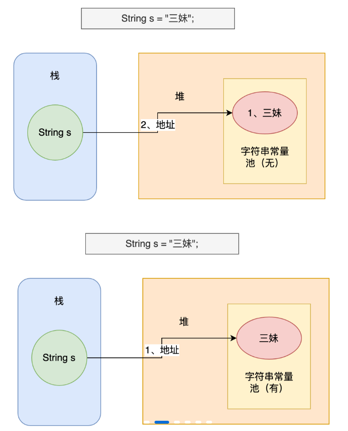
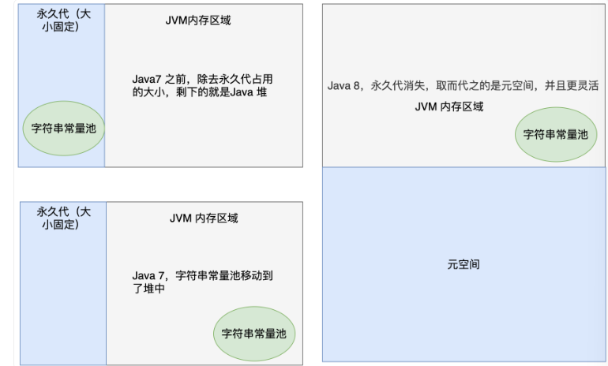
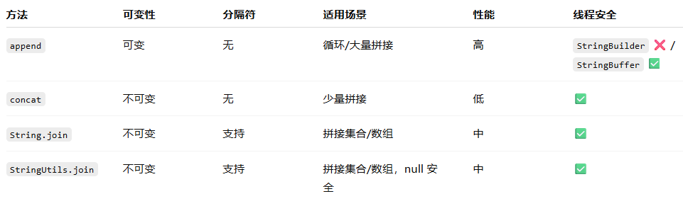

# 基本语法

## 数据类型转换

* 自动转换：将一种基本数据类型自动转换为另一种基本数据类型的过程
  * 如果任一操作数是 double 类型，其他操作数将被转换为 double 类型。
  * 否则，如果任一操作数是 float 类型，其他操作数将被转换为 float 类型。
  * 否则，如果任一操作数是 long 类型，其他操作数将被转换为 long 类型。
  * 否则，所有操作数将被转换为 int 类型。
* ```java
  byte b = 50;

  b = b * 2; // Type mismatch: cannot convert from int to byte
  ```

该程序试图将一个完全合法的 byte 型的值 `50*2` 存储给一个 byte 型的变量，但是表达式被提升到int类型（正确操作需要强制转换）

* 强制类型转换：显示转换

```java
int a = 1500000000, b = 1500000000;
int sum = a + b;
long sum1 = a + b;
long sum2 = (long)a + b;
long sum3 = (long)(a + b);
```

```java
-1294967296
-1294967296
3000000000
-1294967296
```

* 1 计算int，赋值int
* 2 计算int，赋值long
* 3 计算long，赋值long
* 4 计算int，赋值long

## 数据缓存

* `new Integer(18)` 每次都会新建一个对象;
* `Integer.valueOf(18)` 会使⽤用缓存池中的对象，多次调用只会取同⼀一个对象的引用。
* 基本数据类型的包装类Byte、Short、Integer、Long、Character、Boolean都有常量缓存池。
  * Byte：-128~127，也就是所有的 byte 值
  * Short/Integer/Long：-128~127
  * Character：\u0000 - \u007F
  * Boolean：true 和 false
* 当使用的数据范围在 -128~127 之间时，会直接返回常量池中数据的引用，而不是创建对象，超过这个范围时会创建新的对象。
* 使用数据类型缓存池可以有效提高程序的性能和节省内存开销，但需要注意的是，在特定的业务场景下，缓存池可能会带来一些问题，例如缓存池中的对象被不同的线程同时修改，导致数据错误等问题。

# 数组

## 数组打印

* stream流打印数组
  * `Arrays.asList(cmowers).stream().forEach(s -> System.out.println(s));`
  * `Stream.of(cmowers).forEach(System.out::println);`
  * `Arrays.stream(cmowers).forEach(System.out::println);`
* for循环
* Array工具类
  * `toString`（一维）
  * `deepToString`（二维）

# 字符串

## String源码解读

* 字符串哈希：`H(s) = (s[0] * 31^(n-1)) + (s[1] * 31^(n-2)) + ... + (s[n-1] * 31^0)`
* `substring`，第一个参数表示起始索引，第二个参数为终止索引（左闭右开）
* `indexOf`：查找指定字符在串中第一次出现的位置

```java
/*
 * 查找字符数组 target 在字符数组 source 中第一次出现的位置。
 * sourceOffset 和 sourceCount 参数指定 source 数组中要搜索的范围，
 * targetOffset 和 targetCount 参数指定 target 数组中要搜索的范围，
 * fromIndex 参数指定开始搜索的位置。
 * 如果找到了 target 数组，则返回它在 source 数组中的位置索引（从0开始），
 * 否则返回-1。
 */
static int indexOf(char[] source, int sourceOffset, int sourceCount,
        char[] target, int targetOffset, int targetCount,
        int fromIndex)
```

## 字符串为什么不可变

* 类和char数组均被 `final`关键字修饰
  * 保证安全性，避免被篡改
  * 保证哈希值不会被频繁变更
  * 实现字符串常量池

## 字符串常量池

* `String s = new String("二哥");`创建了两个对象
* 使用 new 关键字创建一个字符串对象时，Java 虚拟机会先在字符串常量池中查找有没有‘二哥’这个字符串对象，如果有，就不会在字符串常量池中创建‘二哥’这个对象了，直接在堆中创建一个‘二哥’的字符串对象，然后将堆中这个‘二哥’的对象地址返回赋值给变量 s。
* 
* `String s = "三妹";`
* 先在字符串常量池中查找有没有“三妹”这个字符串对象，如果有，则不创建任何对象，直接将字符串常量池中这个“三妹”的对象地址返回，赋给变量 s；如果没有，在字符串常量池中创建“三妹”这个对象，然后将其地址返回，赋给变量 s
* 
* 常量池位置
  * Java7之前：永久代内存区域（堆的一部分）
  * Java7：移动到堆中
  * Java8：永久代被取消，被元空间取代（用于存储类信息、方法信息、常量池信息等静态数据）
  * 

## intern

* 当你调用 `str.intern()` 时：

  * JVM 会去 **字符串常量池（String Table）** 中查找是否已经存在一个内容相同的字符串；
* 如果存在：

  * 返回常量池中已存在的字符串对象引用；
* 如果不存在：

  * 将当前字符串的引用（或复制）放入常量池中；
  * 并返回这个常量池中的引用。

## 字符串拼接


