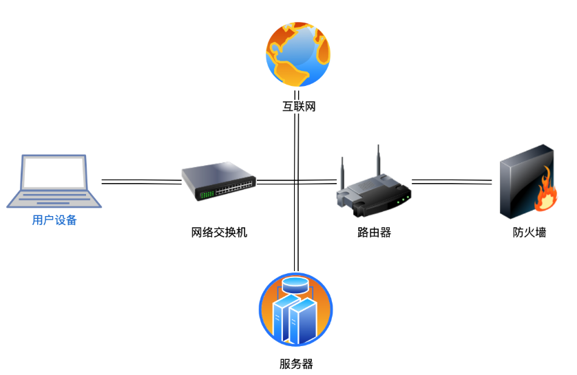

# 网络编程基础知识

## 网络拓扑图

* 用户设备：Laptop，用于访问网络资源。
* 网络交换机：Switch，用于连接局域网内的设备，例如 Laptop 和 Router。
* 路由器：Router，用于连接不同网络，将局域网与互联网相连。
* 防火墙：Firewall，用于保护网络内部资源，阻止未经授权的访问。
* 互联网：Internet，提供连接到其他网络和全球信息资源。
* 服务器：Server，用于托管网络应用程序和数据。

## IP地址

* 用于唯一标识一个网络接口（Network Interface）。一台联入互联网的计算机肯定有一个 IP 地址，但也可能有多个 IP 地址。
* IP 地址分为 IPv4 和 IPv6 两种。IPv4 采用 32 位地址，类似 `101.202.99.12`，而 IPv6 采用 128 位地址，类似 `2001:0DA8:100A:0000:0000:1020:F2F3:1428`
* 如果两台计算机位于同一个网络，那么他们之间可以直接通信
* 每台计算机都需要正确配置 IP 地址和子网掩码，根据这两个就可以计算网络号，如果两台计算机计算出的网络号相同，说明两台计算机在同一个网络，可以直接通信。
