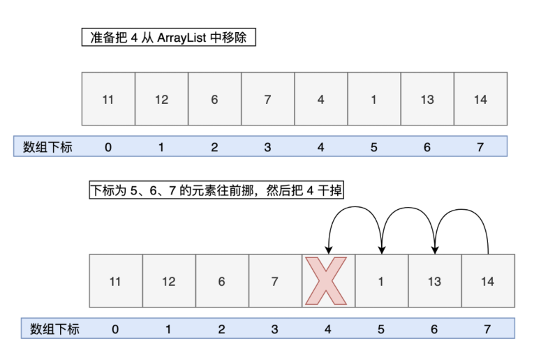

# ArrayList

* 默认长度为0，添加元素后默认变成10，扩容变成1.5倍，一次添加多个元素（扩容放不下）长度为实际长度

## 添加元素

```
堆栈过程图示：
add(element)
└── if (size == elementData.length) // 判断是否需要扩容
    ├── grow(minCapacity) // 扩容
    │   └── newCapacity = oldCapacity + (oldCapacity >> 1) // 计算新的数组容量
    │   └── Arrays.copyOf(elementData, newCapacity) // 创建新的数组
    ├── elementData[size++] = element; // 添加新元素
    └── return true; // 添加成功
```

* `ensureCapacityInternal`方法
  * 将指定元素添加到 ArrayList 的末尾
  * 如果 elementData 还是默认的空数组，使用 DEFAULT_CAPACITY 和指定容量的最小值中的较大值
  * 用 `ensureExplicitCapacity`方法确保容量能够容纳指定容量的元素
* `ensureExplicitCapacity`方法
  * 检查并确保集合容量足够，如果需要则增加集合容量
  * `if (minCapacity - elementData.length > 0)`，`grow(minCapacity);`
* `grow`方法
  * 扩容至原来的1.5倍
  * 如果还是小于指定容量的最小值，直接扩容至指定容量的最小值
  * 如果超出了数组的最大长度，扩容至数组的最大长度
  * 将当前数组复制到一个新数组中，长度为 newCapacity

## 向指定位置添加元素

* 核心方法：`add(int index, E element)`
* 移动数组元素：`System.arraycopy(elementData, index, elementData, index + 1, size - index);`
  * 语法：`System.arraycopy(Object src, int srcPos, Object dest, int destPos, int length);`
  * elementData：表示要复制的源数组，即 ArrayList 中的元素数组。
  * index：表示源数组中要复制的起始位置，即需要将 index 及其后面的元素向后移动一位。
  * elementData：表示要复制到的目标数组，即 ArrayList 中的元素数组。
  * index + 1：表示目标数组中复制的起始位置，即将 index 及其后面的元素向后移动一位后，应该插入到的位置。
  * size - index：表示要复制的元素个数，即需要将 index 及其后面的元素向后移动一位，需要移动的元素个数为 size - index。


## 更新元素

* 方法： `set(int index, E element)`

## 删除元素

* 方法：`remove(int index)`
  * 删除元素时，需要将删除位置后面的元素向前移动一位，以填补删除位置留下的空缺
  * 如果需要移动元素，则需要使用 System.arraycopy 方法将删除位置后面的元素向前移动一位
  * 数组末尾的元素置为 null，以便让垃圾回收机制回收该元素占用的空间
* 方法：`remove(Object o)`
  * null 的时候使用 == 操作符判断，非 null 的时候使用 `equals()` 方法
  * 有相同元素时，只会删除第一个



## 查找元素

* 顺序查找：`indexOf(Object o)`
* 倒序查找：`lastIndexOf(Object o)`
* 二分查找：
  * 数组中的元素经过排序可以二分查找

## 操作时间复杂度

* 查询：`O(1)`
* 插入：
  * 最好：在列表末尾添加元素，`O(1)`
  * 最坏：在列表的中间或开头插入元素，`O(n)`
* 删除：
  * 最好：在列表末尾删除元素，`O(1)`
  * 最坏：在列表的中间或开头删除元素，`O(n)`
* 修改：`O(1)`

# LinkedList

## 节点结构

```java
/**
 * 链表中的节点类。
 */
private static class Node<E> {
    E item; // 节点中存储的元素
    Node<E> next; // 指向下一个节点的指针
    Node<E> prev; // 指向上一个节点的指针

    /**
     * 构造一个新的节点。
     *
     * @param prev 前一个节点
     * @param element 节点中要存储的元素
     * @param next 后一个节点
     */
    Node(Node<E> prev, E element, Node<E> next) {
        this.item = element; // 存储元素
        this.next = next; // 设置下一个节点
        this.prev = prev; // 设置上一个节点
    }
}
```

## 增

* 核心方法：`add(E e)`
* `addFirst()` 方法将元素添加到第一位；
* `addLast()` 方法将元素添加到末尾。

## 删

* `remove()`：删除第一个节点
* `remove(int)`：删除指定位置的节点
* `remove(Object)`：删除指定元素的节点
* `removeFirst()`：删除第一个节点
* `removeLast()`：删除最后一个节点

## 改

* 方法：`set(int index, E element)`

## 查

* `indexOf(Object)`：查找某个元素所在的位置
* `get(int)`：查找某个位置上的元素
* `getFirst()` 方法用于获取第一个元素；
* `getLast()` 方法用于获取最后一个元素；
* `poll()` 和 `pollFirst()` 方法用于删除并返回第一个元素；
* `pollLast()` 方法用于删除并返回最后一个元素；
* `peekFirst()` 方法用于返回但不删除第一个元素。HashMap

# HashMap

## 增删改查

* 增：`put(K key, V value)`
* 删：`remove`
* 改：`put`
* 查：`get`
* 哈希算法
* ```java
  static final int hash(Object key) {
      int h;
      return (key == null) ? 0 : (h = key.hashCode()) ^ (h >>> 16);
  }
  ```

  

## 取模和取余

> `mod(a, b) = a - floor(a / b) * b`

也就是说：

* **取模的结果与除数 b 同号**
* **取余的结果与被除数 a 同号**

## 扩容机制

### resize 方法（Java7）

* HashMap 的扩容是通过 resize 方法来实现的
  * 获取当前 HashMap 的旧数组 oldTable 和旧容量 oldCapacity
  * 如果旧容量已经达到 HashMap 支持的最大容量 `MAXIMUM_CAPACITY`（ 2 的 30 次方），就将新的阈值 threshold 调整为 `Integer.MAX_VALUE`（2 的 31 次方 - 1）
  * 创建一个新的数组 newTable，并将旧数组 oldTable 中的元素转移到新数组 newTable 中。转移过程是通过调用 transfer 方法来实现的。
  * 将 HashMap 内部的数组引用 table 指向新数组 newTable，并重新计算阈值 threshold

### 新容量计算

```java
int newCapacity = oldCapacity * 2;
if (newCapacity < 0 || newCapacity >= MAXIMUM_CAPACITY) {
    newCapacity = MAXIMUM_CAPACITY;
} else if (newCapacity < DEFAULT_INITIAL_CAPACITY) {
    newCapacity = DEFAULT_INITIAL_CAPACITY;
}
```

* 新容量 newCapacity 被初始化为原容量 oldCapacity 的两倍
* 如果 newCapacity 超过了 HashMap 的容量限制 MAXIMUM_CAPACITY（2^30），就将 newCapacity 设置为 MAXIMUM_CAPACITY
* 如果 newCapacity 小于默认初始容量 DEFAULT_INITIAL_CAPACITY（16），就将 newCapacity 设置为 DEFAULT_INITIAL_CAPACITY

### transfer 方法

* 该方法用来转移，将旧的小数组元素拷贝到新的大数组中。
  * `void transfer(Entry[] newTable, boolean rehash)`，newTable 表示新的哈希表，rehash 表示是否需要重新计算键的哈希值
  * 首先获取新哈希表（数组）的长度 newCapacity，然后遍历旧哈希表中的每个 Entry
  * 对于每个 Entry，使用拉链法将相同 key 值的不同 value 值存储在同一个链表中。
  * 如果 rehash 为 true，则需要重新计算键的哈希值，并将新的哈希值存储在 Entry 的 hash 属性中。
  * 根据新哈希表的长度和键的哈希值，计算 Entry 在新数组中的位置 i，然后将该 Entry 添加到新数组的 i 位置上。由于新元素需要被放在链表的头部，因此将新元素的下一个元素设置为当前数组位置上的元素。
* 头插法会导致**在旧数组中同一个链表上的元素，通过重新计算索引位置后，有可能被放到了新数组的不同位置上**

### resize方法（Java8）

* 获取原来的数组 table、数组长度 oldCap 和阈值 oldThr。
* 如果原来的数组 table 不为空，则根据扩容规则计算新数组长度 newCap 和新阈值 newThr，然后将原数组中的元素复制到新数组中。
* 如果原来的数组 table 为空但阈值 oldThr 不为零，则说明是通过带参数构造方法创建的 HashMap，此时将阈值作为新数组长度 newCap。
* 如果原来的数组 table 和阈值 oldThr 都为零，则说明是通过无参数构造方法创建的 HashMap，此时将默认初始容量 `DEFAULT_INITIAL_CAPACITY（16）`和默认负载因子 `DEFAULT_LOAD_FACTOR（0.75）`计算出新数组长度 newCap 和新阈值 newThr。
* 计算新阈值 threshold，并将其赋值给成员变量 threshold。
* 创建新数组 newTab，并将其赋值给成员变量 table。
* 如果旧数组 oldTab 不为空，则遍历旧数组的每个元素，将其复制到新数组中。
* 返回新数组 newTab。

## 关于负载因子

* 负载因子默认为**0.75，这个数在“ **哈希冲突** ”与“ **空间利用率** ”取得了较好的平衡**

## 线程不安全

### 多线程下扩容会死循环

* 头插法情况下，线程A在获取到节点后被挂起，线程B完成了所有的扩容数据转移。可能会出现循环套娃
* JDK 8 时已经修复了这个问题，扩容时会保持链表原来的顺序。


### 多线程下put会导致元素丢失

* 多线程同时执行 put 操作时，如果计算出来的索引位置是相同的，那会造成前一个 key 被后一个 key 覆盖，从而导致元素的丢失。

### put和get并发会导致get到null

* 线程 1 执行 put 时，因为元素个数超出阈值而导致出现扩容，线程 2 此时执行 get，就有可能出现这个问题。
* 因为线程 1 执行完 table = newTab 之后，线程 2 中的 table 此时也发生了变化，此时去 get 的时候可能会 get 到 null 了，因为元素还没有转移。

# LinkedHashMap

* 为了提高查找效率，HashMap 在插入的时候对键做了一次哈希算法，这就导致插入的元素是无序的。
* LinkedHashMap 继承了 HashMap，并追加了双向链表，来维护元素的插入顺序。
* before 和 after，用来维护当前元素的前一个元素和后一个元素的顺序

```java
static class Entry<K,V> extends HashMap.Node<K,V> {
    Entry<K,V> before, after;
    Entry(int hash, K key, V value, Node<K,V> next) {
        super(hash, key, value, next);
    }
}
```

## 插入顺序

* 当使用 put() 方法向 LinkedHashMap 中添加键值对时，会将新节点插入到链表的尾部，并更新 before 和 after 属性，以保证链表的顺序关系
* 由 `linkNodeLast()` 方法来完成：

```java
/**
 * 将指定节点插入到链表的尾部
 *
 * @param p 要插入的节点
 */
private void linkNodeLast(LinkedHashMap.Entry<K,V> p) {
    LinkedHashMap.Entry<K,V> last = tail; // 获取链表的尾节点
    tail = p; // 将 p 设为尾节点
    if (last == null)
        head = p; // 如果链表为空，则将 p 设为头节点
    else {
        p.before = last; // 将 p 的前驱节点设为链表的尾节点
        last.after = p; // 将链表的尾节点的后继节点设为 p
    }
}
```

## 访问顺序

* `LinkedHashMap<String, String> map = new LinkedHashMap<>(16, .75f, true);`
* 第三个参数如果为 true 的话，就表示 LinkedHashMap 要维护访问顺序；否则，维护插入顺序。默认是 false。不维护的话，最不经常访问的放在头部

## LRU缓存

```java
/**
 * 自定义的 MyLinkedHashMap 类，继承了 Java 中内置的 LinkedHashMap<K, V> 类。
 * 用于实现一个具有固定大小的缓存，当缓存达到最大容量时，会自动移除最早加入的元素，以腾出空间给新的元素。
 *
 * @param <K> 键的类型
 * @param <V> 值的类型
 */
public class MyLinkedHashMap<K, V> extends LinkedHashMap<K, V> {

    private static final int MAX_ENTRIES = 5; // 表示 MyLinkedHashMap 中最多存储的键值对数量

    /**
     * 构造方法，使用 super() 调用了父类的构造函数，并传递了三个参数：initialCapacity、loadFactor 和 accessOrder。
     *
     * @param initialCapacity 初始容量
     * @param loadFactor      负载因子
     * @param accessOrder     访问顺序
     */
    public MyLinkedHashMap(int initialCapacity, float loadFactor, boolean accessOrder) {
        super(initialCapacity, loadFactor, accessOrder);
    }

    /**
     * 重写父类的 removeEldestEntry() 方法，用于指示是否应该移除最早加入的元素。
     * 如果返回 true，那么将删除最早加入的元素。
     *
     * @param eldest 最早加入的元素
     * @return 如果当前 MyLinkedHashMap 中元素的数量大于 MAX_ENTRIES，返回 true，否则返回 false。
     */
    @Override
    protected boolean removeEldestEntry(Map.Entry eldest) {
        return size() > MAX_ENTRIES;
    }

}
```

## 维持访问顺序

* `afterNodeAccess()` 会在调用 `get()` 方法的时候被调用
* `afterNodeInsertion()` 会在调用 `put()` 方法的时候被调用，
* `afterNodeRemoval()` 会在调用 `remove()` 方法的时候被调用。

# TreeMap

* TreeMap 由红黑树实现，可以保持元素的自然顺序，或者实现了 Comparator 接口的自定义顺序。

## 自然顺序

* 默认情况下，TreeMap 是根据 key 的自然顺序排列的。
* `put(K key, V value)` 方法
  * 首先定义一个Entry类型的变量t，用于表示当前的根节点；
  * 如果t为null，说明TreeMap为空，直接创建一个新的节点作为根节点，并将size设置为1；
  * 如果t不为null，说明需要在TreeMap中查找键所对应的节点。因为TreeMap中的元素是有序的，所以可以使用二分查找的方式来查找节点；
  * 如果TreeMap中使用了Comparator来进行排序，则使用Comparator进行比较，否则使用Comparable进行比较。如果查找到了相同的键，则直接更新键所对应的值；
  * 如果没有查找到相同的键，则创建一个新的节点，并将其插入到TreeMap中。然后使用fixAfterInsertion()方法来修正插入节点后的平衡状态；
  * 最后将TreeMap的size加1，然后返回null。如果更新了键所对应的值，则返回原先的值。

## 选择方法

* `lastKey()`、`firstKey()` ：获取最后一个 key 和第一个 key
* `headMap()` ：获取指定 key 之前的 key
* `tailMap()` 获取指定 key 之后的 key（包括指定 key）

# ArrayDeque

# PriorityQueue
