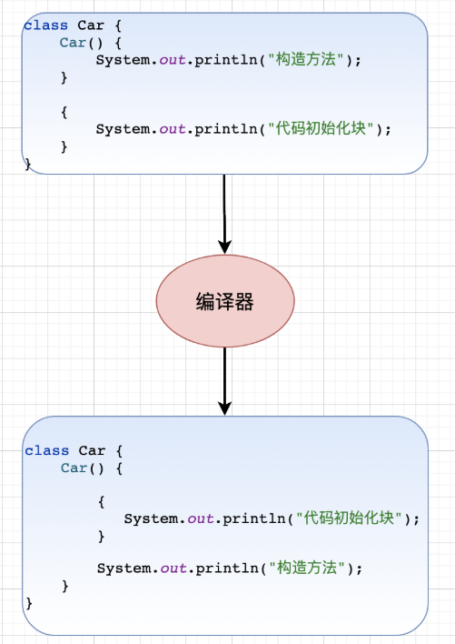

# 面向对象

## Object类

* 对象比较

  * `public native int hashCode()` ：用于返回对象的哈希码。
  * `public boolean equals(Object obj)`：用于比较 2 个对象的内存地址是否相等。
* 对象拷贝

  * `protected native Object clone() throws CloneNotSupportedException`：naitive 方法，返回此对象的一个副本。默认实现只做[浅拷贝](https://javabetter.cn/basic-extra-meal/deep-copy.html)，且类必须实现 Cloneable 接口。
  * Object 本身没有实现 Cloneable 接口，所以在不重写 clone 方法的情况下直接直接调用该方法会发生 CloneNotSupportedException 异常。
* 对象转字符串

  * `public String toString()`：返回对象的字符串表示。默认实现返回类名@哈希码的十六进制表示，但通常会被重写以返回更有意义的信息。
* 多线程调度

  * `public final void wait() throws InterruptedException`：调用该方法会导致当前线程等待，直到另一个线程调用此对象的 `notify()`方法或 `notifyAll()`方法。
  * `public final native void notify()`：唤醒在此对象监视器上等待的单个线程。如果有多个线程等待，选择一个线程被唤醒。
  * `public final native void notifyAll()`：唤醒在此对象监视器上等待的所有线程。
  * `public final native void wait(long timeout) throws InterruptedException`：等待 timeout 毫秒，如果在 timeout 毫秒内没有被唤醒，会自动唤醒。
  * `public final void wait(long timeout, int nanos) throws InterruptedException`：更加精确了，等待 timeout 毫秒和 nanos 纳秒，如果在 timeout 毫秒和 nanos 纳秒内没有被唤醒，会自动唤醒。
* 反射

  * `public final native Class<?> getClass()`：用于获取对象的类信息，如类名。
* 垃圾回收

  * `protected void finalize() throws Throwable`：当垃圾回收器决定回收对象占用的内存时调用此方法。用于清理资源，但 Java 不推荐使用，因为它不可预测且容易导致问题，Java 9 开始已被弃用。

## Java Native方法

* Java Native Interface (JNI)：允许 Java 代码和其他语言编写的代码进行交互
* 缺点
  * ①、程序不再跨平台。要想跨平台，必须在不同的系统环境下重新编译本地语言部分。
  * ②、程序不再是绝对安全的，本地代码的不当使用可能导致整个程序崩溃。一个通用规则是，你应该让本地方法集中在少数几个类当中。这样就降低了 Java 和 C/C++ 之间的耦合性。

## 构造方法

* 如果一个类没有声明构造方法，也可以执行，它会有默认的无参构造方法
* 如果重载了有参的构造方法，记得都要把无参的构造方法也写出来
* 通过 `clone()`复制对象时，需要先实现 Cloneable 接口的 `clone()` 方法，然后再调用 `clone()` 方法

## 访问权限

* 默认访问权限（包访问权限）：如果一个类的方法或变量被包访问权限修饰，也就意味着只能在同一个包中的其他类中显示地调用该类的方法或者变量，在不同包中的类中不能显式地调用该类的方法或变量。
* private：如果一个类的方法或者变量被 private 修饰，那么这个类的方法或者变量只能在该类本身中被访问，在类外以及其他类中都不能显式的进行访问。
* protected：如果一个类的方法或者变量被 protected 修饰，对于同一个包的类，这个类的方法或变量是可以被访问的。对于不同包的类，只有继承于该类的类才可以访问到该类的方法或者变量。
* public：被 public 修饰的方法或者变量，在任何地方都是可见的。

## 代码初始化块

* 
* 
* 类实例化的时候执行代码初始化块；
* 实际上，代码初始化块是放在构造方法中执行的，只不过比较靠前；
* 代码初始化块里的执行顺序是从前到后的。
