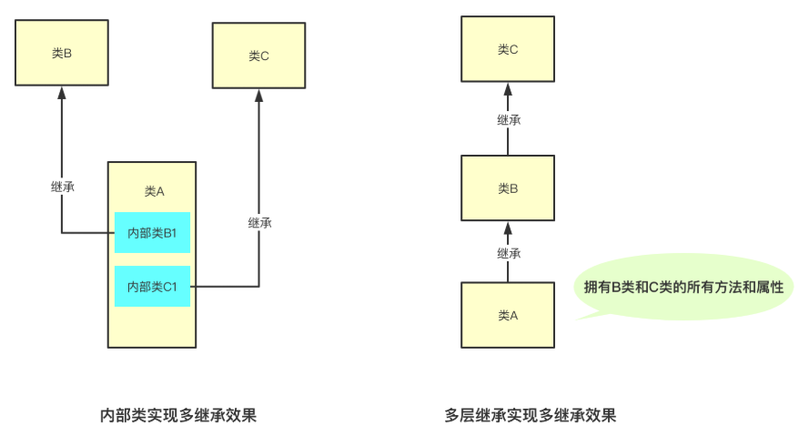

# 面向对象

## Object类

* 对象比较

  * `public native int hashCode()` ：用于返回对象的哈希码。
  * `public boolean equals(Object obj)`：用于比较 2 个对象的内存地址是否相等。
* 对象拷贝

  * `protected native Object clone() throws CloneNotSupportedException`：naitive 方法，返回此对象的一个副本。默认实现只做[浅拷贝](https://javabetter.cn/basic-extra-meal/deep-copy.html)，且类必须实现 Cloneable 接口。
  * Object 本身没有实现 Cloneable 接口，所以在不重写 clone 方法的情况下直接直接调用该方法会发生 CloneNotSupportedException 异常。
* 对象转字符串

  * `public String toString()`：返回对象的字符串表示。默认实现返回类名@哈希码的十六进制表示，但通常会被重写以返回更有意义的信息。
* 多线程调度

  * `public final void wait() throws InterruptedException`：调用该方法会导致当前线程等待，直到另一个线程调用此对象的 `notify()`方法或 `notifyAll()`方法。
  * `public final native void notify()`：唤醒在此对象监视器上等待的单个线程。如果有多个线程等待，选择一个线程被唤醒。
  * `public final native void notifyAll()`：唤醒在此对象监视器上等待的所有线程。
  * `public final native void wait(long timeout) throws InterruptedException`：等待 timeout 毫秒，如果在 timeout 毫秒内没有被唤醒，会自动唤醒。
  * `public final void wait(long timeout, int nanos) throws InterruptedException`：更加精确了，等待 timeout 毫秒和 nanos 纳秒，如果在 timeout 毫秒和 nanos 纳秒内没有被唤醒，会自动唤醒。
* 反射

  * `public final native Class<?> getClass()`：用于获取对象的类信息，如类名。
* 垃圾回收

  * `protected void finalize() throws Throwable`：当垃圾回收器决定回收对象占用的内存时调用此方法。用于清理资源，但 Java 不推荐使用，因为它不可预测且容易导致问题，Java 9 开始已被弃用。

## Java Native方法

* Java Native Interface (JNI)：允许 Java 代码和其他语言编写的代码进行交互
* 缺点
  * ①、程序不再跨平台。要想跨平台，必须在不同的系统环境下重新编译本地语言部分。
  * ②、程序不再是绝对安全的，本地代码的不当使用可能导致整个程序崩溃。一个通用规则是，你应该让本地方法集中在少数几个类当中。这样就降低了 Java 和 C/C++ 之间的耦合性。

## 构造方法

* 如果一个类没有声明构造方法，也可以执行，它会有默认的无参构造方法
* 如果重载了有参的构造方法，记得都要把无参的构造方法也写出来
* 通过 `clone()`复制对象时，需要先实现 Cloneable 接口的 `clone()` 方法，然后再调用 `clone()` 方法

## 访问权限

* 默认访问权限（包访问权限）：如果一个类的方法或变量被包访问权限修饰，也就意味着只能在同一个包中的其他类中显示地调用该类的方法或者变量，在不同包中的类中不能显式地调用该类的方法或变量。
* private：如果一个类的方法或者变量被 private 修饰，那么这个类的方法或者变量只能在该类本身中被访问，在类外以及其他类中都不能显式的进行访问。
* protected：如果一个类的方法或者变量被 protected 修饰，对于同一个包的类，这个类的方法或变量是可以被访问的。对于不同包的类，只有继承于该类的类才可以访问到该类的方法或者变量。
* public：被 public 修饰的方法或者变量，在任何地方都是可见的。

## 接口

* 接口三种模式
  * 策略模式：针对一组算法，将每一种算法封装到具有共同接口的实现类中，接口的设计者可以在不影响调用者的情况下对算法做出改变
  * 适配器模式：针对调用者的需求对原有的接口进行转接
  * 工厂模式：需要什么生产什么

## 代码初始化块

* 
* 
* 类实例化的时候执行代码初始化块；
* 实际上，代码初始化块是放在构造方法中执行的，只不过比较靠前；
* 代码初始化块里的执行顺序是从前到后的。

## 内部类

* 分类
  * 成员内部类
  * 局部内部类
  * 匿名内部类
  * 静态内部类
* 应用
  * 可以继承多个具体的或者抽象的类
* 特性
  * 内部类可以使用多个实例，每个实例都有自己的状态信息，并且与其他外围对象的信息相互独立。
  * 在单个外部类中，可以让多个内部类以不同的方式实现同一个接口，或者继承同一个类。
  * 创建内部类对象的时刻并不依赖于外部类对象的创建。
  * 内部类并没有令人迷惑的“is-a”关系，他就是一个独立的实体。
  * 内部类提供了更好的封装，除了该外围类，其他类都不能访问。

## 封装

* **利用抽象将数据和基于数据的操作封装在一起，使其构成一个不可分割的独立实体**
* 优点
  * 良好的封装能够减少耦合。
  * 类内部的结构可以自由修改。
  * 可以对成员进行更精确的控制。
  * 隐藏信息，实现细节。

## 继承

* **子类继承父类的属性和方法，使得子类对象（实例）具有父类的属性和方法，或子类从父类继承方法，使得子类具有父类相同的方法** 。
* Java只支持单继承
* 实现多继承效果的方式
  * 内部类
  * 多层继承
  * 实现接口
* Java 子类重写继承的方法时， **不可以降低方法的访问权限** ， **子类继承父类的访问修饰符作用域不能比父类小** ，也就是更加开放



## 多态

* **在面向对象编程中，同一个类的对象在不同情况下表现出来的不同行为和状态。**
* 前提条件
  * 子类继承父类
  * 子类重写父类的方法
  * 父类引用指向子类的对象
* 程序运行时根据对象的类型进行后期绑定，编译器在编译阶段并不知道对象的类型，但是 Java 的方法调用机制能找到正确的方法体，然后执行，得到正确的结果。

## this和super关键字

* this

  * 指向当前对象
  * 调用当前类方法
  * 调用当前类构造方法
  * 作为参数在方法中传递
  * 作为参数在构造方法中传递
  * 作为方法返回值
* super

  * 指向父类对象
  * 调用父类方法
  * `super()` 可以调用父类的构造方法

## 不可变类

* 一个类的对象在通过构造方法创建后状态不会再被改变
* 不可变类满足的条件
  * **确保类是 final 的**
  * **确保所有的成员变量（字段）是 final 的**
  * **不要提供任何 setter 方法**
  * **如果要修改类的状态，必须返回一个新的对象**
    * ```java
      public Book getBook() {
          Book clone = new Book();
          clone.setPrice(this.book.getPrice());
          clone.setName(this.book.getName());
          return clone;
      }
      ```

## 方法重写

* 只能重写过来的方法
* final、static的方法不能被重写
* 重写的方法必须有相同的参数列表
* 重写的方法必须返回相同的类型
* 重写的方法不能使用限制等级更严格的权限修饰符
* 重写后的方法不能抛出比父类更高级别的异常
* 可以在子类通过super关键字来调用父类中被重写的方法
* 构造方法不能被重写
* 如果一个类继承了抽象类，抽象类中的抽象方法必须在子类中重写
* synchorized、strictfp 关键字对重写规则没有任何影响
