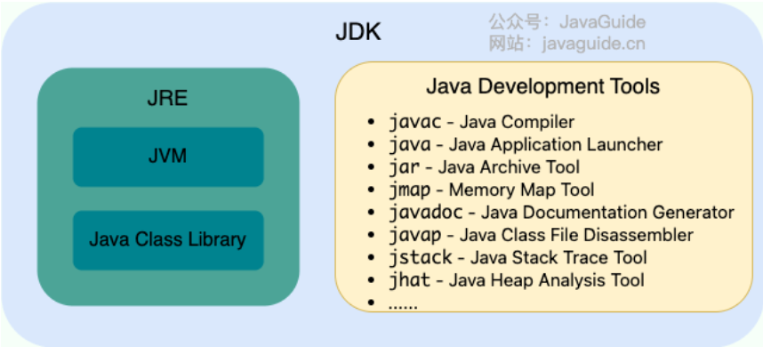
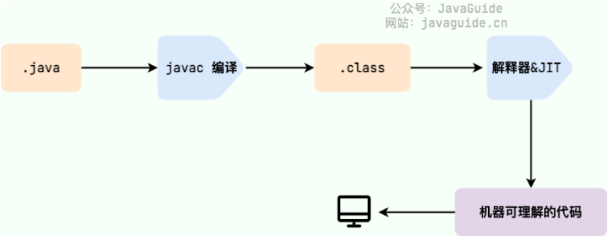
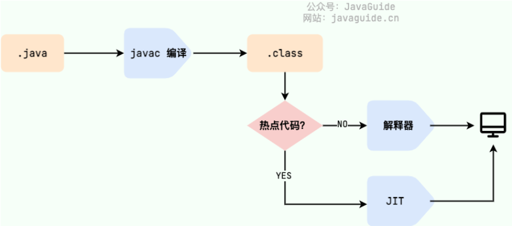
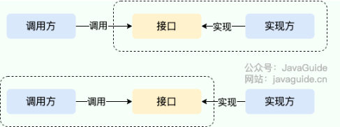

# 基本概念

## JVM、JDK、JRE

* JVM：运行Java字节码的虚拟机
* JDK：Java开发工具包，包括：
  * JRE
  * 编译器javac
  * 文档生成器javadoc
  * 调试器jdb
  * ...
* JRE：运行已经编译Java程序的环境，主要包括：
  * JVM
  * Java基础类库



## 字节码

* 定义：JVM 可以理解的代码就叫做字节码（即扩展名为 `.class` 的文件）
* 好处：一定程度上解决了传统解释型语言执行效率低的问题，同时又保留了解释型语言可移植的特点。
* 由 Java 编写的程序需要先经过编译步骤，生成字节码（`.class` 文件），这种字节码必须由 Java 解释器来解释执行。



## AOT

* 编译模式：在程序被执行前就将其编译成机器码，属于静态编译（C、C++）
* 好处：
  * 启动时间短：避免了 JIT 预热等各方面的开销，可以提高 Java 程序的启动速度，避免预热时间长。
  * 减少内存占用和增强 Java 程序的安全性。
  * 打包体积小
* 缺点
  * 无法支持 Java 的一些动态特性，某些用到这些特性的库和框架无法使用

## Java和C++

* 同：

  * 都是面向对象的语言，都支持封装、继承和多态
* 异：

  * Java 不提供指针来直接访问内存，程序内存更加安全。
  * Java 的类是单继承的，C++ 支持多重继承；虽然 Java 的类不可以多继承，但是接口可以多继承。
  * Java 有自动内存管理垃圾回收机制(GC)，不需要程序员手动释放无用内存。
  * C ++同时支持方法重载和操作符重载，但是 Java 只支持方法重载（操作符重载增加了复杂性，这与 Java 最初的设计思想不符）。

# 基础语法

## 标识符和关键字

* 标识符：为程序、类、变量、方法等取的名字
* 关键字：被赋予特殊含义的标识符

## 基本类型和包装类型

* 何时用哪一个？
  * 优先用基本类型：性能敏感、数值计算、循环、局部变量。
  * 必须用包装类型：需要 null 表示“缺失/未知”、与集合/泛型/框架交互、作为对象属性对外暴露。
  * 创建新对象时，优先选用静态工厂方法而不是new操作符。

## 自动装箱和拆箱

* **装箱** ：将基本类型用它们对应的引用类型包装起来；
* **拆箱** ：将包装类型转换为基本数据类型；
* 装箱其实就是调用了 包装类的 `valueOf()`方法，拆箱其实就是调用了 `xxxValue()`方法。
* **如果频繁拆装箱的话，也会严重影响系统的性能。我们应该尽量避免不必要的拆装箱操作。**

## 精度

* `BigDecimal` 可以实现对浮点数的运算，不会造成精度丢失。
* `BigInteger` 内部使用 `int[]` 数组来存储任意大小的整形数据。相对于常规整数类型的运算来说，`BigInteger` 运算的效率会相对较低

# 变量

## 成员变量与局部变量

* 语法形式

  * 成员变量是属于类的，而局部变量是在代码块或方法中定义的变量或是方法的参数
  * 成员变量可以被 `public`,`private`,`static` 等修饰符所修饰，而局部变量不能被访问控制修饰符及 `static` 所修饰
* 存储方式

  * 对象存在于堆内存，局部变量则存在于栈内存。
* 生存时间

  * 成员变量它随着对象的创建而存在，局部变量随着方法的调用开始/结束而自动生成/消亡。
* 默认值

  * 成员变量如果没有被赋初始值，则会自动以类型的默认值而赋值（一种情况例外:被 `final` 修饰的成员变量也必须显式地赋值），而局部变量则不会自动赋值。

# 方法

## 静态方法为什么不能调用非静态成员

* 静态方法是属于类的，在类加载的时候就会分配内存，可以通过类名直接访问。
* 而非静态成员属于实例对象，只有在对象实例化之后才存在，需要通过类的实例对象去访问。
* 在类的非静态成员不存在的时候静态方法就已经存在了，此时调用在内存中还不存在的非静态成员，属于非法操作。

## 静态方法和实例方法区别

* 在外部调用静态方法时，可以使用 `类名.方法名` 的方式，也可以使用 `对象.方法名` 的方式，而实例方法只有后面这种方式。
* 调用静态方法无需创建对象。
* 建议使用 `类名.方法名` 的方式来调用静态方法，避免混淆。
* 静态方法在访问本类的成员时，只允许访问静态成员，实例方法不存在这个限制。

## 重载和重写

* 重载就是同样的一个方法能够根据输入数据的不同，做出不同的处理
* 重写就是当子类继承自父类的相同方法，输入数据一样，但要做出有别于父类的响应时，你就要覆盖父类方法

### 重写

* 重写发生在运行期，是子类对父类的允许访问的方法的实现过程进行重新编写。
* **重写就是子类对父类方法的重新改造，外部样子不能改变，内部逻辑可以改变。**

1. 方法名、参数列表必须相同，子类方法返回值类型应比父类方法返回值类型更小或相等，抛出的异常范围小于等于父类，访问修饰符范围大于等于父类。
2. 如果父类方法访问修饰符为 `private/final/static` 则子类就不能重写该方法，但是被 `static` 修饰的方法能够被再次声明。
3. 构造方法无法被重写

# String

## String、StringBuffer、StringBuilder区别

* 可变性：`String`不可变； `StringBuilder` 与 `StringBuffer` 都继承自 `AbstractStringBuilder` 类，`AbstractStringBuilder` 定义了一些字符串的基本操作，如 `expandCapacity`、`append`、`insert`、`indexOf` 等公共方法。
* 线程： `StringBuffer` 对方法加了同步锁或者对调用的方法加了同步锁，所以是线程安全的。`StringBuilder` 并没有对方法进行加同步锁，所以是非线程安全的。
* 性能：相同情况下使用 `StringBuilder` 相比使用 `StringBuffer` 仅能获得 10%~15% 左右的性能提升，但却要冒多线程不安全的风险。
* 使用：
  * 操作少量的数据: 适用 `String`
  * 单线程操作字符串缓冲区下操作大量数据: 适用 `StringBuilder`
  * 多线程操作字符串缓冲区下操作大量数据: 适用 `StringBuffer`

## 为什么String不可变？

* 保存字符串的数组被 `final` 修饰且为私有的，并且 `String` 类没有提供/暴露修改这个字符串的方法。
* `String` 类被 `final` 修饰导致其不能被继承，进而避免了子类破坏 `String` 不可变。
* 在 Java 9 之后，`String`、`StringBuilder` 与 `StringBuffer` 的实现改用 `byte` 数组存储字符串。
* `String` 中的 `equals` 方法是被重写过的，比较的是 String 字符串的值是否相等。 `Object` 的 `equals` 方法是比较的对象的内存地址。

## 字符串常量池

* **字符串常量池** 是 JVM 为了提升性能和减少内存消耗针对字符串（String 类）专门开辟的一块区域，主要目的是为了避免字符串的重复创建。

```
// 在字符串常量池中创建字符串对象 ”ab“
// 将字符串对象 ”ab“ 的引用赋值给 aa
String aa = "ab";
// 直接返回字符串常量池中字符串对象 ”ab“，赋值给引用 bb
String bb = "ab";
System.out.println(aa==bb); // true
```

## String#intern

* `intern()` 方法的主要作用是确保字符串引用在常量池中的唯一性。
* 当调用 `intern()` 时，如果常量池中已经存在相同内容的字符串，则返回常量池中已有对象的引用；否则，将该字符串添加到常量池并返回其引用。

# 泛型

* 虚拟机不知道泛型，会把类型 `<T>`视为 `Object`，并根据 `<T>`实现安全的强制转型
* Java的泛型是由编译器在编译时实行的
* 局限
  * `<T>`不能是基本类型，例如 `int`，因为实际类型是 `Object`，`Object`类型无法持有基本类型
  * 无法取得带泛型的 `Class`，编译器在编译期会检查泛型类型是否正确，但到了  **运行时泛型信息会被擦除** 。
  * `instanceof` 不能用带泛型的写法，因为运行时只有一个 `class`
  * 不能直接实例化，需要借助额外的 `Class<T>`参数
* extends通配符：使用 `Pair<? extends Number>`使得方法接收所有泛型类型为 `Number`或 `Number`子类的 `Pair`类型；表示只读不能写
* super通配符：`Pair<? super Integer>`表示，方法参数接受所有泛型类型为 `Integer`或 `Integer`父类的 `Pair`类型；表示只可读不能写
* 无限定通配符：不能读也不能写

## 泛型类

```
//此处T可以随便写为任意标识，常见的如T、E、K、V等形式的参数常用于表示泛型
//在实例化泛型类时，必须指定T的具体类型
public class Generic<T>{

    private T key;

    public Generic(T key) {
        this.key = key;
    }

    public T getKey(){
        return key;
    }
}
```

## 泛型接口

## 泛型方法

```
   public static < E > void printArray( E[] inputArray )
   {
         for ( E element : inputArray ){
            System.out.printf( "%s ", element );
         }
         System.out.println();
    }
```

# 反射

* Java 反射 (Reflection) 是一种 **在程序运行时，动态地获取类的信息并操作类或对象（方法、属性）的能力** 。
* 优点
  * 灵活性和动态性
  * 框架开发
  * 解耦合和通用性
* 缺点
  * 性能开销大
  * 安全性问题
  * 代码可读性和维护性
* 应用场景

## 获取反射四种方式

* 知道具体类的情况下可以使用：`xxx.class`
  * 最常用
* 通过 `Class.forName()`传入类的全路径获取：
  * 传参获取
* 通过对象实例 `instance.getClass()`获取：
* 通过类加载器 `xxxClassLoader.loadClass()`传入类路径获取:

## 访问字段

* `Field getField(name)`：根据字段名获取某个public的field（包括父类）
* `Field getDeclaredField(name)`：根据字段名获取当前类的某个field（不包括父类）
* `Field[] getFields()`：获取所有public的field（包括父类）
* `Field[] getDeclaredFields()`：获取当前类的所有field（不包括父类）
* 一个 `Field`对象包含了一个字段的所有信息：
  * `getName()`：返回字段名称，例如，`"name"`；
  * `getType()`：返回字段类型，也是一个 `Class`实例，例如，`String.class`；
  * `getModifiers()`：返回字段的修饰符，它是一个 `int`，不同的bit表示不同的含义。
* `Field.set(Object, Object) `：设置字段值；第一个 `Object`参数是指定的实例，第二个 `Object`参数是待修改的值

## 调用方法

* `Method getMethod(name, Class...)`：获取某个 `public`的 `Method`（包括父类）
* `Method getDeclaredMethod(name, Class...)`：获取当前类的某个 `Method`（不包括父类）
* `Method[] getMethods()`：获取所有 `public`的 `Method`（包括父类）
* `Method[] getDeclaredMethods()`：获取当前类的所有 `Method`（不包括父类）
* 对 `Method`实例调用 `invoke`就相当于调用该方法，`invoke`的第一个参数是对象实例，即在哪个实例上调用该方法，后面的可变参数要与方法参数一致，否则将报错。
* 一个 `Method`对象包含一个方法的所有信息：
  * `getName()`：返回方法名称，例如：`"getScore"`；
  * `getReturnType()`：返回方法返回值类型，也是一个Class实例，例如：`String.class`；
  * `getParameterTypes()`：返回方法的参数类型，是一个Class数组，例如：`{String.class, int.class}`；
  * `getModifiers()`：返回方法的修饰符，它是一个 `int`，不同的bit表示不同的含义。
* 调用静态方法，`invoke`第一个参数永远为 `null`
* 调用非public方法，通过 `Method.setAccessible(true)`允许其调用，但是可能会失败
* 使用反射调用方法时，仍然遵循多态原则：即总是调用实际类型的覆写方法（如果存在）

## 调用构造方法

* 通过反射创建实例，调用 `Class.newInstance()`的局限是：它只能调用该类的public无参数构造方法。如果构造方法带有参数，或者不是public，就无法直接通过 `Class.newInstance()`来调用。
* `getConstructor(Class...)`：获取某个 `public`的 `Constructor`；
* `getDeclaredConstructor(Class...)`：获取某个 `Constructor`；
* `getConstructors()`：获取所有 `public`的 `Constructor`；
* `getDeclaredConstructors()`：获取所有 `Constructor`。
* 调用非 `public`的 `Constructor`时，必须首先通过 `setAccessible(true)`设置允许访问，可能会失败。

## 获取继承关系

* `getSuperclass()`：获取父类Class
* `getInterfaces()`：获取接口（只返回当前类直接实现的接口类型，并不包括其父类实现的接口类型）
* 对 `interface`的 `Class`调用 `getSuperclass()`返回的是 `null`，获取接口的父接口要用 `getInterfaces()`

# 注解

* 可以看作是一种特殊的注释，主要用于修饰类、方法或者变量，提供某些信息供程序在编译或者运行时使用。
* 注解本质是一个继承了 `Annotation` 的特殊接口。
* 三种类型
  * 由编译器使用的注解
  * 由工具处理 `.class`文件使用的注解
  * 在程序运行期能够读取的注解
* 元注解
  * 修饰其他注解的注解
  * @Target：定义注解能够被应用于源码哪些位置
    * 类或接口：`ElementType.TYPE`；
    * 字段：`ElementType.FIELD`；
    * 方法：`ElementType.METHOD`；
    * 构造方法：`ElementType.CONSTRUCTOR`；
    * 方法参数：`ElementType.PARAMETER`。
  * @Retention：定义注解的生命周期，默认为class
    * 仅编译期：`RetentionPolicy.SOURCE`；
    * 仅class文件：`RetentionPolicy.CLASS`；
    * 运行期：`RetentionPolicy.RUNTIME`
  * @Repeatable：定义注解是否可重复
  * @Inherited：定义子类是否可以继承父类的注解
    * 仅针对 `@Target(ElementType.TYPE)`类型的 `annotation`有效
    * 仅针对 `class`的继承，对 `interface`的继承无效：
* 定义注解
  * 使用 `@interface`定义注解
  * 添加参数、默认值
  * 用元注解配置注解
* 使用注解
  * 需要自己编写代码
  * 

# SPI

* 专门提供给服务提供者或者扩展框架功能的开发者去使用的一个接口。
* SPI 将服务接口和具体的服务实现分离开来，将服务调用方和服务实现者解耦，能够提升程序的扩展性、可维护性。
* 上方为API，下方为SPI



# 序列化和反序列化

* **序列化** ：将数据结构或对象转换成可以存储或传输的形式，通常是二进制字节流，也可以是 JSON, XML 等文本格式
* **反序列化** ：将在序列化过程中所生成的数据转换为原始数据结构或者对象的过程
* Java 中序列化的都是对象（Object）也就是实例化后的类(Class)
* 应用场景：**序列化的主要目的是通过网络传输对象或者说是将对象存储到文件系统、数据库、内存中。**
* 属于 TCP/IP **应用层**的一部分
* 对于不想进行序列化的变量，使用 `transient` 关键字修饰。`transient` 关键字的作用是：阻止实例中那些用此关键字修饰的的变量序列化；当对象被反序列化时，被 `transient` 修饰的变量值不会被持久化和恢复。
* `transient` 只能修饰变量，不能修饰类和方法。`static`变量不会被序列化

## 不使用JDK序列化

* 不支持跨语言调用
* 性能差
* 安全问题
* 比较常用的序列化协议有 Hessian、Kryo、Protobuf、ProtoStuff，这些都是基于二进制的序列化协议。

# I/O

* Java IO 流的 40 多个类都是从如下 4 个抽象类基类中派生出来的。
  * `InputStream`/`Reader`: 所有的输入流的基类，前者是字节输入流，后者是字符输入流。
  * `OutputStream`/`Writer`: 所有输出流的基类，前者是字节输出流，后者是字符输出流。

# Unsafe类
