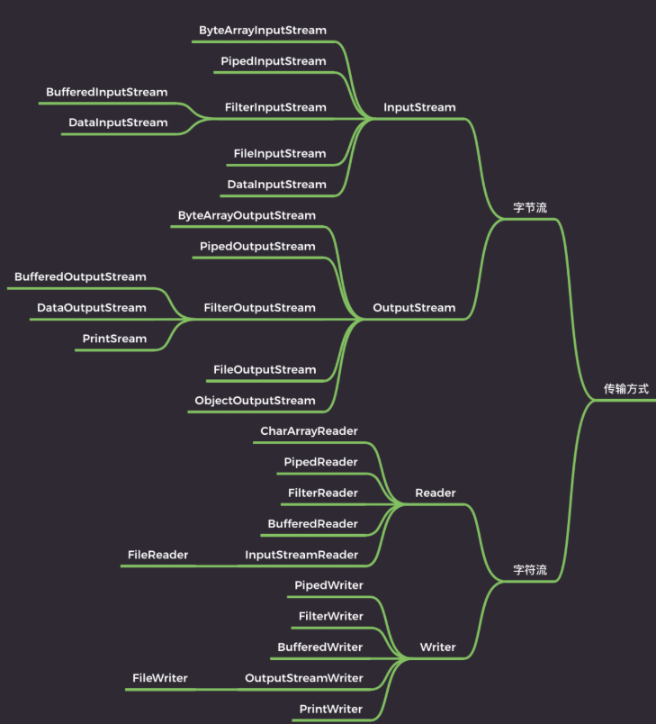
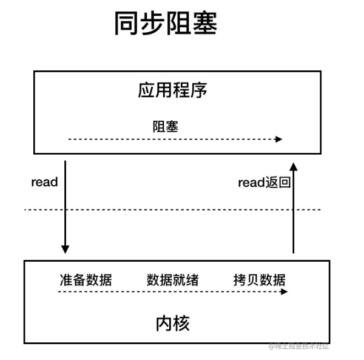
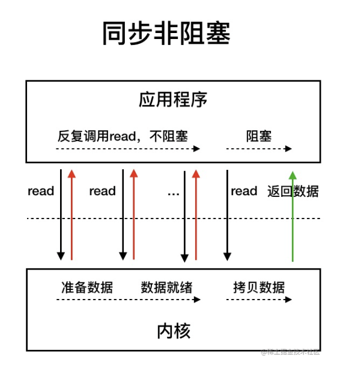
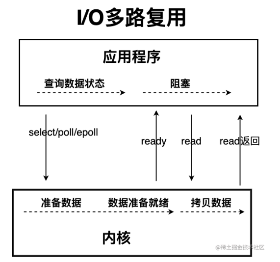
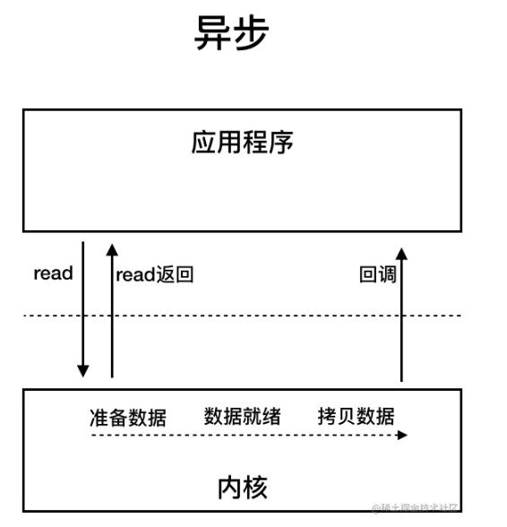
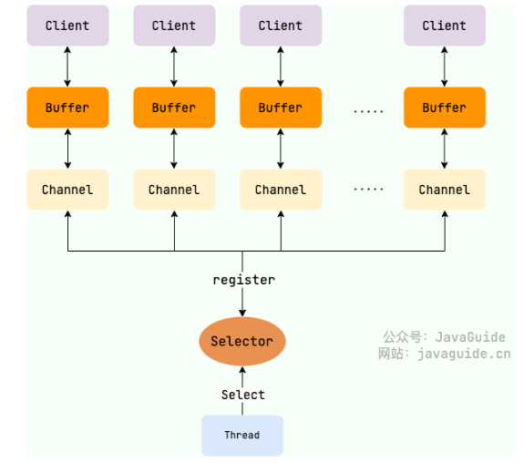
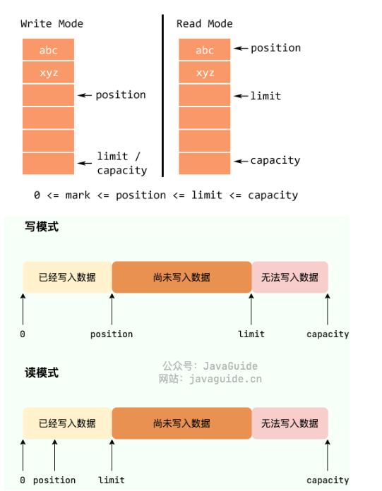

# IO

Java IO 流的 40 多个类都是从如下 4 个抽象类基类中派生出来的。

* `InputStream`/`Reader`: 所有的输入流的基类，前者是字节输入流，后者是字符输入流。
* `OutputStream`/`Writer`: 所有输出流的基类，前者是字节输出流，后者是字符输出流。



## 核心抽象类

### InputStream 类

* `int read()`：读取数据
* `int read(byte b[], int off, int len)`：从第 off 位置开始读，读取 len 长度的字节，然后放入数组 b 中
* `long skip(long n)`：跳过指定个数的字节
* `int available()`：返回可读的字节数
* `void close()`：关闭流，释放资源

### OutputStream 类

* `void write(int b)`： 写入一个字节，虽然参数是一个 int 类型，但只有低 8 位才会写入，高 24 位会舍弃
* `void write(byte b[], int off, int len)`： 将数组 b 中的从 off 位置开始，长度为 len 的字节写入
* `void flush()`： 强制刷新，将缓冲区的数据写入
* `void close()`：关闭流

### Reader 类

* `int read()`：读取单个字符
* `int read(char cbuf[], int off, int len)`：从第 off 位置开始读，读取 len 长度的字符，然后放入数组 b 中
* `long skip(long n)`：跳过指定个数的字符
* `int ready()`：是否可以读了
* `void close()`：关闭流，释放资源

### Writer 类

* `void write(int c)`： 写入一个字符
* `void write( char cbuf[], int off, int len)`： 将数组 cbuf 中的从 off 位置开始，长度为 len 的字符写入
* `void flush()`： 强制刷新，将缓冲区的数据写入
* `void close()`：关闭流


## 控制台读取输入

* 把 `System.in`包装在一个 `BufferedReader`中创建一个字符流
* ```java
  // 使用 BufferedReader 在控制台读取字符/字符串

  import java.io.*;

  public class BRRead {
     public static void main(String args[]) throws IOException
     {
        char c;
        String str;
        // 使用 System.in 创建 BufferedReader 
        BufferedReader br = new BufferedReader(new 
                           InputStreamReader(System.in));
        // 读取字符/字符串
        do {
           c = (char) br.read();// 字符
  	 str = br.readLine(); // 字符串
           System.out.println(c);
        } while(c != 'q');
     }
  }

  ```
* 使用 `Sacnner`类
* ```java
  import java.util.Scanner; 

  public class ScannerDemo { 
      public static void main(String[] args) { 
          Scanner scan = new Scanner(System.in); 
  				// 从键盘接收数据

          //nextLine方式接收字符串
          System.out.println("nextLine方式接收：");
          // 判断是否还有输入
          if(scan.hasNextLine()){   
            String str2 = scan.nextLine();
            System.out.println("输入的数据为："+str2);  
      	}  
      } 
  } 

  ```
* next需要读取有效字符才会结束输入，有效字符前面的空白会去掉，以空白作为分隔符/结束符，无法得到有空格的字符串
* nextline以enter为结束符

## 读写文件

## 字节流

### InputStream（字节输入流）

* 用于从源头（通常是文件）读取数据（字节信息）到内存中，`java.io.InputStream`抽象类是所有字节输入流的父类。
* 常用方法

  * `read()`：返回输入流中下一个字节的数据。返回的值介于 0 到 255 之间。如果未读取任何字节，则代码返回 `-1` ，表示文件结束。
  * `read(byte b[])` : 从输入流中读取一些字节存储到数组 `b` 中。如果数组 `b` 的长度为零，则不读取。如果没有可用字节读取，返回 `-1`。如果有可用字节读取，则最多读取的字节数最多等于 `b.length` ， 返回读取的字节数。这个方法等价于 `read(b, 0, b.length)`。
  * `read(byte b[], int off, int len)`：在 `read(byte b[ ])` 方法的基础上增加了 `off` 参数（偏移量）和 `len` 参数（要读取的最大字节数）。
  * `skip(long n)`：忽略输入流中的 n 个字节 ,返回实际忽略的字节数。
  * `available()`：返回输入流中可以读取的字节数。
  * `close()`：关闭输入流释放相关的系统资源。
  * `readAllBytes()`：读取输入流中的所有字节，返回字节数组。
  * `readNBytes(byte[] b, int off, int len)`：阻塞直到读取 `len` 个字节。
  * `transferTo(OutputStream out)`：将所有字节从一个输入流传递到一个输出流。
* 一般不会直接单独使用 `FileInputStream` ，通常会配合字节缓冲输入流 `BufferedInputStream`来使用
* `DataInputStream` 用于读取指定类型数据，不能单独使用，必须结合其它流，比如 `FileInputStream`
* ```java
  FileInputStream fileInputStream = new FileInputStream("input.txt");
  //必须将fileInputStream作为构造参数才能使用
  DataInputStream dataInputStream = new DataInputStream(fileInputStream);
  //可以读取任意具体的类型数据
  dataInputStream.readBoolean();
  dataInputStream.readInt();
  dataInputStream.readUTF();
  ```
* `ObjectInputStream` 用于从输入流中读取 Java 对象（反序列化），`ObjectOutputStream` 用于将对象写入到输出流(序列化)

### OutputStream（字节输出流）

用于将数据（字节信息）写入到目的地（通常是文件），`java.io.OutputStream`抽象类是所有字节输出流的父类

常用方法

* `write(int b)`：将特定字节写入输出流。
* `write(byte b[ ])` : 将数组 `b` 写入到输出流，等价于 `write(b, 0, b.length)` 。
* `write(byte[] b, int off, int len)` : 在 `write(byte b[ ])` 方法的基础上增加了 `off` 参数（偏移量）和 `len` 参数（要读取的最大字节数）。
* `flush()`：刷新此输出流并强制写出所有缓冲的输出字节。
* `close()`：关闭输出流释放相关的系统资源
* 向 output.txt 写入 "JavaGuide"

```java
try (FileOutputStream output = new FileOutputStream("output.txt")) {
    byte[] array = "JavaGuide".getBytes();
    output.write(array);
} catch (IOException e) {
    e.printStackTrace();
}
```

* `FileOutputStream` 通常也会配合 字节缓冲输出流 `BufferedOutputStream` 来使用
* **`DataOutputStream`** 用于写入指定类型数据，不能单独使用，必须结合其它流，比如 `FileOutputStream` 。

## 字符流

* I/O操作为什么要分为字符流和字节流？
  * 字符流是由 Java 虚拟机将字节转换得到的，这个过程还算是比较耗时。
  * 如果我们不知道编码类型就很容易出现乱码问题。
* I/O 流提供了一个直接操作字符的接口，方便我们平时对字符进行流操作。
* 音频文件、图片等媒体文件用字节流比较好，如果涉及到字符的话使用字符流比较好。
* 字符流默认采用的是 `Unicode` 编码，我们可以通过构造方法自定义编码。
* Unicode 本身只是一种字符集，它为每个字符分配一个唯一的数字编号，并没有规定具体的存储方式。UTF-8、UTF-16、UTF-32 都是 Unicode 的编码方式，它们使用不同的字节数来表示 Unicode 字符。例如，UTF-8 :英文占 1 字节，中文占 3 字节。

### Reader（字符输入流）

* `Reader`用于从源头（通常是文件）读取数据（字符信息）到内存中，`java.io.Reader`抽象类是所有字符输入流的父类。`Reader` 用于读取文本， `InputStream` 用于读取原始字节。
* 常用方法：
  * `read()` : 从输入流读取一个字符。
  * `read(char[] cbuf)` : 从输入流中读取一些字符，并将它们存储到字符数组 `cbuf`中，等价于 `read(cbuf, 0, cbuf.length)` 。
  * `read(char[] cbuf, int off, int len)`：在 `read(char[] cbuf)` 方法的基础上增加了 `off` 参数（偏移量）和 `len` 参数（要读取的最大字符数）。
  * `skip(long n)`：忽略输入流中的 n 个字符 ,返回实际忽略的字符数。
  * `close()` : 关闭输入流并释放相关的系统资源。
* `InputStreamReader` 是字节流转换为字符流的桥梁，其子类 `FileReader` 是基于该基础上的封装，可以直接操作字符文件。

```java
try (FileReader fileReader = new FileReader("input.txt");) {
    int content;
    long skip = fileReader.skip(3);
    System.out.println("The actual number of bytes skipped:" + skip);
    System.out.print("The content read from file:");
    while ((content = fileReader.read()) != -1) {
        System.out.print((char) content);
    }
} catch (IOException e) {
    e.printStackTrace();
}
```

### Writer（字符输出流）

* `Writer`用于将数据（字符信息）写入到目的地（通常是文件），`java.io.Writer`抽象类是所有字符输出流的父类。
* 常用方法：

  * `write(int c)` : 写入单个字符。
  * `write(char[] cbuf)`：写入字符数组 `cbuf`，等价于 `write(cbuf, 0, cbuf.length)`。
  * `write(char[] cbuf, int off, int len)`：在 `write(char[] cbuf)` 方法的基础上增加了 `off` 参数（偏移量）和 `len` 参数（要读取的最大字符数）。
  * `write(String str)`：写入字符串，等价于 `write(str, 0, str.length())` 。
  * `write(String str, int off, int len)`：在 `write(String str)` 方法的基础上增加了 `off` 参数（偏移量）和 `len` 参数（要读取的最大字符数）。
  * `append(CharSequence csq)`：将指定的字符序列附加到指定的 `Writer` 对象并返回该 `Writer` 对象。
  * `append(char c)`：将指定的字符附加到指定的 `Writer` 对象并返回该 `Writer` 对象。
  * `flush()`：刷新此输出流并强制写出所有缓冲的输出字符。
  * `close()`:关闭输出流释放相关的系统资源
* `OutputStreamWriter` 是字符流转换为字节流的桥梁，其子类 `FileWriter` 是基于该基础上的封装，可以直接将字符写入到文件。

```java
try (Writer output = new FileWriter("output.txt")) {
    output.write("你好，我是Guide。");
} catch (IOException e) {
    e.printStackTrace();
}
```

## 字节缓冲流

* IO 操作很消耗性能，缓冲流将数据加载至缓冲区，一次性读取/写入多个字节，从而避免频繁的 IO 操作，提高流的传输效率。
* 字节缓冲流这里采用了装饰器模式来增强 `InputStream` 和 `OutputStream`子类对象的功能。
* 字节流和字节缓冲流的性能差别主要体现在我们使用两者的时候都是调用 `write(int b)` 和 `read()` 这两个一次只读取一个字节的方法的时候。由于字节缓冲流内部有缓冲区（字节数组），因此，字节缓冲流会先将读取到的字节存放在缓存区，大幅减少 IO 次数，提高读取效率。

### BufferedInputStream（字节缓冲输入流）

* `BufferedInputStream` 从源头（通常是文件）读取数据（字节信息）到内存的过程中不会一个字节一个字节的读取，而是会先将读取到的字节存放在缓存区，并从内部缓冲区中单独读取字节。这样大幅减少了 IO 次数，提高了读取效率。
* `BufferedInputStream` 内部维护了一个缓冲区，这个缓冲区实际就是一个字节数组，默认大小 8192

### BufferedOutputStream（字节缓冲输出流）

* `BufferedOutputStream` 将数据（字节信息）写入到目的地（通常是文件）的过程中不会一个字节一个字节的写入，而是会先将要写入的字节存放在缓存区，并从内部缓冲区中单独写入字节。这样大幅减少了 IO 次数，提高了效率

### 字符缓冲流

`BufferedReader` （字符缓冲输入流）和 `BufferedWriter`（字符缓冲输出流）类似于 `BufferedInputStream`（字节缓冲输入流）和 `BufferedOutputStream`（字节缓冲输入流），内部都维护了一个字节数组作为缓冲区。不过，前者主要是用来操作字符信息。

## 随机访问流

* 这里的随机访问流指的是支持随意跳转到文件的任意位置进行读写的 `RandomAccessFile`
* 读写模式主要有下面四种：

  * `r` : 只读模式。
  * `rw`: 读写模式
  * `rws`: 相对于 `rw`，`rws` 同步更新对“文件的内容”或“元数据”的修改到外部存储设备。
  * `rwd` : 相对于 `rw`，`rwd` 同步更新对“文件的内容”的修改到外部存储设备。
* 文件内容指的是文件中实际保存的数据，元数据则是用来描述文件属性比如文件的大小信息、创建和修改时间。
* `RandomAccessFile` 中有一个文件指针用来表示下一个将要被写入或者读取的字节所处的位置。我们可以通过 `RandomAccessFile` 的 `seek(long pos)` 方法来设置文件指针的偏移量（距文件开头 `pos` 个字节处）。如果想要获取文件指针当前的位置的话，可以使用 `getFilePointer()` 方法。
* `RandomAccessFile` 的 `write` 方法在写入对象的时候如果对应的位置已经有数据的话，会将其覆盖掉。需要提前设置指针偏移量
* `RandomAccessFile` 比较常见的一个应用就是实现大文件的 **断点续传，它可以合并文件分片**

## IO设计模式

### 装饰器模式

* **装饰器（Decorator）模式** 可以在不改变原有对象的情况下拓展其功能。通过组合替代继承来扩展原始类的功能，在一些继承关系比较复杂的场景（IO 这一场景各种类的继承关系就比较复杂）更加实用。
* 对于字节流来说， `FilterInputStream` （对应输入流）和 `FilterOutputStream`（对应输出流）是装饰器模式的核心，分别用于增强 `InputStream` 和 `OutputStream`子类对象的功能。
* 我们常见的 `BufferedInputStream`(字节缓冲输入流)、`DataInputStream` 等等都是 `FilterInputStream` 的子类，`BufferedOutputStream`（字节缓冲输出流）、`DataOutputStream`等等都是 `FilterOutputStream`的子类。
* 举例：通过 `BufferedInputStream`（字节缓冲输入流）来增强 `FileInputStream` 的功能， `BufferedInputStream` 的构造函数其中的一个参数就是 `InputStream`。

```java
public BufferedInputStream(InputStream in) {
    this(in, DEFAULT_BUFFER_SIZE);
}

public BufferedInputStream(InputStream in, int size) {
    super(in);
    if (size <= 0) {
        throw new IllegalArgumentException("Buffer size <= 0");
    }
    buf = new byte[size];
}
```

### 适配器模式

* 主要用于接口互不兼容的类的协调工作，你可以将其联想到我们日常经常使用的电源适配器。
* IO 流中的字符流和字节流的接口不同，它们之间可以协调工作就是基于适配器模式来做的，更准确点来说是对象适配器。通过适配器，我们可以将字节流对象适配成一个字符流对象，这样我们可以直接通过字节流对象来读取或者写入字符数据。
* `InputStreamReader` 和 `OutputStreamWriter` 就是两个适配器(Adapter)， 同时，它们两个也是字节流和字符流之间的桥梁。`InputStreamReader` 使用 `StreamDecoder` （流解码器）对字节进行解码，**实现字节流到字符流的转换，**`OutputStreamWriter` 使用 `StreamEncoder`（流编码器）对字符进行编码，实现字符流到字节流的转换。

### 二者区别

**装饰器模式** 更侧重于动态地增强原始类的功能，装饰器类需要跟原始类继承相同的抽象类或者实现相同的接口。并且，装饰器模式支持对原始类嵌套使用多个装饰器。

**适配器模式** 更侧重于让接口不兼容而不能交互的类可以一起工作，当我们调用适配器对应的方法时，适配器内部会调用适配者类或者和适配类相关的类的方法，这个过程是透明的。就比如说 `StreamDecoder` （流解码器）和 `StreamEncoder`（流编码器）就是分别基于 `InputStream` 和 `OutputStream` 来获取 `FileChannel`对象并调用对应的 `read` 方法和 `write` 方法进行字节数据的读取和写入。

### 观察者模式

没看懂

## IO模型

**从计算机结构的视角来看的话， I/O 描述了计算机系统与外部设备之间通信的过程。**

**从应用程序的视角来看的话，我们的应用程序对操作系统的内核发起 IO 调用（系统调用），操作系统负责的内核执行具体的 IO 操作。也就是说，我们的应用程序实际上只是发起了 IO 操作的调用而已，具体 IO 的执行是由操作系统的内核来完成的。**

当应用程序发起 I/O 调用后，会经历两个步骤：

1. 内核等待 I/O 设备准备好数据
2. 内核将数据从内核空间拷贝到用户空间。

UNIX 系统下， IO 模型一共有 5 种： **同步阻塞 I/O** 、 **同步非阻塞 I/O** 、 **I/O 多路复用** 、**信号驱动 I/O** 和 **异步 I/O** 。

### Java 中 3 种常见 IO 模型

#### BIO（Blockinng I/O）

* **BIO 属于同步阻塞 IO 模型** 。同步阻塞 IO 模型中，应用程序发起 read 调用后，会一直阻塞，直到内核把数据拷贝到用户空间。
* 在客户端连接数量不高的情况下，是没问题的。但是面对十万甚至百万级连接的时候，传统的 BIO 模型是无能为力的。



#### NIO（Non-blocking/New I/O）

* Java 中的 NIO 对应 `java.nio` 包。NIO 中的 N 可以理解为 Non-blocking，不单纯是 New。它是支持面向缓冲的，基于通道的 I/O 操作方法。 对于高负载、高并发的（网络）应用，应使用 NIO 。
* Java 中的 NIO 可以看作是  **I/O 多路复用模型** 。也有很多人认为，Java 中的 NIO 属于同步非阻塞 IO 模型。
* 同步非阻塞模型：

  * 应用程序会一直发起 read 调用，等待数据从内核空间拷贝到用户空间的这段时间里，线程依然是阻塞的，直到在内核把数据拷贝到用户空间。
  * 轮询：同步非阻塞 IO，发起一个 read 调用，如果数据没有准备好，这个时候应用程序可以不阻塞等待，而是切换去做一些小的计算任务，然后很快回来继续发起 read 调用。轮询不是持续不断发起的，会有间隙, 这个间隙的利用就是同步非阻塞 IO 比同步阻塞 IO 高效的地方。
  * **缺点：**应用程序不断进行 I/O 系统调用轮询数据是否已经准备好的过程是十分消耗 CPU 资源的。****

  
* I/O多路复用IO

  * 多路复用模型中，线程首先发起 select 调用，询问内核数据是否准备就绪，等内核把数据准备好了，用户线程再发起 read 调用。read 调用的过程（数据从内核空间 -> 用户空间）还是阻塞的.
  * **IO 多路复用模型，通过减少无效的系统调用，减少了对 CPU 资源的消耗。**
  * Java 中的 NIO ，有一个**选择器 ( Selector )** 的概念，也可以被称为  **多路复用器** 。通过它，只需要一个线程便可以管理多个客户端连接。当客户端数据到了之后，才会为其服务。



#### AIO(Asynchronous I/O)

AIO 是异步 IO 是，基于事件 and 回调机制实现的，也就是应用操作之后会直接返回，不会堵塞在那里，当后台处理完成，操作系统会通知相应的线程进行后续的操作。



### NIO详解

* 使用 NIO 并不一定意味着高性能，它的性能优势主要体现在高并发和高延迟的网络环境下。当连接数较少、并发程度较低或者网络传输速度较快时，NIO 的性能并不一定优于传统的 BIO 。
* 核心组件
  * **Buffer（缓冲区）** ：NIO 读写数据都是通过缓冲区进行操作 of。读操作的时候将 Channel 中的数据填充到 Buffer 中，而写操作时将 Buffer 中的数据写入到 Channel 中。
  * **Channel（通道）** ：Channel 是一个双向的、可读可写的数据传输通道，NIO 通过 Channel 来实现数据的输入输出。通道是一个抽象的概念，它可以代表文件、套接字或者其他数据源之间的连接。
  * **Selector（选择器）** ：允许一个线程处理多个 Channel，基于事件驱动的 I/O 多路复用模型。所有的 Channel 都可以注册到 Selector 上，由 Selector 来分配线程来处理事件。



#### Buffer

* 传统的 BIO 中，数据的读写是面向流的， 分为字节流和字符流。
* NIO 库中，所有数据都是用缓冲区处理的，有点类似于 BIO 中的缓冲流。NIO 在读/写数据时，它是直接读/写到缓冲区中的。
* 变量含义

  * 容量（`capacity`）：`Buffer`可以存储的最大数据量，`Buffer`创建时设置且不可改变；
  * 界限（`limit`）：`Buffer` 中可以读/写数据的边界。写模式下，`limit` 代表最多能写入的数据，一般等于 `capacity`（可以通过 `limit(int newLimit)`方法设置）；读模式下，`limit` 等于 Buffer 中实际写入的数据大小。
  * 位置（`position`）：下一个可以被读写的数据的位置（索引）。从写操作模式到读操作模式切换的时候（flip），`position` 都会归零，这样就可以从头开始读写了。
  * 标记（`mark`）：`Buffer`允许将位置直接定位到该标记处，这是一个可选属性；
  * **0 <= mark <= position <= limit <= capacity**

  ```java
  public abstract class Buffer {
      // Invariants: mark <= position <= limit <= capacity
      private int mark = -1;
      private int position = 0;
      private int limit;
      private int capacity;
  }
  ```
* Buffer 有读模式和写模式这两种模式，分别用于从 Buffer 中读取数据或者向 Buffer 中写入数据。Buffer 被创建之后默认是写模式，调用 `flip()` 可以切换到读模式。如果要再次切换回写模式，可以调用 `clear()` 或者 `compact()` 方法。
* 
* 重要方法

  * `get` : 读取缓冲区的数据
  * `put` ：向缓冲区写入数据
  * `flip` ：将缓冲区从写模式切换到读模式，它会将 `limit` 的值设置为当前 `position` 的值，将 `position` 的值设置为 0。
  * `clear`: 清空缓冲区，将缓冲区从读模式切换到写模式，并将 `position` 的值设置为 0，将 `limit` 的值设置为 `capacity` 的值。
  * `Buffer` 对象不能通过 `new` 调用构造方法创建对象 ，只能通过静态方法实例化 `Buffer`

#### Channel

* 是一个通道，全双工，建立了与数据源（如文件、网络套接字等）之间的连接。
* 通道与流的不同之处在于通道是双向的，它可以用于读、写或者同时用于读写。
* 常用通道：

  * `FileChannel`：文件访问通道；
  * `SocketChannel`、`ServerSocketChannel`：TCP 通信通道；
  * `DatagramChannel`：UDP 通信通道；
* 核心方法：

  * `read` ：读取数据并写入到 Buffer 中。
  * `write` ：将 Buffer 中的数据写入到 Channel 中。

#### Selector

* 允许一个线程处理多个 Channel
* 主要运作原理：通过 Selector 注册通道的事件，Selector 会不断地轮询注册在其上的 Channel。当事件发生时，比如：某个 Channel 上面有新的 TCP 连接接入、读和写事件，这个 Channel 就处于就绪状态，会被 Selector 轮询出来。Selector 会将相关的 Channel 加入到就绪集合中。通过 SelectionKey 可以获取就绪 Channel 的集合，然后对这些就绪的 Channel 进行相应的 I/O 操作。
* 监听事件类型：

  * `SelectionKey.OP_ACCEPT`：表示通道接受连接的事件，这通常用于 `ServerSocketChannel`。
  * `SelectionKey.OP_CONNECT`：表示通道完成连接的事件，这通常用于 `SocketChannel`。
  * `SelectionKey.OP_READ`：表示通道准备好进行读取的事件，即有数据可读。
  * `SelectionKey.OP_WRITE`：表示通道准备好进行写入的事件，即可以写入数据。
* `SelectionKey` 集合：

  * 所有的 `SelectionKey` 集合：代表了注册在该 Selector 上的 `Channel`，这个集合可以通过 `keys()` 方法返回。
  * 被选择的 `SelectionKey` 集合：代表了所有可通过 `select()` 方法获取的、需要进行 `IO` 处理的 Channel，这个集合可以通过 `selectedKeys()` 返回。
  * 被取消的 `SelectionKey` 集合：代表了所有被取消注册关系的 `Channel`，在下一次执行 `select()` 方法时，这些 `Channel` 对应的 `SelectionKey` 会被彻底删除，程序通常无须直接访问该集合，也没有暴露访问的方法。

#### NIO零拷贝

* 计算机执行 IO 操作时，CPU 不需要将数据从一个存储区域复制到另一个存储区域，从而可以减少上下文切换以及 CPU 的拷贝时间。
* 零拷贝主要是减少了 CPU 拷贝及上下文的切换。

如果需要使用 NIO 构建网络程序的话，不建议直接使用原生 NIO，编程复杂且功能性太弱，推荐使用一些成熟的基于 NIO 的网络编程框架比如 Netty。Netty 在 NIO 的基础上进行了一些优化和扩展比如支持多种协议、支持 SSL/TLS 等等。
