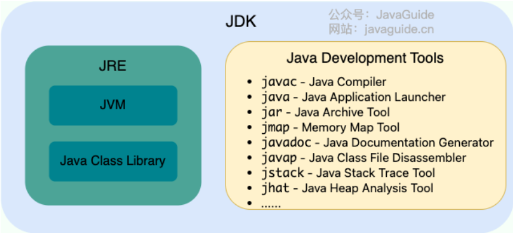
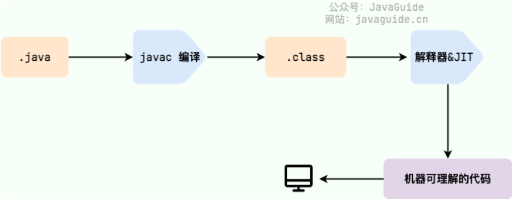
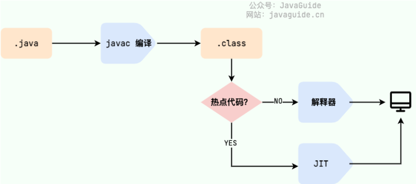
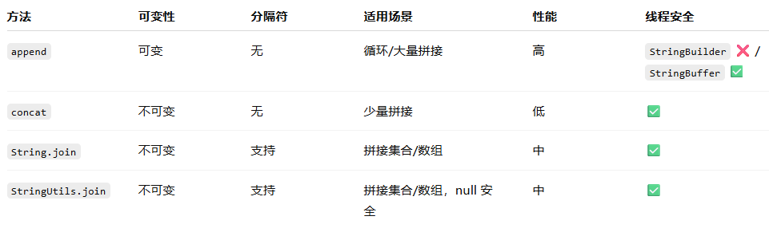

# 基本概念

## JVM、JDK、JRE

* JVM：运行Java字节码的虚拟机
* JDK：Java开发工具包，包括：
  * JRE
  * 编译器javac
  * 文档生成器javadoc
  * 调试器jdb
  * ...
* JRE：运行已经编译Java程序的环境，主要包括：
  * JVM
  * Java基础类库



## 字节码

* 定义：JVM 可以理解的代码就叫做字节码（即扩展名为 `.class` 的文件）
* 好处：一定程度上解决了传统解释型语言执行效率低的问题，同时又保留了解释型语言可移植的特点。
* 由 Java 编写的程序需要先经过编译步骤，生成字节码（`.class` 文件），这种字节码必须由 Java 解释器来解释执行。
* JIT：运行时编译，完成第一次编译后会将字节码对应的机器码保存下来，下次可以直接使用



## AOT

* 编译模式：在程序被执行前就将其编译成机器码，属于静态编译（C、C++、Rust、Go）
* 好处：
  * 启动时间短：避免了 JIT 预热等各方面的开销，可以提高 Java 程序的启动速度，避免预热时间长。
  * 减少内存占用 and 增强 Java 程序的安全性。
  * 打包体积小
* 缺点
  * 无法支持 Java 的一些动态特性，某些用到这些特性的库 and 框架无法使用

## Java和C++

* 同：

  * 都是面向对象的语言，都支持封装、继承 and 多态
* 异：

  * Java 不提供指针来直接访问内存，程序内存更加安全。
  * Java 的类是单继承的，C++ 支持多重继承；虽然 Java 的类不可以多继承，但是接口可以多继承。
  * Java 有自动内存管理垃圾回收机制(GC)，不需要程序员手动释放无用内存。
  * C ++同时支持方法重载 and 操作符重载，但是 Java 只支持方法重载（操作符重载增加了复杂性，这与 Java 最初的设计思想不符）。

# 基本数据类型

## 数据类型转换

* **自动转换**：将一种基本数据类型自动转换为另一种基本数据类型的过程
  * 如果任一操作数是 double 类型，其他操作数将被转换为 double 类型。
  * 否则，如果任一操作数是 float 类型，其他操作数将被转换为 float 类型。
  * 否则，如果任一操作数是 long 类型，其他操作数将被转换为 long 类型。
  * 否则，所有操作数将被转换为 int 类型。
* **强制类型转换**：显式转换，可能会导致精度丢失或溢出。

```java
int a = 1500000000, b = 1500000000;
long sum = (long)a + b; // 3000000000 (正确)
long sum_err = (long)(a + b); // -1294967296 (错误，先溢出再转换)
```

## 标识符和关键字

* 标识符：为程序、类、变量、方法等取的名字
* 关键字：被赋予特殊含义的标识符

## 基本类型和包装类型

* 何时用哪一个？
  * 优先用基本类型：性能敏感、数值计算、循环、局部变量、常量。
  * 必须用包装类型：需要 null 表示“缺失/未知”、与集合/泛型/框架交互、作为对象属性对外暴露。
  * 创建新对象时，优先选用静态工厂方法而不是 new 操作符。

| 比较维度 | 基本类型                                               | 包装类型                                         |
| -------- | ------------------------------------------------------ | ------------------------------------------------ |
| 用途     | 常量、局部变量                                         | 方法参数、对象属性                               |
| 存储方式 | 局部变量存放在栈中<br />成员变量（无static）存放在堆中 | 堆                                               |
| 占用空间 | 小                                                     | 大                                               |
| 默认值   | 有对应默认值                                           | null                                             |
| 比较方式 | `==` 比较的是值                                      | `==` 比较的是地址<br />`equals()` 比较的是值 |

## 包装类型缓存 (数据缓存)

* `Byte`,`Short`,`Integer`,`Long` 这 4 种包装类默认创建了数值 **[-128，127]** 的相应类型的缓存数据。
* `Character` 创建了数值在 **[0,127]** 范围的缓存数据。
* `Boolean` 直接返回 `TRUE` or `FALSE`。
* 如果超出对应范围仍然会去创建新的对象。
* `Float`,`Double` 并没有实现缓存机制。
* **Integer 缓存池**：`Integer.valueOf(18)` 会使用缓存池中的对象，多次调用只会取同一个对象的引用；而 `new Integer(18)` 每次都会新建一个对象。

## 自动装箱和拆箱

* **装箱** ：将基本类型用它们对应的引用类型包装起来；
* **拆箱** ：将包装类型转换为基本数据类型；
* 装箱调用了包装类的 `valueOf()` 方法，拆箱调用了 `xxxValue()` 方法。
  * `Integer i = 10` 等价于 `Integer i = Integer.valueOf(10)`
  * `int n = i` 等价于 `int n = i.intValue()`;
* **如果频繁拆装箱的话，也会严重影响系统的性能。我们应该尽量避免不必要的拆装箱操作。**

## 精度

* `BigDecimal` 可以实现对浮点数的运算，不会造成精度丢失。
* `BigInteger` 内部使用 `int[]` 数组来存储任意大小的整形数据。相对于常规整数类型的运算来说，`BigInteger` 运算的效率会相对较低。

# 数组

## 数组打印

* **stream 流打印**：
  * `Arrays.stream(cmowers).forEach(System.out::println);`
  * `Stream.of(cmowers).forEach(System.out::println);`
* **Arrays 工具类**：
  * `Arrays.toString(array)`（一维数组）
  * `Arrays.deepToString(array)`（多维数组）

# 变量

## 成员变量与局部变量

* 语法形式
  * 成员变量是属于类的，而局部变量是在代码块或方法中定义的变量或是方法的参数。
  * 成员变量可以被 `public`,`private`,`static` 等修饰符所修饰，而局部变量不能被访问控制修饰符及 `static` 所修饰。
* 存储方式
  * 对象存在于堆内存，局部变量则存在于栈内存。
* 生存时间
  * 成员变量它随着对象的创建而存在，局部变量随着方法的调用开始/结束而自动生成/消亡。
* 默认值
  * 成员变量如果没有被赋初始值，则会自动以类型的默认值而赋值（一种情况例外:被 `final` 修饰的成员变量也必须显式地赋值），而局部变量则不会自动赋值。

# 方法

## 静态方法为什么不能调用非静态成员

* 静态方法是属于类的，在类加载的时候就会分配内存，可以通过类名直接访问。
* 而非静态成员属于实例对象，只有在对象实例化之后才存在，需要通过类的实例对象去访问。
* 在类的非静态成员不存在的时候静态方法就已经存在了，此时调用在内存中还不存在的非静态成员，属于非法操作。

## 静态方法和实例方法区别

* 在外部调用静态方法时，可以使用 `类名.方法名` 的方式，也可以使用 `对象.方法名` 的方式，而实例方法只有后面这种方式。
* 调用静态方法无需创建对象。
* 建议使用 `类名.方法名` 的方式来调用静态方法，避免混淆。
* 静态方法在访问本类的成员时，只允许访问静态成员，实例方法不存在这个限制。

## 重载和重写

* 重载就是同样的一个方法能够根据输入数据的不同，做出不同的处理。
* 重写就是当子类继承自父类的相同方法，输入数据一样，但要做出有别于父类的响应时，你就要覆盖父类方法。

### 重写

* 重写发生在运行期，是子类对父类的允许访问的方法的实现过程进行重新编写。
* **重写就是子类对父类方法的重新改造，外部样子不能改变，内部逻辑可以改变。**

1. 方法名、参数列表必须相同，子类方法返回值类型应比父类方法返回值类型更小或相等，抛出的异常范围小于等于父类，访问修饰符范围大于等于父类。
2. 如果父类方法访问修饰符为 `private/final/static` 则子类就不能重写该方法，但是被 `static` 修饰的方法能够被再次声明。
3. 构造方法无法被重写。

### 可变长参数

* 允许调用方法时传入不定长度的参数。
* `public static void method1(String... args){}`
* 可变参数只能作为函数的最后一个参数。
* 遇到重载时，会优先匹配固定参数的方法。

# 修饰符

## 访问控制修饰符

* `default`：默认访问修饰符，变量和方法对同一个包的类可见。接口变量隐式声明为 `public static final`，接口方法默认声明为 `public`。
* `private`：私有访问修饰符，变量和方法只能被所属类访问。
* `public`：公有访问修饰符，类、方法、变量、接口都能被其他类访问。
* `protected`：受保护访问修饰符，变量、方法、构造函数能被同一包中的其他类访问，能被不同包中的子类访问。不能修饰类 and 接口、以及接口的变量 and 方法。
* 访问控制 and 继承
  * public 的子类必须是 public。
  * protected 的子类必须是 public 或 protected。
  * private 的方法不能被继承。

## 非访问修饰符

* `static`：
  * 静态变量只有一份拷贝。
  * 静态方法不能使用类的非静态变量。
* `final`
  * 变量只能被初始化一次，被声明的对象引用不能指向不同对象，但是 `final` 里面的数据可以改变。
  * 方法可以被子类继承，但是不能被修改。
  * 类不能被继承。
* `abstract`
  * 抽象类不能用于实例化，而是为了将来对嘞扩充，类不能同时被 `abstract` and `final` 修饰，抽象类可以包含抽象方法 and 非抽象方法。一个类包含抽象方法，则该类必须是抽象类。
  * 抽象方法没有实现，需要子类实现，不能被声明为 `abstract` and `final`。抽象类的子类需要实现父类所有抽象方法，除非子类也是抽象类。
* `synchronized`
  * 被声明的方法同一时间只能被同一线程访问。
* `transient`
  * JVM 会跳过被修饰的变量。
* `volatile`
  * 被修饰的成员变量每次被线程访问时，都强迫从共享内存读取值。
  * 成员变量变化时，强迫线程将变化值写到共享内存。

# String

## String、StringBuffer、StringBuilder 区别

* 可变性：`String` 不可变； `StringBuilder` 与 `StringBuffer` 都继承自 `AbstractStringBuilder` 类，`AbstractStringBuilder` 定义了一些字符串的基本操作，如 `expandCapacity`、`append`、`insert`、`indexOf` 等公共方法。
* 线程： `StringBuffer` 对方法加了同步锁或者对调用的方法加了同步锁，所以是线程安全的。`StringBuilder` 并没有对方法进行加同步锁，所以是非线程安全的。
* 性能：相同情况下使用 `StringBuilder` 相比使用 `StringBuffer` 仅能获得 10%~15% 左右的性能提升，但却要冒多线程不安全的风险。
* 使用：
  * 操作少量的数据: 适用 `String`
  * 单线程操作字符串缓冲区下操作大量数据: 适用 `StringBuilder`
  * 多线程操作字符串缓冲区下操作大量数据: 适用 `StringBuffer`

## 为什么 String 不可变？

* **保证安全性**：避免被篡改，如网络连接参数等。
* **保证哈希值不会被频繁变更**：字符串作为 HashMap 的 key 时，不可变性保证了哈希值的稳定性。
* **实现字符串常量池**。
* **源码角度**：保存字符串的数组被 `final` 修饰且为私有的，并且 `String` 类没有提供/暴露修改这个字符串的方法。
* `String` 类被 `final` 修饰导致其不能被继承。

## 字符串源码解读

* 字符串哈希：`H(s) = (s[0] * 31^(n-1)) + (s[1] * 31^(n-2)) + ... + (s[n-1] * 31^0)`
* `substring(begin, end)`：左闭右开。
* `indexOf`：查找指定字符/子串在串中第一次出现的位置。

## 字符串常量池

* **字符串常量池** 是 JVM 为了提升性能 and 减少内存消耗针对字符串（String 类）专门开辟的一块区域，主要目的是为了避免字符串的重复创建。
* `String s = new String("二哥");` 会创建两个对象（一个在常量池，一个在堆中）。
* `String s = "三妹";` 如果常量池中已存在则直接引用，否则在常量池创建。


## String#intern

* 当调用 `str.intern()` 时：
  * JVM 会去 **字符串常量池（String Table）** 中查找是否已经存在一个内容相同的字符串。
  * 如果存在：返回常量池中已存在的字符串对象引用。
  * 如果不存在：将当前字符串的引用（或复制）放入常量池中，并返回这个常量池中的引用。

## 字符串拼接

* Java 中字符串拼接实际上是通过 `StringBuilder` 的 `append` 方法实现的，拼接完成后调用 `toString()` 得到一个新的 String 对象。
* 注意：在循环中频繁拼接字符串建议显式使用 `StringBuilder.append` 以避免频繁创建临时对象。



# 日期

* 初始化
  * 使用当前日期 `new Date()`
  * 接受参数，从 1970 年 1 月 1 日开始读毫秒 `Date(long millisec)`

# 泛型

* 虚拟机不知道泛型，会把类型 `<T>` 视为 `Object`，并根据 `<T>` 实现安全的强制转型。
* Java 的泛型是由编译器在编译时实行的。
* 局限
  * `<T>` 不能是基本类型，例如 `int`。
  * 无法取得带泛型的 `Class`，运行时泛型信息会被擦除。
  * `instanceof` 不能用带泛型的写法。
  * 不能直接实例化，需要借助额外的 `Class<T>` 参数。
* extends 通配符：`Pair<? extends Number>`，只读不能写。
* super 通配符：`Pair<? super Integer>`，只可读不能写。
* 无限定通配符：不能读也不能写。

## 泛型类、接口、方法

* 泛型类

```java
public class Generic<T>{
    private T key;
    public Generic(T key) { this.key = key; }
    public T getKey(){ return key; }
}
```

* 泛型接口

```Java
class GeneratorImpl<T> implements Generator<T>{
    @Override
    public T method() {
        return null;
    }
}
```

* 泛型方法

```java
   public static < E > void printArray( E[] inputArray )
   {
         for ( E element : inputArray ){
            System.out.printf( "%s ", element );
         }
         System.out.println();
    }
```

# 反射

* Java 反射 (Reflection) 是一种 **在程序运行时，动态地获取类的信息并操作类或对象（方法、属性）的能力** 。
* 优点：灵活性 and 动态性、框架开发、解耦合。
* 缺点：性能开销大、安全性问题。

## 获取反射四种方式

* `xxx.class`
* `Class.forName("全路径")`
* `instance.getClass()`
* `xxxClassLoader.loadClass("路径")`

# 注解

* 可以看作是一种特殊的注释，本质是一个继承了 `Annotation` 的特殊接口。
* 元注解：`@Target`, `@Retention`, `@Repeatable`, `@Inherited`。

# SPI

* 专门提供给服务提供者或者扩展框架功能的开发者去使用的一个接口。
* SPI 将服务接口 and 具体的服务实现分离开来，实现解耦。

# 序列化 and 反射反序列化

* **序列化** ：将对象转换成可以存储或传输的形式（如二进制流）。
* **反序列化** ：将序列化后的数据恢复为原始对象。
* 对于不想进行序列化的变量，使用 `transient` 关键字修饰。

# Unsafe 类
