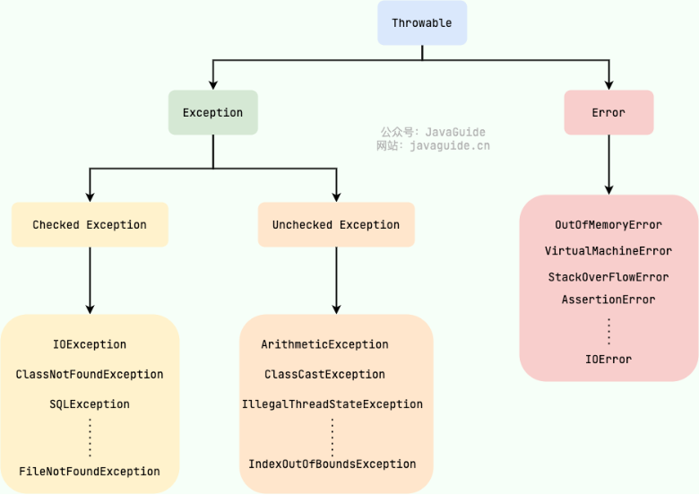

# 异常

## Exception和Error区别

* **`Exception`** :程序本身可以处理的异常，可以通过 `catch` 来进行捕获。`Exception` 又可以分为 Checked Exception (受检查异常，必须处理) 和 Unchecked Exception (不受检查异常，可以不处理)。
* **`Error`** ：`Error` 属于程序无法处理的错误 ，不建议通过 `catch`捕获 。例如 Java 虚拟机运行错误（`Virtual MachineError`）、虚拟机内存不够错误(`OutOfMemoryError`)、类定义错误（`NoClassDefFoundError`）等 。这些异常发生时，Java 虚拟机（JVM）一般会选择线程终止。

## Checked Exception 和 Unchecked Exception 区别

* **`Checked Exception`** 即 受检查异常 ，Java 代码在编译过程中，如果受检查异常没有被 `catch`或者 `throws` 关键字处理的话，就没办法通过编译。
* **`Unchecked Exception`** 即 不受检查异常 ，Java 代码在编译过程中 ，我们即使不处理不受检查异常也可以正常通过编译。
* 除了 `RuntimeException`及其子类以外，其他的 `Exception`类及其子类都属于受检查异常 。

## Throwable 常用方法

* `String getMessage()`: 返回异常发生时的详细信息
* `String toString()`: 返回异常发生时的简要描述
* `String getLocalizedMessage()`: 返回异常对象的本地化信息。使用 `Throwable` 的子类覆盖这个方法，可以生成本地化信息。如果子类没有覆盖该方法，则该方法返回的信息与 `getMessage()`返回的结果相同
* `void printStackTrace()`: 在控制台上打印 `Throwable` 对象封装的异常信息

## throw和throws

* throws 关键字用于声明异常，它的作用和 try-catch 相似；而 throw 关键字用于显式的抛出异常。
* throws 关键字后面跟的是异常的名字；而 throw 关键字后面跟的是异常的对象。

## try-catch-finally

* `try`块：用于捕获异常。其后可接零个或多个 `catch` 块，如果没有 `catch` 块，则必须跟一个 `finally` 块。
* `catch`块：用于处理 try 捕获到的异常。
* `finally` 块：无论是否捕获或处理异常，`finally` 块里的语句都会被执行。当在 `try` 块或 `catch` 块中遇到 `return` 语句时，`finally` 语句块将在方法返回之前被执行。
* **不要在 finally 语句块中使用 return**，因为 try 语句中的 return 返回值会先被暂存在一个本地变量中，当执行到 finally 语句中的 return 之后，这个本地变量的值就变为了 finally 语句中的 return 返回值。
* 即使是 try 块中执行了 return、break、continue 这些跳转语句，finally 块也会被执行。
* finally 块前面必须有 try 块，不要把 finally 块单独拉出来使用。
* 不执行 finally 的情况：
  * 程序所在的线程死亡。
  * 关闭 CPU。
  * 遇到了死循环。
  * 执行了 `System.exit()` 这行代码。

## try-with-resources

* 取消 finally 块，把需要释放的资源写在 try 后的 `()` 中。
* 如果想释放自定义资源的话，让它实现 `AutoCloseable` 接口，并提供 `close()` 方法。

## 异常处理实践经验

* **尽量不要捕获 RuntimeException**
* **尽量使用 try-with-resource 来关闭资源**，禁止在 try 块中直接关闭资源。
* **不要捕获 Throwable**
* **不要省略异常信息的记录**
* **不要记录了异常又抛出异常**
* **不要在 finally 块中使用 return**
* **抛出具体定义的检查性异常而不是 Exception**
* **捕获具体的子类而不是捕获 Exception 类**
* **自定义异常时不要丢失堆栈跟踪**
* **finally 块中不要抛出任何异常**
* **不要在生产环境中使用 `printStackTrace()`**
* **对于不打算处理的异常，直接使用 try-finally，不用 catch**
* **记住“早 throw 晚 catch”原则**
* **只抛出和方法相关的异常**
* **切勿在代码中使用异常来进行流程控制**
* **尽早验证用户输入**以在请求处理的早期捕获异常
* **一个异常只能包含在一个日志中**
* **将所有相关信息尽可能地传递给异常**
* **终止掉被中断线程**
* **对于重复的 try-catch，使用模板方法**
* **不要把异常定义为静态变量**，因为这样会导致异常栈信息错乱。每次手动抛出异常，我们都需要手动 new 一个异常对象抛出。
* **抛出的异常信息一定要有意义**。

## NullPointerException

* 早暴露早修复，严谨使用 `catch` 捕获
* 成员变量定义时初始化
* 返回空字符串、空数组而不是 `null`
* 如果调用方一定要根据 `null`判断，比如返回 `null`表示文件不存在，那么考虑返回 `Optional<T>`
