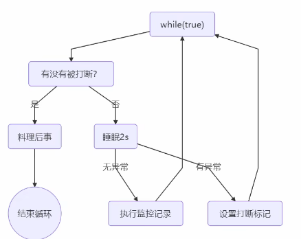
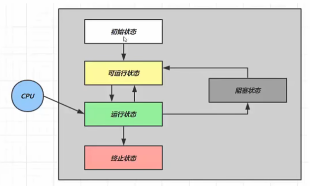
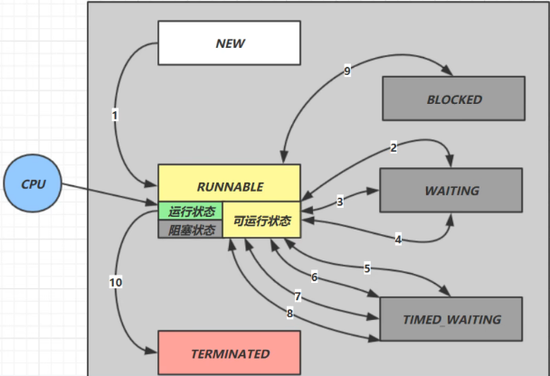

# 线程

## 创建和运行线程

* 直接使用Thread
* 使用Runnable配合Thread
  * Runnable 更容易和线程池配合
  * Runnable 脱离了 Thread 继承体系，更灵活
* FutureTask配合Thread

## 查看进程

### Windows

* 任务管理器
* `tasklist` 查看进程
* `taskkill` 杀死进程

### Linux

* `ps -fe` 查看所有进程
* `ps -fT -p <PID>` 查看某个进程
* `kill <PID>` 杀死进程
* `top` 动态查看进程信息

### Java

* `jps` 查看所有Java进程
* `jstack <PID>` 查看某个Java进程
* `jconsole` 查看某个Java进程中线程的运行情况

## 线程运行原理

### 栈与栈帧

* 线程启动后，虚拟机会为线程分配一段栈内存
* 栈由多个栈帧构成，对应每次方法调用占用的内存
* 每个线程只能有一个活动栈帧，对于当前执行的方法

### 线程上下文切换

* 发生情况
  * 线程cpu时间片用完
  * 垃圾回收
  * 更高优先级的线程要执行
  * 线程自己调用了sleep、wait等方法
* 切换时，os需要保存当前线程的状态，并恢复另一个线程的状态
  * 状态包括：程序计数器、虚拟机栈信息：局部变量、操作数栈、返回地址等
  * 频繁上下文切换可能影响性能

## 常用方法

| 方法名              | 作用                                        | 说明                                                                                                                                                                                  |
| ------------------- | ------------------------------------------- | ------------------------------------------------------------------------------------------------------------------------------------------------------------------------------------- |
| `start`           | 启动一个新的线程 在新的线程运行run方法 | 1.只是让线程进入就绪，不一定马上运行 2.每个线程只能start一次 3.只有用 `start`启动线程，才会创建新的线程，不能直接 `run`                                                 |
| `run`             | 新线程启动后调用的方法                      |                                                                                                                                                                                       |
| `join`            | 等待线程运行结束                            |                                                                                                                                                                                       |
| `join(long n)`    | 等待线程运行结束 最多等待 n 毫秒       |                                                                                                                                                                                       |
| `getId`           | 获取线程唯一id                              |                                                                                                                                                                                       |
| `getName()`       | 获取线程名称                                |                                                                                                                                                                                       |
| `setName(String)` | 修改线程名                                  |                                                                                                                                                                                       |
| `getPriority()`  | 获取线程优先级                              |                                                                                                                                                                                       |
| `setPriority()`   | 修改线程优先级                              | Java中优先级是1-10的整数，具体实现依赖任务调度器                                                                                                                                      |
| `getState()`      | 获取线程状态                                | 包括六个状态：NEW,RUNNABLE,BLOCKED, WAITING,TIMED_WAITING,TERMINATED                                                                                                             |
| `isInterrupted()` | 判断线程是否被打断                          | 不会清除打断标记                                                                                                                                                                      |
| `isAlive()`       | 线程是否存活 （还没有运行完毕）        |                                                                                                                                                                                       |
| `interrupt`       | 打断线程                                    | 1.如果线程正在sleep、wait、join会报错并清除打断标记 2.打断正在运行的线程会设置打断标记                                                                                           |
| `interrupted`    | 判断当前线程是否被打断                      | 会清除打断标记                                                                                                                                                                        |
| `currentThread`   | 获取正在执行的线程                          |                                                                                                                                                                                       |
| `sleep(n)`        | 让执行的线程休眠n毫秒                       | 1.线程从 RUNNABLE状态变成 TIMED_WAITING（阻塞）状态 2.打断 sleep 的线程会被报错 3.睡眠结束后的线程未必立即执行 4.不要让 `while(ture)`空转，中间调用 `sleep`让出CPU |
| `yeild`           | 提示线程调度器 让出线程对CPU的使用     | 1.线程从 进入 状态 2.具体是否让出依赖任务调度器                                                                                                                                  |

### 两阶段终止模式

* 问题：如何在一个线程中优雅的终止另一个线程？
* 错误：
  * 使用stop杀死：如果线程锁住了共享资源，被杀死后没有机会释放锁，其他线程永远无法获得锁
  * 使用System.exit：会让整个程序停止

### 过时方法（不推荐使用）

* stop：停止线程运行
* suspend：挂起线程
* resume：恢复线程运行

### 守护线程

* 其他非守护线程运行结束了，即使守护线程代码没有执行完，也会强制结束
* 垃圾回收器就是一种守护线程

## 线程状态

### 操作系统层面

* 初始：已创建，但未和操作系统关联
* 可运行：可以由CPU调度执行
* 运行：正在执行
  * CPU时间片用完，会变成可运行状态
* 阻塞：调用了阻塞API（如读写文件）
  * 阻塞事件处理完毕，会变成可运行状态
* 终止：

### Java层面

* NEW：刚被创建，还未start
* RUNNBLE：调用了start方法后。**涵盖了os中的可运行、运行、阻塞状态**
* TERMINATED：结束
