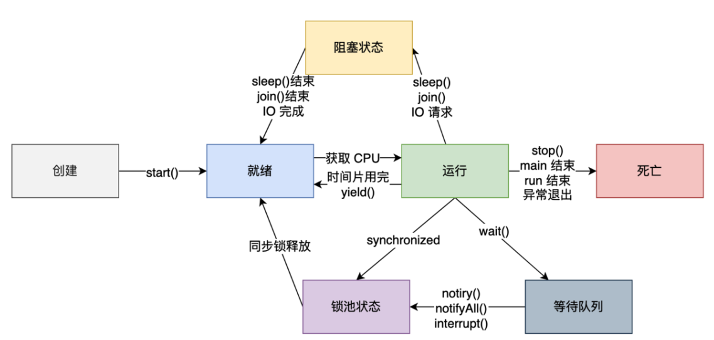
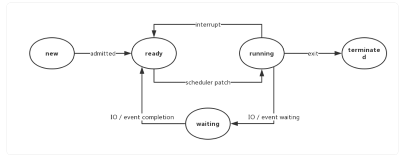
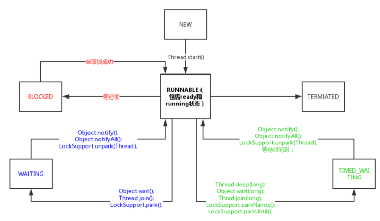
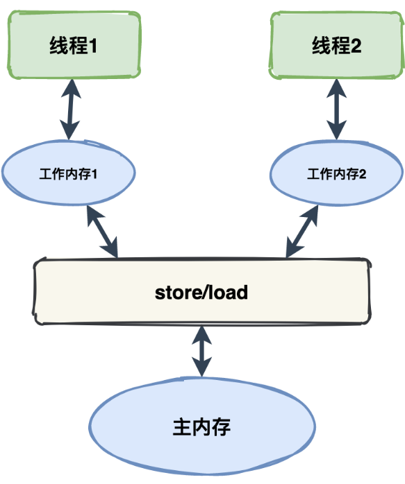
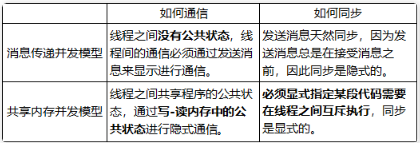
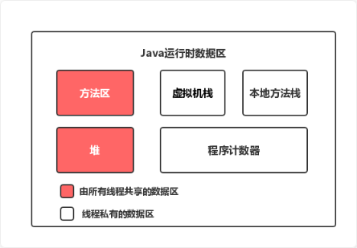
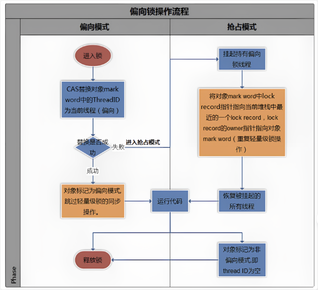

# 多线程基础

## 创建线程三种方式

### 继承Thread类

创建一个类继承 Thread 类，并重写 run 方法。

```java
public class MyThread extends Thread {
    @Override
    public void run() {
        for (int i = 0; i < 100; i++) {
            System.out.println(getName() + ":打了" + i + "个小兵");
        }
    }
}
```

### 实现 Runnable 接口

创建一个类实现 Runnable 接口，并重写 run 方法。

```java
public class MyRunnable implements Runnable {
    @Override
    public void run() {
        for (int i = 0; i < 10; i++) {
            try {//sleep会发生异常要显示处理
                Thread.sleep(20);//暂停20毫秒
            } catch (InterruptedException e) {
                e.printStackTrace();
            }
            System.out.println(Thread.currentThread().getName() + "打了:" + i + "个小兵");
        }
    }
}
```

### 实现 Callable 接口

实现 Callable 接口，重写 call 方法，这种方式可以通过 FutureTask 获取任务执行的返回值。

```java
public class CallerTask implements Callable<String> {
    public String call() throws Exception {
        return "Hello,i am running!";
    }

    public static void main(String[] args) {
        //创建异步任务
        FutureTask<String> task=new FutureTask<String>(new CallerTask());
        //启动线程
        new Thread(task).start();
        try {
            //等待执行完成，并获取返回结果
            String result=task.get();
            System.out.println(result);
        } catch (InterruptedException e) {
            e.printStackTrace();
        } catch (ExecutionException e) {
            e.printStackTrace();
        }
    }
}
```

## 关于线程

### 为什么要重写run方法

这是因为默认的 `run()`方法不会做任何事情。为了让线程执行一些实际的任务，我们需要提供自己的 `run()`方法实现，这就需要重写 `run()`方法。

### run方法和start方法区别？

* `run()`：封装线程执行的代码，直接调用相当于调用普通方法。
* `start()`：启动线程，然后由 JVM 调用此线程的 `run()` 方法。

### 通过继承 Thread 的方法和实现 Runnable 接口的方式创建多线程，哪个好？

实现 Runable 接口好，原因有两个：

* 避免了 Java 单继承的局限性，Java 不支持多重继承，因此如果我们的类已经继承了另一个类，就不能再继承 Thread 类了。
* 适合多个相同的程序代码去处理同一资源的情况，把线程、代码和数据有效的分离，更符合面向对象的设计思想。Callable 接口与 Runnable 非常相似，但可以返回一个结果。

## 控制线程其他方法

* `sleep()`：使当前正在执行的线程暂停指定的毫秒数，也就是进入休眠的状态。要对异常进行处理。
* `join()`：等待这个线程执行完才会轮到后续线程得到 cpu 的执行权，使用这个也要捕获异常。
* `setDaemon()`：将此线程标记为守护线程，准确来说，就是服务其他的线程，像 Java 中的垃圾回收线程，就是典型的守护线程。
* `yield()`：yield() 方法是一个静态方法，用于暗示当前线程愿意放弃其当前的时间片，允许其他线程执行。然而，它只是向线程调度器提出建议，调度器可能会忽略这个建议。

## 线程生命周期



# 获取线程的执行结果

## 异步计算接口Future接口

```java
public interface Future<V> {
    boolean cancel(boolean mayInterruptIfRunning);
    boolean isCancelled();
    boolean isDone();
    V get() throws InterruptedException, ExecutionException;
    V get(long timeout, TimeUnit unit)
        throws InterruptedException, ExecutionException, TimeoutException;
}
```

* 提供的功能

  * 判断任务是否完成；
  * 能够中断任务；
  * 能够获取任务执行结果。
* `cancel()` 方法用来取消任务，如果取消任务成功则返回 true，如果取消任务失败则返回 false。

  * 参数 mayInterruptIfRunning 表示是否允许取消正在执行却没有执行完毕的任务，如果设置 true，则表示可以取消正在执行过程中的任务。
  * 如果任务已经完成，则无论 mayInterruptIfRunning 为 true 还是 false，此方法肯定返回 false，即如果取消已经完成的任务会返回 false；
  * 如果任务正在执行，若 mayInterruptIfRunning 设置为 true，则返回 true，若 mayInterruptIfRunning 设置为 false，则返回 false；
  * 如果任务还没有执行，则无论 mayInterruptIfRunning 为 true 还是 false，肯定返回 true。
* `isCancelled()` 方法表示任务是否被取消成功，如果在任务正常完成前被取消成功，则返回 true。
* `isDone()` 方法表示任务是否已经完成，若任务完成，则返回 true；
* `get()`方法用来获取执行结果，这个方法会产生阻塞，会一直等到任务执行完毕才返回；
* `get(long timeout, TimeUnit unit)`用来获取执行结果，如果在指定时间内，还没获取到结果，就直接返回 null。

## 异步计算结果 FutureTask

# Java线程的6种状态



```java
// Thread.State 源码
public enum State {
    NEW,
    RUNNABLE,
    BLOCKED,
    WAITING,
    TIMED_WAITING,
    TERMINATED;
}
```

## NEW

* 线程此时尚未启动，还没调用 Thread 实例的 `start()`方法。
* 反复调用同一个线程的 start 方法是否可行？**不行**

## RUNNABLE

* 表示当前线程正在运行中。此时线程在 Java 虚拟机中运行，也有可能在等待 CPU 分配资源。
* Java 线程的**RUNNABLE**状态包括了操作系统线程的**ready**和**running**两个状态。

## BLOCKED

* 阻塞状态。处于 BLOCKED 状态的线程正等待锁的释放以进入同步区

## WAITING

* 等待状态。处于等待状态的线程变成 RUNNABLE 状态需要其他线程唤醒。
* 这 3 个方法会使线程进入等待状态：
  * `Object.wait()`：使当前线程处于等待状态直到另一个线程唤醒它；
  * `Thread.join()`：等待线程执行完毕，底层调用的是 Object 的 wait 方法；
  * `LockSupport.park()`：除非获得调用许可，否则禁用当前线程进行线程调度。

## TIMED_WAITING

* 超时等待状态。线程等待一个具体的时间，时间到后会被自动唤醒。
* 调用如下方法会使线程进入超时等待状态：

  * `Thread.sleep(long millis)`：使当前线程睡眠指定时间；
  * `Object.wait(long timeout)`：线程休眠指定时间，等待期间可以通过 `notify()`/`notifyAll()`唤醒；
  * `Thread.join(long millis)`：等待当前线程最多执行 millis 毫秒，如果 millis 为 0，则会一直执行；
  * `LockSupport.parkNanos(long nanos)`： 除非获得调用许可，否则禁用当前线程进行线程调度指定时间；
  * `LockSupport.parkUntil(long deadline)`：同上，也是禁止线程进行调度指定时间；

## TERMINATED

* 终止状态。此时线程已执行完毕。

## 线程状态转换



## 线程中断

Thread 类里提供的关于线程中断的几个方法：

* `Thread.interrupt()`：中断线程。这里的中断线程并不会立即停止线程，而是设置线程的中断状态为 true（默认是 false）；
* `Thread.isInterrupted()`：测试当前线程是否被中断。
* `Thread.interrupted()`：检测当前线程是否被中断，与 `isInterrupted()` 方法不同的是，这个方法如果发现当前线程被中断，会清除线程的中断状态。

# 线程安全

## 原子性

* 原子性：即一个操作或者多个操作，要么全部执行并且执行的过程不会被任何因素打断，要么就都不执行。
* 并发编程中很多操作都不是原子操作，如果不加锁的话，可能会得到意料之外的值。

## 可见性

* 可见性：当多个线程访问同一个变量时，一个线程修改了这个变量的值，其他线程能够立即看得到修改的值。
* 每个线程都有属于自己的工作内存，工作内存和主内存间需要通过 store 和 load 等进行交互。
* Java 提供了 `volatile`这个关键字。当一个共享变量被 volatile 修饰时，它会保证修改的值立即更新到主存当中，这样的话，当有其他线程需要读取时，就会从内存中读到新值



## 活跃性问题

* 活跃性是指某件正确的事情最终会发生，但当某个操作无法继续下去的时候，就会发生活跃性问题。
  * 死锁：多个线程因为环形等待锁的关系而永远地阻塞下去。
  * 活锁：多个线程都在运行并且都在修改各自的状态，而其他线程又依赖这个状态，就导致任何一个线程都无法继续执行
  * 饥饿
    * 高优先级的线程一直在运行消耗 CPU，所有的低优先级线程一直处于等待；
    * 一些线程被永久堵塞在一个等待进入同步块的状态，而其他线程总是能在它之前持续地对该同步块进行访问；

## 性能问题

* 多线程有 `创建线程`和 `线程上下文切换`的开销。
* 一般减少上下文切换的方法有：
  * 无锁并发编程：可以参照 [ConcurrentHashMap](https://javabetter.cn/thread/ConcurrentHashMap.html) 锁分段的思想，不同的线程处理不同段的数据，这样在多线程竞争的条件下，可以减少上下文切换的时间。
  * CAS 算法，利用 [Atomic](https://javabetter.cn/thread/atomic.html) + [CAS](https://javabetter.cn/thread/cas.html) 算法来更新数据，采用乐观锁的方式，可以有效减少一部分不必要的锁竞争带来的上下文切换。
  * 使用最少线程：避免创建不必要的线程，如果任务很少，但创建了很多的线程，这样就会造成大量的线程都处于等待状态。
  * 协程：在单线程里实现多任务的调度，并在单线程里维持多个任务间的切换。

# Java内存模型 JMM

并发编程的线程之间存在两个问题：

* 线程间如何通信？即：线程之间以何种机制来交换信息
* 线程间如何同步？即：线程以何种机制来控制不同线程间发生的相对顺序

有两种并发模型可以解决这两个问题：

* 消息传递并发模型
* 共享内存并发模型



* Java使用的是共享内存发布模型



## happens-before关系

happens-before 关系的定义如下：

1. 如果一个操作 happens-before 另一个操作，那么第一个操作的执行结果将对第二个操作可见，而且第一个操作的执行顺序排在第二个操作之前。
2. **两个操作之间存在 happens-before 关系，并不意味着 Java 平台的具体实现必须要按照 happens-before 关系指定的顺序来执行。如果重排序之后的执行结果，与按 happens-before 关系来执行的结果一致，那么 JMM 也允许这样的重排序。**

在 Java 中，有以下天然的 happens-before 关系：

* 程序顺序规则：一个线程中的每一个操作，happens-before 于该线程中的任意后续操作。
* 监视器锁规则：对一个锁的解锁，happens-before 于随后对这个锁的加锁。
* volatile 变量规则：对一个 volatile 域的写，happens-before 于任意后续对这个 volatile 域的读。
* 传递性：如果 A happens-before B，且 B happens-before C，那么 A happens-before C。
* start 规则：如果线程 A 执行操作 `ThreadB.start()`启动线程 B，那么 A 线程的 `ThreadB.start()`操作 happens-before 于线程 B 中的任意操作。
* join 规则：如果线程 A 执行操作 `ThreadB.join()`并成功返回，那么线程 B 中的任意操作 happens-before 于线程 A 从 `ThreadB.join()`操作成功返回。

# volatile关键字

## 禁止指令重排

* 使用 volatile 关键字修饰共享变量可以禁止重排序。
* 使用 volatile 关键字来修饰一个变量时，Java 内存模型会插入内存屏障
  * 写屏障（Write Barrier）：当一个 volatile 变量被写入时，写屏障确保在该屏障之前的所有变量的写入操作都提交到主内存。
  * 读屏障（Read Barrier）：当读取一个 volatile 变量时，读屏障确保在该屏障之后的所有读操作都从主内存中读取。
  * 在其前面操作的更改肯定已经全部进行，且结果对后面的操作可见；在其后面的操作肯定还没有进行；

# synchronized关键字

* 关键字 synchronized 可以保证在同一个时刻，只有一个线程可以执行某个方法或者某个代码块
* synchronized 可保证一个线程的变化(主要是共享数据的变化)被其他线程所看到（保证可见性，完全可以替代 [volatile](https://javabetter.cn/thread/volatile.html) 功能）。
* 应用方式
  * 同步方法
  * 同步静态方法
  * 同步代码块
* 一个对象只有一把锁，当一个线程获取了该对象的锁之后，其他线程无法获取该对象的锁，所以无法访问该对象的其他 synchronized 方法，但是其他线程还是可以访问该对象的其他非 synchronized 方法。

## 同步方法

* 在方法声明中加入 synchronized 关键字，可以保证在任意时刻，只有一个线程能执行该方法。
* 但是，如果一个线程 A 需要访问对象 obj1 的 synchronized 方法 f1(当前对象锁是 obj1)，另一个线程 B 需要访问对象 obj2 的 synchronized 方法 f2(当前对象锁是 obj2)，这样是允许的（可能导致错误）

## 同步静态方法

* 当 synchronized 同步[静态方法](https://javabetter.cn/oo/static.html)时，锁的是当前类的 Class 对象，不属于某个对象

## 同步代码块

* 如果直接对整个方法进行同步，可能会比较耗时
* 此时可以使用同步代码块的方式对需要同步的代码进行包裹。

## 可重入锁

* 当一个线程再次请求自己持有对象锁的临界资源时，这种情况属于重入锁，请求将会成功。
* synchronized 是可重入锁


# synchronized四种锁状态

## 锁的优缺点对比

* 锁的状态

  * 无锁状态
  * 偏向锁状态
  * 轻量级锁状态
  * 重量级锁状态

| 锁       | 优点                                                               | 缺点                                             | 适用场景                             |
| -------- | ------------------------------------------------------------------ | ------------------------------------------------ | ------------------------------------ |
| 偏向锁   | 加锁和解锁不需要额外的消耗，和执行非同步方法比仅存在纳秒级的差距。 | 如果线程间存在锁竞争，会带来额外的锁撤销的消耗。 | 适用于只有一个线程访问同步块场景。   |
| 轻量级锁 | 竞争的线程不会阻塞，提高了程序的响应速度。                         | 如果始终得不到锁竞争的线程使用自旋会消耗 CPU。   | 追求响应时间。同步块执行速度非常快。 |
| 重量级锁 | 线程竞争不使用自旋，不会消耗 CPU。                                 | 线程阻塞，响应时间缓慢。                         | 追求吞吐量。同步块执行时间较长。     |

## 锁的信息


| 长度     | 内容                   | 说明                           |
| -------- | ---------------------- | ------------------------------ |
| 32/64bit | Mark Word              | 存储对象的 hashCode 或锁信息等 |
| 32/64bit | Class Metadata Address | 存储到对象类型数据的指针       |
| 32/64bit | Array length           | 数组的长度（如果是数组）       |

我们主要来看看 Mark Word 的格式：

| 锁状态   | 29 bit 或 61 bit             | 1 bit 是否是偏向锁？       | 2 bit 锁标志位 |
| -------- | ---------------------------- | -------------------------- | -------------- |
| 无锁     |                              | 0                          | 01             |
| 偏向锁   | 线程 ID                      | 1                          | 01             |
| 轻量级锁 | 指向栈中锁记录的指针         | 此时这一位不用于标识偏向锁 | 00             |
| 重量级锁 | 指向互斥量（重量级锁）的指针 | 此时这一位不用于标识偏向锁 | 10             |
| GC 标记  |                              | 此时这一位不用于标识偏向锁 | 11             |

## 偏向锁

* 偏向锁会偏向于第一个访问锁的线程，如果在接下来的运行过程中，该锁没有被其他的线程访问，则持有偏向锁的线程将永远不需要触发同步。
* 
