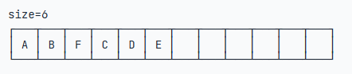
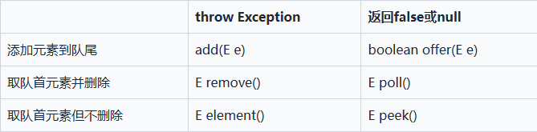
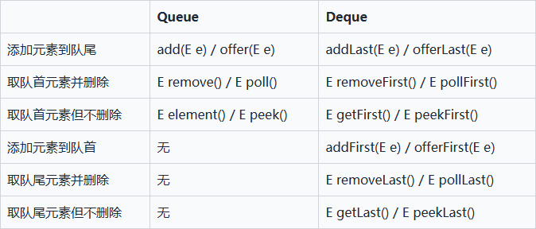
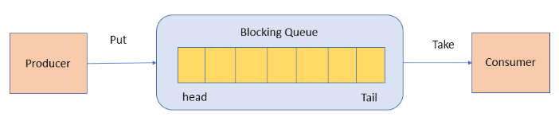
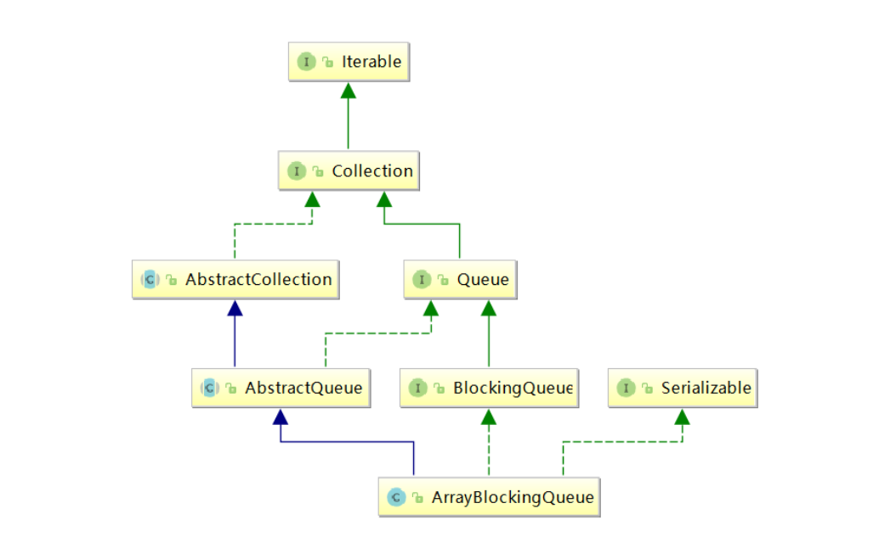
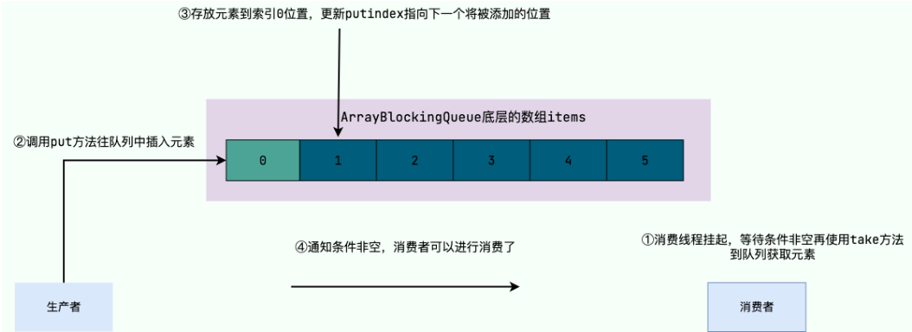
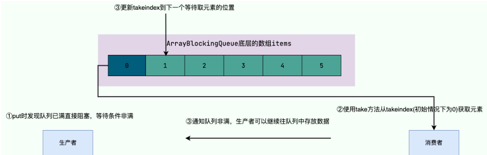
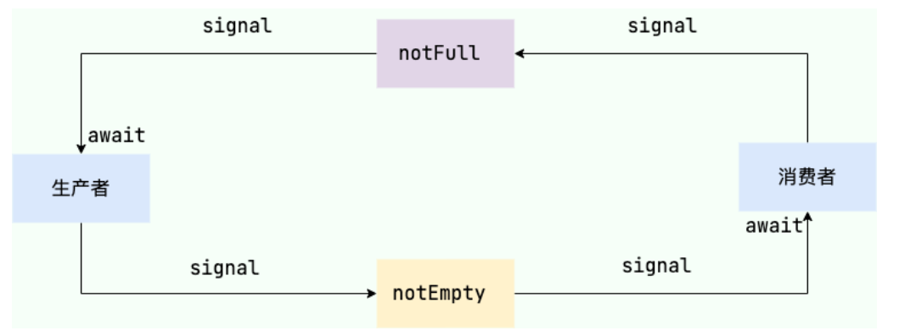
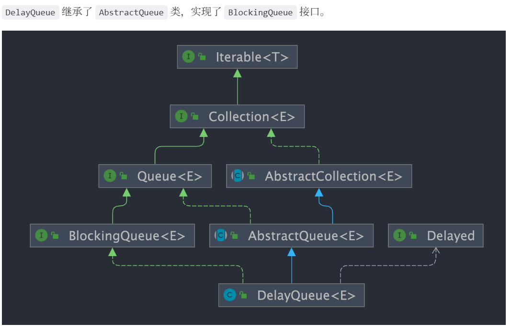

# Java 集合 —— 知识点整理

* 定义：如果一个 Java 对象可以在内部持有若干其他 Java 对象，并对外提供访问接口


## Collection

### iterator


## List

### ArrayList

* 添加元素但是数组已满时，会创建更大的新数组，复制后替换旧数组



* 使用 `Iterator` 遍历列表，`for-each` 自带迭代器
* `ArrayList` 和 `LinkedList` 都不是线程安全的

#### List 和 Array 转换

* `toArray()` 返回 `Object[]`，会丢失类型信息
* `toArray(T[])` 传入同类型 `Array`，元素复制到该数组
* 示例：`Integer[] array = list.toArray(new Integer[list.size()]);` 或 `Integer[] array = list.toArray(Integer[]::new);`

#### 重写 `equals()` 方法

* 先确定实例“相等”的逻辑
* 用 `instanceof` 判断类型匹配
* 引用类型用 `Objects.equals()`，基本类型用 `==`

#### 源码要点（ArrayList）

- add 扩容触发点：空列表第一次 `ensureCapacityInternal()` 使 `minCapacity=10`，后续直到第 11 个元素才触发 `grow`
- `grow` 后容量约为原来的 1.5 倍；需校验新容量与 `Integer.MAX_VALUE - 8`
- 建议批量添加前调用 `ensureCapacity` 减少重分配

### LinkedList

- 插入元素
  - `add(E e)` 尾插 O(1)
  - `add(int index, E element)` 按索引插入/删除平均需要移动 n/4 个元素，O(n)
- 获取元素：`getFirst()`、`getLast()`、`get(int index)`
- 删除元素：`removeFirst()`、`removeLast()`、`remove(E e)`、`remove(int index)`、`clear()`
- `unlink` 删除节点流程：处理首/尾指针与前驱/后继重连并断开 x 与其链接，置空元素并更新长度

### CopyOnWriteArrayList（COW）

- 读多写少并发场景；读无锁，写互斥（写-写互斥），写时复制
- 写操作：复制底层数组到新数组，修改新数组后 `setArray` 替换
- 写开销 O(n) 且占额外内存；可能出现读到旧值（弱一致性）
- 插入示例（要点）：`ReentrantLock` 加锁，`Arrays.copyOf` 扩一位，末尾放新元素，`setArray`
- 读取：`get` 直接从当前 `array` 取值，无锁，弱一致

## Map

### HashMap

- 初始数组大小默认 16
- 扩容：超过阈值自动扩容为原来 2 倍，需要重新定位索引
- 频繁扩容影响性能；大量元素时建议初始化指定容量
- JDK1.8 底层：数组 + 链表/红黑树（阈值：链表长度≥8 且数组长度≥64 时树化，否则先扩容）
- 负载因子 `loadFactor` 默认 0.75，元素数超过 `capacity*loadFactor` 触发扩容
- 选择阈值 8 和 64 的依据：概率与成本平衡（泊松分布、扩容成本与树化收益）

#### 构造、put/get/resize 要点

- put：空桶直接插入；同 key 覆盖；树节点走树插入；链表尾插
- get：计算 hash，定位桶，检查首节点；若链表/树则继续查找
- resize：初始化与扩容行为统一为给 `table` 赋新数组；非常耗时，应尽量避免

### TreeMap

- Key 有序（自然排序或比较器），与 `equals()/hashCode()` 无关
- `NavigableMap` 提供定向搜索、子集视图、逆序视图、边界操作等

### LinkedHashMap

- 继承 `HashMap`，额外维护双向链表，支持插入顺序或访问顺序遍历
- 访问有序：构造传入 `accessOrder=true`，访问后节点移动到尾部
- 适合实现 LRU 缓存：重写 `removeEldestEntry` 控制淘汰

```java
public class LRUCache<K, V> extends LinkedHashMap<K, V> {
    private final int capacity;
    public LRUCache(int capacity) {
        super(capacity, 0.75f, true);
        this.capacity = capacity;
    }
    @Override
    protected boolean removeEldestEntry(Map.Entry<K, V> eldest) {
        return size() > capacity;
    }
}
```

### ConcurrentHashMap（JDK1.7 vs 1.8）

- 1.7：分段锁 `Segment`（基于 `ReentrantLock`），数组+链表
- 1.8：`Node` 数组 + 链表/红黑树，`synchronized` + CAS，锁粒度更细，首节点加锁
- 并发度：1.7 受 Segment 数量限制（默认 16）；1.8 受 Node 数组大小限制
- `sizeCtl` 控制初始化/扩容状态；`MOVED=-1` 表示在扩容
- 树化：数量超过阈值，且数组长度≥64 时树化

## Set

- 仅存 key 的 `Map`
- 需正确实现 `equals()` 与 `hashCode()`
- `HashSet` 无序；`TreeSet` 有序（需 `Comparable` 或 `Comparator`）
- `LinkedHashSet` 插入/取出顺序满足 FIFO
- 检查重复：先比 `hashCode`，相同再用 `equals`

## Queue / Deque





### ArrayDeque vs LinkedList

- `ArrayDeque`：可变长数组+双指针；不支持 `null`；插入可能扩容但均摊 O(1)
- `LinkedList`：链表；支持 `null`；插入需分配节点，均摊慢
- 性能通常 `ArrayDeque` 更优，也可实现栈

### PriorityQueue

- 基于二叉堆，底层动态数组
- 插入与删除堆顶 O(log n)
- 非线程安全；不支持 `null` 与不可比较对象
- 默认小顶堆，可传 `Comparator` 自定义优先级

### BlockingQueue（以 ArrayBlockingQueue 为例）



- 典型生产者-消费者模型
- 阻塞方法：`put`、`take`；非阻塞：`offer`、`poll`
- `ArrayBlockingQueue`：容量固定，不可变；`ReentrantLock` 控制并发；循环数组
- `put(E e)` 要点：放入 `putIndex`，推进指针（到末尾回绕到 0），`count++`，`notEmpty.signal()` 通知消费者
- `take()` 要点：空时阻塞直到非空或中断









#### 非阻塞式与异常方法

- `offer(E e)` 满则返回 false
- `poll()` 空则返回 null
- `add(E e)` 满则抛 `IllegalStateException`
- `remove()` 空则抛 `NoSuchElementException`
- `peek()` 空返回 null

#### ArrayBlockingQueue vs LinkedBlockingQueue

- 底层：数组 vs 链表
- 是否有界：必须指定容量 vs 可不指定（也可指定）
- 锁分离：单锁 vs 生产/消费分离锁（`putLock`/`takeLock`）
- 内存：数组预分配 vs 节点按需分配

#### ArrayBlockingQueue vs ConcurrentLinkedQueue

- 底层：数组 vs 链表
- 是否有界：有界 vs 无界
- 是否阻塞：支持阻塞/非阻塞 vs 仅非阻塞

### DelayQueue

- 延迟队列（实现延时任务），`BlockingQueue` 的一种；底层 `PriorityQueue`；线程安全
- 核心变量：`ReentrantLock`、`PriorityQueue<E> q`、`Thread leader`、`Condition available`



- `offer` 要点：上锁→`q.offer`→若成为队首，清空 `leader` 并 `signal` 唤醒等待者→解锁
- `poll` 要点：上锁→看队首与是否到期→未到期/为空返回 null→到期 `poll` 返回→解锁

