# Java集合

* 定义：如果一个Java对象可以在内部持有若干其他Java对象，并对外提供访问接口

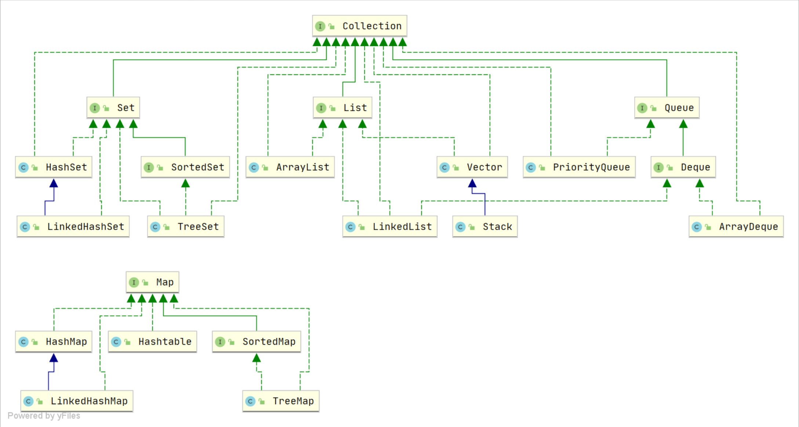

* Collection方法

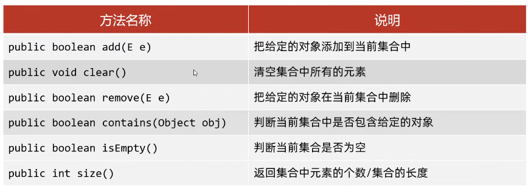

* List方法

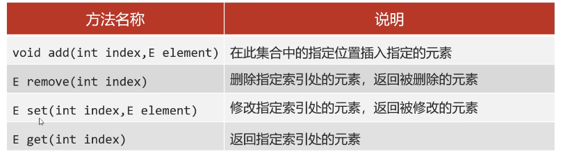

# Collection

## iterator

* 循环中只能用一次next方法
* 迭代器遍历时，不要用集合方法进行增加或消除
* 修改增强for中的变量、不会改变集合原本的数据

## List遍历方式

* for循环
* 迭代器遍历：遍历过程需要删除元素
* 增强for循环
* 列表迭代器遍历 `listIterator`：遍历过程需要增加元素
* lambda表达式：需要操作索引

# List

* 添加元素，但是数组已满，`ArrayList`先创建一个更大的新数组，然后把旧数组的所有元素复制到新数组，紧接着用新数组取代旧数组：

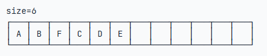

* 使用 `Iterator`遍历列表，`for each`自带迭代器
* ArrayList和LinkedList都不是线程安全的

## List和Array转换

* `toArray()`返回一个 `Object[]`数组，会丢失类型信息
* 给 `toArray(T[])`传入一个类型相同的 `Array`，`List`内部自动把元素复制到传入的 `Array`中（也可以传入其他类型的数组）
* `Integer[] array = list.toArray(new Integer[list.size()]); Integer[] array = list.toArray(Integer[]::new); `

## 重写 `equals()`方法

* 先确定实例“相等”的逻辑，即哪些字段相等，就认为实例相等；
* 用 `instanceof`判断传入的待比较的 `Object`是不是当前类型，如果是，继续比较，否则，返回 `false`；
* 对引用类型用 `Objects.equals()`比较，对基本类型直接用 `==`比较。

## 源码（ArrayList）

* 默认长度为0，添加元素后默认变成10，扩容变成1.5倍，一次添加多个元素（扩容放不下）长度为实际长度

### `add`方法

* 当要 `add` 进第 1 个元素到 `ArrayList` 时，`elementData.length` 为 0 （因为还是一个空的 list），因为执行了 `ensureCapacityInternal()` 方法 ，所以 `minCapacity` 此时为 10。此时，`minCapacity - elementData.length > 0`成立，所以会进入 `grow(minCapacity)` 方法。
* 当 `add` 第 2 个元素时，`minCapacity` 为 2，此时 `elementData.length`(容量)在添加第一个元素后扩容成 `10` 了。此时，`minCapacity - elementData.length > 0` 不成立，所以不会进入 （执行）`grow(minCapacity)` 方法。
* 添加第 3、4···到第 10 个元素时，依然不会执行 grow 方法，数组容量都为 10。
* 直到添加第 11 个元素，`minCapacity`(为 11)比 `elementData.length`（为 10）要大。进入 `grow` 方法进行扩容。

### `grow`方法

* ArrayList 每次扩容之后容量都会变为原来的 1.5 倍左右
* 两个判断条件：
  * 新容量是否大于最小需要容量
  * 新容量是否大于 `Integer.MAX_VALUE - 8`

### `ensureCapacity`方法

* 最好在向 `ArrayList` 添加大量元素之前用 `ensureCapacity` 方法，以减少增量重新分配的次数

## 源码（LinkedList）

* 插入元素

  * `add(E e)`：用于在 `LinkedList` 的尾部插入元素，即将新元素作为链表的最后一个元素，时间复杂度为 O(1)。
  * `add(int index, E element)`:用于在指定位置插入元素。这种插入方式需要先移动到指定位置，再修改指定节点的指针完成插入/删除，因此需要移动平均 n/4 个元素，时间复杂度为 O(n)。
* 获取元素

  1. `getFirst()`：获取链表的第一个元素。
  2. `getLast()`：获取链表的最后一个元素。
  3. `get(int index)`：获取链表指定位置的元素
* 删除元素
* * `removeFirst()`：删除并返回链表的第一个元素。
  * `removeLast()`：删除并返回链表的最后一个元素。
  * `remove(E e)`：删除链表中首次出现的指定元素，如果不存在该元素则返回 false。
  * `remove(int index)`：删除指定索引处的元素，并返回该元素的值。
  * `void clear()`：移除此链表中的所有元素。
* `unlink`方法

  * 首先获取待删除节点 x 的前驱和后继节点；
  * 判断待删除节点是否为头节点或尾节点：
    * 如果 x 是头节点，则将 first 指向 x 的后继节点 next
    * 如果 x 是尾节点，则将 last 指向 x 的前驱节点 prev
    * 如果 x 不是头节点也不是尾节点，执行下一步操作
  * 将待删除节点 x 的前驱的后继指向待删除节点的后继 next，断开 x 和 x.prev 之间的链接；
  * 将待删除节点 x 的后继的前驱指向待删除节点的前驱 prev，断开 x 和 x.next 之间的链接；
  * 将待删除节点 x 的元素置空，修改链表长度。

## 源码（CopyOnWriteArrayList）

* 允许多个线程同时访问 `List` 的内部数据
* `CopyOnWriteArrayList` 中的读取操作无需加锁的，写入操作也不会阻塞读取操作，只有写写才会互斥。
* 当需要修改（ `add`，`set`、`remove` 等操作） `CopyOnWriteArrayList` 的内容时，不会直接修改原数组，而是会先创建底层数组的副本，对副本数组进行修改，修改完之后再将修改后的数组赋值回去
* 写时复制机制非常适合读多写少的并发场景
* COW模式存在的不足：
  * 内存占用：每次写操作都需要复制一份原始数据，会占用额外的内存空间，在数据量比较大的情况下，可能会导致内存资源不足。
  * 写操作开销：每一次写操作都需要复制一份原始数据，然后再进行修改和替换，所以写操作的开销相对较大，在写入比较频繁的场景下，性能可能会受到影响。
  * 数据一致性问题：修改操作不会立即反映到最终结果中，还需要等待复制完成，这可能会导致一定的数据一致性问题。

### 插入元素

* `add(E e)`：在 `CopyOnWriteArrayList` 的尾部插入元素。
* `add(int index, E element)`：在 `CopyOnWriteArrayList` 的指定位置插入元素。
* `addIfAbsent(E e)`：如果指定元素不存在，那么添加该元素。如果成功添加元素则返回 true。

```java
// 插入元素到 CopyOnWriteArrayList 的尾部
public boolean add(E e) {
    final ReentrantLock lock = this.lock;
    // 加锁
    lock.lock();
    try {
        // 获取原来的数组
        Object[] elements = getArray();
        // 原来数组的长度
        int len = elements.length;
        // 创建一个长度+1的新数组，并将原来数组的元素复制给新数组
        Object[] newElements = Arrays.copyOf(elements, len + 1);
        // 元素放在新数组末尾
        newElements[len] = e;
        // array指向新数组
        setArray(newElements);
        return true;
    } finally {
        // 解锁
        lock.unlock();
    }
}
```

* `add`方法内部用到了 `ReentrantLock` 加锁，保证了同步，避免了多线程写的时候会复制出多个副本出来。锁被修饰保证了锁的内存地址肯定不会被修改，并且，释放锁的逻辑放在 `finally` 中，可以保证锁能被释放。
* `CopyOnWriteArrayList` 通过复制底层数组的方式实现写操作，即先创建一个新的数组来容纳新添加的元素，然后在新数组中进行写操作，最后将新数组赋值给底层数组的引用，替换掉旧的数组。
* 每次写操作都需要通过 `Arrays.copyOf` 复制底层数组，时间复杂度是 O(n) 的，且会占用额外的内存空间。因此，`CopyOnWriteArrayList` 适用于读多写少的场景，在写操作不频繁且内存资源充足的情况下，可以提升系统的性能表现。
* `CopyOnWriteArrayList` 中并没有类似于 `ArrayList` 的 `grow()` 方法扩容的操作。

### 读取操作

```java
// 底层数组，只能通过getArray和setArray方法访问
private transient volatile Object[] array;

public E get(int index) {
    return get(getArray(), index);
}

final Object[] getArray() {
    return array;
}

private E get(Object[] a, int index) {
    return (E) a[index];
}
```

* `get`方法是弱一致性的，在某些情况下可能读到旧的元素值。
* `get(int index)`方法是分两步进行的：

1. 通过 `getArray()`获取当前数组的引用；
2. 直接从数组中获取下标为 index 的元素。

* 这个过程并没有加锁，所以在并发环境下可能出现如下情况：

1. 线程 1 调用 `get(int index)`方法获取值，内部通过 `getArray()`方法获取到了 array 属性值；
2. 线程 2 调用 `CopyOnWriteArrayList`的 `add`、`set`、`remove` 等修改方法时，内部通过 `setArray`方法修改了 `array`属性的值；
3. 线程 1 还是从旧的 `array` 数组中取值。

### 删除元素

* `remove(int index)`：移除此列表中指定位置上的元素。将任何后续元素向左移动（从它们的索引中减去 1）。
* `boolean remove(Object o)`：删除此列表中首次出现的指定元素，如果不存在该元素则返回 false。
* `boolean removeAll(Collection<?> c)`：从此列表中删除指定集合中包含的所有元素。
* `void clear()`：移除此列表中的所有元素。

### 判断元素是否存在

* `contains(Object o)`：判断是否包含指定元素。
* `containsAll(Collection<?> c)`：判断是否保证指定集合的全部元素。

# Map

## HashMap

* `HashMap`初始化时默认的数组大小只有16
* 添加超过一定数量的 `key-value`时，`HashMap`会在内部自动扩容，每次扩容一倍，即长度为16的数组扩展为长度32，相应地，需要重新确定 `hashCode()`计算的索引位置。
* 频繁扩容对 `HashMap`的性能影响很大。如果我们确定要使用一个容量为 `10000`个 `key-value`的 `HashMap`，更好的方式是创建 `HashMap`时就指定容量

## TreeMap

* 保证遍历时以Key的顺序来进行排序
* 使用 `TreeMap`时，放入的Key必须实现 `Comparable`接口
* `TreeMap`不使用 `equals()`和 `hashCode()`，无需覆写

## HashMap和HashTable区别

* **线程是否安全：** `HashMap` 是非线程安全的，`Hashtable` 是线程安全的
* **效率：** 因为线程安全的问题，`HashMap` 要比 `Hashtable` 效率高一点。（`Hashtable` 基本被淘汰）
* **对 Null key 和 Null value 的支持：**`HashMap` 可以存储 null 的 key 和 value，但 null 作为键只能有一个，null 作为值可以有多个；Hashtable 不允许有 null 键和 null 值，否则会抛出 `NullPointerException`
* **哈希函数的实现** ：`HashMap` 对哈希值进行了高位和低位的混合扰动处理以减少冲突，而 `Hashtable` 直接使用键的 `hashCode()` 值
* **底层数据结构：** JDK1.8 以后的 `HashMap` ，当链表长度大于阈值（默认为 8）且数组长度≥64时时，将链表转化为红黑树（如果当前数组的长度小于 64，会选择先进行数组扩容），以减少搜索时间 `Hashtable` 没有这样的机制。
* **初始容量大小和每次扩充容量大小的不同：**
  * 创建时如果不指定容量初始值，`Hashtable` 默认的初始大小为 11，之后每次扩充，容量变为原来的 2n+1。`HashMap` 默认的初始化大小为 16。之后每次扩充，容量变为原来的 2 倍。
  * 创建时如果给定了容量初始值，那么 `Hashtable` 会直接使用你给定的大小，而 `HashMap` 会将其扩充为 2 的幂次方大小。也就是说 `HashMap` 总是使用 2 的幂作为哈希表的大小,后面会介绍到为什么是 2 的幂次方。

## HashMap和HashSet区别

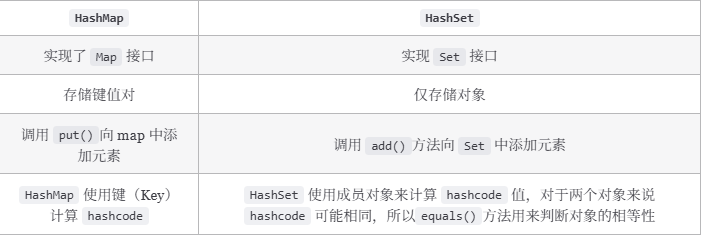

## HashMap和TreeMap区别

**相比于 `HashMap`来说， `TreeMap` 主要多了对集合中的元素根据键排序的能力以及对集合内元素的搜索的能力。**

`NavigableMap` 接口提供了丰富的方法来探索和操作键值对:

1. **定向搜索** : `ceilingEntry()`, `floorEntry()`, `higherEntry()`和 `lowerEntry()` 等方法可以用于定位大于等于、小于等于、严格大于、严格小于给定键的最接近的键值对。
2. **子集操作** : `subMap()`, `headMap()`和 `tailMap()` 方法可以高效地创建原集合的子集视图，而无需复制整个集合。
3. **逆序视图** :`descendingMap()` 方法返回一个逆序的 `NavigableMap` 视图，使得可以反向迭代整个 `TreeMap`。
4. **边界操作** : `firstEntry()`, `lastEntry()`, `pollFirstEntry()`和 `pollLastEntry()` 等方法可以方便地访问和移除元素。

## HashMap长度为什么是2的幂次方

* 位运算效率更高：位运算(&)比取余运算(%)更高效。当长度为 2 的幂次方时，`hash % length` 等价于 `hash & (length - 1)`。
* 可以更好地保证哈希值的均匀分布：扩容之后，在旧数组元素 hash 值比较均匀的情况下，新数组元素也会被分配的比较均匀，最好的情况是会有一半在新数组的前半部分，一半在新数组后半部分。
* 扩容机制变得简单和高效：扩容后只需检查哈希值高位的变化来决定元素的新位置，要么位置不变（高位为 0），要么就是移动到新位置（高位为 1，原索引位置+原容量）。

## HashMap多线程导致死循环

* JDK1.7：头插法，可能会导致链表中的节点指向错误的位置，从而形成一个环形链表
* JDK1.8：尾插法，避免了链表中的环形结构。但是还是不建议在多线程下使用 `HashMap`

## ConcurrentHashMap和Hashtable的区别

* **底层数据结构：**
  * JDK1.7 的 `ConcurrentHashMap` 底层采用 **分段的数组+链表** 实现，在 JDK1.8 中采用的数据结构跟 `HashMap` 的结构一样，数组+链表/红黑二叉树。
  * `Hashtable` 和 JDK1.8 之前的 `HashMap` 的底层数据结构类似都是采用 **数组+链表** 的形式
* **实现线程安全的方式（重要）：**
  * 在 JDK1.7 的时候，`ConcurrentHashMap` 对整个桶数组进行了分割分段(`Segment`，分段锁)，每一把锁只锁容器其中一部分数据，多线程访问容器里不同数据段的数据，就不会存在锁竞争，提高并发访问率。
  * 到了 JDK1.8 的时候，`ConcurrentHashMap` 直接用 `Node` 数组+链表+红黑树的数据结构来实现，并发控制使用 `synchronized` 和 CAS 来操作。
  * **`Hashtable`(同一把锁)** :使用 `synchronized` 来保证线程安全，效率非常低下。当一个线程访问同步方法时，其他线程也访问同步方法，可能会进入阻塞或轮询状态，如使用 put 添加元素，另一个线程不能使用 put 添加元素，也不能使用 get，竞争会越来越激烈效率越低。

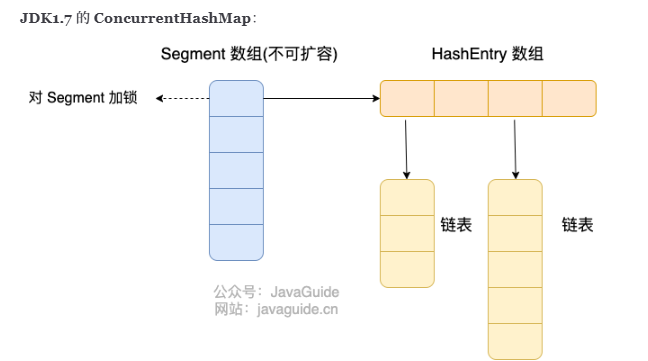

 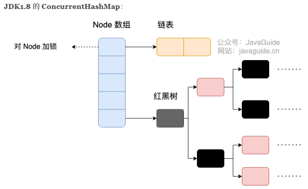

## ConcurrentHashMap线程安全实现方式

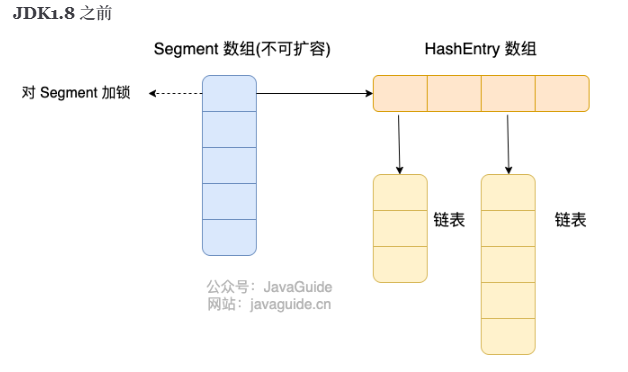

将数据分为一段一段（这个“段”就是 `Segment`）的存储，然后给每一段数据配一把锁，当一个线程占用锁访问其中一个段数据时，其他段的数据也能被其他线程访问。

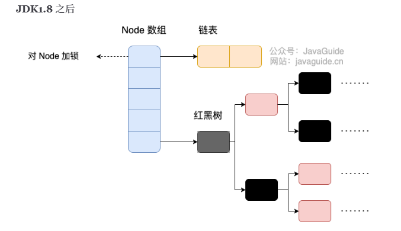

* 取消了 `Segment` 分段锁，采用 `Node + CAS + synchronized` 来保证并发安全。
* 锁粒度更细，`synchronized` 只锁定当前链表或红黑二叉树的首节点，这样只要 hash 不冲突，就不会产生并发，就不会影响其他 Node 的读写，效率大幅提升。

## 两种并发实现方式区别

* **线程安全实现方式** ：JDK 1.7 采用 `Segment` 分段锁来保证安全， `Segment` 是继承自 `ReentrantLock`。JDK1.8 放弃了 `Segment` 分段锁的设计，采用 `Node + CAS + synchronized` 保证线程安全，锁粒度更细，`synchronized` 只锁定当前链表或红黑二叉树的首节点。
* **Hash 碰撞解决方法** : JDK 1.7 采用拉链法，JDK1.8 采用拉链法结合红黑树（链表长度超过一定阈值时，将链表转换为红黑树）。
* **并发度** ：JDK 1.7 最大并发度是 Segment 的个数，默认是 16。JDK 1.8 最大并发度是 Node 数组的大小，并发度更大。

## ConcurrentHashMap为什么key和value不能为null？

* `ConcurrentHashMap` 的 key 和 value 不能为 null 主要是为了避免二义性。
* null 是一个特殊的值，表示没有对象或没有引用。如果你用 null 作为键，那么你就无法区分这个键是否存在于 `ConcurrentHashMap` 中，还是根本没有这个键。同样，如果你用 null 作为值，那么你就无法区分这个值是否是真正存储在 `ConcurrentHashMap` 中的，还是因为找不到对应的键而返回的。---
* 如果确实需要在 ConcurrentHashMap 中使用 null 的话，可以使用一个特殊的静态空对象来代替 null。
* `public static final Object NULL = new Object();`

## ConcurrentHashMap能保证复合操作的原子性吗

* 复合操作是指由多个基本操作(如 `put`、`get`、`remove`、`containsKey`等)组成的操作，这种操作在执行过程中可能会被其他线程打断，导致结果不符合预期。
* `ConcurrentHashMap` 提供了一些原子性的复合操作，如 `putIfAbsent`、`compute`、`computeIfAbsent` 、`computeIfPresent`、`merge`等。这些方法都可以接受一个函数作为参数，根据给定的 key 和 value 来计算一个新的 value，并且将其更新到 map 中

## 源码（HashMap）

### 底层数据结构

* JDK1.8之前：数组和链表
* JDK1.8之后：(<64)数组和链表，（>=64）红黑树
* **loadFactor 负载因子**:控制数组存放数据的疏密程度

  * **太大导致查找元素效率低，太小导致数组的利用率低，存放的数据会很分散**
  * **默认值 0.75f 是官方给出的一个比较好的临界值**
  * 比如：默认容量为 16，负载因子为 0.75，当数量超过了 16 * 0.75 = 12 就需要将当前 16 的容量进行扩容
* **为什么选择阈值 8 和 64？**

  * 泊松分布表明，链表长度达到 8 的概率极低（小于千万分之一）。在绝大多数情况下，链表长度都不会超过 8。阈值设置为 8，可以保证性能和空间效率的平衡。
  * 数组长度阈值 64 同样是经过实践验证的经验值。在小数组中扩容成本低，优先扩容可以避免过早引入红黑树。数组大小达到 64 时，冲突概率较高，此时红黑树的性能优势开始显现。

### 构造方法

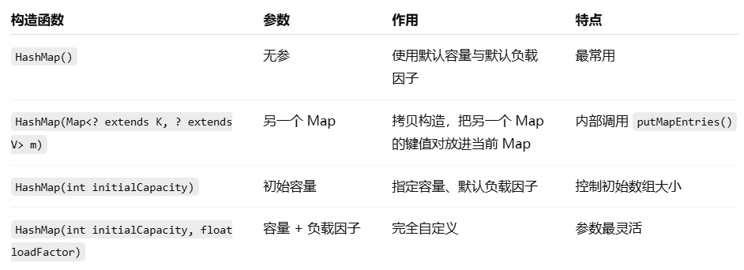

### put方法

* 如果定位到的数组位置没有元素 就直接插入。
* 如果定位到的数组位置有元素就和要插入的 key 比较
  * 如果 key 相同就直接覆盖
  * 如果 key 不相同，就判断 p 是否是一个树节点
    * 如果是就调用 `e = ((TreeNode<K,V>)p).putTreeVal(this, tab, hash, key, value)`将元素添加进入。
    * 如果不是就遍历链表插入(插入的是链表尾部)。

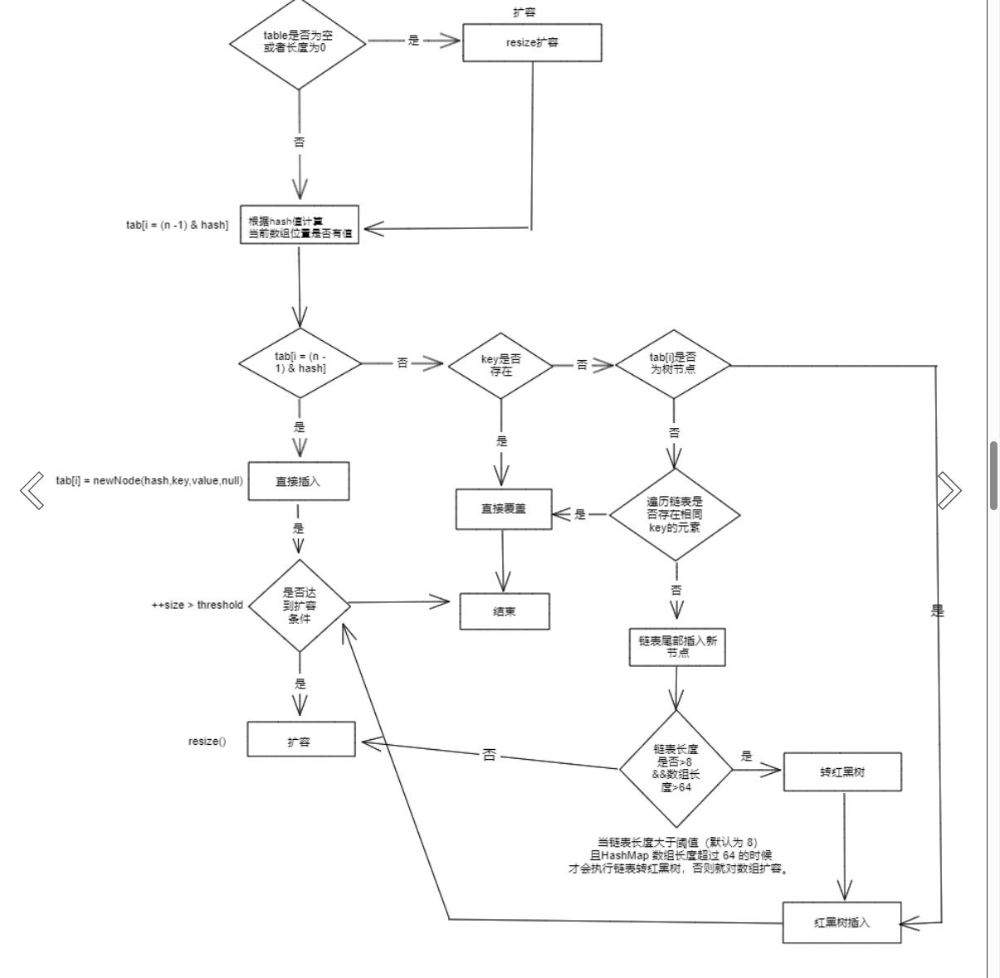

### get方法

* 计算 `key`的哈希值
* 检查哈希表是否初始化、并定位桶位置
* 检查桶中第一个节点
* 若桶中不止一个节点，遍历链表或红黑树

### resize方法

* 进行扩容，会伴随着一次重新 hash 分配，并且会遍历 hash 表中所有的元素，是非常耗时的。
* 在编写程序中，要尽量避免 resize。
* resize 方法实际上是将 table 初始化和 table 扩容进行了整合，底层的行为都是给 table 赋值一个新的数组。

## 源码（ConcurrentHashMap1.7）

### 存储结构

* `ConcurrnetHashMap` 由很多个 `Segment` 组合，而每一个 `Segment` 是一个类似于 `HashMap` 的结构
* 每一个 `HashMap` 的内部可以进行扩容。但是 `Segment` 的个数一旦 **初始化就不能改变**
* 默认 `Segment` 的个数是 16 个，可以认为 `ConcurrentHashMap` 默认支持最多 16 个线程并发。

### 初始化

* 必要参数校验。
* 校验并发级别 `concurrencyLevel` 大小，如果大于最大值，重置为最大值。无参构造**默认值是 16.**
* 寻找并发级别 `concurrencyLevel` 之上最近的 **2 的幂次方**值，作为初始化容量大小， **默认是 16** 。
* 记录 `segmentShift` 偏移量，这个值为【容量 = 2 的 N 次方】中的 N，在后面 Put 时计算位置时会用到。 **默认是 32 - sshift = 28** .
* 记录 `segmentMask`，默认是 ssize - 1 = 16 -1 = 15.
* **初始化 `segments[0]`** ， **默认大小为 2** ， **负载因子 0.75** ， **扩容阀值是 2*0.75=1.5** ，插入第二个值时才会进行扩容。

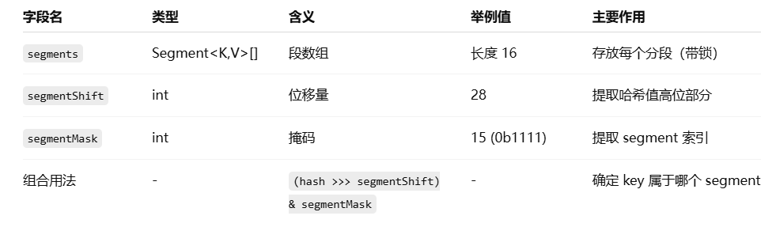

### put方法

* 计算要 put 的 key 的位置，获取指定位置的 `Segment`。
* 如果指定位置的 `Segment` 为空，则初始化这个 `Segment`.
  **初始化 Segment 流程：**

  1. 检查计算得到的位置的 `Segment` 是否为 null.
  2. 为 null 继续初始化，使用 `Segment[0]` 的容量和负载因子创建一个 `HashEntry` 数组。
  3. 再次检查计算得到的指定位置的 `Segment` 是否为 null.
  4. 使用创建的 `HashEntry` 数组初始化这个 Segment.
  5. 自旋判断计算得到的指定位置的 `Segment` 是否为 null，使用 CAS 在这个位置赋值为 `Segment`.
* `Segment.put` 插入 key,value 值。

  * `tryLock()` 获取锁，获取不到使用 **`scanAndLockForPut`** 方法继续获取。
  * 计算 put 的数据要放入的 index 位置，然后获取这个位置上的 `HashEntry` 。
  * 遍历 put 新元素，为什么要遍历？因为这里获取的 `HashEntry` 可能是一个空元素，也可能是链表已存在，所以要区别对待。

    如果这个位置上的  **`HashEntry` 不存在** ：

    1. 如果当前容量大于扩容阀值，小于最大容量， **进行扩容** 。
    2. 直接头插法插入。

    如果这个位置上的  **`HashEntry` 存在** ：

    1. 判断链表当前元素 key 和 hash 值是否和要 put 的 key 和 hash 值一致。一致则替换值
    2. 不一致，获取链表下一个节点，直到发现相同进行值替换，或者链表遍历完没有相同的。
       1. 如果当前容量大于扩容阀值，小于最大容量， **进行扩容** 。
       2. 直接链表头插法插入。
  * 如果要插入的位置之前已经存在，替换后返回旧值，否则返回 null.

### 扩容

### get方法

* 计算得到key的存放位置
* 遍历指定位置查找相同 key 的 value 值。

## 源码（ConcurrentHashMap1.8）

### 存储结构

**Node 数组 + 链表 / 红黑树** 。当冲突链表达到一定长度时，链表会转换成红黑树。

### 初始化

变量 `sizeCtl` （sizeControl 的缩写），它的值决定着当前的初始化状态。

* -1 说明正在初始化，其他线程需要自旋等待
* -N 说明 table 正在进行扩容，高 16 位表示扩容的标识戳，低 16 位减 1 为正在进行扩容的线程数
* 0 表示 table 初始化大小，如果 table 没有初始化
* ＞0 表示 table 扩容的阈值，如果 table 已经初始化。

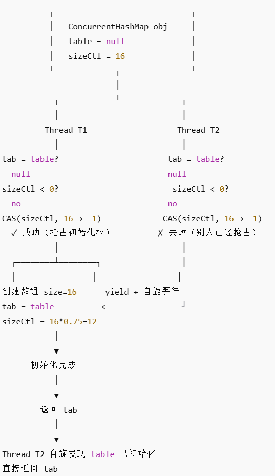

### put方法

1. 根据 key 计算出 hashcode 。
2. 判断是否需要进行初始化。
3. 即为当前 key 定位出的 Node，如果为空表示当前位置可以写入数据，利用 CAS 尝试写入，失败则自旋保证成功。
4. 如果当前位置的 `hashcode == MOVED == -1`,则需要进行扩容。
5. 如果都不满足，则利用 synchronized 锁写入数据。
6. 如果数量大于 `TREEIFY_THRESHOLD` 则要执行树化方法，在 `treeifyBin` 中会首先判断当前数组长度 ≥64 时才会将链表转换为红黑树。

### get方法

1. 根据 hash 值计算位置。
2. 查找到指定位置，如果头节点就是要找的，直接返回它的 value.
3. 如果头节点 hash 值小于 0 ，说明正在扩容或者是红黑树，查找之。
4. 如果是链表，遍历查找之。

## 源码（LinkedHashMap）

### 简介

继承自 `HashMap`，并在 `HashMap` 基础上维护一条双向链表，原本散列在不同 bucket 上的节点、链表、红黑树有序关联起来。具备如下特性:

1. 支持遍历时会按照插入顺序有序进行迭代。
2. 支持按照元素访问顺序排序,适用于封装 LRU 缓存工具。
3. 因为内部使用双向链表维护各个节点，所以遍历时的效率和元素个数成正比，相较于和容量成正比的 HashMap 来说，迭代效率会高很多。

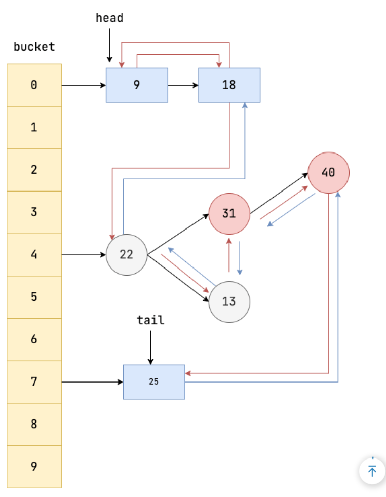

### 遍历

`LinkedHashMap` 定义了排序模式 `accessOrder`(boolean 类型，默认为 false)，访问顺序则为 true，插入顺序则为 false。为了实现访问顺序遍历，我们可以使用传入 `accessOrder` 属性的 `LinkedHashMap` 构造方法，并将 `accessOrder` 设置为 true，表示其具备访问有序性。

插入顺序遍历

`HashMap < String, String > map = new LinkedHashMap < > ();`

访问顺序遍历

`LinkedHashMap<Integer, String> map = new LinkedHashMap<>(16, 0.75f, true);`

### LRU缓存

* 继承 `LinkedHashMap`;
* 构造方法中指定 `accessOrder` 为 true ，这样在访问元素时就会把该元素移动到链表尾部，链表首元素就是最近最少被访问的元素；
* 重写 `removeEldestEntry` 方法，该方法会返回一个 boolean 值，告知 `LinkedHashMap` 是否需要移除链表首元素（缓存容量有限）。

```java
public class LRUCache<K, V> extends LinkedHashMap<K, V> {
    private final int capacity;

    public LRUCache(int capacity) {
        super(capacity, 0.75f, true);
        this.capacity = capacity;
    }

    /**
     * 判断size超过容量时返回true，告知LinkedHashMap移除最老的缓存项(即链表的第一个元素)
     */
    @Override
    protected boolean removeEldestEntry(Map.Entry<K, V> eldest) {
        return size() > capacity;
    }
}
```

### Node设计

* `LinkedHashMap` 的节点内部类 `Entry` 基于 `HashMap` 的基础上，增加 `before` 和 `after` 指针使节点具备双向链表的特性。
* `HashMap` 的树节点 `TreeNode` 继承了具备双向链表特性的 `LinkedHashMap` 的 `Entry`。

### 构造方法

如果要让 `LinkedHashMap` 实现键值对按照访问顺序排序，需要调用第 4 个构造方法将 `accessOrder` 设置为 true。

### get方法

* 调用父类即 `HashMap` 的 `getNode` 获取键值对，若为空则直接返回。
* 判断 `accessOrder` 是否为 true，若为 true 则说明需要保证 `LinkedHashMap` 的链表访问有序性，执行下一步
* 调用 `LinkedHashMap` 重写的 `afterNodeAccess` 将当前元素添加到链表末尾。

`afterNodeAccess`方法

* 如果 `accessOrder` 为 true 且链表尾部不为当前节点 p，我们则需要将当前节点移到链表尾部。
* 获取当前节点 p、以及它的前驱节点 b 和后继节点 a。
* 将当前节点 p 的后继指针设置为 null，使其和后继节点 p 断开联系。
* 尝试将前驱节点指向后继节点，若前驱节点为空，则说明当前节点 p 就是链表首节点，故直接将后继节点 a 设置为首节点，随后我们再将 p 追加到 a 的末尾。
* 再尝试让后继节点 a 指向前驱节点 b。
* 上述操作让前驱节点和后继节点完成关联，并将当前节点 p 独立出来，这一步则是将当前节点 p 追加到链表末端，如果链表末端为空，则说明当前链表只有一个节点 p，所以直接让 head 指向 p 即可。
* 上述操作已经将 p 成功到达链表末端，最后我们将 tail 指针即指向链表末端的指针指向 p 即可。

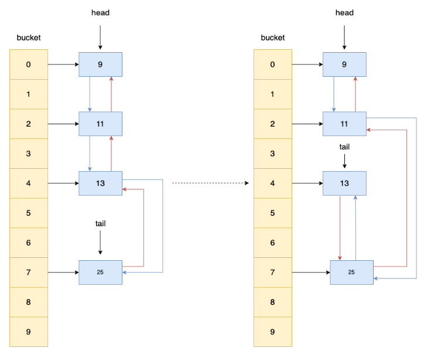

### remove方法

 `afterNodeRemoval`方法的整体操作就是让当前节点 p 和前驱节点、后继节点断开联系，等待 gc 回收，整体步骤为:

1. 获取当前节点 p、以及 p 的前驱节点 b 和后继节点 a。
2. 让当前节点 p 和其前驱、后继节点断开联系。
3. 尝试让前驱节点 b 指向后继节点 a，若 b 为空则说明当前节点 p 在链表首部，我们直接将 head 指向后继节点 a 即可。
4. 尝试让后继节点 a 指向前驱节点 b，若 a 为空则说明当前节点 p 在链表末端，所以直接让 tail 指针指向前驱节点 b 即可。

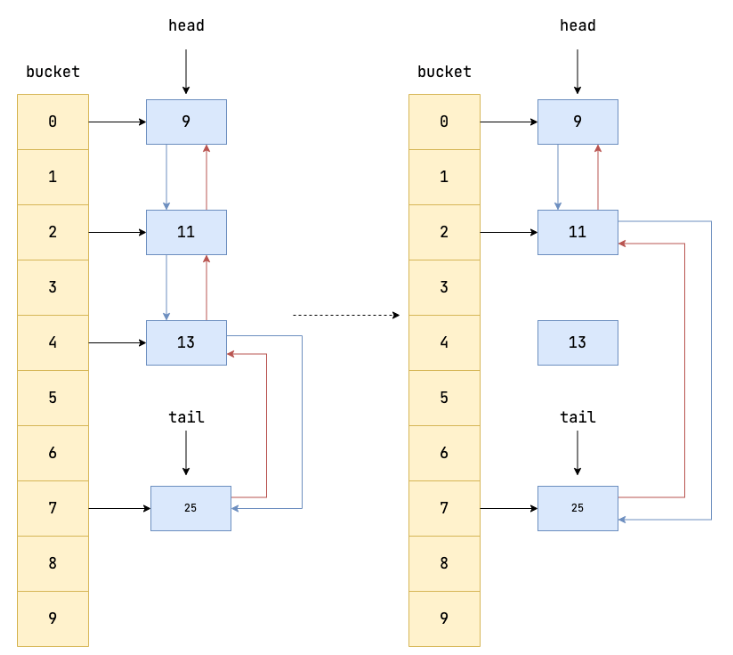

### put方法

`afterNodeInsertion` 方法完成了下面这些操作:

1. 判断 `eldest` 是否为 true，只有为 true 才能说明可能需要将最年长的键值对(即链表首部的元素)进行移除，具体是否具体要进行移除，还得确定链表是否为空 `((first = head) != null)`，以及 `removeEldestEntry` 方法是否返回 true，只有这两个方法返回 true 才能确定当前链表不为空，且链表需要进行移除操作了。
2. 获取链表第一个元素的 key。
3. 调用 `HashMap` 的 `removeNode` 方法，它会将节点从 `HashMap` 的 bucket 中移除，并且 `LinkedHashMap` 还重写了 `removeNode` 中的 `afterNodeRemoval` 方法，所以这一步将通过调用 `removeNode` 将元素从 `HashMap` 的 bucket 中移除，并和 `LinkedHashMap` 的双向链表断开，等待 gc 回收。

### LinkedHashMap和HashMap性能比较

* `LinkedHashMap` 维护了一个双向链表来记录数据插入的顺序，因此在迭代遍历生成的迭代器的时候，是按照双向链表的路径进行遍历的。
* 这一点相比于 `HashMap` 遍历整个 bucket 的方式来说，高效许多。
* `LinkedHashMap` 需要维护双向链表的缘故，插入元素相较于 `HashMap` 会更耗时，但是有了双向链表明确的前后节点关系，迭代效率相对于前者高效了许多。

# Set

* 相当于只存储key、不存储value的 `Map`。
* 和 `Map`的key类似，都要正确实现 `equals()`和 `hashCode()`方法，否则该元素无法正确地放入 `Set`
* `Set`接口并不保证有序，而 `SortedSet`接口则保证元素是有序的：
  * `HashSet`是无序的，因为它实现了 `Set`接口，并没有实现 `SortedSet`接口；
  * `TreeSet`是有序的，因为它实现了 `SortedSet`接口。
* 使用 `TreeSet`和使用 `TreeMap`的要求一样，添加的元素必须正确实现 `Comparable`接口，如果没有实现 `Comparable`接口，那么创建 `TreeSet`时必须传入一个 `Comparator`对象。

## 比较 HashSet、LinkedHashSet 和 TreeSet 三者的异同

* `HashSet`、`LinkedHashSet` 和 `TreeSet` 都是 `Set` 接口的实现类，都能保证元素唯一，并且都不是线程安全的。
* `HashSet`、`LinkedHashSet` 和 `TreeSet` 的主要区别在于底层数据结构不同。
  * `HashSet` 的底层数据结构是哈希表（基于 `HashMap` 实现）。
  * `LinkedHashSet` 的底层数据结构是链表和哈希表，元素的插入和取出顺序满足 FIFO。
  * `TreeSet` 底层数据结构是红黑树，元素是有序的，排序的方式有自然排序和定制排序。
* 底层数据结构不同又导致这三者的应用场景不同。
  * `HashSet` 用于不需要保证元素插入和取出顺序的场景，
  * `LinkedHashSet` 用于保证元素的插入和取出顺序满足 FIFO 的场景
  * `TreeSet` 用于支持对元素自定义排序规则的场景。

## HashSet检查重复

先检查 `hashcode`是否相同，若相同，再通过 `equals()`判断是否存在，若存在，不插入元素

# Queue

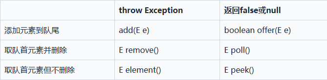

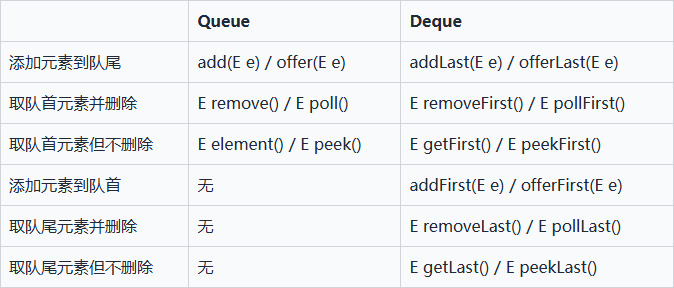

## ArrayQueue和LinkedList区别

* `ArrayDeque` 是基于可变长的数组和双指针来实现，而 `LinkedList` 则通过链表来实现。
* `ArrayDeque` 不支持存储 `NULL` 数据，但 `LinkedList` 支持。
* `ArrayDeque` 插入时可能存在扩容过程, 不过均摊后的插入操作依然为 O(1)。虽然 `LinkedList` 不需要扩容，但是每次插入数据时均需要申请新的堆空间，均摊性能相比更慢。
* 从性能的角度上，选用 `ArrayDeque` 来实现队列要比 `LinkedList` 更好。此外，`ArrayDeque` 也可以用于实现栈。

## PriorityQueue

* `PriorityQueue` 利用了二叉堆的数据结构来实现的，底层使用可变长的数组来存储数据
* `PriorityQueue` 通过堆元素的上浮和下沉，实现了在 O(logn) 的时间复杂度内插入元素和删除堆顶元素。
* `PriorityQueue` 是非线程安全的，且不支持存储 `NULL` 和 `non-comparable` 的对象。
* `PriorityQueue` 默认是小顶堆，但可以接收一个 `Comparator` 作为构造参数，从而来自定义元素优先级的先后。

## 源码（BlockingQueue）

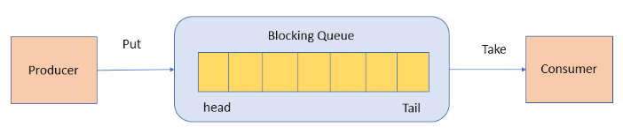

* 阻塞队列，典型的生产者-消费者模型
* 阻塞存取方法：`put`，`take`
* 非阻塞存取方法：`offer`，`poll`

### 整体设计

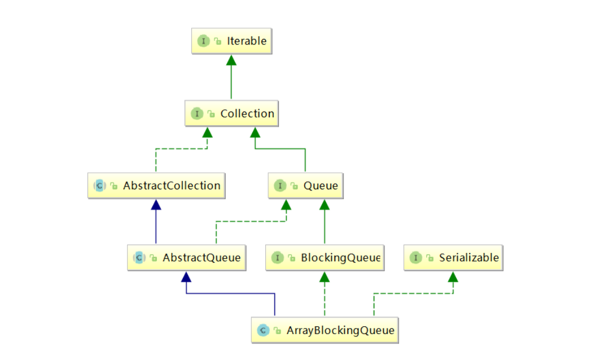

* `ArrayBlockingQueue` 继承了阻塞队列 `BlockingQueue` 这个接口，拥有了阻塞队列常见的操作行为。
* `ArrayBlockingQueue` 继承了 `AbstractQueue` 这个抽象类（继承了 `AbstractCollection` 和 `Queue` 的抽象类），拥有了队列的常见操作。
* `ArrayBlockingQueue` 的容量有限，一旦创建，容量不能改变。
* `ArrayBlockingQueue` 的并发控制采用可重入锁 `ReentrantLock` ，不管是插入操作还是读取操作，都需要获取到锁才能进行操作。

### 阻塞式获取和新增元素

* `put(E e)`：将元素插入队列中，如果队列已满，则该方法会一直阻塞，直到队列有空间可用或者线程被中断。
* * 获取 `ArrayBlockingQueue` 底层的数组 `items`。
  * 将元素存到 `putIndex` 位置。
  * 更新 `putIndex` 到下一个位置，如果 `putIndex` 等于队列长度，则说明 `putIndex` 已经到达数组末尾了，下一次插入则需要 0 开始。(`ArrayBlockingQueue` 用到了循环队列的思想，即从头到尾循环复用一个数组)
  * 更新 `count` 的值，表示当前队列长度+1。
  * 调用 `notEmpty.signal()` 通知队列非空，消费者可以从队列中获取值了。
* `take()` ：获取并移除队列头部的元素，如果队列为空，则该方法会一直阻塞，直到队列非空或者线程被中断。

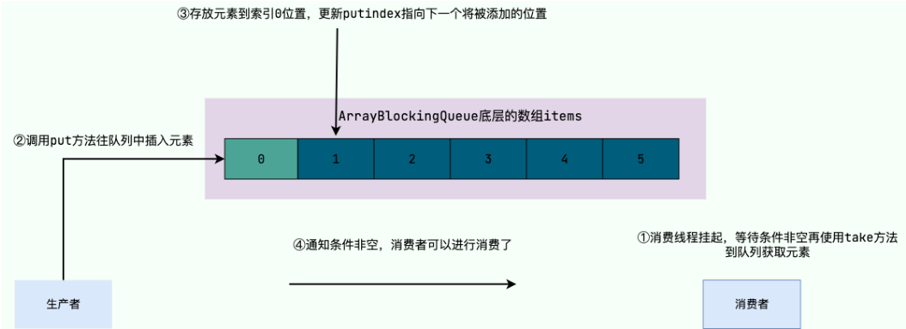

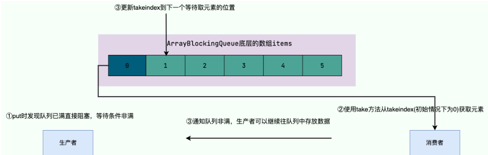

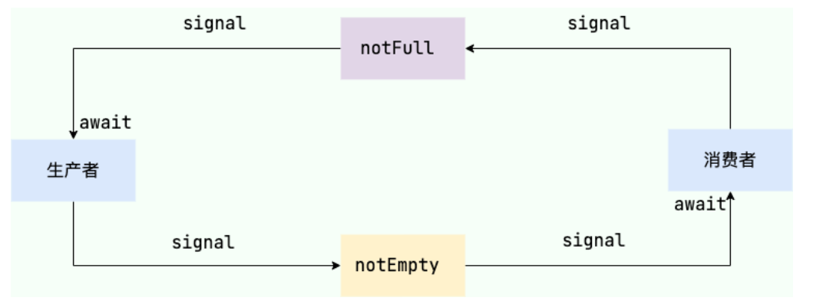

### 非阻塞式获取和新增元素

* `offer(E e)`：将元素插入队列尾部。如果队列已满，则该方法会直接返回 false，不会等待并阻塞线程。
* `poll()`：获取并移除队列头部的元素，如果队列为空，则该方法会直接返回 null，不会等待并阻塞线程。
* `add(E e)`：将元素插入队列尾部。如果队列已满则会抛出 `IllegalStateException` 异常，底层基于 `offer(E e)` 方法。
* `remove()`：移除队列头部的元素，如果队列为空则会抛出 `NoSuchElementException` 异常，底层基于 `poll()`。
* `peek()`：获取但不移除队列头部的元素，如果队列为空，则该方法会直接返回 null，不会等待并阻塞线程。

### 指定超时时间内阻塞式获取和新增元素

* `offer(E e, long timeout, TimeUnit unit)` 和 `poll(long timeout, TimeUnit unit)` ，用于在指定的超时时间内阻塞式地添加和获取元素。

### 判断元素是否存在

* contains(Object o)
* 加锁后遍历

### 增删元素比较

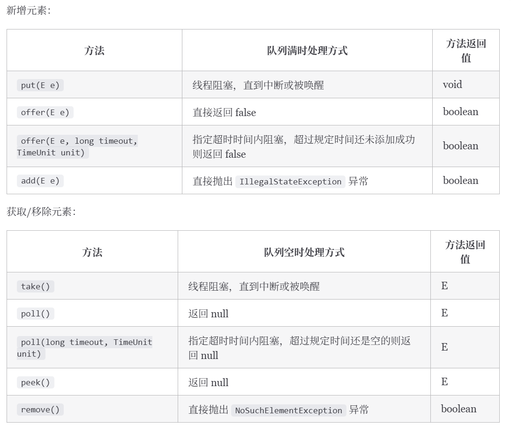

### ArrayBlockingQueue和LinkedBlockingQueue区别

Java 并发包中常用的两种阻塞队列实现，都是线程安全

* 底层实现：`ArrayBlockingQueue` 基于数组实现，而 `LinkedBlockingQueue` 基于链表实现。
* 是否有界：`ArrayBlockingQueue` 是有界队列，必须在创建时指定容量大小。`LinkedBlockingQueue` 创建时可以不指定容量大小，但也可以指定队列大小，从而成为有界的。
* 锁是否分离： `ArrayBlockingQueue`中的锁是没有分离的，即生产和消费用的是同一个锁；`LinkedBlockingQueue`中的锁是分离的，即生产用的是 `putLock`，消费是 `takeLock`，这样可以防止生产者和消费者线程之间的锁争夺。
* 内存占用：`ArrayBlockingQueue` 需要提前分配数组内存，而 `LinkedBlockingQueue` 则是动态分配链表节点内存。这意味着，`ArrayBlockingQueue` 在创建时就会占用一定的内存空间，且往往申请的内存比实际所用的内存更大，而 `LinkedBlockingQueue` 则是根据元素的增加而逐渐占用内存空间。

### ArrayBlockingQueue和ConcurrentLinkedQueue区别

Java 并发包中常用的两种队列实现，都是线程安全

* 底层实现：`ArrayBlockingQueue` 基于数组实现，而 `ConcurrentLinkedQueue` 基于链表实现。
* 是否有界：`ArrayBlockingQueue` 是有界队列，必须在创建时指定容量大小，而 `ConcurrentLinkedQueue` 是无界队列，可以动态地增加容量。
* 是否阻塞：`ArrayBlockingQueue` 支持阻塞和非阻塞两种获取和新增元素的方式（一般只会使用前者）， `ConcurrentLinkedQueue` 是无界的，仅支持非阻塞式获取和新增元素。

## 源码（DelayQueue）

`DelayQueue` 是延迟队列，用于实现延时任务比如订单下单 15 分钟未支付直接取消。它是 `BlockingQueue` 的一种，底层是一个基于 `PriorityQueue` 实现的一个无界队列，是线程安全的。

```java
// 创建延迟队列，并添加任务
DelayQueue < DelayedTask > delayQueue = new DelayQueue < > ();

//分别添加1s、2s、3s到期的任务
delayQueue.add(new DelayedTask(2000, () -> System.out.println("Task 2")));
delayQueue.add(new DelayedTask(1000, () -> System.out.println("Task 1")));
delayQueue.add(new DelayedTask(3000, () -> System.out.println("Task 3")));

// 取出任务并执行
while (!delayQueue.isEmpty()) {
  //阻塞获取最先到期的任务
  DelayedTask task = delayQueue.take();
  if (task != null) {
    task.execute();
  }
}
```


### 核心成员变量

```java
//可重入锁，实现线程安全的关键
private final transient ReentrantLock lock = new ReentrantLock();
//延迟队列底层存储数据的集合,确保元素按照到期时间升序排列
private final PriorityQueue<E> q = new PriorityQueue<E>();

//指向准备执行优先级最高的线程
private Thread leader = null;
//实现多线程之间等待唤醒的交互
private final Condition available = lock.newCondition();
```

### 添加元素

`offer` 方法的整体逻辑为:

1. 尝试获取 `lock` 。
2. 如果上锁成功,则调 `q` 的 `offer` 方法将元素存放到优先队列中。
3. 调用 `peek` 方法看看当前队首元素是否就是本次入队的元素,如果是则说明当前这个元素是即将到期的任务(即优先级最高的元素)，于是将 `leader` 设置为空,通知因为队列为空时调用 `take` 等方法导致阻塞的线程来争抢元素。
4. 上述步骤执行完成，释放 `lock`。
5. 返回 true。

### 获取元素

* 阻塞式
  * 没看懂
* 非阻塞式 `poll()`
  1. 尝试获取可重入锁。
  2. 查看队列第一个元素,判断元素是否为空。
  3. 若元素为空，或者元素未到期，则直接返回空。
  4. 若元素不为空且到期了，直接调用 `poll` 返回出去。
  5. 释放可重入锁 `lock` 。

### 查看元素

`peek()`

1. 上锁。
2. 调用优先队列 q 的 peek 方法查看索引 0 位置的元素。
3. 释放锁。
4. 将元素返回出去。
