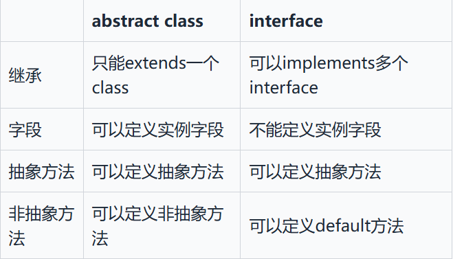
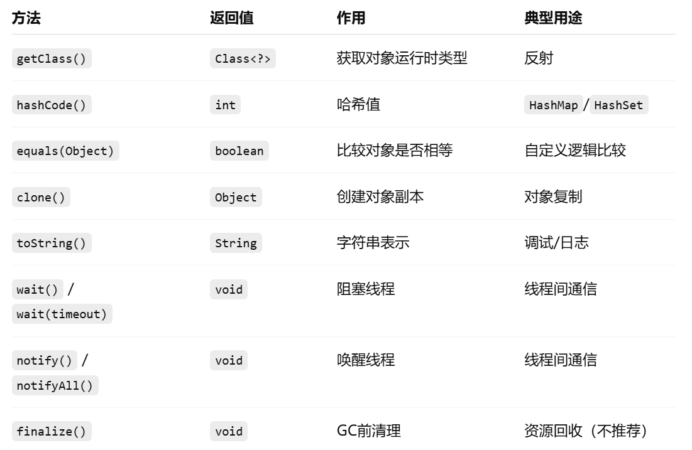
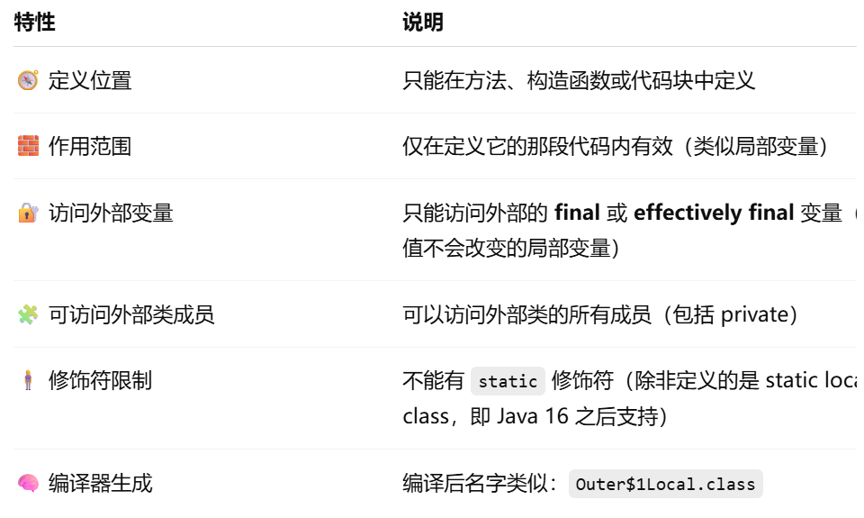

# 面向对象基础

* **面向过程编程（POP）** ：面向过程把解决问题的过程拆成一个个方法，通过一个个方法的执行解决问题。
* **面向对象编程（OOP）** ：面向对象会先抽象出对象，然后用对象执行方法的方式解决问题。

## 对象实体和对象引用

* new 创建对象实例（对象实例在堆内存中）
* 对象引用指向对象实例（对象引用存放在栈内存中）
* 一个对象引用可以指向 0 个或 1 个对象
* 一个对象可以有 n 个引用指向它

## 对象相等和引用相等区别

* 对象的相等一般比较的是内存中存放的内容是否相等。
* 引用相等一般比较的是他们指向的内存地址是否相等。
* `==` 运算符比较的是字符串的引用是否相等
* `equals` 方法比较的是字符串的内容

## 类的构造方法

* 如果一个类没有声明构造方法，也可以执行，它会有默认的无参构造方法
* 如果重载了有参的构造方法，记得都要把无参的构造方法也写出来

## 面向对象三大特征

* 封装

  * 指把一个对象的状态信息隐藏在对象内部，不允许外部对象直接访问对象的内部信息
  * 可以提供一些可以被外界访问的方法来操作属性
* 继承

  *  使用已存在的类的定义作为基础建立新类的技术
  * 继承，可以快速地创建新的类，提高代码的重用，程序的可维护性
  * 子类拥有父类对象所有的属性和方法（包括私有属性和私有方法），但是父类中的私有属性和方法子类是无法访问， **只是拥有**
* 多态

  * 一个对象具有多种的状态，具体表现为父类的引用指向子类的实例。

## 抽象类

* 如果父类的方法本身不需要实现任何功能，仅仅是为了定义方法签名，目的是让子类去覆写它，那么，可以把父类的方法声明为抽象方法：

```java
class Person {
    public abstract void run();
}
```

* 因此，抽象方法实际上相当于定义了“规范”。（子类必须override其方法）
* 面向抽象编程：尽量引用高层类型，避免引用实际子类型的方式

## 接口

* 如果一个抽象类没有字段，所有方法全部都是抽象方法，就可以把该抽象类改写为接口：`interface`：

```
abstract class Person {
    public abstract void run();
    public abstract String getName();
}

```

* 当一个具体的 `class`去实现一个 `interface`时，需要使用 `implements`关键字
* 一个类只能继承自另一个类，不能从多个类继承。但是，一个类可以实现多个 `interface`
* 在接口中，可以定义 `default`方法。如果新增的是 `default`方法，那么子类就不必全部修改，只需要在需要覆写的地方去覆写新增方法。
* 接口可以用静态字段，必须为 `final`类型

## 接口和抽象类

* 同

  * 都不能直接实例化，只能被实现/继承后才能创建具体对象
  * 二者都可以包含抽象方法
* 异

  * 一个类只能继承一个类，单一个类可以实现多个接口
  * 接口中的成员变量只能是 `public static final` 类型的，不能被修改且必须有初始值。抽象类的成员变量可以有任何修饰符（`private`, `protected`, `public`），可以在子类中被重新定义或赋值。



## 深拷贝和浅拷贝

* **浅拷贝** ：浅拷贝会在堆上创建一个新的对象，不过，如果原对象内部的属性是引用类型的话，浅拷贝会直接复制内部对象的引用地址，也就是说拷贝对象和原对象共用同一个内部对象。
* ```java
  @Override
      public Address clone() {
          try {
              return (Address) super.clone();
          } catch (CloneNotSupportedException e) {
              throw new AssertionError();
          }
      }
  ```
* **深拷贝** ：深拷贝会完全复制整个对象，包括这个对象所包含的内部对象。
* ```Java
  @Override
  public Person clone() {
      try {
          Person person = (Person) super.clone();
          person.setAddress(person.getAddress().clone());
          return person;
      } catch (CloneNotSupportedException e) {
          throw new AssertionError();
      }
  }
  ```

## Object

* 一个特殊的类，是所有类的父类
* 常见方法及作用



## ==和equals()

* ==

  * 对于基本数据类型来说，`==` 比较的是值。
  * 对于引用数据类型来说，`==` 比较的是对象的内存地址。
* equals()

  * **类没有重写 `equals()`方法** ：通过 `equals()`比较该类的两个对象时，等价于通过“==”比较这两个对象，使用的默认是 `Object`类 `equals()`方法。
  * **类重写了 `equals()`方法** ：一般我们都重写 `equals()`方法来比较两个对象中的属性是否相等；若它们的属性相等，则返回 true(即，认为这两个对象相等)。

## hashCode()

* 如果两个对象的 `hashCode` 值相等，那这两个对象不一定相等（哈希碰撞）。
* 如果两个对象的 `hashCode` 值相等并且 `equals()`方法也返回 `true`，我们才认为这两个对象相等。
* 如果两个对象的 `hashCode` 值不相等，我们就可以直接认为这两个对象不相等。
* 重写 `equals()`时必须重写 `hashCode()` 方法
  * 因为两个相等的对象的 `hashCode` 值必须是相等。也就是说如果 `equals` 方法判断两个对象是相等的，那这两个对象的 `hashCode` 值也要相等。
  * 如果重写 `equals()` 时没有重写 `hashCode()` 方法的话就可能会导致 `equals` 方法判断是相等的两个对象，`hashCode` 值却不相等。

## 重写 `equals()`但是没有重写 `hashCode()`的问题

## 阻止继承

* `final`：不允许其他类继承
* `sealed `修饰 ， `permits` 明确写出能够从该class继承的子类名称。

## 转型

* 把一个子类类型安全地变为父类类型的赋值，称为向上转型（upcasting）
* 把一个父类类型强制转型为子类类型，称为向下转型（downcasting）
* 向下转型很可能会失败，失败的时候，Java虚拟机会报 `ClassCastException`。
* `instanceof`实际上判断一个变量所指向的实例是否是指定类型，或者这个类型的子类。利用 `instanceof`，在向下转型前可以先判断。
* 判断 `instanceof`后，可以直接转型为指定变量，避免再次强制转型。

## 作用域

* 包作用域是指一个类允许访问同一个 `package`的没有 `public`、`private`修饰的 `class`，以及没有 `public`、`protected`、`private`修饰的字段和方法。

## super

* `super` 可以在子类中用来访问 **被重写的方法** 或  **被隐藏的字段** 。
* 当子类重写了父类的方法后，如果仍想在子类中调用父类版本，可以使用：`super.methodName();`
* 如果子类定义了一个与父类同名的字段（隐藏了父类的字段），可以用 `super` 访问父类的那个版本。
* `super` 也可以用于 **调用父类构造函数** ，这是构造链（constructor chaining）的一部分。使用时必须是 **子类构造函数的第一行** 。
* 当创建一个子类对象时，会 **依次调用父类、祖父类、…… 的构造函数** 。

## 局部类 local class

* **局部类（local class）** 是  **定义在一个方法、构造函数或代码块内部的类** 。
* 它的作用范围（scope） **仅限于定义它的那段代码内部** 。



## 匿名类

* **匿名类**是一种没有名字的类。
* 它通常 **在声明和实例化的同时**被定义。
* 匿名类  **必须继承一个类或实现一个接口** 。
* 用途：快速创建类的实例，通常用于 **事件处理、回调、线程** 等场景，不需要单独写一个完整类。
* 不能定义构造方法
* 局部变量只能访问final/effectively final
