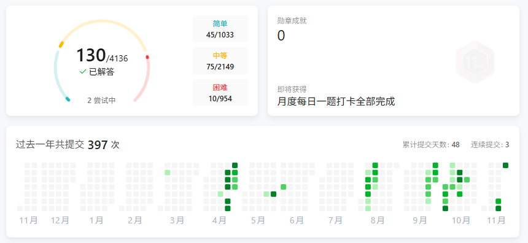

本周状态恢复了些，八股、算法开始捡起来继续看了，不得不开始继续为了那虚无缥缈的未来前进。虽然前几天刚结束了一个项目，但这学期倒数日上面的ddl在期末周前只会越来越多。接下来的项目是软工课设和数据存储的作业。软工课设已经开工了，去还数据库的债；但是数据存储有点让我摸不着头脑，只能说不愧是款爷。

在三周没跑步的情况下，昨日参加了比亚迪的冬季长跑，能抵消十次刷锻，这学期的刷锻终于结束。昨日下午是少有的完全抛掉课内任务的时间，也是这学期周末不在宿舍最长时间记录（应该是）自从这学期济事楼的自习室因不明原因被锁后，因为拓展屏幕不便频繁移动，学习任务基本都在宿舍进行，这就导致很容易会摸鱼、效率大打折扣，看似一整天都坐在电脑前，实际完成的任务却只有堪堪两三项。

跑完后，不出所料开始腿酸，然而明天就要测一千米，上午还有习概的期中考试。

虽然这周在心情上有所恢复，但其实内心的焦虑和急躁并没有好转。甚至有通过他人发泄情绪的倾向，这并非是本周才出现的迹象，我开始变得敏感，语言也变得尖锐起来，甚至会对好友说起风凉话。

每每听到已经能保研的同学提及就业形式严峻，希望早些就业/实习。尽管底层逻辑并不矛盾，但这种“心口不一”的措辞还是让我不舒服，有一种“何不食肉糜”的感受；有时听道同学因“一次训练模型失败”“干一天活没什么进展”而痛心疾首，我也会以“燕雀不知鸿鹄之志”来调侃/自嘲/阴阳。此时其实已经高下立判了：人家是精益求精、严格要求自己；而我不知何时已经习惯于“接受”“退一步”，自己早已在“退一步”又“退一步”中变得腐朽和平庸。也是时候正视自己的丑态了。

更加残酷的现实是：身边准备深造的同学也早就有实习了，相比之下我的小丑和菜鸡姿态更加明显。可实际情况是：人家面试和算法都能一遍过，我面三次挂三次、笔试三道算法AC了0道，自己又有什么资格在这怨天尤人？三次挂面之后，我开始重新审视自己，其实实际能力压根就没有自己和他人设想的那样，所谓菜是原罪，说的就是我这种没底子不自知还不上进的小丑吧，赫赫。

前几段文字所述的情况其实早已出现，但迟迟未能形成文字，我想导火索应该是那句“你找到实习了我们的课设怎么办，你是好几个项目的中流砥柱”这句“捧杀”。说者无意听着有心。虽然我并没打算在课设压力最大的时间去实习，虽然我确实需要用这个项目去还数据库的债，虽然他并非是那种又要摆烂又要比例的人。但这样的话直接说出来，却有一种甩手掌柜、精致利己、不管他人死活的感觉。我是不是也有理由担心学期末会因为“一门一学分的课拿了中/良”又让我产生“何不食肉糜”的心情？

说实话，这周心情其实还可以的。可当开始落笔时，却又不知不觉撕下了遮羞布，写了许多沉重的文字，可能内心深处早已被焦虑和嫉妒笼罩吧，这周短暂的积极，或许只是因dll而被逼无奈吧。

