# 操作系统知识速成

## 操作系统基础

### 操作系统概念

* 操作系统（Operating System，简称 OS）是管理计算机硬件与软件资源的程序，是计算机的基石。
* 操作系统本质上是一个运行在计算机上的软件程序 ，主要用于管理计算机硬件和软件资源。

1. 操作系统的内核（Kernel）属于操作系统层面，而 CPU 属于硬件。
2. CPU 主要提供运算，处理各种指令的能力。内核（Kernel）主要负责系统管理比如内存管理，它屏蔽了对硬件的操作。

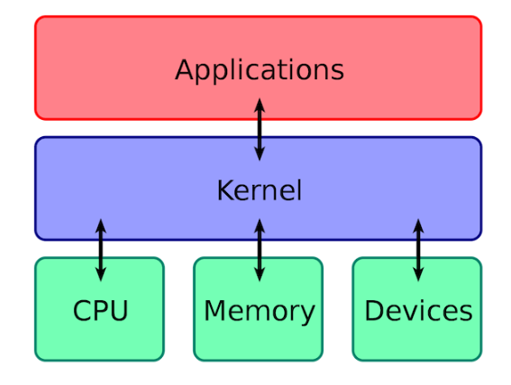

### 操作系统功能

* **进程和线程的管理** ：进程的创建、撤销、阻塞、唤醒，进程间的通信等。
* **存储管理** ：内存的分配和管理、外存（磁盘等）的分配和管理等。
* **文件管理** ：文件的读、写、创建及删除等。
* **设备管理** ：完成设备（输入输出设备和外部存储设备等）的请求或释放，以及设备启动等功能。
* **网络管理** ：操作系统负责管理计算机网络的使用。网络是计算机系统中连接不同计算机的方式，操作系统需要管理计算机网络的配置、连接、通信和安全等，以提供高效可靠的网络服务。
* **安全管理** ：用户的身份认证、访问控制、文件加密等，以防止非法用户对系统资源的访问和操作。

### 用户态和内核态

#### 用户态和内核态概念

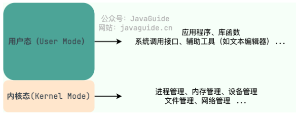

* **用户态(User Mode)** : 用户态运行的进程可以直接读取用户程序的数据，拥有较低的权限。当应用程序需要执行 需要特殊权限的操作，例如读写磁盘、网络通信等，需要向操作系统发起系统调用请求，进入内核态。
* **内核态(Kernel Mode)** ：内核态运行的进程几乎可以访问计算机的任何资源包括系统的内存空间、设备、驱动程序等，拥有非常高的权限。当操作系统接收到进程的系统调用请求时，就会从用户态切换到内核态，执行相应的系统调用，并将结果返回给进程，最后再从内核态切换回用户态。
* 内核态相比用户态拥有更高的特权级别，能够执行更底层、更敏感的操作。
* 进入内核态需要付出较高的开销（需要进行一系列的上下文切换和权限检查），应该尽量减少进入内核态的次数，以提高系统的性能和稳定性。

#### 区分用户态和内核态的原因

* 主要是为了**安全和稳定**
* 特权指令：只能由操作系统内核态执行的指令
* CPU 有一些指令是比较危险的比如内存分配、设置时钟、IO 处理等，如果所有的程序都能使用这些指令的话，会对系统的正常运行造成灾难性地影响。需要限制这些危险指令只能内核态运行。
* 如果计算机系统中只有一个内核态，那么所有程序或进程都必须共享系统资源，这将导致系统资源的竞争和冲突，从而影响系统性能和效率。也会让系统的安全性降低，毕竟所有程序或进程都具有相同的特权级别和访问权限。

#### 用户态和内核态切换

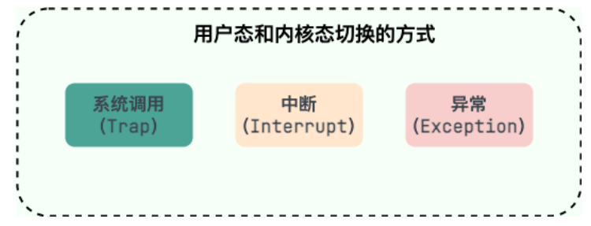

* **系统调用（Trap）** ：这是最主要的方式，是应用程序**主动**发起的。程序需要读取一个文件或者发送网络数据时，它无法直接操作磁盘或网卡，就必须调用操作系统提供的接口（如 `read()`,`send()`), 这会触发一次从用户态到内核态的切换。
* **中断（Interrupt）** ：这是**被动**的，由**外部硬件设备触发**。比如，当硬盘完成了数据读取，会向 CPU 发送一个中断信号，CPU 会暂停当前用户态的程序，切换到内核态去处理这个中断。
* **异常（Exception）** ：这也是**被动**的，由**程序自身错误引起**。比如，我们的代码执行了一个除以零的操作，或者访问了一个非法的内存地址（缺页异常），CPU 会捕获这个异常，并切换到内核态去处理它。
* 状态的切换设计保存/恢复用户上下文，是存在性能开销的。
* 需要考虑减少切换次数，比如通过缓冲 I/O 来批量读写文件。

### 系统调用

#### 系统调用概念

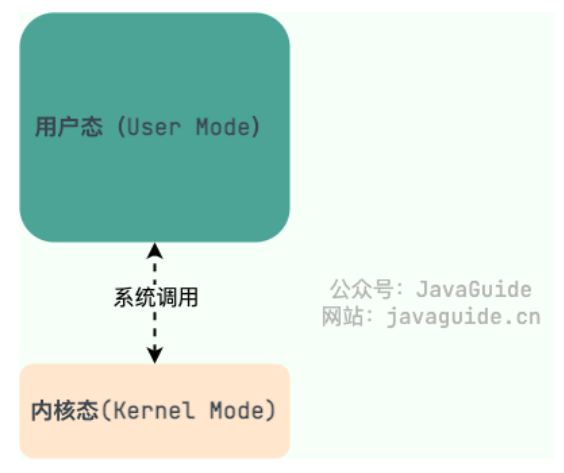

* 我们运行的程序基本都是运行在用户态。
* 凡是和系统态级别的资源有关的操作，都必须通过系统调用方式向操作系统提出服务请求，并由操作系统代为完成。
* 系统调用是应用程序与操作系统之间进行交互的一种方式，通过系统调用，应用程序可以访问操作系统底层资源。
* 系统调用分类：

  * 设备管理：完成设备（输入输出设备和外部存储设备等）的请求或释放，以及设备启动等功能。
  * 文件管理：完成文件的读、写、创建及删除等功能。
  * 进程管理：进程的创建、撤销、阻塞、唤醒，进程间的通信等功能。
  * 内存管理：完成内存的分配、回收以及获取作业占用内存区大小及地址等功能。

#### 系统调用过程

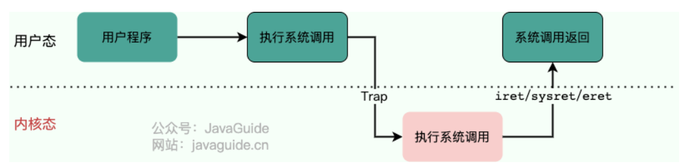

* 用户态程序发起系统调用，中断执行（因为系统调用中涉及一些特权指令）
* 中断后，CPU 执行的程序中断，跳转到中断处理程序
* 内核程序开始处理系统调用
* 系统调用处理完成后，操作系统使用特权指令切换回用户态，恢复用户态的上下文，继续执行用户程序。

## 进程和线程

### 进程和线程的区别

它们的关系可以理解为 **工厂和工人** 的关系。

 **进程（Process）就像一个工厂** 。操作系统在分配资源时，是以进程为基本单位的。比如，当我启动一个微信，操作系统就为它建立了一个独立的工厂，分配给它专属的内存空间、文件句柄等资源。这个工厂与其他工厂（比如我打开的浏览器进程）是严格隔离的。

 **线程（Thread）则像是工厂里的工人** 。一个工厂里可以有很多工人，他们共享这个工厂的资源，但每个工人有自己的工具箱和任务清单，让他们可以独立地执行不同的任务。比如微信这个工厂里，可以有一个工人（线程）负责接收消息，一个工人负责渲染界面。

#### JVM 角度的进程和线程

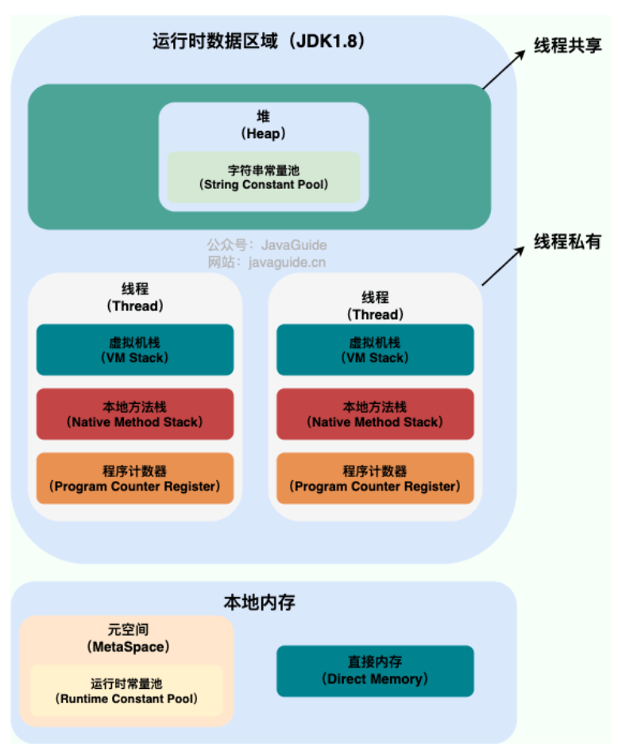

一个进程中可以有多个线程，多个线程共享进程的 **堆**和 **方法区 **资源，但是每个线程有自己的**程序计数器** 、**虚拟机栈** 和  **本地方法栈** 。

1. **资源所有权：** **进程是资源分配的基本单位**，拥有独立的地址空间；**而线程是 CPU 调度的基本单位**，几乎不拥有系统资源，只保留少量私有数据（PCB、栈、寄存器），主要共享其所属进程的资源。
2. **开销：** 创建或销毁一个工厂（进程）的开销很大，需要分配独立的资源。而雇佣或解雇一个工人（线程）的开销就小得多。同理，进程间的上下文切换开销远大于线程间的切换。
3. **健壮性：** 工厂之间是隔离的，一个工厂倒闭（进程崩溃）不会影响其他工厂。但一个工厂内的工人之间是共享资源的，一个工人操作失误（比如一个线程访问了非法内存）可能会导致整个工厂停工（整个进程崩溃）。

### 有进程为什么还要线程

* **为了在单个应用内实现低开销、高效率的并发。**
* 微信同时接收消息和发送文件
  * 使用两个进程，不仅资源开销巨大，它们之间通信还非常麻烦（需要 IPC）。
  * 使用两个线程，它们不仅切换成本低，还能直接通过共享内存高效通信，从而能更好地利用多核 CPU，提升应用的响应速度和吞吐量。

### 为什么要使用多线程

先从总体上来说：

* **从计算机底层来说：** 线程可以比作是轻量级的进程，是程序执行的最小单位,线程间的切换和调度的成本远远小于进程。多核 CPU 时代意味着多个线程可以同时运行，这减少了线程上下文切换的开销。
* **从当代互联网发展趋势来说：** 现在的系统要求百万级甚至千万级的并发量，而多线程并发编程正是开发高并发系统的基础，利用好多线程机制可以大大提高系统整体的并发能力以及性能。

再深入到计算机底层来探讨：

* **单核时代** ：在单核时代多线程主要是为了提高单进程利用 CPU 和 IO 系统的效率。
  * 假设只运行一个进程的情况，请求 IO 的时候，此线程被 IO 阻塞则整个进程被阻塞。CPU 和 IO 设备只有一个在运行，那么可以简单地说系统整体效率只有 50%。
  * 使用多线程的时候，一个线程被 IO 阻塞，其他线程还可以继续使用 CPU。从而提高了进程利用系统资源的整体效率。
* **多核时代** : 多核时代多线程主要是为了提高进程利用多核 CPU 的能力
  * 假如我们要计算一个复杂的任务，我们只用一个线程的话，不论系统有几个 CPU 核心，都只会有一个 CPU 核心被利用到。
  * 而创建多个线程，这些线程可以被映射到底层多个 CPU 上执行，在任务中的多个线程没有资源竞争的情况下，任务执行的效率会有显著性的提高，约等于（单核时执行时间/CPU 核心数）。

### 线程的同步方式

线程同步：两个或多个共享关键资源的线程的并发执行。同步线程以避免关键的资源使用冲突。

* **互斥锁(Mutex)** ：只有拥有互斥对象的线程才有访问公共资源的权限。因为互斥对象只有一个，所以可以保证公共资源不会被多个线程同时访问。比如 Java 中的 `synchronized` 关键词和各种 `Lock` 都是这种机制。
* **读写锁（Read-Write Lock）** ：允许多个线程同时读取共享资源，但只有一个线程可以对共享资源进行写操作。
* **信号量(Semaphore)** ：它允许同一时刻多个线程访问同一资源，但是需要控制同一时刻访问此资源的最大线程数量。
* **屏障（Barrier）** ：屏障是一种同步原语，用于等待多个线程到达某个点再一起继续执行。当一个线程到达屏障时，它会停止执行并等待其他线程到达屏障，直到所有线程都到达屏障后，它们才会一起继续执行。比如 Java 中的 `CyclicBarrier` 。
* **事件(Event)** :Wait/Notify：通过通知操作的方式来保持多线程同步，还可以方便的实现多线程优先级的比较操作。

### PCB 是什么，包含哪些信息

**PCB（Process Control Block）** ：进程控制块，是操作系统中用来管理和跟踪进程的数据结构，每个进程都对应着一个独立的 PCB。可以将 PCB 视为进程的大脑。

操作系统创建进程时，会分配一个唯一的进程 ID，并创建一个对应的 PCB

PCB 主要包含的信息：

* 进程的描述信息，包括进程的名称、标识符等等；
* 进程的调度信息，包括进程阻塞原因、进程状态（就绪、运行、阻塞等）、进程优先级等等；
* 进程对资源的需求情况，包括 CPU 时间、内存空间、I/O 设备等等。
* 进程打开的文件信息，包括文件描述符、文件类型、打开模式等等。
* 处理机的状态信息（由处理机的各种寄存器中的内容组成的），包括通用寄存器、指令计数器、程序状态字 PSW、用户栈指针。

### 进程的状态

进程和线程的状态定义相似

* **创建状态(new)** ：进程正在被创建，尚未到就绪状态。
* **就绪状态(ready)** ：进程已处于准备运行状态，获得了除了处理器之外的一切所需资源，一旦得到处理器资源(处理器分配的时间片)即可运行。
* **运行状态(running)** ：进程正在处理器上运行(单核 CPU 下任意时刻只有一个进程处于运行状态)。
* **阻塞状态(waiting)** ：又称为等待状态，进程正在等待某一事件而暂停运行。即使处理器空闲，该进程也不能运行。
* **结束状态(terminated)** ：进程正在从系统中消失。可能是进程正常结束或其他原因中断退出运行。

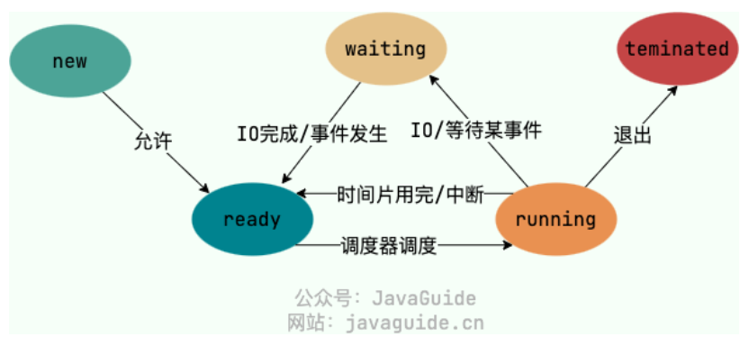

### 进程间的通信方式

* **管道/匿名管道(Pipes)** ：用于具有亲缘关系的父子进程间或者兄弟进程之间的通信。
* **有名管道(Named Pipes)** : 匿名管道由于没有名字，只能用于亲缘关系的进程间通信。为了克服这个缺点，提出了有名管道。有名管道严格遵循 **先进先出(First In First Out)** 。有名管道以磁盘文件的方式存在，可以实现本机任意两个进程通信。
* **信号(Signal)** ：信号是一种比较复杂的通信方式，用于通知接收进程某个事件已经发生；
* **消息队列(Message Queuing)** ：消息队列是消息的链表,具有特定的格式,存放在内存中并由消息队列标识符标识。管道和消息队列的通信数据都是先进先出的原则。与管道（无名管道：只存在于内存中的文件；命名管道：存在于实际的磁盘介质或者文件系统）不同的是消息队列存放在内核中，只有在内核重启(即，操作系统重启)或者显式地删除一个消息队列时，该消息队列才会被真正的删除。消息队列可以实现消息的随机查询,消息不一定要以先进先出的次序读取,也可以按消息的类型读取.比 FIFO 更有优势。消息队列克服了信号承载信息量少，管道只能承载无格式字节流以及缓冲区大小受限等缺点。
* **信号量(Semaphores)** ：信号量是一个计数器，用于多进程对共享数据的访问，信号量的意图在于进程间同步。这种通信方式主要用于解决与同步相关的问题并避免竞争条件。
* **共享内存(Shared memory)** ：使得多个进程可以访问同一块内存空间，不同进程可以及时看到对方进程中对共享内存中数据的更新。这种方式需要依靠某种同步操作，如互斥锁和信号量等。可以说这是最有用的进程间通信方式。
* **套接字(Sockets)** : 主要用于在客户端和服务器之间通过网络进行通信。套接字是支持 TCP/IP 的网络通信的基本操作单元，可以看做是不同主机之间的进程进行双向通信的端点，简单的说就是通信的两方的一种约定，用套接字中的相关函数来完成通信过程。

### 进程调度算法

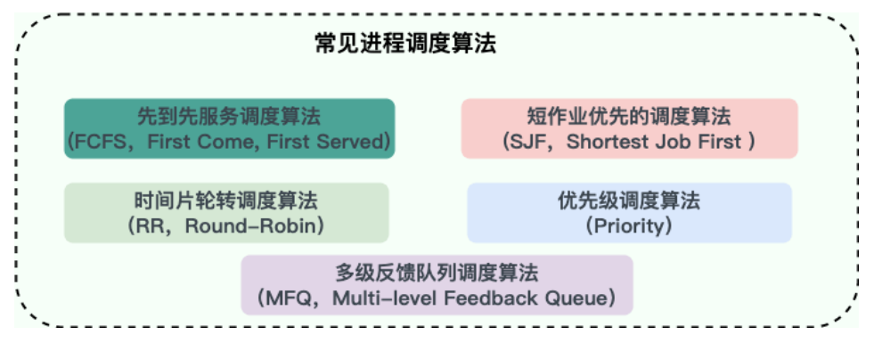

#### 非抢占式调度

这种方式下，一旦 CPU 分配给一个进程，它就会一直运行下去，直到任务完成或主动放弃（比如等待 I/O）。

* **先到先服务调度算法(FCFS，First Come, First Served)** :
  * 排队，谁先来谁先用。
  * 优点：公平、实现简单。
  * 缺点：如果一个很长的任务先到了，后面无数个短任务都得等着，这会导致平均等待时间很长，我们称之为“护航效应”。
* **短作业优先的调度算法(SJF，Shortest Job First)** :
  * 从就绪队列中选出一个估计运行时间最短的进程为之分配资源。
  * 优点：理论上，它的平均等待时间是最短的，吞吐量很高。
  * 缺点：它需要预测运行时间，这很难做到，而且可能会导致长作业“饿死”，永远得不到执行。(实际做不到)

#### 抢占式调度

操作系统可以强制剥夺当前进程的 CPU 使用权，分配给其他更重要的进程。现代操作系统基本都采用这种方式。

* **时间片轮转调度算法（RR，Round-Robin）** :
  * 最经典、最公平的抢占式算法。它给每个进程分配一个固定的时间片，用完了就把它放到队尾，切换到下一个进程。
  * 优点：非常适合分时系统，保证了每个进程都能得到响应
  * 缺点：但时间片的设置很关键：太长了退化成 FCFS，太短了则会导致过于频繁的上下文切换，增加系统开销。
* **优先级调度算法（Priority）** ：
  * 每个进程都有一个优先级，进程调度器总是选择优先级最高的进程，具有相同优先级的进程以 FCFS 方式执行。
  * 优点：灵活，可以根据内存要求，时间要求或任何其他资源要求来确定优先级
  * 缺点：可能导致低优先级进程“饿死”。

#### 多级反馈队列调度算法

* 结合了 RR 和优先级调度。
* 设置多个不同优先级的队列，每个队列使用 RR 调度，时间片大小也不同。新进程先进入最高优先级队列；如果在一个时间片内没执行完，就会被降级到下一个队列。
* 这样既照顾了短作业（在高优先级队列中快速完成），也保证了长作业不会饿死（最终会在低优先级队列中得到执行），是一种非常均衡的方案。

### 进程调度

负责进程调度的核心：**调度程序（Scheduler）** 和  **分派程序（Dispatcher）**

* **调度程序 (Scheduler):** 可以看作是决策者。当需要进行调度时，调度程序会被激活，它会根据预设的调度算法，从就绪队列中挑选出下一个应该占用 CPU 的进程。
* **分派程序 (Dispatcher)：** 可以看作是执行者。它负责完成具体的“交接”工作，也就是 **上下文切换** 。这个过程非常底层，主要包括：
  * 保存当前进程的上下文到其进程控制块（PCB）中。
  * 加载下一个被选中进程的上下文，从其 PCB 中读取状态，恢复到 CPU 寄存器。
  * 将 CPU 的控制权正式移交给新进程，让它开始运行。

## 死锁

### 死锁介绍

多个进程/线程同时被阻塞，它们中的一个或者全部都在等待某个资源被释放。由于进程/线程被无限期地阻塞，因此程序不可能正常终止。如：

* 线程 1 先拿到了锁 A，然后尝试去获取锁 B。
* 几乎同时，线程 2 拿到了锁 B，然后尝试去获取锁 A。

### 产生死锁的必要条件

* **互斥** ：资源必须处于非共享模式，一次只有一个进程可以使用。如果另一进程申请该资源，那么必须等待直到该资源被释放为止。
* **占有并等待** ：一个进程至少应该占有一个资源，并等待另一资源，而该资源被其他进程所占有。
* **非抢占** ：资源不能被抢占。只能在持有资源的进程完成任务后，该资源才会被释放。
* **循环等待** ：有一组等待进程 {P0, P1,..., Pn}， P0 等待的资源被 P1 占有，P1 等待的资源被 P2 占有，……，Pn-1 等待的资源被 Pn 占有，Pn 等待的资源被 P0 占有。

### 解决死锁的方法

* **死锁预防：** 通过编码规范来破坏条件。最经典的就是 **破坏循环等待** ，比如规定所有线程都必须**按相同的顺序**来获取锁（比如先 A 后 B），这样就不会形成环路。
* **死锁避免：** 在分配资源前进行预测，如果这次分配可能导致未来发生死锁，就拒绝分配。但这种方法开销很大，在通用系统中用得比较少。
* **死锁检测与解除：** 这是一种“事后补救”的策略，就像乐观锁。系统允许死锁发生，但会有一个后台线程（或机制）定期检测是否存在死锁环路（比如通过分析线程等待图）。一旦发现，就会采取措施解除，比如 **强制剥夺某个线程的资源或直接终止它** 。数据库系统中的死锁处理就常常采用这种方式。

#### 死锁预防

* 破坏四个必要条件中的任意一个就可以接触死锁
  * 破坏第一个：很多资源 **往往是不能同时访问的** ，所以这种做法在大多数的场合是行不通的。
  * 破坏第三个：剥夺式调度方法目前一般仅适用于 **主存资源** 和 **处理器资源** 的分配，并不适用于所有的资源，会导致 **资源利用率下降**
  * 因此主要考虑破坏第二个和第四个条件
* 静态分配策略
  * 破坏第二个条件（占有并等待）
  * 一个进程必须在执行前就申请到它所需要的全部资源，并且知道它所要的资源都得到满足之后才开始执行。
  * 优点：逻辑简单，实现容易
  * 缺点：严重降低资源利用率。在每个进程所占有的资源中，有些资源是在比较靠后的执行时间里采用的，甚至有些资源是在额外的情况下才使用的，这样就可能造成一个进程占有了一些 **几乎不用的资源而使其他需要该资源的进程产生等待** 的情况。
* 层次分配策略
  * 破坏第四个条件（循环等待）
  * 所有的资源被分成了多个层次，一个进程得到某一次的一个资源后，它只能再申请较高一层的资源；当一个进程要释放某层的一个资源时，必须先释放所占用的较高层的资源

#### 死锁避免

* 死锁预防会降低进程和资源使用效率
* 死锁避免允许系统中**同时存在四个必要条件**
* 只要掌握并发进程中与每个进程有关的资源动态申请情况，做出 **明智和合理的选择** ，仍然可以避免死锁，因为四大条件仅仅是产生死锁的必要条件。
* 将系统分为**安全状态和不安全状态**
  * 安全状态：系统能保证所有进程在有限时间内得到需要的全部资源。不安全状态反之
  * 系统在安全状态下不会产生死锁
* **银行家算法** 通过先 **试探** 分配给该进程资源，然后通过 **安全性算法** 判断分配后系统是否处于安全状态，若不安全则试探分配作废，让该进程继续等待，若能够进入到安全的状态，则就  **真的分配资源给该进程** 。
* 优点：改善了资源利用率低的问题
* 缺点：要不断检测每个进程对资源的占用和申请情况，以及做 **安全性检查** ，需要花费较多的时间。

#### 死锁检测

死锁检测对资源的分配不加以限制，也不采取死锁避免措施，但系统 **定时地运行一个 “死锁检测”** 的程序，判断系统内是否出现死锁，如果检测到系统发生了死锁，再采取措施去解除它。

##### 进程-资源分配图

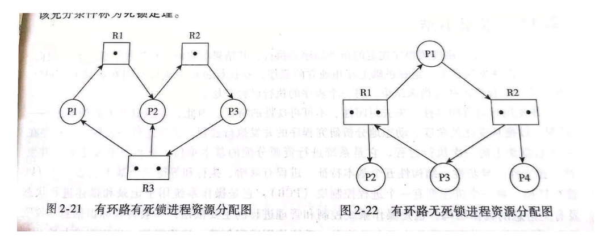

* 方框表示资源类，方框黑点表示资源，圆圈表示进程
* 检测死锁步骤
  * 图中无环路：无死锁
  * 图中有环路，且每个资源类只有一个资源：有死锁
  * 图中有环路，涉及到的资源类有多个资源，不一定死锁

#### 死锁解除

存在死锁发生时，解除死锁状态：

* **立即结束所有进程的执行，重新启动操作系统** ：简单，但以前所在的工作全部作废，损失很大。
* **撤销涉及死锁的所有进程，解除死锁后继续运行** ：能彻底打破**死锁的循环等待**条件，但将付出很大代价，例如有些进程可能已经计算了很长时间，由于被撤销而使产生的部分结果也被消除了，再重新执行时还要再次进行计算。
* **逐个撤销涉及死锁的进程，回收其资源直至死锁解除。**
* **抢占资源** ：从涉及死锁的一个或几个进程中抢占资源，把夺得的资源再分配给涉及死锁的进程直至死锁解除。

## 内存管理

### 内存管理的主要工作

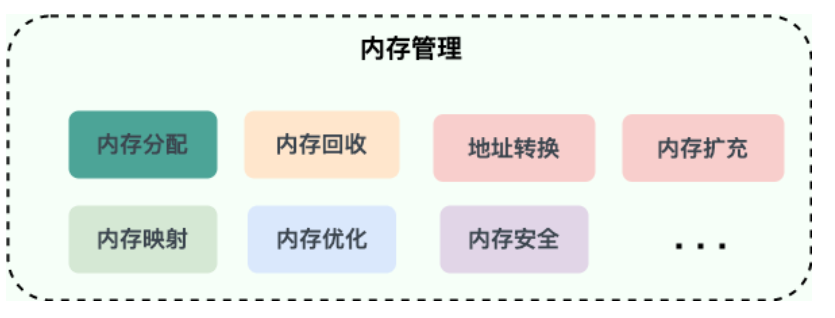

* **内存的分配与回收** ：对进程所需的内存进行分配和释放
  * malloc 函数：申请内存，free 函数：释放内存。
* **地址转换** ：将程序中的虚拟地址转换成内存中的物理地址。
* **内存扩充** ：当系统没有足够的内存时，利用虚拟内存技术或自动覆盖技术，从逻辑上扩充内存。
* **内存映射** ：将一个文件直接映射到进程的进程空间中，这样可以通过内存指针用读写内存的办法直接存取文件内容，速度更快。
* **内存优化** ：通过调整内存分配策略和回收算法来优化内存使用效率。
* **内存安全** ：保证进程之间使用内存互不干扰，避免一些恶意程序通过修改内存来破坏系统的安全性。

### 内存碎片

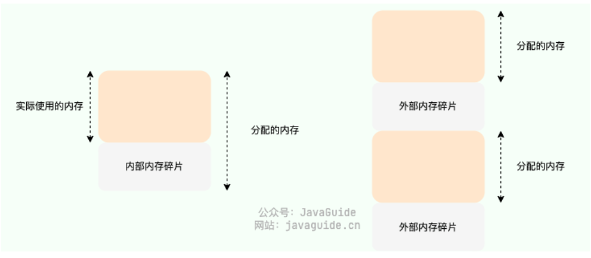

* **内部内存碎片(Internal Memory Fragmentation)** ：已经分配给进程使用但未被使用的内存。导致内部内存碎片的主要原因是，当采用固定比例比如 2 的幂次方进行内存分配时，进程所分配的内存可能会比其实际所需要的大。
* **外部内存碎片(External Memory Fragmentation)** ：由于未分配的连续内存区域太小，以至于不能满足任意进程所需要的内存分配请求，这些小片段且不连续的内存空间被称为外部碎片。也就是说，外部内存碎片指的是那些并未分配给进程但又不能使用的内存。

### 内存管理方式

#### 连续内存管理

块式管理，存在严重的内部内存碎片问题

* 将内存分为几个固定大小的块，每个块只包含一个进程
* 伙伴系统算法
  * 将内存按 2 的幂次划分，并将相邻的内存块组合成一对伙伴
  * 当进行内存分配时，尝试找到最合适的内存块：如果找到的内存块过大，就将其一分为二，分成两个大小相等的伙伴块。如果还是大的话，就继续切分
  * 假设两块相邻的内存块都被释放，系统会将这两个内存块合并，进而形成一个更大的内存块，以便后续的内存分配。
  * 存在内部内存碎片问题

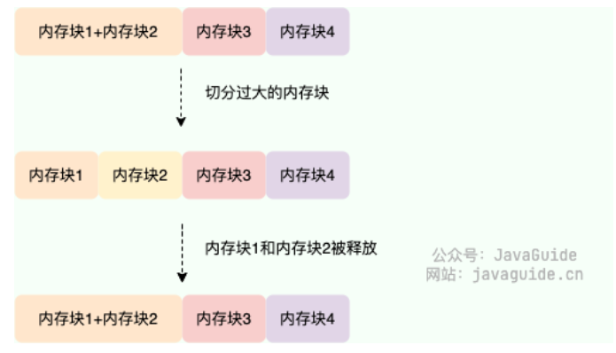

#### 非连续内存管理

* **段式管理** ：以段(一段连续的物理内存)的形式管理/分配物理内存。应用程序的虚拟地址空间被分为大小不等的段，段是有实际意义的，每个段定义了一组逻辑信息，例如有主程序段 MAIN、子程序段 X、数据段 D 及栈段 S 等。
* **页式管理** ：把物理内存分为连续等长的物理页，应用程序的虚拟地址空间也被划分为连续等长的虚拟页，是现代操作系统广泛使用的一种内存管理方式。
* **段页式管理机制** ：结合了段式管理和页式管理的一种内存管理机制，把物理内存先分成若干段，每个段又继续分成若干大小相等的页。

### 虚拟内存

**虚拟内存(Virtual Memory)** 本质上来说它只是逻辑存在的，假想出来的内存空间，主要作用是作为进程访问主存（物理内存）的桥梁并简化内存管理。

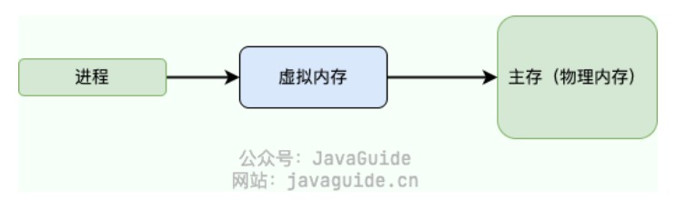

#### 虚拟内存作用

* **隔离进程** ：物理内存通过虚拟地址空间访问，虚拟地址空间与进程一一对应。每个进程都认为自己拥有了整个物理内存，进程之间彼此隔离，一个进程中的代码无法更改正在由另一进程或操作系统使用的物理内存。
* **提升物理内存利用率** ：有了虚拟地址空间后，操作系统只需要将进程当前正在使用的部分数据或指令加载入物理内存。
* **简化内存管理** ：程序员不用和真正的物理内存打交道，而是借助虚拟地址空间访问物理内存，从而简化了内存管理。
* **多个进程共享物理内存** ：进程在运行过程中，会加载许多操作系统的动态库。这些库对于每个进程而言都是公用的，它们在内存中实际只会加载一份，这部分称为共享内存。
* **提高内存使用安全性** ：控制进程对物理内存的访问，隔离不同进程的访问权限，提高系统的安全性。
* **提供更大的可使用内存空间** ：可以让程序拥有超过系统物理内存大小的可用内存空间。这是因为当物理内存不够用时，可以利用磁盘充当，将物理内存页保存到磁盘文件（会影响读写速度），数据或代码页会根据需要在物理内存与磁盘之间移动。

#### 没有虚拟内存存在的问题

* 用户程序可以访问任意物理内存，可能会不小心操作到系统运行必需的内存，进而造成操作系统崩溃，严重影响系统的安全。
* 同时运行多个程序容易崩溃。比如你想同时运行一个微信和一个 QQ 音乐，微信在运行的时候给内存地址 1xxx 赋值后，QQ 音乐也同样给内存地址 1xxx 赋值，那么 QQ 音乐对内存的赋值就会覆盖微信之前所赋的值，这就可能会造成微信这个程序会崩溃。
* 程序运行过程中使用的所有数据或指令都要载入物理内存，根据局部性原理，其中很大一部分可能都不会用到，白白占用了宝贵的物理内存资源。

#### 虚拟地址和物理地址

* 物理地址：物理内存（地址寄存器）中的地址
* 虚拟地址：程序访问的内存地址
* 地址翻译/地址转换：操作系统通过 CPU 中的内存管理单元 MMU 将虚拟地址转化为物理地址
* 虚拟地址空间：虚拟地址的集合，是虚拟内存的范围。每一个进程都有一个一致且私有的虚拟地址空间。
* 物理地址空间：物理地址的集合，是物理内存的范围。
* MMU 翻译地址的机制：分页机制、分段机制、段页机制

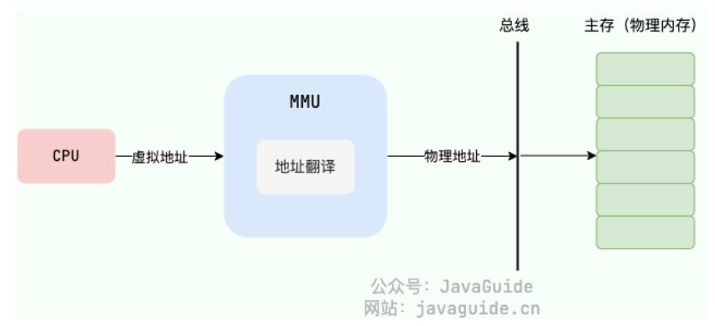

### 分段机制

* 以段的形式管理/分配物理内存，每个段定义了一组逻辑信息（比如主程序段，子程序段，数据段，栈段等）
* 通过段表映射虚拟地址和物理地址
* 分段机制的虚拟地址
  * **段号** ：标识着该虚拟地址属于整个虚拟地址空间中的哪一个段。
  * **段内偏移量** ：相对于该段起始地址的偏移量。
* 地址翻译过程
  * MMU 解析得到虚拟地址段号
  * 通过段号从段表中取出对应段信息
  * 从段信息去除该段的起始地址加上虚拟地址中的段内偏移量，得到最终物理地址
* 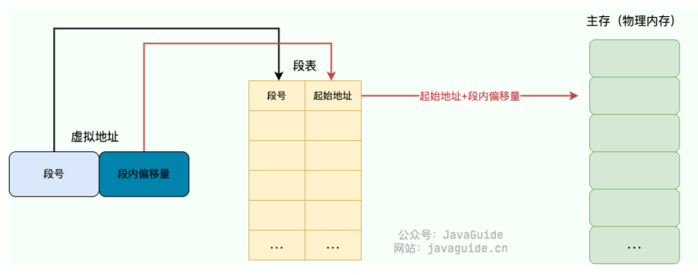
* 分段机制会导致外部碎片

### 分页机制

* 把主存分为**连续等长**的物理页，应用程序的虚拟地址空间划也被分为连续等长的虚拟页。现代操作系统广泛采用分页机制。
* 程序虚拟地址空间中的任意虚拟页可以被映射到物理内存中的任意物理页上，因此可以实现物理内存资源的离散分配。

#### 页表

* 分页机制通过页表映射虚拟地址和物理地址
* 分页机制的虚拟地址

  * **页号** ：通过虚拟页号可以从页表中取出对应的物理页号；
  * **页内偏移量** ：物理页起始地址+页内偏移量=物理内存地址。
* 地址翻译过程

  * MMU 解析得到虚拟地址页号
  * 通过虚拟页号从页表中取出对应物理页号
  * 用该物理页号对应的物理页起始地址加上虚拟地址中的页内偏移量得到最终的物理地址。

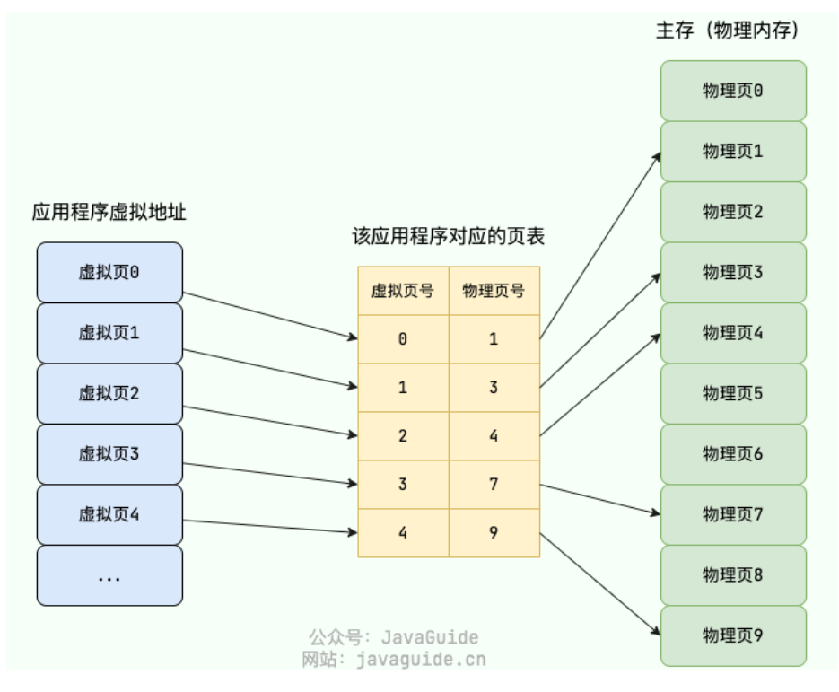

#### 单级页表与多级页表

* 单极页表存在比较严重的浪费
* 引入二级页表，利用增加页表查询次数减少页表占用空间（时间换空间）

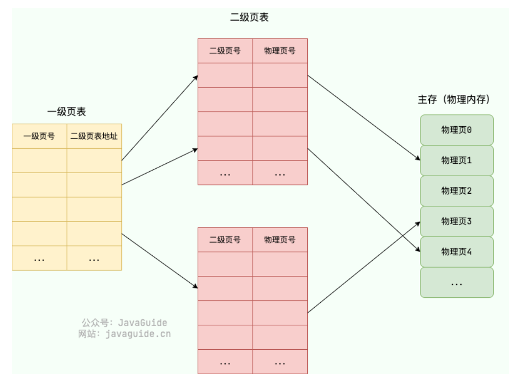

#### TLB介绍

* TLB：快表，**转址旁路缓存**
* 主流体系下。TLB本质是高速缓存，可以简单看作存储键（虚拟页号）值（物理页号）对的哈希表
* 使用 TLB 之后的地址翻译流程是这样的：
  * 用虚拟地址中的虚拟页号作为 key 去 TLB 中查询；
  * 如果能查到对应的物理页的话，就不用再查询页表了，这种情况称为 TLB 命中（TLB hit)。
  * 如果不能查到对应的物理页的话，还是需要去查询主存中的页表，同时将页表中的该映射表项添加到 TLB 中，这种情况称为 TLB 未命中（TLB miss)。
  * 当 TLB 填满后，又要登记新页时，就按照一定的淘汰策略淘汰掉快表中的一个页。
* 没有 TLB 之前，每次读写内存数据时 CPU 要访问两次主存。有了 TLB 之后，对于存在于 TLB 中的页表数据只需要访问一次主存即可。（省略了读）

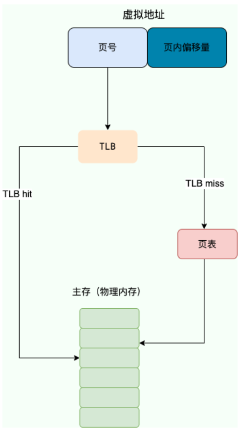

#### 换页机制

* 当物理内存不够用的时候，操作系统选择将一些物理页的内容放到磁盘上去，等要用到的时候再将它们读取到物理内存中（时间换空间）
* 操作系统中所有进程运行所需的物理内存即使比真实的物理内存要大一些，这些进程也是可以正常运行的，只是运行速度会变慢。

#### 页缺失

* 概念：软件试图访问已映射在虚拟地址空间中，但目前并未加载在物理内存中的分页
* 分类
  * **硬性页缺失（Hard Page Fault）** ：物理内存中没有对应的物理页。于是，Page Fault Handler 会指示 CPU 从已经打开的磁盘文件中读取相应的内容到物理内存，而后交由 MMU 建立相应的虚拟页和物理页的映射关系。
  * **软性页缺失（Soft Page Fault）** ：物理内存中有对应的物理页，但虚拟页还未和物理页建立映射。于是，Page Fault Handler 会指示 MMU 建立相应的虚拟页和物理页的映射关系。
  * 无效页缺失：程序访问的是无效的物理内存

#### 页面置换算法

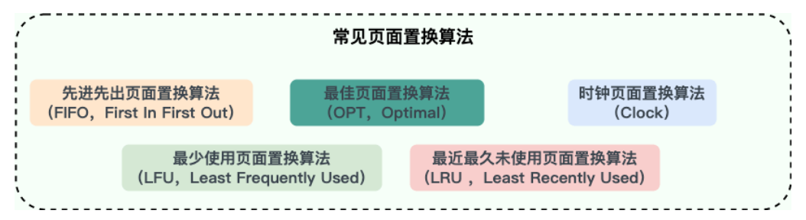

* 发生硬性页缺失时，如果物理内存中没有空闲的物理页面可用的话。操作系统就必须将物理内存中的一个物理页淘汰出去，腾出空间来加载新的页面。
* 页面置换算法：选择淘汰哪一个物理页的规则
* 页缺失太频繁的发生会非常影响性能， 好的页面置换算法应该是可以减少页缺失出现的次数。
* **最佳页面置换算法（OPT，Optimal）** ：优先选择淘汰的页面是以后永不使用的，或者是在最长时间内不再被访问的页面，这样可以保证获得最低的缺页率。但由于目前无法预知进程在内存下的若干页面中哪个是未来最长时间内不再被访问的，因而该算法无法实现，只是理论最优的页面置换算法，可以作为衡量其他置换算法优劣的标准。
* **先进先出页面置换算法（FIFO，First In First Out）** : 总是淘汰最先进入内存的页面，即选择在内存中驻留时间最久的页面进行淘汰。该算法易于实现和理解，一般只需要通过一个 FIFO 队列即可满足需求。不过性能并不是很好。
* **最近最久未使用页面置换算法（LRU ，Least Recently Used）** ：LRU 算法赋予每个页面一个访问字段，用来记录一个页面自上次被访问以来所经历的时间 T，当须淘汰一个页面时，选择现有页面中其 T 值最大的，即最近最久未使用的页面予以淘汰。LRU 算法是根据各页之前的访问情况来实现，因此是易于实现的。
* **最少使用页面置换算法（LFU，Least Frequently Used）** : 和 LRU 算法比较像，不过该置换算法选择的是之前一段时间内使用最少的页面作为淘汰页。
* **时钟页面置换算法（Clock）** ：可以认为是一种最近未使用算法，即逐出的页面都是最近没有使用的那个。

### 段页机制

结合了段式管理和页式管理的一种内存管理机制。程序视角中，内存被划分为多个逻辑段，每个逻辑段进一步被划分为固定大小的页。

在段页式机制下，地址翻译的过程分为两个步骤：

1. **段式地址映射（虚拟地址 → 线性地址）：**
   * 虚拟地址 = 段选择符（段号）+ 段内偏移。
   * 根据段号查段表，找到段基址，加上段内偏移得到线性地址。
2. **页式地址映射（线性地址 → 物理地址）：**
   * 线性地址 = 页号 + 页内偏移。
   * 根据页号查页表，找到物理页框号，加上页内偏移得到物理地址。

### 局部性原理

* 在程序执行过程中，数据和指令的访问存在一定的空间和时间上的局部性特点。
* **时间局部性** ：由于程序中存在一定的循环或者重复操作，因此会反复访问同一个页或一些特定的页。利用时间局部性，分页机制中通常采用缓存机制来提高页面的命中率，即**将最近访问过的一些页放入缓存中**，如果下一次访问的页已经在缓存中，就不需要再次访问内存，而是直接从缓存中读取。
* **空间局部性** ：由于程序中数据和指令的访问通常是具有一定的空间连续性的，因此当访问某个页时，往往会顺带访问其相邻的一些页。利用空间局部性，分页机制中通常**采用预取技术来预先将相邻的一些页读入内存缓存中**，以便在未来访问时能够直接使用，从而提高访问速度。

## 文件系统

### 文件系统主要工作

文件系统主要负责管理和组织计算机存储设备上的文件和目录，其功能包括以下几个方面：

1. **存储管理** ：将文件数据存储到物理存储介质中，并且管理空间分配，以确保每个文件都有足够的空间存储，并避免文件之间发生冲突。
2. **文件管理** ：文件的创建、删除、移动、重命名、压缩、加密、共享等等。
3. **目录管理** ：目录的创建、删除、移动、重命名等等。
4. **文件访问控制** ：管理不同用户或进程对文件的访问权限，以确保用户只能访问其被授权访问的文件，以保证文件的安全性和保密性。

### 硬链接和软链接

文件链接（File Link）是一种特殊的文件类型，可以在文件系统中指向另一个文件。

#### 硬链接

* 在 Linux文件系统中，每个文件和目录都有一个唯一的索引节点（inode）号，用来标识该文件或目录。硬链接通过 inode 节点号建立连接，硬链接和源文件的 inode 节点号相同，两者对文件系统来说是完全平等的（可以看作是互为硬链接，源头是同一份文件），删除其中任何一个对另外一个没有影响，可以通过给文件设置硬链接文件来防止重要文件被误删。
* 只有删除了源文件和所有对应的硬链接文件，该文件才会被真正删除。
* 硬链接具有一些限制，不能对目录以及不存在的文件创建硬链接，并且，硬链接也不能跨越文件系统。
* `ln` 命令用于创建硬链接。

#### 软链接

* 软链接和源文件的 inode 节点号不同，而是指向一个文件路径。
* 源文件删除后，软链接依然存在，但是指向的是一个无效的文件路径。
* 软连接类似于 Windows 系统中的快捷方式。
* 不同于硬链接，可以对目录或者不存在的文件创建软链接，并且，软链接可以跨越文件系统。
* `ln -s` 命令用于创建软链接。

### 提高文件系统性能

* **化硬件** ：使用高速硬件设备替代传统的机械硬盘，使用 RAID（Redundant Array of Independent Disks）等技术提高磁盘性能。
* **选择合适的文件系统选型** ：不同的文件系统具有不同的特性，对于不同的应用场景选择合适的文件系统可以提高系统性能。
* **运用缓存** ：访问磁盘的效率比较低，可以运用缓存来减少磁盘的访问次数。
* **避免磁盘过度使用** ：注意磁盘的使用率，避免将磁盘用满，尽量留一些剩余空间，以免对文件系统的性能产生负面影响。
* **对磁盘进行合理的分区** ：合理的磁盘分区方案，能够使文件系统在不同的区域存储文件，从而减少文件碎片，提高文件读写性能。

### 磁盘调度算法

* 一次磁盘读写操作的时间由磁盘寻道时间、延迟时间和传输时间决定。磁盘调度算法可以通过改变到达磁盘请求的处理顺序，减少磁盘寻道时间和延迟时间。
* **先来先服务算法（First-Come First-Served，FCFS）** ：按照请求到达磁盘调度器的顺序进行处理，先到达的请求的先被服务。
  * 优点：实现起来比较简单，不存在算法开销。
  * 缺点：没有考虑磁头移动的路径和方向，平均寻道时间较长。同时，该算法容易出现饥饿问题，即一些后到的磁盘请求可能需要等待很长时间才能得到服务。
* **最短寻道时间优先算法（Shortest Seek Time First，SSTF）**：优先选择距离当前磁头位置最近的请求进行服务。
  * 优点：最小化磁头的寻道时间
  * 缺点：容易出现饥饿问题，即磁头附近的请求不断被服务，远离磁头的请求长时间得不到响应。
* **扫描算法（SCAN）** ：也被称为电梯（Elevator）算法，基本思想和电梯非常类似。磁头沿着一个方向扫描磁盘，如果经过的磁道有请求就处理，直到到达磁盘的边界，然后改变移动方向，依此往复。
  * 优点：能够保证所有的请求得到服务，解决了饥饿问题。
  * 缺点：如果磁头从一个方向刚扫描完，请求才到的话。这个请求就需要等到磁头从相反方向过来之后才能得到处理。
* **循环扫描算法（Circular Scan，C-SCAN）** ：SCAN 算法的变体，只在磁盘的一侧进行扫描，并且只按照一个方向扫描，直到到达磁盘边界，然后回到磁盘起点，重新开始循环。
* **边扫描边观察算法（LOOK）** ：SCAN 算法中磁头到了磁盘的边界才改变移动方向，这样可能会做很多无用功，因为磁头移动方向上可能已经没有请求需要处理了。LOOK 算法对 SCAN 算法进行了改进，如果磁头移动方向上已经没有别的请求，就可以立即改变磁头移动方向，依此往复。也就是边扫描边观察指定方向上还有无请求，因此叫 LOOK。
* **均衡循环扫描算法（C-LOOK）** ：C-SCAN 只有到达磁盘边界时才能改变磁头移动方向，并且磁头返回时也需要返回到磁盘起点，这样可能会做很多无用功。C-LOOK 算法对 C-SCAN 算法进行了改进，如果磁头移动的方向上已经没有磁道访问请求了，就可以立即让磁头返回，并且磁头只需要返回到有磁道访问请求的位置即可。
