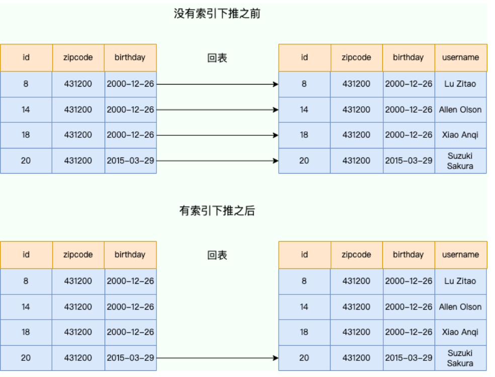
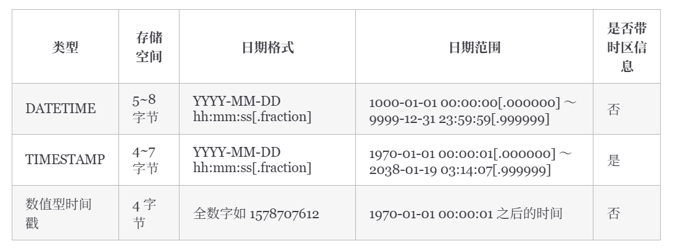

# SQL基础语法

## SQL语法

### SQL语法结构

<pre class="vditor-reset" placeholder="" contenteditable="true" spellcheck="false"><p data-block="0"></p></pre>

SQL 语法结构包括：

* **`子句`** - 是语句和查询的组成成分。（在某些情况下，这些都是可选的。）
* **`表达式`** - 可以产生任何标量值，或由列和行的数据库表
* **`谓词`** - 给需要评估的 SQL 三值逻辑（3VL）（true/false/unknown）或布尔真值指定条件，并限制语句和查询的效果，或改变程序流程。
* **`查询`** - 基于特定条件检索数据。这是 SQL 的一个重要组成部分。
* **`语句`** - 可以持久地影响纲要和数据，也可以控制数据库事务、程序流程、连接、会话或诊断。

## 子查询

子查询常用在 `WHERE` 子句和 `FROM` 子句后边：

```sql
select column_name [, column_name ]
from   table1 [, table2 ]
where  column_name operator
    (select column_name [, column_name ]
    from table1 [, table2 ]
    [where])
```

```sql
select column_name [, column_name ]
from (select column_name [, column_name ]
      from table1 [, table2 ]
      [where]) as temp_table_name
where  condition
```

## 连接

### **`join ON` 和 `WHERE` 的区别**

* 连接表时，SQL 会根据连接条件生成一张新的临时表。`ON` 就是连接条件，它决定临时表的生成。
* `WHERE` 是在临时表生成以后，再对临时表中的数据进行过滤，生成最终的结果集，这个时候已经没有 JOIN-ON 了。

所以总结来说就是： **SQL 先根据 ON 生成一张临时表，然后再根据 WHERE 对临时表进行筛选** 。

## 组合

`UNION` 基本规则：

* 所有查询的列数和列顺序必须相同。
* 每个查询中涉及表的列的数据类型必须相同或兼容。
* 通常返回的列名取自第一个查询。

`JOIN` vs `UNION`：

* `JOIN` 中连接表的列可能不同，但在 `UNION` 中，所有查询的列数和列顺序必须相同。
* `UNION` 将查询之后的行放在一起（垂直放置），但 `JOIN` 将查询之后的列放在一起（水平放置），即它构成一个笛卡尔积。

## 索引

## 约束

## 事务处理

不能回退 `SELECT` 语句，回退 `SELECT` 语句也没意义；也不能回退 `CREATE` 和 `DROP` 语句。

 **MySQL 默认是隐式提交** ，每执行一条语句就把这条语句当成一个事务然后进行提交。当出现 `START TRANSACTION` 语句时，会关闭隐式提交；当 `COMMIT` 或 `ROLLBACK` 语句执行后，事务会自动关闭，重新恢复隐式提交。

指令：

* `START TRANSACTION` - 指令用于标记事务的起始点。
* `SAVEPOINT` - 指令用于创建保留点。
* `ROLLBACK TO` - 指令用于回滚到指定的保留点；如果没有设置保留点，则回退到 `START TRANSACTION` 语句处。
* `COMMIT` - 提交事务。

## 权限控制

# MySQL

## MySQL字段类型

### 整数类型unsigned作用

* 不允许负值的无符号整数。使用 UNSIGNED 属性可以将正整数的上限提高一倍
* 对于从 0 开始递增的 ID 列，使用 UNSIGNED 属性可以非常适合

### varchar(10)和varchar(100)

* 二者存储相同的字符串，所占用磁盘的存储空间其实是一样的
* VARCHAR(100) 会消耗更多的内存。这是因为 VARCHAR 类型在内存中操作时，通常会分配固定大小的内存块来保存值，即使用字符类型中定义的长度。

### decimal和float/double

* DECIMAL 是定点数，FLOAT/DOUBLE 是浮点数。DECIMAL 可以存储精确的小数值，FLOAT/DOUBLE 只能存储近似的小数值。
* DECIMAL 用于存储具有精度要求的小数，例如与货币相关的数据，可以避免浮点数带来的精度损失。

### datetime和timestamp

* DATETIME 类型没有时区信息，TIMESTAMP 和时区有关。
* TIMESTAMP 只需要使用 4 个字节的存储空间，但是 DATETIME 需要耗费 8 个字节的存储空间。
* Timestamp 表示的时间范围更小。

### NULL和''

* 含义

  * `NULL` 代表一个不确定的值，它不等于任何值，包括它自身。因此，`SELECT NULL = NULL` 的结果是 `NULL`，而不是 `true` 或 `false`。 `NULL` 意味着缺失或未知的信息。虽然 `NULL` 不等于任何值，但在某些操作中，数据库系统会将 `NULL` 值视为相同的类别进行处理，例如：`DISTINCT`,`GROUP BY`,`ORDER BY`。需要注意的是，这些操作将 `NULL` 值视为相同的类别进行处理，并不意味着 `NULL` 值之间是相等的。 它们只是在特定操作中被特殊处理，以保证结果的正确性和一致性。 这种处理方式是为了方便数据操作，而不是改变了 `NULL` 的语义。
  * `''` 表示一个空字符串，它是一个已知的值。
* 比较运算
* * 任何值与 `NULL` 进行比较（例如 `=`, `!=`, `>`, `<` 等）的结果都是 `NULL`，表示结果不确定。要判断一个值是否为 `NULL`，必须使用 `IS NULL` 或 `IS NOT NULL`。
  * `''` 可以像其他字符串一样进行比较运算。例如，`'' = ''` 的结果是 `true`。
* 聚合函数：

  * 大多数聚合函数（例如 `SUM`, `AVG`, `MIN`, `MAX`）会忽略 `NULL` 值。
  * `COUNT(*)` 会统计所有行数，包括包含 `NULL` 值的行。`COUNT(列名)` 会统计指定列中非 `NULL` 值的行数。
  * 空字符串 `''` 会被聚合函数计算在内。例如，`SUM` 会将其视为 0，`MIN` 和 `MAX` 会将其视为一个空字符串

### MySQL没有boolean类型，使用 `tinyint`表示

### 手机号存储用 int 还是 varchar

**推荐使用varchar**


## MySQL基础架构

* MySQL 可以简单分为 Server 层和存储引擎层这两层。Server 层处理查询解析、分析、优化、缓存以及与客户端的交互等操作，而存储引擎层负责数据的存储和读取，MySQL 支持 InnoDB、MyISAM、Memory 等多种存储引擎。


* 主要构成：
  * **连接器：** 身份认证和权限相关(登录 MySQL 的时候)。
  * **查询缓存：** 执行查询语句的时候，会先查询缓存（MySQL 8.0 版本后移除，因为这个功能不太实用）。
  * **分析器：** 没有命中缓存的话，SQL 语句就会经过分析器，分析器说白了就是要先看你的 SQL 语句要干嘛，再检查你的 SQL 语句语法是否正确。
  * **优化器：** 按照 MySQL 认为最优的方案去执行。
  * **执行器：** 执行语句，然后从存储引擎返回数据。 执行语句之前会先判断是否有权限，如果没有权限的话，就会报错。
  * **插件式存储引擎** ：主要负责数据的存储和读取，采用的是插件式架构，支持 InnoDB、MyISAM、Memory 等多种存储引擎。InnoDB 是 MySQL 的默认存储引擎，绝大部分场景使用 InnoDB 就是最好的选择。

### Server层

主要包括连接器、查询缓存、分析器、优化器、执行器等，所有跨存储引擎的功能都在这一层实现，比如存储过程、触发器、视图，函数等，还有一个通用的日志模块 binlog 日志模块。

* 连接器：进行用户的身份认证，包括校验账户密码，权限等操作。后续只要这个连接不断开，即使管理员修改了该用户的权限，该用户也是不受影响的
* 查询缓存
* 分析器：
  * 词法分析：提取关键字，如select、表、字段名等
  * 语法分析：判断SQL语句是否正确

## SQL语句在MySQL的执行过程

### 查询语句

```sql
select * from tb_student  A where A.age='18' and A.name=' 张三 ';
```

* 查询语句的执行流程如下：权限校验（如果命中缓存）--->查询缓存--->分析器--->优化器--->权限校验--->执行器--->引擎
  * 查询权限
  * （MySQL 8.0 之前）查询缓存
  * 分析器、优化器
  * 进行权限校验，如果没有权限就会返回错误信息
  * 如果有权限就会调用数据库引擎接口，返回引擎的执行结果。

### 更新语句

* 更新语句执行流程如下：分析器---->权限校验---->执行器--->引擎---redo log(prepare 状态)--->binlog--->redo log(commit 状态)

## MySQL索引

### 优缺点

* 优点
  * 提高查询速度
  * 保证数据唯一性：唯一索引
  * 加速排序和分组：`order by`和 `group by`
* 缺点
  * 创建、维护耗时
  * 占用存储空间
  * 设计不当**可能被误用或失效**
* 索引不一定能提高查询性能
  * 数据量太小
  * 查询结果集占比过大（比如超过20%-30%），优化器可能会认为全表扫描更划算
  * 索引维护不当

### MySQL和InnoDB索引区别

* MyISAM 引擎中，B+Tree 叶节点的 data 域存放的是数据记录的地址。在索引检索的时候，首先按照 B+Tree 搜索算法搜索索引，如果指定的 Key 存在，则取出其 data 域的值，然后以 data 域的值为地址读取相应的数据记录。这被称为“ **非聚簇索引（非聚集索引）** ”。
* InnoDB 引擎中，其数据文件本身就是索引文件。相比 MyISAM，索引文件和数据文件是分离的，其表数据文件本身就是按 B+Tree 组织的一个索引结构，树的叶节点 data 域保存了完整的数据记录。这个索引的 key 是数据表的主键，因此 InnoDB 表数据文件本身就是主索引。这被称为“ **聚簇索引（聚集索引）** ”，而其余的索引都作为  **辅助索引** ，辅助索引的 data 域存储相应记录主键的值而不是地址，这也是和 MyISAM 不同的地方。在根据主索引搜索时，直接找到 key 所在的节点即可取出数据；在根据辅助索引查找时，则需要先取出主键的值，再走一遍主索引。
* 因此，在设计表的时候，不建议使用过长的字段作为主键，也不建议使用非单调的字段作为主键，这样会造成主索引频繁分裂。

### 索引类型

按照应用维度划分：

* 主键索引：加速查询 + 列值唯一（不可以有 NULL）+ 表中只有一个。
* 普通索引：仅加速查询。
* 唯一索引：加速查询 + 列值唯一（可以有 NULL）。
* 覆盖索引：一个索引包含（或者说覆盖）所有需要查询的字段的值。
* 联合索引：多列值组成一个索引，专门用于组合搜索，其效率大于索引合并。
* 全文索引：对文本的内容进行分词，进行搜索。目前只有 `CHAR`、`VARCHAR`、`TEXT` 列上可以创建全文索引。一般不会使用，效率较低，通常使用搜索引擎如 ElasticSearch 代替。
* 前缀索引：对文本的前几个字符创建索引，相比普通索引建立的数据更小，因为只取前几个字符。

MySQL 8.x 中实现的索引新特性：

* 隐藏索引：也称为不可见索引，不会被优化器使用，但是仍然需要维护，通常会软删除和灰度发布的场景中使用。主键不能设置为隐藏（包括显式设置或隐式设置）。
* 降序索引：之前的版本就支持通过 desc 来指定索引为降序，但实际上创建的仍然是常规的升序索引。直到 MySQL 8.x 版本才开始真正支持降序索引。另外，在 MySQL 8.x 版本中，不再对 GROUP BY 语句进行隐式排序。
* 函数索引：从 MySQL 8.0.13 版本开始支持在索引中使用函数或者表达式的值，也就是在索引中可以包含函数或者表达式。

### 聚集索引和非聚集索引

* 聚集索引优缺点：
  * 优点：
    * **查询速度非常快**
    * **对排序查找和范围查找优化**
  * 缺点：
    * **依赖于有序的数据**
    * **更新代价大**
* 非聚集索引优缺点：
  * 优点：

    * 更新代价比聚簇索引要小
  * 缺点：

    * **依赖于有序的数据**
    * **可能会二次查询（回表）** ：当查到索引对应的指针或主键后，可能还需要根据指针或主键再到数据文件或表中查询。

### 覆盖索引和联合索引

* 覆盖索引：一个索引包含（或者说覆盖）所有需要查询的字段的值
* 联合索引：使用表中的多个字段创建索引

### 最左前缀匹配

* MySQL 会根据索引中的字段顺序，从左到右依次匹配查询条件中的字段。如果查询条件与索引中的最左侧字段相匹配，那么 MySQL 就会使用索引来过滤数据，这样可以提高查询效率。
* 最左匹配原则会一直向右匹配，直到遇到范围查询（如 >、<）为止。对于 >=、<=、BETWEEN 以及前缀匹配 LIKE 的范围查询，不会停止匹配
* 如果有索引 `联合索引（a，b，c）`，查询 `a=1 AND c=1` 会走索引么？`c=1` 呢？`b=1 AND c=1` 呢？ `b = 1 AND a = 1 AND c = 1` 呢？
  * 查询 `a=1 AND c=1`：根据最左前缀匹配原则，查询可以使用索引的前缀部分。因此，该查询仅在 `a=1` 上使用索引，然后对结果进行 `c=1` 的过滤。
  * 查询 `c=1`：由于查询中不包含最左列 `a`，根据最左前缀匹配原则，整个索引都无法被使用。
  * 查询 `b=1 AND c=1`：和第二种一样的情况，整个索引都不会使用。
  * 查询 `b=1 AND a=1 AND c=1`：这个查询是可以用到索引的。查询优化器分析 SQL 语句时，对于联合索引，会对查询条件进行重排序，以便用到索引。会将 `b=1` 和 `a=1` 的条件进行重排序，变成 `a=1 AND b=1 AND c=1`。

### 索引下推

#### 介绍

* **索引下推（Index Condition Pushdown，简称 ICP）** 允许存储引擎在索引遍历过程中，执行部分 `WHERE` 字句的判断条件，直接过滤掉不满足条件的记录，从而减少回表次数，提高查询效率。
* 将部分上层（Server 层）负责的事情，交给了下层（存储引擎层）去处理。



#### 实例

```sql
CREATE TABLE `user` (
  `id` int NOT NULL AUTO_INCREMENT,
  `username` varchar(20) CHARACTER SET utf8mb4 COLLATE utf8mb4_0900_ai_ci NOT NULL,
  `zipcode` varchar(20) CHARACTER SET utf8mb4 COLLATE utf8mb4_0900_ai_ci NOT NULL,
  `birthdate` date NOT NULL,
  PRIMARY KEY (`id`),
  KEY `idx_username_birthdate` (`zipcode`,`birthdate`) ) ENGINE=InnoDB AUTO_INCREMENT=1001 DEFAULT CHARSET=utf8mb4;

# 查询 zipcode 为 431200 且生日在 3 月的用户
# birthdate 字段使用函数索引失效
SELECT * FROM user WHERE zipcode = '431200' AND MONTH(birthdate) = 3;
```

没有索引下推之前：

* 存储引擎层先根据 `zipcode` 索引字段找到所有 `zipcode = '431200'` 的用户的主键 ID，然后二次回表查询，获取完整的用户数据；
* 存储引擎层把所有 `zipcode = '431200'` 的用户数据全部交给 Server 层，Server 层根据 `MONTH(birthdate) = 3` 这一条件再进一步做筛选。

有了索引下推之后：

* 存储引擎层先根据 `zipcode` 索引字段找到所有 `zipcode = '431200'` 的用户，然后直接判断 `MONTH(birthdate) = 3`，筛选出符合条件的主键 ID；
* 二次回表查询，根据符合条件的主键 ID 去获取完整的用户数据；
* 存储引擎层把符合条件的用户数据全部交给 Server 层。

**除了可以减少回表次数之外，索引下推还可以减少存储引擎层和 Server 层的数据传输量。**

#### 适用范围

* 适用于 InnoDB 引擎和 MyISAM 引擎的查询。
* 适用于执行计划是 range、ref、eq_ref、ref_or_null 的范围查询。
* 对于 InnoDB 表，仅用于非聚簇索引。索引下推的目标是减少全行读取次数，从而减少 I/O 操作。对于 InnoDB 聚集索引，完整的记录已经读入 InnoDB 缓冲区。在这种情况下使用索引下推不会减少 I/O。
* 子查询不能使用索引下推，因为子查询通常会创建临时表来处理结果，而这些临时表是没有索引的。
* 存储过程不能使用索引下推，因为存储引擎无法调用存储函数。

### 索引使用建议

* 字段选择

  * **字段不为null**
  * **为常作为查询条件、排序、分组(where、order by、group by)的字段建立索引**
* 被频繁更新的字段，慎重建立索引
* 每张表索引数量不要超过5个

  * MySQL 优化器在选择如何优化查询时，会根据统一信息，对每一个可以用到的索引来进行评估，以生成出一个最好的执行计划，如果同时有很多个索引都可以用于查询，就会增加 MySQL 优化器生成执行计划的时间，同样会降低查询性能。
* 尽量考虑联合索引而非单列

  * 如果一个表的字段过多，索引过多，那么当这个表的数据达到一个体量后，索引占用的空间也是很多的，且修改索引时，耗费的时间也是较多的。如果是联合索引，多个字段在一个索引上，那么将会节约很大磁盘空间，且修改数据的操作效率也会提升。
* 避免冗余索引
* 字符串类型，使用前缀索引
* 避免索引失效

  * ~使用 `SELECT *` 进行查询;~ `SELECT *` 不会直接导致索引失效（如果不走索引大概率是因为 where 查询范围过大导致的），但它可能会带来一些其他的性能问题比如造成网络传输和数据处理的浪费、无法使用索引覆盖；
  * 创建了组合索引，但查询条件未遵守最左匹配原则；
  * 在索引列上进行计算、函数、类型转换等操作；
  * 以 % 开头的 LIKE 查询比如 `LIKE '%abc';`；
  * 查询条件中使用 OR，且 OR 的前后条件中有一个列没有索引，涉及的索引都不会被使用到；
  * IN 的取值范围较大时会导致索引失效，走全表扫描（NOT IN 和 IN 的失效场景相同）；
  * 发生[隐式转换](https://javaguide.cn/database/mysql/index-invalidation-caused-by-implicit-conversion.html)；

### 分析SQL是否使用索引

`explain`

## MySQL存储引擎

* **存储引擎是基于表的，而不是数据库，可以为不同的数据库表设置不同的存储引擎以适应不同场景的需要**

### MyISAM和InnoDB区别

|                 维度                 | MyISAM                                                  | InnoDB                                                 |
| :----------------------------------: | ------------------------------------------------------- | ------------------------------------------------------ |
|             **锁**             | 只有表级锁，上锁就锁住了整张表                          | 有表级锁和行级锁，默认行级锁                           |
|            **事务**            | 不提供事务支持                                          | 提供支持并定义了四个隔离级别                           |
|            **外键**            | 不支持                                                  | 支持                                                   |
| **数据库异常崩溃后的安全恢复** | 不支持                                                  | 支持，依赖于 `redo log`                              |
|       **是否支持 MVCC**       | 不支持                                                  | 支持                                                   |
|          **索引实现**          | 索引文件和数据文件是分离的                              | 数据文件本身就是索引文件                               |
|            **性能**            | 读写不能并发                                            | 随着 CPU 核数的增加，<br />InnoDB 的读写能力呈线性增长 |
|   **数据缓存策略和机制**实现   | 使用键缓存（Key Cache）<br />仅缓存索引页而不缓存数据页 | 使用缓冲池（Buffer Pool）<br />缓存数据页和索引页      |

## MySQL事务


* 事务特性：ACID

  * **原子性** （`Atomicity`）：事务是最小的执行单位，不允许分割。事务的原子性确保动作要么全部完成，要么完全不起作用；
  * **一致性** （`Consistency`）：执行事务前后，数据保持一致，例如转账业务中，无论事务是否成功，转账者和收款人的总额应该是不变的；
  * **隔离性** （`Isolation`）：并发访问数据库时，一个用户的事务不被其他事务所干扰，各并发事务之间数据库是独立的；
  * **持久性** （`Durability`）：一个事务被提交之后。它对数据库中数据的改变是持久的，即使数据库发生故障也不应该对其有任何影响。
* **只有保证了事务的持久性、原子性、隔离性之后，一致性才能得到保障。也就是说 A、I、D 是手段，C 是目的**

### 并发事务问题

* 脏读：一个事务读到另外一个事务还没有提交的数据

  
* 丢失修改：两个事务修改相同数据，第一个事务的修改结果被丢失

  
* 不可重复读：一个事务先后读取同一条记录，但两次读取的数据不同

  
* 幻读：一个事务读取了几行数据，接着另一个并发事务插入了一些数据。第一个事务就会发现多了一些原本不存在的记录

  
* 不可重复读和幻读区别

  * 执行 `delete` 和 `update` 操作的时候，可以直接对记录加锁，保证事务安全。而执行 `insert` 操作的时候，由于记录锁（Record Lock）只能锁住已经存在的记录，为了避免插入新记录，需要依赖间隙锁（Gap Lock）。也就是说执行 `insert` 操作的时候需要依赖 Next-Key Lock（Record Lock+Gap Lock） 进行加锁来保证不出现幻读。
  * 幻读其实可以看作是不可重复读的一种特殊情况，单独把幻读区分出来的原因主要是解决幻读和不可重复读的方案不一样。

### 控制并发事务

* **锁** 和 **MVCC**（悲观与乐观）
* **共享锁（S 锁）** ：又称读锁，事务在读取记录的时候获取共享锁，允许多个事务同时获取（锁兼容）。
* **排他锁（X 锁）** ：又称写锁/独占锁，事务在修改记录的时候获取排他锁，不允许多个事务同时获取。如果一个记录已经被加了排他锁，那其他事务不能再对这条记录加任何类型的锁（锁不兼容）。

### 事务隔离级别

| 隔离级别                         | 描述                                                                   | 脏读 | 不可重复读 | 幻读                         |
| -------------------------------- | ---------------------------------------------------------------------- | ---- | ---------- | ---------------------------- |
| **读取未提交**             | 允许读取尚未提交的数据变更                                             | √   | √         | √                           |
| **读取已提交(Oracle默认)** | 允许读取并发事务已经提交的数据                                         | ×   | √         | √                           |
| **可重复读(MySQL默认)**    | 对同一字段的多次读取结果都是一致的<br />除非数据是被本身事务自己所修改 | ×   | ×         | √ (标准)<br />≈× (InnoDB) |
| **可串行化**               | 所有的事务依次逐个执行<br />这样事务之间就完全不可能产生干扰           | ×   | ×         | ×                           |

* **InnoDB 的 REPEATABLE READ 对幻读的处理：**

  * **快照读 (Snapshot Read)** :事务启动时创建一个数据快照，后续的快照读都读取这个版本的数据，从而避免了看到其他事务新插入的行（幻读）或修改的行（不可重复读）。
  * **当前读 (Current Read)** :像 `SELECT ... F0OR UPDATE`, `SELECT ... LOCK IN SHARE MODE`, `INSERT`, `UPDATE`, `DELETE` 这些操作。InnoDB 使用 **Next-Key Lock** 来锁定扫描到的索引记录及其间的范围（间隙），防止其他事务在这个范围内插入新的记录，从而避免幻读。Next-Key Lock 是行锁（Record Lock）和间隙锁（Gap Lock）的组合。
* 解决幻读

  * 将事务隔离级别调整为 `SERIALIZABLE` 。
  * 在可重复读的事务级别下，给事务操作的这张表添加表锁。
  * 在可重复读的事务级别下，给事务操作的这张表添加 `Next-key Lock（Record Lock+Gap Lock）`

## MySQL日期选择

* **不要使用字符串**
  * 占用更多内存
  * 查询和计算效率低

### DateTime和TimeStamp

* 前者没有时区信息，后者有

```sql
# 查看当前会话时区
SELECT @@session.time_zone;
# 设置当前会话时区
SET time_zone = 'Europe/Helsinki';
SET time_zone = "+00:00";
# 数据库全局时区设置
SELECT @@global.time_zone;
# 设置全局时区
SET GLOBAL time_zone = '+8:00';
SET GLOBAL time_zone = 'Europe/Helsinki';
```

* `DateTime `的范围是 5-8 字节，`TIMESTAMP `的范围是 4-7 字节。
* `TIMESTAMP`只能到2038年，`DateTime`能到9999年
* `TIMESTAMP`需要时区转换、有额外开销。

  * 推荐的做法是在应用程序层面统一管理时区，或者在数据库连接/会话级别显式设置 `time_zone` 参数，而不是依赖服务器的默认或操作系统时区。
* `TIMESTAMP` ：多时区
* `DATETIME`：不涉及时区，需要2038年后
* 时间戳：极度需求性能，接受可读性牺牲


