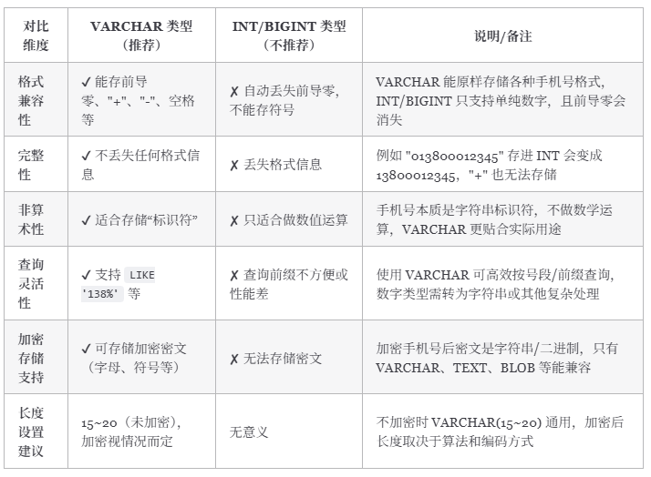

# SQL基础语法

## SQL语法

### SQL语法结构

<pre class="vditor-reset" placeholder="" contenteditable="true" spellcheck="false"><p data-block="0"></p></pre>

SQL 语法结构包括：

* **`子句`** - 是语句和查询的组成成分。（在某些情况下，这些都是可选的。）
* **`表达式`** - 可以产生任何标量值，或由列和行的数据库表
* **`谓词`** - 给需要评估的 SQL 三值逻辑（3VL）（true/false/unknown）或布尔真值指定条件，并限制语句和查询的效果，或改变程序流程。
* **`查询`** - 基于特定条件检索数据。这是 SQL 的一个重要组成部分。
* **`语句`** - 可以持久地影响纲要和数据，也可以控制数据库事务、程序流程、连接、会话或诊断。

## 子查询

子查询常用在 `WHERE` 子句和 `FROM` 子句后边：

```sql
select column_name [, column_name ]
from   table1 [, table2 ]
where  column_name operator
    (select column_name [, column_name ]
    from table1 [, table2 ]
    [where])
```

```sql
select column_name [, column_name ]
from (select column_name [, column_name ]
      from table1 [, table2 ]
      [where]) as temp_table_name
where  condition
```

## 连接

### **`join ON` 和 `WHERE` 的区别**

* 连接表时，SQL 会根据连接条件生成一张新的临时表。`ON` 就是连接条件，它决定临时表的生成。
* `WHERE` 是在临时表生成以后，再对临时表中的数据进行过滤，生成最终的结果集，这个时候已经没有 JOIN-ON 了。

所以总结来说就是： **SQL 先根据 ON 生成一张临时表，然后再根据 WHERE 对临时表进行筛选** 。

## 组合

`UNION` 基本规则：

* 所有查询的列数和列顺序必须相同。
* 每个查询中涉及表的列的数据类型必须相同或兼容。
* 通常返回的列名取自第一个查询。

`JOIN` vs `UNION`：

* `JOIN` 中连接表的列可能不同，但在 `UNION` 中，所有查询的列数和列顺序必须相同。
* `UNION` 将查询之后的行放在一起（垂直放置），但 `JOIN` 将查询之后的列放在一起（水平放置），即它构成一个笛卡尔积。

## 索引

## 约束

## 事务处理

不能回退 `SELECT` 语句，回退 `SELECT` 语句也没意义；也不能回退 `CREATE` 和 `DROP` 语句。

 **MySQL 默认是隐式提交** ，每执行一条语句就把这条语句当成一个事务然后进行提交。当出现 `START TRANSACTION` 语句时，会关闭隐式提交；当 `COMMIT` 或 `ROLLBACK` 语句执行后，事务会自动关闭，重新恢复隐式提交。

指令：

* `START TRANSACTION` - 指令用于标记事务的起始点。
* `SAVEPOINT` - 指令用于创建保留点。
* `ROLLBACK TO` - 指令用于回滚到指定的保留点；如果没有设置保留点，则回退到 `START TRANSACTION` 语句处。
* `COMMIT` - 提交事务。

## 权限控制

# MySQL

## MySQL字段类型

### 整数类型unsigned作用

* 不允许负值的无符号整数。使用 UNSIGNED 属性可以将正整数的上限提高一倍
* 对于从 0 开始递增的 ID 列，使用 UNSIGNED 属性可以非常适合

### varchar(10)和varchar(100)

* 二者存储相同的字符串，所占用磁盘的存储空间其实是一样的
* VARCHAR(100) 会消耗更多的内存。这是因为 VARCHAR 类型在内存中操作时，通常会分配固定大小的内存块来保存值，即使用字符类型中定义的长度。

### decimal和float/double

* DECIMAL 是定点数，FLOAT/DOUBLE 是浮点数。DECIMAL 可以存储精确的小数值，FLOAT/DOUBLE 只能存储近似的小数值。
* DECIMAL 用于存储具有精度要求的小数，例如与货币相关的数据，可以避免浮点数带来的精度损失。

### datetime和timestamp

* DATETIME 类型没有时区信息，TIMESTAMP 和时区有关。
* TIMESTAMP 只需要使用 4 个字节的存储空间，但是 DATETIME 需要耗费 8 个字节的存储空间。
* Timestamp 表示的时间范围更小。

### NULL和''

* 含义

  * `NULL` 代表一个不确定的值，它不等于任何值，包括它自身。因此，`SELECT NULL = NULL` 的结果是 `NULL`，而不是 `true` 或 `false`。 `NULL` 意味着缺失或未知的信息。虽然 `NULL` 不等于任何值，但在某些操作中，数据库系统会将 `NULL` 值视为相同的类别进行处理，例如：`DISTINCT`,`GROUP BY`,`ORDER BY`。需要注意的是，这些操作将 `NULL` 值视为相同的类别进行处理，并不意味着 `NULL` 值之间是相等的。 它们只是在特定操作中被特殊处理，以保证结果的正确性和一致性。 这种处理方式是为了方便数据操作，而不是改变了 `NULL` 的语义。
  * `''` 表示一个空字符串，它是一个已知的值。
* 比较运算
* * 任何值与 `NULL` 进行比较（例如 `=`, `!=`, `>`, `<` 等）的结果都是 `NULL`，表示结果不确定。要判断一个值是否为 `NULL`，必须使用 `IS NULL` 或 `IS NOT NULL`。
  * `''` 可以像其他字符串一样进行比较运算。例如，`'' = ''` 的结果是 `true`。
* 聚合函数：

  * 大多数聚合函数（例如 `SUM`, `AVG`, `MIN`, `MAX`）会忽略 `NULL` 值。
  * `COUNT(*)` 会统计所有行数，包括包含 `NULL` 值的行。`COUNT(列名)` 会统计指定列中非 `NULL` 值的行数。
  * 空字符串 `''` 会被聚合函数计算在内。例如，`SUM` 会将其视为 0，`MIN` 和 `MAX` 会将其视为一个空字符串

### MySQL没有boolean类型，使用 `tinyint`表示

### 手机号存储用 int 还是 varchar

**推荐使用varchar**



## MySQL基础架构


* 主要构成：

  * **连接器：** 身份认证和权限相关(登录 MySQL 的时候)。
  * **查询缓存：** 执行查询语句的时候，会先查询缓存（MySQL 8.0 版本后移除，因为这个功能不太实用）。
  * **分析器：** 没有命中缓存的话，SQL 语句就会经过分析器，分析器说白了就是要先看你的 SQL 语句要干嘛，再检查你的 SQL 语句语法是否正确。
  * **优化器：** 按照 MySQL 认为最优的方案去执行。
  * **执行器：** 执行语句，然后从存储引擎返回数据。 执行语句之前会先判断是否有权限，如果没有权限的话，就会报错。
  * **插件式存储引擎** ：主要负责数据的存储和读取，采用的是插件式架构，支持 InnoDB、MyISAM、Memory 等多种存储引擎。InnoDB 是 MySQL 的默认存储引擎，绝大部分场景使用 InnoDB 就是最好的选择。

## MySQL存储引擎

* **存储引擎是基于表的，而不是数据库，可以为不同的数据库表设置不同的存储引擎以适应不同场景的需要**

### MyISAM和InnoDB区别

|                 维度                 | MyISAM                                                  | InnoDB                                                 |
| :----------------------------------: | ------------------------------------------------------- | ------------------------------------------------------ |
|             **锁**             | 只有表级锁，上锁就锁住了整张表                          | 有表级锁和行级锁，默认行级锁                           |
|            **事务**            | 不提供事务支持                                          | 提供支持并定义了四个隔离级别                           |
|            **外键**            | 不支持                                                  | 支持                                                   |
| **数据库异常崩溃后的安全恢复** | 不支持                                                  | 支持，依赖于 `redo log`                              |
|       **是否支持 MVCC**       | 不支持                                                  | 支持                                                   |
|          **索引实现**          | 索引文件和数据文件是分离的                              | 数据文件本身就是索引文件                               |
|            **性能**            | 读写不能并发                                            | 随着 CPU 核数的增加，<br />InnoDB 的读写能力呈线性增长 |
|   **数据缓存策略和机制**实现   | 使用键缓存（Key Cache）<br />仅缓存索引页而不缓存数据页 | 使用缓冲池（Buffer Pool）<br />缓存数据页和索引页      |

### MySQL事务


* 事务特性：ACID

  * **原子性** （`Atomicity`）：事务是最小的执行单位，不允许分割。事务的原子性确保动作要么全部完成，要么完全不起作用；
  * **一致性** （`Consistency`）：执行事务前后，数据保持一致，例如转账业务中，无论事务是否成功，转账者和收款人的总额应该是不变的；
  * **隔离性** （`Isolation`）：并发访问数据库时，一个用户的事务不被其他事务所干扰，各并发事务之间数据库是独立的；
  * **持久性** （`Durability`）：一个事务被提交之后。它对数据库中数据的改变是持久的，即使数据库发生故障也不应该对其有任何影响。
* **只有保证了事务的持久性、原子性、隔离性之后，一致性才能得到保障。也就是说 A、I、D 是手段，C 是目的**

### 并发事务问题

* 脏读：一个事务读到另外一个事务还没有提交的数据

  
* 丢失修改：两个事务修改相同数据，第一个事务的修改结果被丢失

  
* 不可重复读：一个事务先后读取同一条记录，但两次读取的数据不同

  
* 幻读：一个事务读取了几行数据，接着另一个并发事务插入了一些数据。第一个事务就会发现多了一些原本不存在的记录

  
* 不可重复读和幻读区别

  * 执行 `delete` 和 `update` 操作的时候，可以直接对记录加锁，保证事务安全。而执行 `insert` 操作的时候，由于记录锁（Record Lock）只能锁住已经存在的记录，为了避免插入新记录，需要依赖间隙锁（Gap Lock）。也就是说执行 `insert` 操作的时候需要依赖 Next-Key Lock（Record Lock+Gap Lock） 进行加锁来保证不出现幻读。
  * 幻读其实可以看作是不可重复读的一种特殊情况，单独把幻读区分出来的原因主要是解决幻读和不可重复读的方案不一样。

### 控制并发事务

* **锁** 和 **MVCC**（悲观与乐观）
* **共享锁（S 锁）** ：又称读锁，事务在读取记录的时候获取共享锁，允许多个事务同时获取（锁兼容）。
* **排他锁（X 锁）** ：又称写锁/独占锁，事务在修改记录的时候获取排他锁，不允许多个事务同时获取。如果一个记录已经被加了排他锁，那其他事务不能再对这条记录加任何类型的锁（锁不兼容）。

### 事务隔离级别

| 隔离级别                         | 描述                                                                   | 脏读 | 不可重复读 | 幻读                         |
| -------------------------------- | ---------------------------------------------------------------------- | ---- | ---------- | ---------------------------- |
| **读取未提交**             | 允许读取尚未提交的数据变更                                             | √   | √         | √                           |
| **读取已提交(Oracle默认)** | 允许读取并发事务已经提交的数据                                         | ×   | √         | √                           |
| **可重复读(MySQL默认)**    | 对同一字段的多次读取结果都是一致的<br />除非数据是被本身事务自己所修改 | ×   | ×         | √ (标准)<br />≈× (InnoDB) |
| **可串行化**               | 所有的事务依次逐个执行<br />这样事务之间就完全不可能产生干扰           | ×   | ×         | ×                           |
