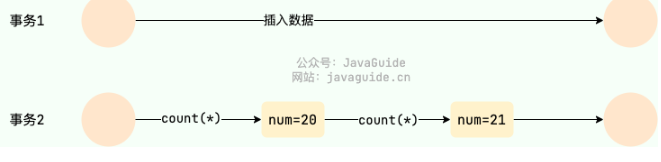

## MySQL事务

* 事务特性：ACID

  * **原子性** （`Atomicity`）：事务是最小的执行单位，不允许分割。事务的原子性确保动作要么全部完成，要么完全不起作用；
  * **一致性** （`Consistency`）：执行事务前后，数据保持一致，例如转账业务中，无论事务是否成功，转账者和收款人的总额应该是不变的；
  * **隔离性** （`Isolation`）：并发访问数据库时，一个用户的事务不被其他事务所干扰，各并发事务之间数据库是独立的；
  * **持久性** （`Durability`）：一个事务被提交之后。它对数据库中数据的改变是持久的，即使数据库发生故障也不应该对其有任何影响。
* **只有保证了事务的持久性、原子性、隔离性之后，一致性才能得到保障。也就是说 A、I、D 是手段，C 是目的**

### 并发事务问题

* 脏读：一个事务读到另外一个事务还没有提交的数据

  
* 丢失修改/重复写suosuo：两个事务修改相同数据，第一个事务的修改结果被丢失

  
* 不可重复读：一个事务先后读取同一条记录，但两次读取的数据不同

  
* 幻读：一个事务读取了几行数据，接着另一个并发事务插入了一些数据。第一个事务就会发现多了一些原本不存在的记录

  
* 不可重复读和幻读区别

  * 执行 `delete` 和 `update` 操作的时候，可以直接对记录加锁，保证事务安全。而执行 `insert` 操作的时候，由于记录锁（Record Lock）只能锁住已经存在的记录，为了避免插入新记录，需要依赖间隙锁（Gap Lock）。也就是说执行 `insert` 操作的时候需要依赖 Next-Key Lock（Record Lock+Gap Lock） 进行加锁来保证不出现幻读。
  * 幻读其实可以看作是不可重复读的一种特殊情况，单独把幻读区分出来的原因主要是解决幻读和不可重复读的方案不一样。

### 控制并发事务

* **锁** 和 **MVCC**（悲观与乐观）
* **共享锁（S 锁）** ：又称读锁，事务在读取记录的时候获取共享锁，允许多个事务同时获取（锁兼容）。
* **排他锁（X 锁）** ：又称写锁/独占锁，事务在修改记录的时候获取排他锁，不允许多个事务同时获取。如果一个记录已经被加了排他锁，那其他事务不能再对这条记录加任何类型的锁（锁不兼容）。
* **MVCC** ：多版本并发控制方法。对一份数据会存储多个版本，通过事务的可见性来保证事务能看到自己应该看到的版本。

### 事务隔离级别

| 隔离级别                         | 描述                                                                   | 脏读 | 不可重复读 | 幻读                         |
| -------------------------------- | ---------------------------------------------------------------------- | ---- | ---------- | ---------------------------- |
| **读取未提交**             | 允许读取尚未提交的数据变更                                             | √   | √         | √                           |
| **读取已提交(Oracle默认)** | 允许读取并发事务已经提交的数据                                         | ×   | √         | √                           |
| **可重复读(MySQL默认)**    | 对同一字段的多次读取结果都是一致的 除非数据是被本身事务自己所修改 | ×   | ×         | √ (标准) ≈× (InnoDB) |
| **可串行化**               | 所有的事务依次逐个执行 这样事务之间就完全不可能产生干扰           | ×   | ×         | ×                           |

* **InnoDB 的 REPEATABLE READ 对幻读的处理：**

  * **快照读 (Snapshot Read)** :事务启动时创建一个数据快照，后续的快照读都读取这个版本的数据，从而避免了看到其他事务新插入的行（幻读）或修改的行（不可重复读）。
  * **当前读 (Current Read)** :像 `SELECT ... F0OR UPDATE`, `SELECT ... LOCK IN SHARE MODE`, `INSERT`, `UPDATE`, `DELETE` 这些操作。InnoDB 使用 **Next-Key Lock** 来锁定扫描到的索引记录及其间的范围（间隙），防止其他事务在这个范围内插入新的记录，从而避免幻读。Next-Key Lock 是行锁（Record Lock）和间隙锁（Gap Lock）的组合。
* 解决幻读

  * 将事务隔离级别调整为 `SERIALIZABLE` 。
  * 在可重复读的事务级别下，给事务操作的这张表添加表锁。
  * 在可重复读的事务级别下，给事务操作的这张表添加 `Next-key Lock（Record Lock+Gap Lock）`
