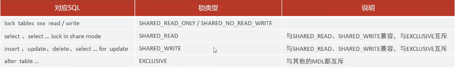
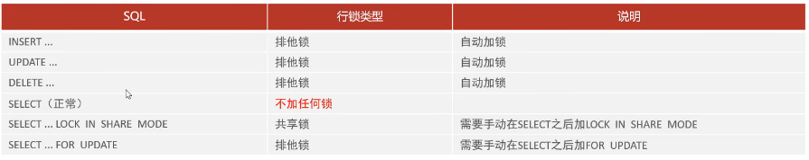
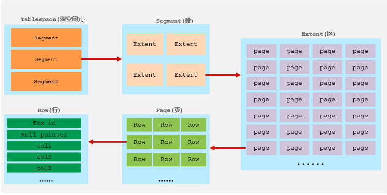
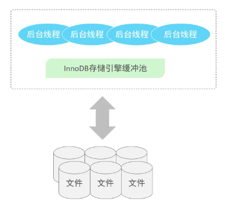
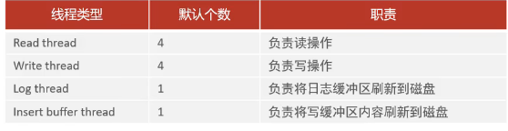
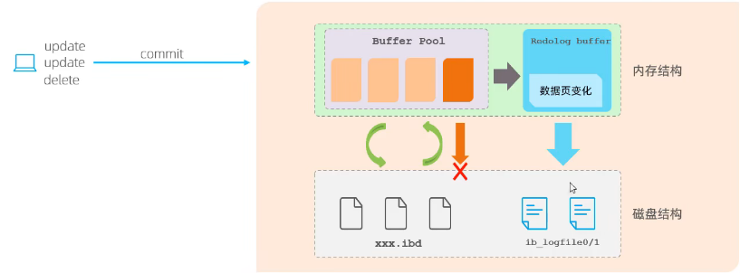
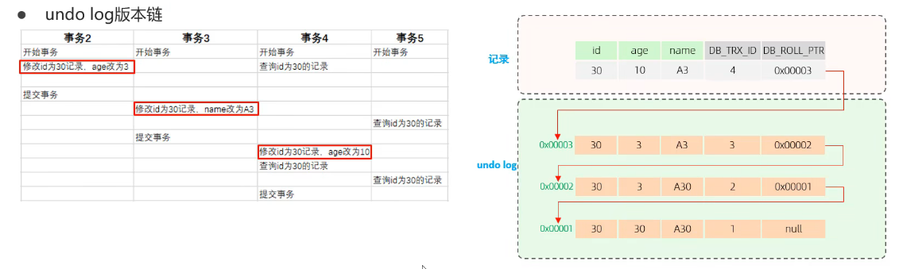

# SQL

## 基础

### 概述

* 关系型数据库（RDBMS）
  * 概念：建立在关系模型基础上，由多张相互连接的二维表组成的数据库
  * 特点：
    * 使用表存储数据，格式统一，便于维护
    * 使用SQL语言进行操作，标准统一，使用方便

### SQL

* SQL分类

| 分类 | 全称                       | 说明                                                   |
| ---- | -------------------------- | ------------------------------------------------------ |
| DDL  | Data Definition Language   | 数据定义语言，用来定义数据库对象(数据库，表，字段)     |
| DML  | Data Manipulation Language | 数据操作语言，用来对数据库表中的数据进行增删改         |
| DQL  | Data Query Language        | 数据查询语言，用来查询数据库中表的记录                 |
| DCL  | Data Control Language      | 数据控制语言，用来创建数据库用户、控制数据库的访问权限 |

#### DDL

* 数据库操作

```sql
# 查询
# 查询所有数据库
show databases;
# 查询当前数据库
show database();

# 创建
create database [if not exists] <数据库名> [default charset 字符集] [collate 排序规划]

# 删除
drop database [if exists] 数据库名;

# 使用
use 数据库名;
```

* 表操作-创建&查询

```sql
# 查询表
# 查询当前数据库所有表
show tables;

# 查询表结构
desc 表名;

# 查询指定表的建表语句
show create table 表名;

# 创建表
create table <表名>(
    <字段1> 字段1类型 [comment 字段1注释],
    <字段2> 字段2类型 [comment 字段2注释],
    <字段3> 字段3类型 [comment 字段3注释],
    ...,
    <字段n> 字段n类型 [comment 字段n注释]
) [comment 表注释];
```

* 表操作-修改&删除

```sql
# 添加字段
alter table 表名 add 字段名 类型（长度） [comment 注释] [约束];

# 修改数据类型
alter table 表名 modify 字段名 新数据类型(长度);

# 修改字段名和字段类型
alter table 表名 change 旧字段名 新字段名 类型(长度) [comment 注释] [约束];

# 修改表名
alter table 表名 rename to 新表名;

# 删除表
drop table [if exists] 表名;

# 删除表并重建
truncate table 表名;
```

* 数据类型
  * 数值类型表

| 类型        | 大小    | 有符号(SIGNED)范围                                  | 无符号(UNSIGNED)范围                                  | 描述           |
| ----------- | ------- | --------------------------------------------------- | ----------------------------------------------------- | -------------- |
| TINYINT     | 1 byte  | (-128, 127)                                         | (0, 255)                                              | 小整数值       |
| SMALLINT    | 2 bytes | (-32768, 32767)                                     | (0, 65535)                                            | 大整数值       |
| MEDIUMINT   | 3 bytes | (-8388608, 8388607)                                 | (0, 16777215)                                         | 大整数值       |
| INT/INTEGER | 4 bytes | (-2147483648, 2147483647)                           | (0, 4294967295)                                       | 大整数值       |
| BIGINT      | 8 bytes | (-2^63, 2^63-1)                                     | (0, 2^64-1)                                           | 极大整数值     |
| FLOAT       | 4 bytes | (-3.402823466E+38, 3.402823466351E+38)              | 0和(1.175494351E-38, 3.402823466E+38)                 | 单精度浮点数值 |
| DOUBLE      | 8 bytes | (-1.7976931348623157E+308, 1.7976931348623157E+308) | 0和(2.2250738585072014E-308, 1.7976931348623157E+308) | 双精度浮点数值 |
| DECIMAL     | -       | 依赖于M(精度)和D(标度)                              | 依赖于M(精度)和D(标度)                                | 精确定点数     |

* 字符串类型表

| 分类       | 类型       | 大小                  | 描述                         |
| ---------- | ---------- | --------------------- | ---------------------------- |
| 字符串类型 | CHAR       | 0-255 bytes           | 定长字符串                   |
|            | VARCHAR    | 0-65535 bytes         | 变长字符串                   |
|            | TINYBLOB   | 0-255 bytes           | 不超过256字符的二进制数据    |
|            | TINYTEXT   | 0-255 bytes           | 短文本字符串                 |
|            | BLOB       | 0-65,535 bytes        | 二进制形式的长文本数据       |
|            | TEXT       | 0-65,535 bytes        | 长文本数据                   |
|            | MEDIUMBLOB | 0-16,777,215 bytes    | 二进制形式的中等长度文本数据 |
|            | MEDIUMTEXT | 0-16,777,215 bytes    | 中等长度文本数据             |
|            | LONGBLOB   | 0-4,294,967,295 bytes | 二进制形式的极大文本数据     |
|            | LONGTEXT   | 0-4,294,967,295 bytes | 极大文本数据                 |

* 日期类型表

| 分类     | 类型      | 大小    | 范围                                       | 格式                | 描述                     |
| -------- | --------- | ------- | ------------------------------------------ | ------------------- | ------------------------ |
| 日期类型 | DATE      | 3 bytes | 1000-01-01 至 9999-12-31                   | YYYY-MM-DD          | 日期值                   |
|          | TIME      | 3 bytes | -838:59:59 至 838:59:59                    | HH:MM:SS            | 时间值或持续时间         |
|          | YEAR      | 1 byte  | 1901 至 2155                               | YYYY                | 年份值                   |
|          | DATETIME  | 8 bytes | 1000-01-01 00:00:00 至 9999-12-31 23:59:59 | YYYY-MM-DD HH:MM:SS | 混合日期和时间值         |
|          | TIMESTAMP | 4 bytes | 1970-01-01 00:00:01 至 2038-01-19 03:14:07 | YYYY-MM-DD HH:MM:SS | 混合日期和时间值(时间戳) |

#### DML

* 插入

```sql
# 给指定字段添加数据
insert into <表名> (<字段名1>, <字段名2>, ...) values (<值1>, <值2>, ...);

# 给全部字段添加数据
insert into <表名> values (<值1>, <值2>, ...);

# 批量添加数据
# 方式1: 指定字段
insert into <表名> (<字段名1>, <字段名2>, ...) 
values 
(<值1>, <值2>, ...),
(<值1>, <值2>, ...),
(<值1>, <值2>, ...);

# 方式2: 全部字段
insert into <表名> 
values 
(<值1>, <值2>, ...),
(<值1>, <值2>, ...),
(<值1>, <值2>, ...);
```

* 更新

```sql
# 修改数据
update 表名 set 字段名1 = 值1,字段名2 = 值2,...[where 条件];
```

* 删除

```sql
delete from 表名 [where 条件];
# delete 语句不能删除某个字段的值
```

#### DQL

* DQL 用于查询数据库表中的记录

```sql
# dql - 基本查询结构+执行顺序
# 4
select  
    <字段列表>
# 1
from
    <表名列表>
# 2
where
    <条件列表>
# 3
group by
    <分组字段列表>
having
    <分组后条件列表>
# 5
order by
    <排序字段列表>
# 6
limit
    <分页参数>;
```

* 基础查询

```sql
# dql - 查询示例
# 1. 查询多个字段
# 方式1: 指定字段
select <字段1>, <字段2>, <字段3> from <表名>;
# 方式2: 所有字段
select * from <表名>;

# 2. 设置别名
select 
    <字段1> [as] <别名1>,
    <字段2> [as] <别名2>
from <表名>;

# 3. 去除重复记录
select distinct <字段列表> from <表名>;
```

* 条件查询

```sql
# dql - where条件查询
# 1. 语法
select <字段列表> from <表名> where <条件列表>;
```

比较运算符表

| 运算符              | 功能     | 示例                            |
| ------------------- | -------- | ------------------------------- |
| >                   | 大于     | `where age > 18`              |
| >=                  | 大于等于 | `where score >= 60`           |
| <                   | 小于     | `where price < 100`           |
| <=                  | 小于等于 | `where quantity <= 10`        |
| =                   | 等于     | `where name = '张三'`         |
| <> 或 !=            | 不等于   | `where status != 0`           |
| BETWEEN ... AND ... | 在范围内 | `where age between 18 and 30` |
| IN(...)             | 在列表中 | `where id in (1,3,5)`         |
| LIKE                | 模糊匹配 | `where name like '张%'`       |
| IS NULL             | 是NULL   | `where email is null`         |

逻辑运算符表

| 运算符    | 功能 | 示例                                       |
| --------- | ---- | ------------------------------------------ |
| AND 或 && | 并且 | `where age > 18 and status = 1`          |
| OR 或\|\| | 或者 | `where role = 'admin' or role = 'super'` |
| NOT 或 !  | 非   | `where not is_deleted`                   |

优先级：NOT>AND>OR

* 聚合函数

将一列数据作为一个整体，进行纵向计算
常见聚合函数：

| 函数  | 功能     |
| ----- | -------- |
| count | 统计数量 |
| max   | 最大值   |
| min   | 最小值   |
| avg   | 平均值   |
| sum   | 求和     |

```sql
select 聚合函数（字段列表） from 表名;
```

* 分组查询

```sql
select <字段列表> 
from <表名> 
[where <条件>] 
group by <分组字段名> 
[having <分组后过滤条件>];
```

* where与having区别

  * 执行时机不同:
    * where在分组之前过滤,不满足条件不参与分组
    * having在分组之后过滤,对分组结果进行筛选
  * 判断条件不同:
    * where不能使用聚合函数
    * having可以使用聚合函数
* 执行顺序：where>聚合函数>having
* 分组之后，查询的字段一般为聚合函数和分组字段，查询其他字段无意义
* 排序查询

```sql
# 排序方式:asc-升序（默认），desc-降序

select 字段列表 from 表名 order by 字段1 排序方式1,字段2 排序方式2;
```

* 分页查询

```sql
# 起始索引从0开始，起始索引 = （查询页码-1）* 每页显示记录数
# 如果查询的是第一页数据，起始索引可以省略，直接简写为limit 10
select 字段列表 from 表名 limit 起始索引,查询记录数;
```

#### DCL

* DCL用于管理数据库用户、控制数据库的访问权限
* 用户管理

```sql
# dcl - 用户管理
# 1. 查询用户
use mysql;
select * from user;

# 2. 创建用户
create user '<用户名>'@'<主机名>' identified by '<密码>';

# 3. 修改用户密码
alter user '<用户名>'@'<主机名>' identified with mysql_native_password by '<新密码>';

# 4. 删除用户
drop user '<用户名>'@'<主机名>';
```

* 权限控制

常见权限

| 权限                | 说明               |
| ------------------- | ------------------ |
| ALL, ALL PRIVILEGES | 所有权限           |
| SELECT              | 查询数据           |
| INSERT              | 插入数据           |
| UPDATE              | 修改数据           |
| DELETE              | 删除数据           |
| ALTER               | 修改表             |
| DROP                | 删除数据库/表/视图 |
| CREATE              | 创建数据库/表      |

```sql
# 查询用户'admin'@'localhost'的权限
show grants for 'admin'@'localhost';

# 授予用户'dev'@'%'对test_db.orders表的SELECT, INSERT权限
grant select, insert on test_db.orders to 'dev'@'%';

# 撤销用户'guest'@'localhost'对mydb.*的所有权限
revoke all privileges on mydb.* from 'guest'@'localhost';
```

### 函数

#### 字符串函数

| 函数                       | 功能                                                      |
| -------------------------- | --------------------------------------------------------- |
| concat(S1, S2, ... Sn)     | 字符串拼接，将S1，S2，... Sn拼接成一个字符串              |
| lower(str)                 | 将字符串str全部转为小写                                   |
| upper(str)                 | 将字符串str全部转为大写                                   |
| lpad(str, n, pad)          | 左填充，用字符串pad对str的左边进行填充，达到n个字符串长度 |
| rpad(str, n, pad)          | 右填充，用字符串pad对str的右边进行填充，达到n个字符串长度 |
| trim(str)                  | 去掉字符串头部和尾部的空格                                |
| substring(str, start, len) | 返回从字符串str从start位置起的len个长度的字符串           |

```sql
-- 字符串拼接
select concat(first_name, ' ', last_name) as full_name from users;

-- 大小写转换
select lower(email) from contacts;  -- 转为小写
select upper(name) from products;   -- 转为大写

-- 填充操作
select lpad(phone, 15, '+86') from customers;  -- 左填充电话号码
select rpad(code, 8, 'X') from vouchers;       -- 右填充优惠码

-- 去除空格
select trim(address) from locations;  -- 去除首尾空格

-- 截取子串
select substring(title, 1, 20) as short_title from articles;  -- 截取前20个字符
```

#### 数值函数

| 函数       | 功能                         |
| ---------- | ---------------------------- |
| ceil(x)    | 向上取整                     |
| floor(x)   | 向下取整                     |
| mod(x,y)   | 返回x除以y的余数（取模）     |
| rand()     | 返回0~1范围内的随机数        |
| round(x,y) | 对参数x四舍五入，保留y位小数 |

```sql
-- 向上取整（大于等于x的最小整数）
select ceil(15.2);   -- 结果：16
select ceil(-5.8);   -- 结果：-5

-- 向下取整（小于等于x的最大整数）
select floor(15.8);  -- 结果：15
select floor(-5.2);  -- 结果：-6

-- 取模运算（除法余数）
select mod(10, 3);   -- 结果：1（10÷3余1）
select mod(15, 4);   -- 结果：3

-- 随机数生成
select rand();       -- 结果：0.12345678（随机值）
select floor(rand()*100); -- 生成0-99的随机整数

-- 四舍五入
select round(15.375, 2); -- 结果：15.38
select round(123.456, 0); -- 结果：123
select round(123.456, -1); -- 结果：120（十位取整）
```

#### 日期函数

| 函数                               | 功能                                  |
| ---------------------------------- | ------------------------------------- |
| curdate()                          | 返回当前日期                          |
| curtime()                          | 返回当前时间                          |
| now()                              | 返回当前日期和时间                    |
| year(date)                         | 获取指定date的年份                    |
| month(date)                        | 获取指定date的月份                    |
| day(date)                          | 获取指定date的日期                    |
| date_add(date, interval expr type) | 返回一个日期/时间值加上时间间隔后的值 |
| datediff(date1, date2)             | 返回date1和date2之间的天数            |

```sql
-- 获取当前日期
select curdate();  -- 结果：2023-10-15

-- 获取当前时间
select curtime();  -- 结果：14:30:45

-- 获取当前日期时间
select now();      -- 结果：2023-10-15 14:30:45

-- 提取日期部分
select year('2023-10-15');    -- 结果：2023
select month('2023-10-15');   -- 结果：10
select day('2023-10-15');     -- 结果：15

-- 日期计算
-- 3天后的日期
select date_add(curdate(), interval 3 day); 
-- 2个月前的日期
select date_add(now(), interval -2 month);
-- 计算两个日期相差天数
select datediff('2023-12-31', '2023-10-15'); -- 结果：77
```

#### 流程函数

* 实现条件筛选，提高检索效率

| 函数                                                       | 功能                                          |
| ---------------------------------------------------------- | --------------------------------------------- |
| if(value, t, f)                                            | 如果value为真则返回t，否则返回f               |
| ifnull(value1, value2)                                     | 如果value1不为空返回value1，否则返回value2    |
| case when [val1] then [res1] ... else [default] end        | 当val1为真时返回res1，... 否则返回default     |
| case [expr] when [val1] then [res1] ... else [default] end | 当expr等于val1时返回res1，... 否则返回default |

```sql
-- IF函数（条件判断）
select 
    name,
    if(score >= 60, '及格', '不及格') as result 
from students;

-- IFNULL函数（空值处理）
select 
    order_id,
    ifnull(comment, '暂无评论') as comment 
from orders;

-- CASE WHEN（多条件判断）
select 
    product_name,
    case 
        when price > 1000 then '高端'
        when price > 500 then '中端'
        else '入门'
    end as level
from products;

-- CASE expr（值匹配）
select 
    status,
    case status
        when 1 then '待支付'
        when 2 then '已发货'
        when 3 then '已完成'
        else '未知状态'
    end as status_text
from orders;
```

### 多表查询

#### 内连接

* 内连接查询的是两张表交集的部分

```sql
# 1. 隐式内连接
select <字段列表> 
from <表1>, <表2> 
where <连接条件>;

# 2. 显式内连接
select <字段列表> 
from <表1> 
[inner] join <表2> 
on <连接条件>;
```

#### 外连接

```sql
# 外连接语法
# 1. 左外连接
select <字段列表> 
from <表1> 
natural left outer join <表2> 
on <连接条件>;
-- 说明: 返回左表(表1)的所有记录 + 右表(表2)的匹配记录

# 2. 右外连接
select <字段列表> 
from <表1> 
natural right outer join <表2> 
on <连接条件>;
-- 说明: 返回右表(表2)的所有记录 + 左表(表1)的匹配记录

# 3. 全外连接
select <字段列表> 
from <表1>
full outer join <表2> 
on <连接条件>;
```

#### 自连接

```sql
select  <字段列表> 
from 表A 别名A
join 表B 别名B 
on 条件;
```

#### 联合查询

```sql
-- union 默认去重，加all不去重
select 字段列表
from 表A
union [all]
select 字段列表
from 表A
```

* 要求：列数相同，数据类型兼容，列顺序一致

#### 子查询

##### 标量子查询

* 子查询返回的结果是单个值（数字，字符串，日期等）
* 常用操作符：比较运算符 `= <> > >= < <= `

##### 列子查询

* 子查询返回的结果是一列（可以多行）
* 常用操作符：`in not in,any,some,all`

| 操作符 | 描述                                   |
| ------ | -------------------------------------- |
| IN     | 在指定的集合范围之内，多选一           |
| NOT IN | 不在指定的集合范围之内                 |
| ANY    | 子查询返回列表中，有任意一个满足即可   |
| SOME   | 与ANY等同，使用SOME的地方都可以使用ANY |
| ALL    | 子查询返回列表的所有值都必须满足       |

##### 行子查询

* 子查询返回的结果是一行（可以多列）
* 常用操作符：`in not in,any,some,all`
* 可以使用括号 `()`将不同属性组合后使用 `=`运算

##### 表子查询

* 子查询返回的结果是多行多列
* 常用操作符：`in`

### 事务

#### 简介

* **事务**是一组操作的集合，是一个不可分割的工作单位，事务会把所有的操作作为应该整体一起向系统提交或撤销操作请求，这些操作**要么同时成功，要么同时失败**
* MySQL默认自动提交

```sql
# 查看事务提交方式
select @@autocommit;

# 改为手动提交事务
set @@autocommit = 0;

# 开启事务
start transaction;
begin;

# 提交事务
commit;

# 回滚事务
rollback;
```

#### 特性

* **原子性（Atomicity）**：事务是一个不可分割的工作单位，事务中的操作要么全部成功，要么全部失败
* **一致性（Consistency）**：事务完成时，必须使所有数据都保持一致状态
* **隔离性（Isolation）**：数据库系统提供隔离机制，保证事务在不受外部并发操作影响的独立环境下运行
* **持久性（Durability）**：事务提交或回滚后，对数据的改变是持久的，即使数据库发生故障也不应该对其有影响

#### 并发问题

* **脏读**：一个事务读到另外一个事务还没有提交的数据
* **不可重复读**：一个事务先后读取同一条记录，但两次读取的数据不同
* **幻读**：一个事务按照条件查询数据时，没有对应的数据行，但是在插入数据时，又发现这行数据已经存在，好像发生了幻觉一样

#### 事务隔离级别

| 隔离级别                             | 脏读 | 不可重复读 | 幻读                      |
| ------------------------------------ | ---- | ---------- | ------------------------- |
| Read uncommited：读未提交            | √   | √         | √                        |
| Read commited：读已提交(Oracle默认)  | ×   | √         | √                        |
| Repeatable Read：可重复读(MySQL默认) | ×   | ×         | √ (标准) / ≈× (InnoDB) |
| Serializable：串行化                 | ×   | ×         | ×                        |

* 从上到下数据安全性越来越高，但是性能越来越低

```sql
# 查看事务隔离级别
select @@transaction_isolation;

# 设置事务隔离级别
set [session|global] transaction isolation level 隔离级别;
```

## 进阶

### 索引

#### 结构

* 为什么 InnoDB 存储引擎选择使用 B+Tree 索引结构？

  * 相对于二叉树，层级更少，搜索效率高
  * 对于 B-Tree，无论是叶子节点还是非叶子节点，都会保存数据，这样导致一页中存储的键值减少，指针也跟着减少，要同样保存大量数据，只能增加树的高度，导致性能降低
  * 相对于 Hash 索引，B+Tree 支持范围匹配及排序操作
* 复杂度

  * 插入（I/O操作）：$O(\log_{n/2}(N))$，n为节点中指针的最大数量，N是被索引文件中的记录数量

#### 语法

```sql
# 创建索引
create [unique|fulltext] index index_name on table_name(column_name1, column_name2, ...);
# unique: 唯一索引
# fulltext: 全文索引

# 查看索引
show index from table_name;

# 删除索引
drop index index_name on table_name;
```

#### 性能分析

##### 查看执行频次

```sql
show global status lick 'Com_______';
```

* 几个重要的指标

| Variable_name | Value            |
| ------------- | ---------------- |
| Com_delete    | 删除语句执行次数 |
| Com_insert    | 插入语句执行次数 |
| Com_update    | 更新语句执行次数 |
| Com_select    | 查询语句执行次数 |

##### 慢查询日志

* 查看慢查询日志开关

```sql
show variables like '%slow_query_log%';
```

* 若未开启，需要在MySQL的配置文件中 `/etc/my.cnf`添加以下配置

```sql
# 开启慢查询日志
slow_query_log = 1

# 设置慢查询日志的时间阈值，单位为秒
long_query_time = 1
```

* 慢查询文件存放位置 `/var/lib/mysql/localhost-slow.log`
* `tail -f localhost-slow.log`实时查看慢查询日志

##### profile详情分析

* 检查profile是否开启

```sql
select @@have_profiling;
```

* 开启profile

```sql
set profiling = 1;
```

* 查看profile

```sql
show profiles;
```

输入格式如下:

| Quert_ID | Duration | Query                    |
| -------- | -------- | ------------------------ |
| 1        | 0.000123 | select * from table_name |
| 2        | 0.000123 | select * from table_name |

* 查看特定查询耗时情况

```sql
show profile for query query_id;
```

##### explain执行计划

* explain或desc命令可以获取MySQL如何执行select语句信息，包括select语句执行过程中表如何连接和连接的顺序，是否用到索引

```sql
explain select * from table_name where condition;
```

* 执行计划

| 名称                    | 含义                                                                                                                                                                        |
| ----------------------- | --------------------------------------------------------------------------------------------------------------------------------------------------------------------------- |
| id                      | select查询的序列号，表示查询中执行select子句或者是操作表的顺序(id相同，执行顺序从上往下；id不同，id值越大，优先级越高)                                                      |
| select_type             | select的类型 `<br>`SIMPLE：不使用表连接或者子查询 `<br>`PRIMARY：主查询 `<br>`UNION：UNION中的第二个或者后面的查询语句 `<br>`SUBQUERY：SELECT/WHERE之后包含了子查询 |
| **table**         | 进行查询的表                                                                                                                                                                |
| partitions              |                                                                                                                                                                             |
| type                    | 表示连接类型，性能从高到低依次为：NULL(不查询任何表),system(系统表),cons(主键/唯一索引),eq_ref,ref(非唯一索引),range,index(用到索引但是遍历索引),all(全表扫描)              |
| **possible_keys** | 可能应用在这张表的索引                                                                                                                                                      |
| **key**           | 实际使用的索引(没用则为NULL)                                                                                                                                                |
| **key_len**       | 索引中使用的字节数，该值为索引字段最大可能长度而非实际长度                                                                                                                  |
| ref                     |                                                                                                                                                                             |
| **rows**          | MySQL认为必须要执行查询的行数，预估值                                                                                                                                       |
| filtered                | 返回结果行数占需读取行数的百分比                                                                                                                                            |
| **Extra**         | 执行情况的描述和说明 `<br>`using index condition:查找使用了索引，但是需要回表查询 `<br>`using where;using index:查找使用了索引，需要的数据在索引列都能找到，不需要回表  |

#### 使用规则

##### 最左前缀法则

* 最左前缀法则：查询从索引的最左列开始，并且不跳过中间的索引。
* 如果索引了多列（联合索引），要遵守最左前缀法则。
* 如果跳过某一列，该列后面的字段将失效
* 联合索引中，如果出现范围查询(<,>)，范围查询右侧的索引将会失效(尽量使用带等于号的查询)

##### 索引失效情况

* 在索引列上进行运算操作
* 字符串类型字段使用时，不加引号
* 尾部模糊匹配，索引不会失效；头部模糊匹配，索引失效
* 用or分割开的条件，如果or前的条件中的列有索引，而后面的列没有索引
* MySQL评估索引比全表扫描慢

##### SQL提示

优化数据库查询的方法，在SQL语句中添加提示，告诉MySQL如何执行查询。

```sql
# 建议 使用索引
select * from table_name use index(index_name);

# 不使用索引
select * from table_name ignore index(index_name);

# 强制使用索引
select * from table_name force index(index_name);
```

##### 覆盖索引

* 查询使用了索引，并且需要返回的列在索引中能够全部找到

##### 前缀索引

* 将字符串的一部分前缀提取出来建立索引，节约索引空间，提高效率

```sql
create index index_name on table_name(column_name(length));
```

* 选择性：不重复的索引值（基数）和数据表的记录总数的比值，选择性越高，索引的效果越好
* 计算选择性

```sql
# 1
select count(distinct column_name)/count(*) from table_name;

select count(distinct substring(column_name,left,right))/count(*) from table_name;
```

##### 单列&联合索引

* 单列索引：一个索引只包含单个列
* 联合索引：一个索引包含多个列
* 存在多个查询条件，建议使用联合索引

#### 设计原则

1. 数据量较大（100万以上），查询比较频繁
2. 为常作为查询条件、排序、分组(where、order by、group by)的字段建立索引
3. 选择区分度高的列作为索引，尽量使用唯一索引
4. 对字符串类型的字段可以建立前缀索引
5. 尽量使用联合索引，避免回表
6. 控制索引数量
7. 如果索引不能存储NULL值，创建表时用NOT NULL约束

### SQL优化

#### 插入数据

* insert语句优化

  * 批量插入(500-1000条)
  * 手动提交事务
  * 主键顺序插入
* 大批量数据插入——load

```sql
# 客户端连接服务器时加上参数
mysql --loacal-infile -u root -p
# 设置全局参数，开启从本地加载文件导入数据的开关
set global local_infile = 1;
# 检查开关
select @@local_infile
# 执行load指令
# 字段用逗号分隔，每行用'\n'分隔
load data local infile 'root/sql1.log' into table 'tb_user' fields terminated by ',' lines terminated by '\n'
```

#### 主键优化

* InnoDB引擎中，表数据是根据主键顺序存放的（索引组织表）
* 页分裂、页合并
* 设计原则
  * 尽量降低主键长度
  * 插入数据时顺序插入、使用自增逐渐
  * 尽量避免对主键的修改

#### order by优化

| 排序           | 说明                                                |
| -------------- | --------------------------------------------------- |
| using filesort | 表索引/全表扫描，读取满足条件的数据，在缓冲区中排序 |
| using index    | 有序索引直接返回有序数据，效率高                    |

* 根据排序字段建立索引，遵循最左前缀法则
* 尽量使用覆盖索引
* 多字段+同时存在升降序，在创建索引时要说明
* 不可避免需要filesort时，可以增大排序缓冲区大小

#### group by优化

* 分组也可用索引，遵循最左前缀法则

#### limit优化

* 大数据情况下效率很低
* 创建覆盖索引、使用子查询优化

#### count优化

* MyISAM：将表的总行数记录在了磁盘上，会直接返回数据
* InnoDB：需要一行一行读取数据并累计计数（根据约束判断是否为null）
* 效率：count(字段)<count(主键id)<count(1)≈count(*)

#### update优化

* update语句加的是行锁
* 根据索引字段更新，否则行锁会编程表锁

### 视图

#### 基本操作

* 视图（View）是一种虚拟存在的表，其数据并非实际存储在数据库中。视图的行和列数据来源于定义视图时所使用的查询语句中涉及的表，这些数据是在使用视图时动态生成的。
* 通俗地讲，视图只保存了查询的SQL逻辑，而不保存查询结果本身。因此，在创建视图时，主要工作就是构建这条SQL查询语句。

```sql
# 视图操作
# 1. 创建视图
create [or replace] view <视图名称> (<列名列表>) 
as 
<select语句> 
[with [cascaded | local] check option];

# 2. 查询视图
# 查看视图创建语句
show create view <视图名称>;

# 查询视图数据
select * from <视图名称>;

# 3. 修改视图
# 方式1: create or replace
create or replace view <视图名称> (<列名列表>) 
as 
<select语句> 
[with [cascaded | local] check option];

# 方式2: alter view
alter view <视图名称> (<列名列表>) 
as 
<select语句> 
[with [cascaded | local] check option];

# 4. 删除视图
drop view [if exists] <视图名称>;
```

#### 检查选项 cascaded/loacl

* 在创建视图的语句后加上 `with cascaded/local check option`
* `cascaded`：检查视图及其递归依赖的视图
* `local`：检查视图及其递归依赖的视图，**若其递归依赖的视图没有检查选项则不检查**

#### 更新

**可更新的**视图需要满足的条件：

* 视图数据和基础行数据是一对一关系
* from 子句中只有一个数据库关系
* select 子句中只包含关系属性名，不包含任何表达式，聚集或 distinct 声明
* 没有出现在 select 子句中的任何属性都可以取 null 值（没有非空约束，不构成主码的一部分）
* 查询中不含有 group by 或 having 子句

不能包含的关键词：聚合函数，`distinct,group by,having,union,union all`

### 存储过程

* SQL层面的代码封装与重用

```sql
# 创建
create procedure 过程名([参数列表])
begin
    过程体
end;

# 调用
call 过程名([参数])

# 查看
# 查询指定数据库的存储过程及状态信息
select * 
from information_schema.routines 
where routine_schema = 'xxx'

# 查询某个存储过程的定义
show create procedure 过程名;

# 删除存储过程
drop procedure [if exists]过程名;
```

#### 变量

##### 系统变量

* MySQL服务器提供，不是用户定义，属于服务器层面
* MySQL服务器重启后，所设置的全局参数会失效，想要不失效，需要在 `/etc/my.cnf`中配置

```sql
# 系统变量操作
# 1. 查看系统变量（默认session）
# 查看所有系统变量
show [session|global] variables;

# 模糊查找系统变量
show [session|global] variables like '...';

# 查看指定变量值
select @@[session|global].系统变量名;

# 2. 设置系统变量
# 方式1: set命令
set [session|global] 系统变量名 = 值;

# 方式2: 使用@@语法
set @@[session|global].系统变量名 = 值;
```

##### 用户变量

* 用户根据自己需要定义的变量

```sql
# 用户定义变量操作
# 1. 变量赋值
# 方式1: set语句
set @var_name = expr;
set @var_name := expr;
set @var1 = 10, @var2 = 'test';

# 方式2: select语句
select @var_name := expr;
select @count := count(*) from employees;

# 方式3: select into语句
select 字段名 into @var_name from 表名;
select salary into @max_salary from employees order by salary desc limit 1;

# 2. 变量使用
select @var_name;
select @max_salary as highest_salary;
```

##### 局部变量

```sql
# 局部变量操作 (用于存储过程/函数)
# 1. 变量声明
declare 变量名 变量类型 [default 默认值];

# 2. 变量赋值
# 方式1: set语句
set 变量名 = 值;
set 变量名 := 值;

# 方式2: select into语句
select 字段名 into 变量名 from 表名 ...;
```

#### 参数列表

| 类型  | 含义                           | 备注     |
| ----- | ------------------------------ | -------- |
| IN    | 作为输入参数，调用时需要传入值 | 默认类型 |
| OUT   | 作为输出参数，可作为返回值     |          |
| INOUT | 既可作输入参数，也可作输出参数 |          |

```sql
# 存储过程基本语法
create procedure 存储过程名称 (
    [in | out | inout] 参数名1 参数类型,
    [in | out | inout] 参数名2 参数类型,
    ...
)
begin
    -- SQL语句
end;
```

#### 选择与循环逻辑

* if

```sql
if condition1 then
    statement1
elseif condition2 then
    statement2
else
    statement_default
end if;
```

* case

```sql
case 
    when condition1 then result1
    when condition2 then result2
    ...
    else result_default
end case;
```

* while：先判断，再执行

```sql
while condition do
    statement
end while;
```

* repeat：先执行，再判断

```sql
repeat
    statement
until condition;
end repeat;
```

* loop/for

```sql
# leave:退出循环
# iterate:迭代循环

# for循环
for variable in expression1..expression2 loop
    statement
end loop;

# loop循环
loop
    statement
end loop;
```

#### 游标cursor + 条件处理程序handler

* cursor：数据库中用于遍历查询结果集的关键工具，特别在存储过程和函数中用于对结果集进行逐行处理。
* 它提供了对结果集的精细化控制，类似于程序中的迭代器。
* **需要先声明游标，再声明普通变量**
* handler可以用来定义在流程控制结构执行过程中遇到问题时相应的处理步骤

```sql
# 1. 声明游标
declare 游标名称 cursor for 查询语句;

# 2. 打开游标
open 游标名称;

# 3. 获取记录
fetch 游标名称 into 变量1, 变量2, ...;

# 4. 关闭游标
close 游标名称;
```

```sql
# 错误处理程序声明语法
declare handler_action handler 
    for condition_value [, condition_value] ... 
    statement;

/*
 * 参数说明：
 * 
 * 1. handler_action - 处理动作：
 *   continue: 继续执行当前程序
 *   exit: 终止执行当前程序
 * 
 * 2. condition_value - 错误条件：
 *   sqlstate '状态码': 指定SQL状态码（如 '02000'）
 *   sqlwarning: 所有以01开头的SQLSTATE代码的简写
 *   not found: 所有以02开头的SQLSTATE代码的简写
 *   sqlexception: 所有未被sqlwarning或not found捕获的SQLSTATE代码
 * 
 * 3. statement - 触发处理程序时执行的SQL语句
 */
```

```sql
delimiter //

create procedure process_employee_salaries()
begin
    -- 声明变量
    declare emp_id int;
    declare emp_name varchar(50);
    declare emp_salary decimal(10,2);
    declare done int default 0;
  
    -- 声明游标
    declare emp_cursor cursor for
        select employee_id, full_name, salary
        from employees
        where department = 'Sales';
  
    -- 声明未找到记录的处理程序
    declare continue handler for not found set done = 1;
  
    -- 打开游标
    open emp_cursor;
  
    -- 创建临时结果表
    create temporary table salary_report (
        employee_id int primary key,
        employee_name varchar(50),
        old_salary decimal(10,2),
        new_salary decimal(10,2)
    );
  
    -- 循环处理每条记录
    process_loop: loop
        -- 获取记录
        fetch emp_cursor into emp_id, emp_name, emp_salary;
  
        -- 检查是否结束
        if done = 1 then
            leave process_loop;
        end if;
  
        -- 业务逻辑：涨薪10%
        set @new_salary = emp_salary * 1.1;
  
        -- 更新员工工资
        update employees
        set salary = @new_salary
        where employee_id = emp_id;
  
        -- 记录变更
        insert into salary_report values
        (emp_id, emp_name, emp_salary, @new_salary);
    end loop;
  
    -- 关闭游标
    close emp_cursor;
  
    -- 返回结果
    select * from salary_report;
end //

delimiter ;
```

### 触发器

* 触发器是数据库中一种与表相关的特殊对象，它会在指定的数据操作（INSERT/UPDATE/DELETE）发生之前或之后自动执行预定义的 SQL 语句集合。这种机制为数据库提供了强大的自动化处理能力。

```sql
# 触发器创建语法
create trigger trigger_name
before|after insert|update|delete
on tbl_name 
[referencing new row as new_row_name]
[referencing old row as old_row_name]
for each row
when condition
begin
    -- 触发器逻辑
    trigger_stmt;
end;

# 查看当前数据库所有触发器
show triggers;

# 查看特定触发器
show create trigger trigger_name;

# 触发器删除语法
drop trigger [if exists] [database_name.]trigger_name;
```

### 锁

* 计算机协调多个进程或线程并发访问某一资源的机制
* 分类
  * 全局锁：锁数据库所有表
  * 表级锁：锁整张表
  * 行级锁：锁对应行数据

#### 全局锁

* 加锁后整个实例都是只读状态，DML写、DDL语句，更新操作数据都成阻塞状态
* 使用场景：数据库备份，保证数据的完整性
* 弊端
  * 主库备份，不能执行更新，业务基本停摆
  * 从库备份，备份时不能执行主库同步的二进制日志binlog，导致主从延迟
  * InnoDB引擎，备份时加上操作 `--single-transaction`完成不加锁的备份

```sql
# 加锁
flush tables with read lock

# 备份（在电脑系统执行，不是mysql语句）
mysqldump -用户名 -密码 数据库 > 数据库sql文件


# 解锁
unlock tables
```

#### 表级锁

* 锁的粒度大，发生锁冲突概率最高，并发度最低
* 分类
  * 表锁
  * 元数据锁
  * 意向锁

##### 表锁

* 表共享读锁（read lock）：所有表都可读，但是都不可写
* 表独占写锁（write lock）：加锁的客户端可读可写，其他均不能读写

```sql
#加锁
lock tables 表名 read/write；

#解锁
unlock tables;
```

##### 元数据锁（meta data lock，MDL）

* 系统自动控制，无需显式使用
* 访问表的时候会自动加上，主要作用是维护表元数据的数据一致性，表上有活动事务的时候，不能对元数据进行写入操作
* **避免DML与DDL冲突，保证读写正确性**
* 对表进行增删改查的时候，加MDL读锁（共享）；对表结构进行变更操作的时候，加MDL写锁（排他）
* 查看元数据锁：`select object_type,object_schema,object_name,lock_duration from performance_schema.metadata_locks;`



##### 意向锁

* 避免DML在执行时，加的行锁和表锁的冲突，这样表锁就不用检查每行数据是否加锁，减少检查次数
* 意向共享锁（IS）：`select ... lock in share mode`添加，与表锁共享锁兼容，与表锁排他锁互斥
* 意向排他锁（IX）：`insert、update、delete、select ... for update`添加，与表锁共享锁和表锁排他锁都互斥。意向锁之间不互斥
* 查看意向锁：`select object_schema,object_name,index_name,lock_type,lock_mode,lock_data from performance_schema.data_locks;`

#### 行级锁

* 每次加锁锁住对应的行数据。锁粒度最小，并发量最高，发生冲突概率最低

##### 行锁

* 锁定单个记录，防止其他事务进行update和delete，RC（Read commited）、RR（Repeatable Read支持）
* 共享锁（S）：允许事务读一行，阻止其他事务获取排他锁
* 排他锁（X）：允许获取排他锁的事务更新数据，阻止其他事务获取相同的共享锁和排他锁
* InnoDB引擎的行锁是针对索引加的锁，不通过索引检索数据，**行锁会升级为表锁**


* 自动加锁



##### 间隙锁

* 锁住索引记录间隙（不含该记录），防止其他事务在间隙中insert，产生幻读，RR支持
* InnoDB引擎使用next-key锁进行搜索和索引扫描
* 索引上等值查询（唯一索引），给不存在的记录加锁时，优化为间隙锁
* 索引上等值查询（普通索引），向右遍历最后一个值不满足查询需求时，临建锁退化为间隙锁
* 索引的范围查询，会访问到第一个不满足条件的值

##### 临建锁

* 行锁和间隙锁组合，锁住数据，锁住数据前面的间隙，RR支持

### InnoDB引擎

#### 逻辑存储结构

* 表空间（ibd文件）：一个mysql可以对应多个表空间，用于存储记录、索引等数据
* 段：分为数据段、索引段、回滚段，InnoDB是索引组织表，数据段是B+树的子节点、索引段是B+树的非子节点
* 区：表空间的单元结构，每个区大小为1M。默认情况页大小为16K，一个区有64个连续的页
* 页：InnoDB引擎磁盘管理的最小单元。为保证页的连续性，每次从磁盘申请4-5个区
* 行：数据按照行进行存放



#### 内存架构


##### 左侧为内存结构

* **Buffer Pool（缓冲池）：**缓存磁盘上经常操作的真实数据，curd时，先操作缓冲池的数据，然后再以一定频率刷新到磁盘，减少磁盘IO
  * 缓冲池以Page页为单位
  * free page：空闲页，未被使用
  * change page：被使用页，数据没有被修改过
  * dirty page：脏页，数据被修改过但是与磁盘中的不一致
* **Change Buffer（更改缓冲区）：**针对于非唯一二级索引页，执行DML语句时，如果数据也不在缓冲池中，不会直接操作磁盘，而是将数据变更存在更改缓冲区中，未来数据被读取时，再将数据合并恢复到缓冲池中，刷新到磁盘中。
  * 二级索引通常是非唯一的，并且插入顺序相对随机，删除和更新都可能影响索引树中不相邻的二级索引，每次都操作磁盘会造成大量IO
* **Log Buffer（日志缓冲区）：**保存要写入磁盘中log日志的数据，默认大小16MB，日志会定期刷新到磁盘中
  * `innodb_log_buffer_size`：日志缓冲区大小（`show variables like '%log_bnuffer_size%'`）
  * `innodb_flush_log_at_trx_commit`：日志刷新磁盘时机
    * 0:每秒将日志写入并刷新到磁盘一次
    * 1:日志在每次事务提交时写入磁盘
    * 2:日志在每次事务提交后写入，每秒刷新到磁盘
* **Adaptive Hash Index（自适应哈希索引）：**优化对缓冲池的查询，引擎会监控对表上个各索引页的查询，如果发现哈希索引可以提升速度，则建立哈希索引（系统自动完成）

##### 右侧为磁盘结构

* System TableSpace（系统表空间）：更改缓冲区的存储区域，如果表是在系统表空间而不是表文件/通用表空间创建的，也可能包含存储数据
  * 参数：`innodb_data_file_path`
* File-Per-Table Tablespaces（独立表空间）：每个表的文件表空间包含单个InnoDB表的数据和引擎索引，并存储在文件系统上的单个数据文件中
  * 参数：`innodb_file_per_table`
* General Tablespaces（通用表空间）：创建表时，可以指定该表空间
  * 创建： `create tablespace 表空间名 add datafile 文件名 engine = engine_name`
  * 使用：`create table xxx tablepace 关联的表空间 `
* Undo Tablespaces（撤销表空间）：用于存储undo log日志，默认创建两个大小为16MB的
* Temporary Tablespaces（临时表空间）：存储用户创建的临时表等数据
* Doublewrite Buffer Files（双写缓冲区）：引擎将数据页从Buffer Pool刷新到磁盘前，先将数据页写入这里，便于系统异常时回复
  * #ib_16384_0.dblwr
  * #ib_16384_1 .dblwr
* Redo Log（重做日志）：用于实现事务的持久性。
  * ib_logfile0
  * ib_logfile1

#### 后台线程



* 将缓冲池数据在合适时机刷新到磁盘中
* 分类
  * Master Thread：核心后台线程，负责调度其他线程，还负责将缓冲池的数据异步刷新到磁盘中，and脏页刷新，合并插入缓存，undo页回收
  * IO Thread：负责IO请求回调（引擎使用了大量AIO处理IO请求）
    
  * Purge Thread：回收事务以及提交的undo log
  * Page Cleaner Thread：协助Master Thread刷新脏页到磁盘

#### 事务原理

* 事务的原子性、一致性、持久性由redo log和undo log控制
* 隔离性通过锁和MVCC实现

##### redo log

* 保障事务的持久性
* 记录物理日志
* 分为重做日志缓冲（redo log buffer）和重做日志文件（redo log），前者在内存中后者在磁盘中。事务提交后会把所有修改信息存放到该日志中，用于刷新脏页到磁盘时，发生错误时进修复
* WAL（Write-Ahead Logging）：先写日志，日志的写是追加形式，比刷新Buffer Pool的随机IO性能高



##### undo log

* 保障事务的原子性
* 回滚日志，用于记录数据被修改前的信息。作用：提供回滚和MVCC（多版本并发控制）
* 记录逻辑日志（可以理解为delete一条记录时，undo log就会记录一条对应的insert记录）
* Undo log销毁：undo log在事务执行时产生，事务提交时，不会立即删除undo log（可能用于MVCC）
* Undo log存储：undo log采用段的方式进行管理和记录

#### MVCC

##### 基本概念

* 当前读
  * 读取的是记录的最新版本，读取时要保证其他并发事务不能修改当前记录描绘对读取的记录进行加锁
  * `select ... lock in share mode,select for ... update,update,insert,delete(排他锁)` 都是当前读
* 快照读
  * 快照读，读取的是记录数据的可见版本。可能是历史数据，非阻塞读
  * 简单的select（不加锁）就是快照读
  * Read Commited：每次select都会生成一个快照读
  * Repeatable Read：开启事务后第一个select语句才是快照读的地方
  * Serializable：快照读会退化为当前读
* MVCC
  * Multi-Version Concurrency Control，多版本并发控制。
  * 维护一个数据的多个版本，使得读写操作没有冲突
  * 具体实现依赖数据库中三个隐式字段、undo log日志、readView

##### 隐式字段

* 创建表时，会生成隐藏的字段
* 查看隐式字段：`ibd2sdi ibd文件`


##### undolog

* insert的时候，日志只在回滚需要，事务提交后可被立即删除
* update、delete的时候，日志在回滚和快照读都需要，不会立即被删除
* undo log版本链：事务对同一条记录进行修改，会导致该记录的undo log生成一条记录版本的链表，头部是最新的旧纪录，尾部是最早的旧纪录



##### readView

* 快照读SQL执行时MVCC提取数据的依据，记录并维护系统当前活跃的事务id
* 核心字段

     

* 版本链数据访问规则：
  * trx_id(当前事务id)==creator_trx_id，可以访问（数据是这个事务更改的）
  * trx_id < min_trx_id，可以访问（数据已经提交）
  * trx_id > max_trx_id，不能访问（事务是在ReadView生成后才开启）
  * min_trx_id<=trx_id<=max_trx_id，trx_id不在m_ids中可以访问（数据已经提交）
* 生成时机：
  * Read Commited：事务中每次执行快照读时生成ReadView
  * Repeatable Read：事务第一次执行快照读时生成ReadView，后续复用
