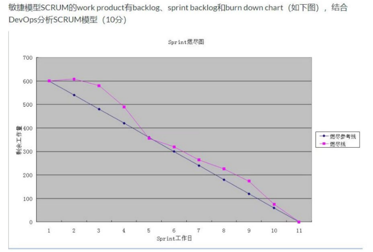
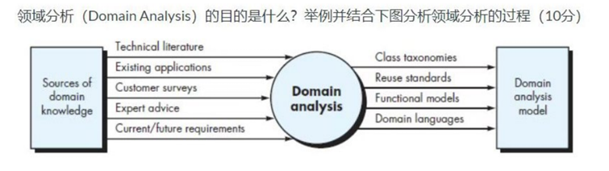
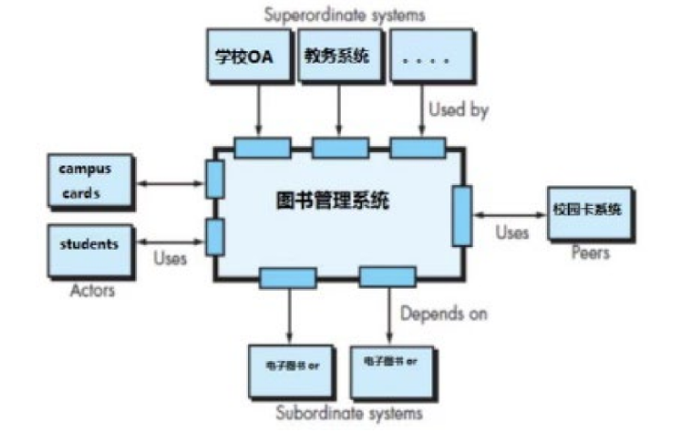
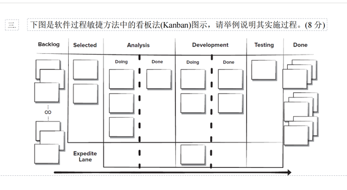
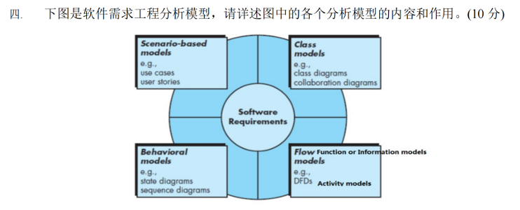
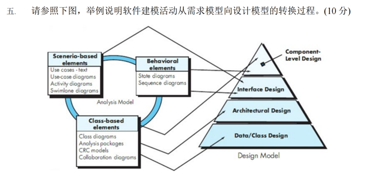

# 大题背诵

## 结合DevOps分析SCRUM模型

答：

* DevOps环境中，SCRUM模型通过其核心工作产品，如产品代办列表（Backlog），冲刺（Sprint）代办列表和燃尽图支持持续开发、测试、集成、部署和监控
  * 产品代办列表：产品负责人根据业务价值和优先级动态维护、提供后续迭代工作来源
  * 冲刺（Sprint）代办列表：团队每次在例会上选取高优先级需求
  * 燃尽图：展示剩余工作量随时间变化关系。蓝色为理想、粉色为实际（结合图具体分析）
* SCRUM和DevOps结合：
  * DevOps强调开发与运维融合，借助⾃动化⼯具、持续集成与交付，加速迭代部署与反馈。
  * 将DevOps流⽔线与SCRUM短迭代结合，可快速将增量功能上线并根据实时反馈优化。（加速迭代）
  * 利⽤燃尽图与持续集成⼯具，团队能更有效监控进度、优化流程，缩短交付周期，不
    断提升产品质量与⽤⼾满意度。（SCRUM产品优化流程）

## 软件领域分析的目的、过程

答：

* 领域分析的目的：
  * 识别适⽤于域内所有应⽤系统的共同问题
  * 查找或创建⼴泛应⽤的分析类或分析模式，使其能够复⽤。
* 领域分析过程（结合具体领域分析）
  * 输入过程（收集领域知识）
    * 技术文献：阅读行业标准
    * 现有应用：调研已有平台
    * 客户调研：访谈商家、用户，了解行业痛点
    * 专家建议：咨询技术专家，获取相关建议
    * 当前/未来需求：
  * 领域分析
    * 提炼共性与差异
    * 建立分析模型
  * 输出内容
    * 类分类结果：清晰描述系统主体间的关系
    * 复用标准：提供标准接口和可复用模块
    * 功能模型：展示核心功能交互方式
    * 领域语言：统一术语和规范

## 类之间的关系、举例分析

* 继承/泛化：⼦类继承⽗类的属性和⽅法，可扩展或重写父类功能
  * 举例：鸟和麻雀
* 实现：类对接口的实现，需提供接口定义方法的具体逻辑、
  * 举例：图形
* 关联：类之间的关系，可单向或双向，存在一对一、一对多、多对多的关系
  * 举例：顾客和订单
* 聚合：整体和部分，部分可以脱离整体存在
  * 举例：公司和员工
* 组合：整体和部分，部分不能脱离整体存在
  * 举例：人和心脏
* 依赖：类之间的临时使用，用于参数传递或方法调用

## 分析系统架构设计图

* 系统交互关系
  * 上层系统（要调用本系统的系统）：作为教务/OA的一部分，为学生提供xxx服务
  * 下层系统（目标系统要访问的系统）：依赖电子书库等系统提供xxx支持
  * 同级系统：与校园卡系统协同工作
  * 参与者：学生通过此系统完成xxx工作
* 系统结构
  * 输入输出：通过明确接口（小方块）与其他系统和外部用户交互
  * 输入为学生操作、校园卡信息认证
  * 输出为借阅记录、剩余库存等
* 系统设计要点
  * 系统通过与其他系统交互，保持独⽴性，并且扩展时仅需修改相关模块，松耦合与⾼内聚，且具有拓展性。

## 举例说明：软件过程框架活动及其实施过程

以课程项目为例：

* 沟通：与客⼾及相关利益者进⾏需求沟通，收集项⽬⽬标和特性要求。
  * 比如项目和相关用户沟通交流
* 策划：制定项⽬计划，定义技术任务和资源需求。
  * 为课程项目指定功能列表、完成期限、开会频率等
* 建模：基于需求创建系统模型和软件设计。
  * 在正式编码前进行需求建模、用例图绘制、架构设计等
* 构建：实现软件功能，编码、调试、测试直⾄⽣成完整的可运⾏系统。
  * 正式编码阶段逐一完成既定功能
* 部署：将软件交付⽤⼾并接受反馈
  * 交付给老师

## 举例说明敏捷开发中看板的实施过程

* Backlog待办事项：待开发的功能或任务
* Selected已选择：团队从Backlog选择高优先级任务进行分析
* Analysis分析阶段：Doing为正在分析，Done为完成分析
* Development开发阶段：Doing为正在编码实现，Done为完成编码
* Testing测试阶段：编码功能验证
* Done完成：已完成任务
* Expedite Lane：加急通道，特殊任务走这个

## 分析软件需求工程中，分析模型的内容和作用

* 基于场景的模型（用例图）
  * 内容：通过用例图和用户故事表述如何和系统进行交互，展示系统在不同场景下的行为
  * 作用：直观描述系统和外部用户的交互
* 基于类的模型（类图）
  * 内容：通过类图和协作图描述对象之间的交互和关系
  * 作用：定义系统的静态结构，明确系统中类及其属性、操作和关系
* 基于行为的模型（状态图、序列图）
  * 内容：使⽤状态图和序列图描述系统的动态⾏为，展⽰外部事件如何改变系统的状态
  * 作用：描述系统对外部输⼊或事件的响应，展⽰状态随时间变化的逻辑和事件流转，便于分析系统⾏为。
* 基于工作流的模型
  * 内容：使⽤数据流图和活动图描述了数据对象在流过各种系统功能时是如何转换的。
  * 作用：描述数据在系统内的流动、转换和处理

## 举例说明应用中交互建模，功能建模，内容建模，导航建模之间的关系

交互建模、功能建模、内容建模和导航建模相互关联，共同构建⽤⼾体验。以下以⼀个在线购物应⽤为例说明其关系：

* 内容建模：**确定应⽤需要展⽰的所有内容**，如产品描述、图⽚、价格、⽤⼾评论等。
* 交互建模：**描述⽤⼾如何与应⽤互动**，通过⽤例或⽤⼾界⾯原型展⽰⽤⼾操作流程，如⽤⼾选择产品后点击“添加到购物⻋ˮ按钮。
* 功能建模：**定义应⽤需要实现的具体功能**，如搜索功能、⽀付功能等。确保每个⽤⼾操作背后都有相应逻辑⽀持，例如“添加到购物⻋ˮ功能会调⽤库存检查和购物⻋更新操作。
* 导航建模：**设计⽤⼾在应⽤中的移动路径**，如从⾸⻚到产品列表，再到产品详情
  ⻚。确保⽤⼾能顺畅地找到所需内容。

关系说明：

* 内容建模提供了⽤⼾交互和功能实现的基础内容。
* 交互建模依赖于内容和功能模型，定义⽤⼾如何利⽤这些内容和功能。
* 功能建模⽀持交互过程中的各种操作，确保⽤⼾需求得到满⾜。
* 导航建模则协调⽤⼾在内容和功能之间的流畅切换，提升整体使⽤体验。

## 举例说明软件建模活动从需求模型向设计模型转换过程

* 输入：基于场景元素、基于行为元素、基于类的元素
* 输出：组件设计、接口设计、结构设计、数据/类设计
* 数据或类设计：将类模型转化为设计类的实现。需求阶段⽤类图表⽰“图书ˮ“读者ˮ等类及关系，设计阶段细化为实现类（类图）
* 结构设计：定义软件主要结构元素关系。需求阶段⽤⽤例图描述“借阅图书ˮ功能，设计阶段选⽤三层架构，将功能划分为表现层、业务逻辑层和数据层。（用例图）
* 接口设计：描述了软件和协助系统、使⽤⼈员之间的通信⽅式。：需求阶段⽤泳道图描述“登录系统ˮ交互流程，设计阶段细化为API接⼝（泳道图）
* 组件设计：需求阶段⽤顺序图表⽰“借阅图书ˮ流程，设计阶段将其转化为“借阅管理模块”

## 举例描述Scrum开发过程

* 确定Scrum角色
  * 指导老师
  * 小组长
  * 小组成员
* 流程
  * 确定产品待定项
  * 举行Sprint会议
  * 每日Scrum例会
  * Sprint冲刺（开发）
  * Sprint评审会议
  * Sprint回顾会议
  * 演示Demo

## 需求工程任务步骤，有哪些产出？

* 初始化
  * 确定对问题的基本理解
  * 产出：项目愿景文档、初步需求说明
* 

## 需求规约、需求分析规约、设计建模之间的关系

* 需求规约：全⾯、详细描述系统功能和⾮功能需求的⽂档。
  * 内容包括：功能需求、非功能需求、业务规则、约束条件等
* 需求分析规约：在需求规约基础上，深⼊分析和细化需求的⽂档。
  * 内容包括：需求分类、用例分析、数据建模、流程建模
* 设计建模：基于需求分析，详细设计系统结构和组件的过程。
  * 内容包括：设计类图、架构图、部署图等
* 三者关系：
  * 递进：需求规约是做什么，需求分析规约是如何做，设计建模是具体实现
  * 依赖：设计建模基于需求分析，需求分析规约基于需求规约

## 软件过程框架中，活动、动作和任务之间的关系

* 框架活动适用于所有项目的高层次宽泛的目标
* 每个框架活动包含多个动作，动作包含了主要⼯作产品⽣产过程中的⼀系列任务
* 任务关注小而明确的目标，是具体执行的工作

用例图

系统状态图

体系结构（架构图）

实体类设计

非功能需求

用例图

状态图

分析类图

分析类到设计类转化

非功能需求

## 软件质量分析

## 代码重构方式
