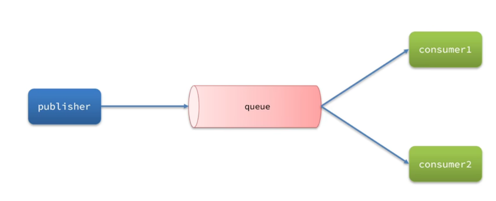
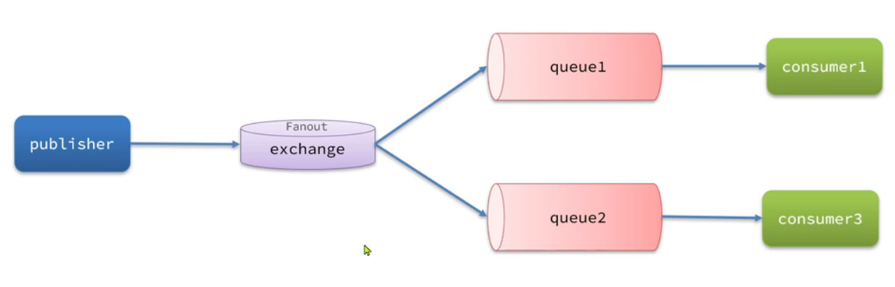
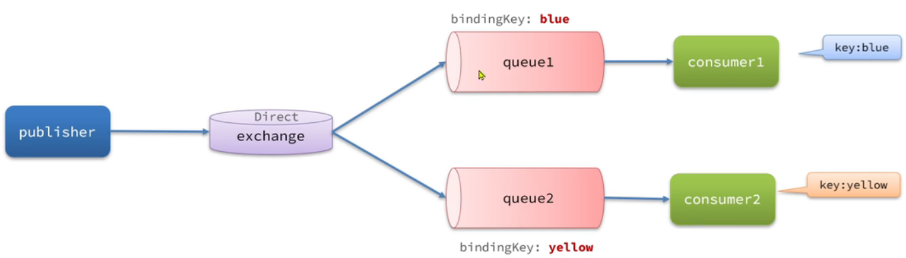
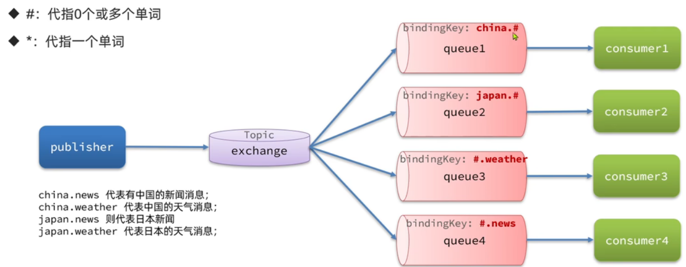
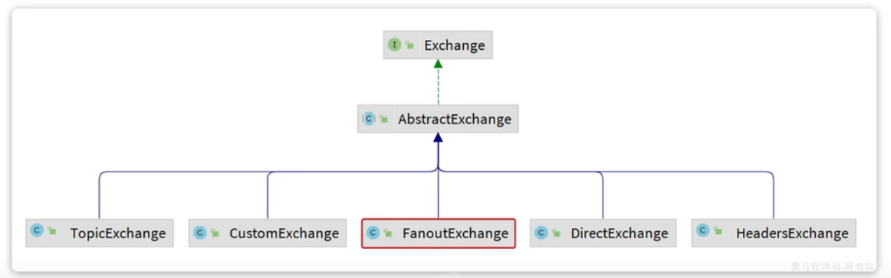

# RabbitMQ

* AMQP（Advanced Message Queuing Protocol）：用于在应用程序之间传递业务消息的开放标准，和语言无关
* Spring AMQP：基于AMQP协议定义的一套API规范

## 工作队列



### 公平分发/轮询分发

公平分发，RabbitMQ将按顺序将每条消息发送到下一个消费者，忽略消息量和消费者处理能力

## 发布/订阅

* Fanout交换机：广播



## 路由



* Direct交换机：将消息根据规则路由到指定的Queue
* 每个队列都和交换机设置一个BindingKey
* 发送消息时，指定消息的RoutingKey
* 交换机将消息路由到Key一致的队列
* BindingKey一样，就是广播效果

## 主题



* Topic交换机
* RoutingKey可以是多个单词的列表，并且以 `.`分割
* BindingKey可以使用通配符
  * `#`：表示0个或多个单词
  * `*`：代指一个单词

## 声明队列/交换机

* Queue：用于声明队列，可以用工厂类QueueBuilder创建
* Exchange：用于声明交换机，可以用工厂类ExchangeBuilder创建
* Binding：用于声明队列和交换机的绑定关系，可以用工厂类BindingBuilder创建



## 消息转化器

# 数据可靠性

## 生产者可靠性

### 重连机制

```xml
  rabbitmq:
    connection-timeout: 1s
    template:
      retry:
        enabled: true # 开启消息重试
        initial-interval: 1000ms # 第一次重试的间隔时间
        multiplier: 1 # 重试的间隔时间倍数
        max-attempts: 3 # 最大重试次数
```

### 确认机制

* 返回ACK投递成功的情况
  * 消息投递到MQ但是路由失败（代码问题/配置问题）
  * 临时消息投递到MQ，并且入队成功
  * 持久消息投递到MQ，并且完成入队持久化
* 其他情况都返回NACK表示投递失败

## MQ可靠性

* 默认情况下，RabbitMQ将收到的信息保存在内存中以降低延迟
  * 一旦MQ宕机，内存的消息就丢失了
  * 内存空间有限，消费者鼓掌或者处理过慢时，会导致消息积压，引发MQ阻塞
* 数据持久化
  * 交换机持久化
  * 队列持久化
  * 消息持久化
* 惰性队列
  * 接收到消息后直接存入磁盘而非内存
  * 消费者要消费信息才能从磁盘中读取并加载到内存
  * 支持百万级别消息存储

## 消费者可靠性

### 消费者确认机制

* 消费者处理消息结束后，向RabbitMQ发送回执
  * ack：成功处理消息，RabbitMQ从队列中删除消息
  * nack：消息处理失败，RabbitMQ需要再次投递消息
  * reject：消息处理失败并拒绝消息，RabbitMQ从队列中删除消息
* SpringAMQP的消息确认机制
  * none：不处理。消息投递给消费者后立即ack，消息从队列中删除。很不安全，不建议用
  * manual：手动模式。需要自己在业务代码调用api，发送ack或者reject。存在业务入侵，但灵活
  * auto：自动模式。
    * 业务正常返回ack
    * 业务异常返回nack
    * 消息处理校验异常返回reject

### 失败重试处理

* 默认情况下，消费者出现异常后，消息会不断重新入队到队列在发送给消费者，再次异常，恶性循环
* 需要开启重试机制
* 若重试次数耗尽仍然失败，需要由 `MessageRecoverer`接口处理
  * `RejectAndDontRequeueRecoverer`：重试耗尽后，直接reject丢弃消息（默认方式）
  * `ImmediateRequeueMessageRecoverer`：重试耗尽后，返回nack，消息重新入队
  * `RepublishMessageRecoverer`：重试耗尽后，将失败消息投递到指定的交换机

### 业务幂等性

* 唯一消息id
  * 每条消息都会生成唯一的id，和消息一起投递给消费者
  * 消费者收到消息后处理业务，并将ID保存到数据库
  * 如果下次收到相同消息，则查询数据库，存在相同消息则放弃处理
  * 会产生额外的性能开销
* 业务判断
  * 基于业务本身判断是否需要修改
  * 但是不具备通用性

## 延迟消息

* 生产者发送消息指定时间，指定时间之后才收到消息

### 死信交换机

* 消息满足以下条件之一会成为死信：
  * 消费者使用reject或nack说明消费失败，并且消息的requeue参数设置为false
  * 消息是一个过期消息，超时无人消费
  * 需要投递的队列消息队积满了，最早的消息可能成为死信

### 延迟消息插件

* 插件设计了一种支持延迟功能的交换机，当消息投递到交换机后可以暂存一定时间，到期后再回到队列
* 发送消息时需要通过消息头x-delay设置过期时间
