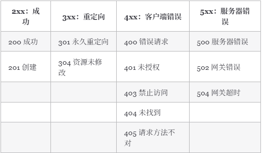

# RESTful API

* **URL+Http Method**

## REST

* 资源resource

  * 真实的数据对象
  * 可以是集合、可以是单个个体
  * 每一种资源都有特定的 URI（统一资源标识符）与之对应，如果我们需要获取这个资源，访问这个 URI 就可以了
  * 资源可以包含子资源
* 表现形式representational

  * "资源"具体呈现出来的形式做它的"表现层/表现形式"
  * 如 `json`，`xml`，`image`，`txt`等
* 状态转移state transfer

  * 描述的服务器端资源的状态
  * 比如通过增删改查（通过 HTTP 动词实现）引起资源状态的改变。
* RESTful 架构

  * 每一个 URI 代表一种资源；
  * 客户端和服务器之间，传递这种资源的某种表现形式比如 `json`，`xml`，`image`,`txt` 等等；
  * 客户端通过特定的 HTTP 动词，对服务器端资源进行操作，实现"表现层状态转化"。

## RESTful API 规范

### 动作

* `GET`：请求从服务器获取特定资源
* `POST`：在服务器上创建一个新的资源
* `PUT`：更新服务器上的资源（客户端提供更新后的整个资源）
* `DELETE`：从服务器删除特定的资源
* `PATCH`：更新服务器上的资源（客户端提供更改的属性，可以看做作是部分更新）

### 路径（接口命名）规范

* **网址中不能有动词，只能有名词，API 中的名词也应该使用复数。**
* **不用大写字母，建议用中杠 - 不用下杠 _**
* **善用版本化 API**
* **接口尽量使用名词，避免使用动词**，RESTful API 操作（HTTP Method）的是资源（名词）而不是动作（动词）

  ```
  GET    /classes：列出所有班级
  POST   /classes：新建一个班级
  GET    /classes/{classId}：获取某个指定班级的信息
  PUT    /classes/{classId}：更新某个指定班级的信息（一般倾向整体更新）
  PATCH  /classes/{classId}：更新某个指定班级的信息（一般倾向部分更新）
  DELETE /classes/{classId}：删除某个班级
  GET    /classes/{classId}/teachers：列出某个指定班级的所有老师的信息
  GET    /classes/{classId}/students：列出某个指定班级的所有学生的信息
  DELETE /classes/{classId}/teachers/{ID}：删除某个指定班级下的指定的老师的信息
  ```

### 过滤信息

### 状态码


