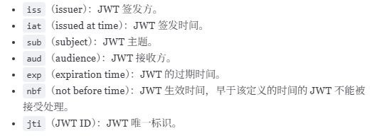

# 基础

## 多服务器节点Session-Cookie

* 某个用户的所有请求都通过特性的哈希策略分配给同一个服务器处理（服务器宕机，相关session完全丢失）
* 每一个服务器保存的 Session 信息都是互相同步的（成本大，耗时）
* 单独使用一个所有服务器都能访问到的数据节点（比如缓存）来存放 Session 信息
* 通过 Spring Session，可以将会话数据存储在共享的外部存储中，以实现跨服务器的会话同步和共享。

## 没有Cookie的话Session还能用吗

* 可以将 `SessionID` 放在请求的 `url` 里面 `https://javaguide.cn/?Session_id=xxx` 。
* 这种方案的话可行，但是安全性和用户体验感降低。当然，为了安全你也可以对 `SessionID` 进行一次加密之后再传入后端

## SSO

* 单点登录：用户登陆多个子系统的其中一个就有权访问与其相关的其他系统
* **用户角度** :用户能够做到一次登录多次使用，无需记录多套用户名和密码，省心。
* **系统管理员角度** : 管理员只需维护好一个统一的账号中心就可以了，方便。
* **新系统开发角度:** 新系统开发时只需直接对接统一的账号中心即可，简化开发流程，省时。

## *OAuth2.0*

* 一种授权机制，为第三方应用颁发一个有时效性的令牌 Token，使得第三方应用能够通过该令牌获取相关的资源。

# JWT

## 概念

JWT 本质上就是一组字串，通过（`.`）切分成三个为 Base64 编码的部分：

* **Header（头部）** : 描述 JWT 的元数据，定义了生成签名的算法以及 `Token` 的类型。Header 被 Base64Url 编码后成为 JWT 的第一部分。

  * `typ`（Type）：令牌类型，也就是 JWT。
  * `alg`（Algorithm）：签名算法，比如 HS256。
* **Payload（载荷）** : 用来存放实际需要传递的数据，

  * 包含声明（Claims），如 `sub`（subject，主题）、`jti`（JWT ID）。Payload 被 Base64Url 编码后成为 JWT 的第二部分。
  * **Registered Claims（注册声明）** ：预定义的一些声明，建议使用，但不是强制性的。
  * **Public Claims（公有声明）** ：JWT 签发方可以自定义的声明，但是为了避免冲突，应该在 [IANA JSON Web Token Registry](https://www.iana.org/assignments/jwt/jwt.xhtml) 中定义它们。
  * **Private Claims（私有声明）** ：JWT 签发方因为项目需要而自定义的声明，更符合实际项目场景使用。
  * 
  * payload不加密，不要将隐私信息放在payload中
* **Signature（签名）** ：服务器通过 Payload、Header 和一个密钥(Secret)使用 Header 里面指定的签名算法（默认是 HMAC SHA256）生成。生成的签名会成为 JWT 的第三部分。

  * 生成签名需要：Header+Payload+签名算法+存放在服务器端的密钥
  * ```
    HMACSHA256(
      base64UrlEncode(header) + "." +
      base64UrlEncode(payload),
      secret)
    ```

## JWT认证过程

* 用户向服务器发送用户名、密码以及验证码用于登陆系统；
* 如果用户用户名、密码以及验证码校验正确的话，服务端会返回已经签名的 Token，也就是 JWT；
* 客户端收到 Token 后自己保存起来（比如浏览器的 `localStorage` ）；
* 用户以后每次向后端发请求都在 Header 中带上这个 JWT ；
* 服务端检查 JWT 并从中获取用户相关信息。
* 使用建议：
  * 建议将 JWT 存放在 localStorage 中，放在 Cookie 中会有 CSRF 风险。
  * 请求服务端并携带 JWT 的常见做法是将其放在 HTTP Header 的 `Authorization` 字段中（`Authorization: Bearer Token`）。

# 优势

* 无状态，不可控
* 避免CSRF攻击
* 适合移动端
* 单点登录友好

# 身份认证问题解决方法

* 场景
  * 注销登录
  * 退出登录;
  * 修改密码;
  * 服务端修改了某个用户具有的权限或者角色；
  * 用户的帐户被封禁/删除；
* 解决方案
  * JWT存入数据库（从Redis删除，增加开销，违背无状态原则）
  * 黑名单机制（Redis是黑名单，虽然违背原则但一般使用1-2）
  * 修改密钥（分布式需同步，无法多端登录）
  * 缩短令牌有效期+轮换（需要经常登录，麻烦）

# JWT续签

* **假如 Session 的有效期 30 分钟，如果 30 分钟内用户有访问，就把 Session 有效期延长 30 分钟。**
* 方法：
  * 类似session（不推荐，对客户端不友好）
  * 每次请求都返回新 JWT（不推荐，开销大）
  * JWT 有效期设置到半夜（不推荐，安全性不高）
  * 用户登录返回两个 JWT（推荐）：
    * accessJWT过期时间短，refreshJWT过期时间长，用户获取accessJWT
    * 客户端登录后，将 accessJWT 和 refreshJWT 保存在本地，每次访问将 accessJWT 传给服务端。
    * 服务端校验 accessJWT 的有效性，如果过期，就将 refreshJWT 传给服务端。如果有效，服务端就生成新的 accessJWT 给客户端。否则，客户端就重新登录即可。

# JWT体积太大

* 尽量减少 JWT Payload（载荷）中的信息，只保留必要的用户和权限信息。
* 在传输 JWT 之前，使用压缩算法（如 GZIP）对 JWT 进行压缩以减少体积。
* 在某些情况下，使用传统的 Token 可能更合适。传统的 Token 通常只是一个唯一标识符，对应的信息（例如用户 ID、Token 过期时间、权限信息）存储在服务端，通常会通过 Redis 保存。and-disadvantages-of-jwt.html
