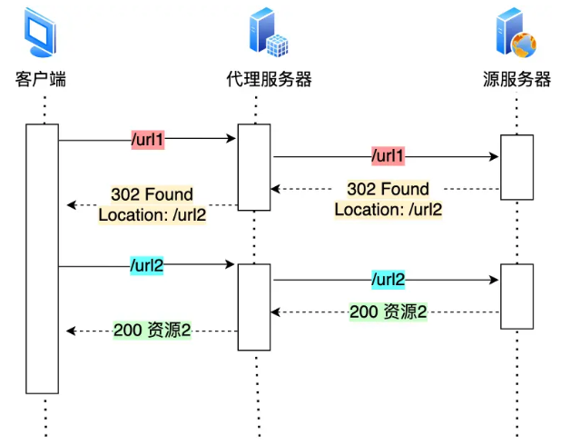
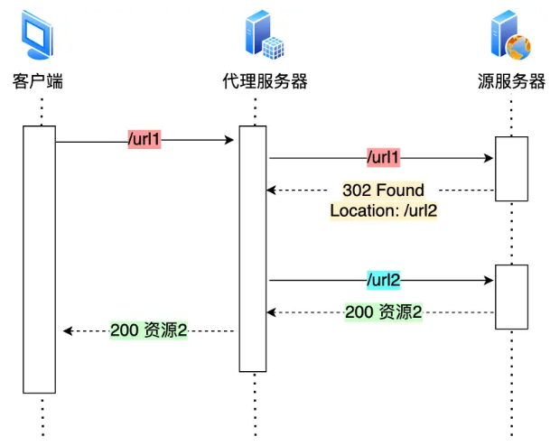
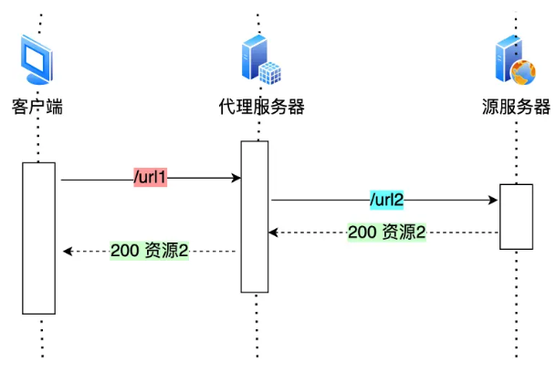
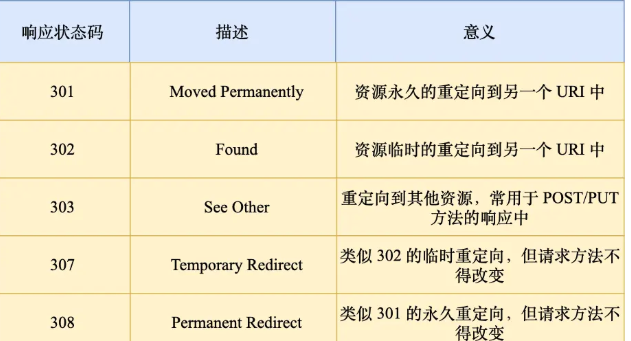

# HTTP/1.1优化

## 尽量避免发送HTTP请求

* 缓存技术

## 减少HTTP请求次数

### 减少重定向请求次数

* 重定向工作交给服务器

  
* 
* 代理服务器知晓重定向规则
* 
* 
* 301和308可以缓存

### 合并请求

* 把多个访问小文件的请求合并成一个大的请求（比如请求网页图片）
* 减少重复的HTTP头部，减少TCP的数量
* 将 js、css 等资源合并打包成大文件
* 将图片的二进制数据用 `base64` 编码，以URL形式嵌入道HTML文件，跟随 HTML 文件一并发送

### 延迟发送请求

* 请求网页的时候，没必要把全部资源都获取到，而是只获取当前用户所看到的页面资源，当用户向下滑动页面的时候，再向服务器获取接下来的资源。

## 减少服务器HTTP响应数据大小

### 无损压缩

* 资源经过压缩后，信息不被破坏
  * 适用范围：文本文件、程序可执行文件、程序源代码
* 步骤
  * 去掉换行符、空格等
  * 用哈夫曼编码生成二进制序=序列

### 有损压缩

* 解压的数据会与原始数据不同但是非常接近。
  * 音视频、图片
