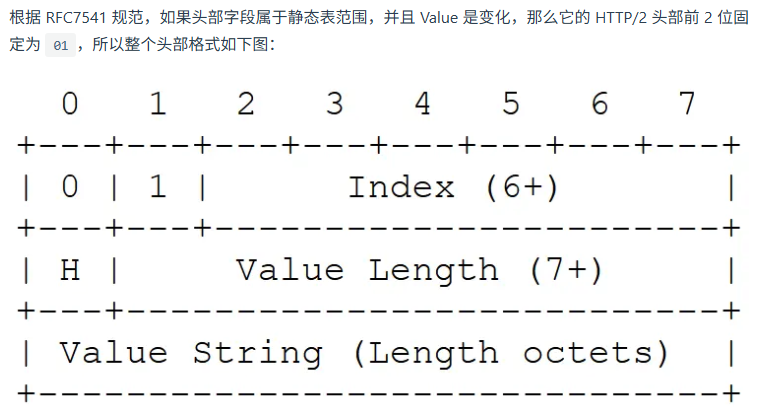
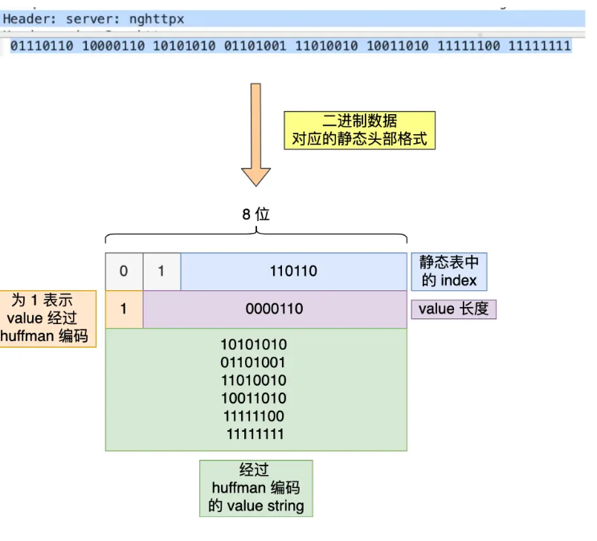
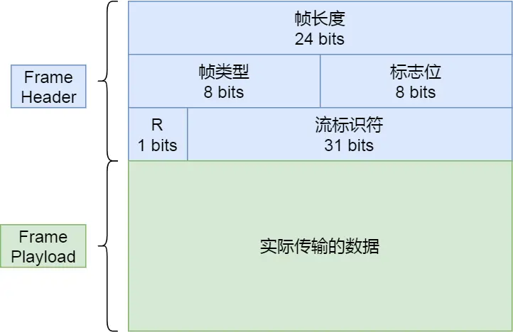

# HTTP2

## HTTP/1.1性能问题

* 延迟难以下降
* 并发连接有限
* 队头阻塞问题
* HTTP头部巨大且重复
* 不支持服务器推送消息

## 兼容HTTP/1.1

* HTTP/2 仍然使用 `http://`表示明文协议，用`https://`表示加密协议，只需要浏览器和服务器在背后自动升级协议
* 只改变了应用层。基于TCP传输
* 将 HTTP 分解成 **语义** 和 **语法** 两部分，语义不做改动，语法改造

## 头部压缩

* HTTP 协议的报文由 Header + Body 构成，HTTP/1.1 可以压缩Body，但是没有优化Header的手段
* Header 部分存在的问题
  * 含有很多固定字段，**需要压缩**
  * 请求和响应报文存在很多重复，**需要避免**
  * 字段为ASCII编码，效率低，**需要改为二进制**
* HTTP/2 开发 HPACK算法压缩头部
  * 算法主要包括：静态字典、动态字典，Huffman编码
  * 客户端和服务器维护字典

### 静态表编码

* `Index` 表示索引（Key），`Header Value` 表示索引对应的 Value，`Header Name`表示字段的名称
* 没有对应 Header Value 的 Index，因为这些Value需要经过Huffman编码才会发送出去

### 动态表编码

* 不在静态表范围内的头部字符串就要自行构建**动态表，Index 从 `62` 起步，会在编码解码的时候随时更新**
* 动态表起作用前提：**必须同一个连接上，重复传输完全相同的 HTTP 头部**
* 请求数量上限后，会关闭HTTP/2释放内存

## 二进制帧

* HTTP/2 将 HTTP/1 的文本格式改成二进制格式传输数据，极大提高了 HTTP 传输效率
* HTTP/2 把响应报文划分成了两类**帧（Frame）**
  * 首部 Header
  * 消息负载 DATA

* 帧头
  * 帧长度
  * 帧类型，共十种
  * 
  * 标志位，携带简单控制信息
  * 流标识符，标识该帧属于哪个Stream
  * 帧数据

## 并发传输

* HTTP/2通过多个 Stream 复用一条 TCP 连接，达到并发的效果

* 1 个 TCP 连接包含一个或者多个 Stream
* Stream 里可以包含 1 个或多个 Message，Message 对应 HTTP/1 中的请求或响应，由 HTTP 头部和包体组成
* Message 里包含一条或者多个 Frame，Frame 是 HTTP/2 最小单位，以二进制格式存放 HTTP/1 的内容
* 不同Stream中的帧可以乱序发送（因为每个帧都有Stream ID信息），同一Stream中的必须是有序的

## 服务器主动推送资源

* 客户端发起的请求，必须使用的是奇数号 Stream；服务器主动的推送，使用的是偶数号 Stream
* 服务器在推送资源时，会通过 `PUSH_PROMISE` 帧传输 HTTP 头部，并通过帧中的 `Promised Stream ID` 字段告知客户端，接下来会在哪个偶数号 Stream 中发送包体。
