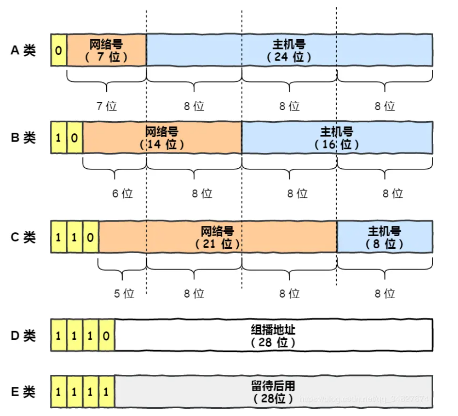
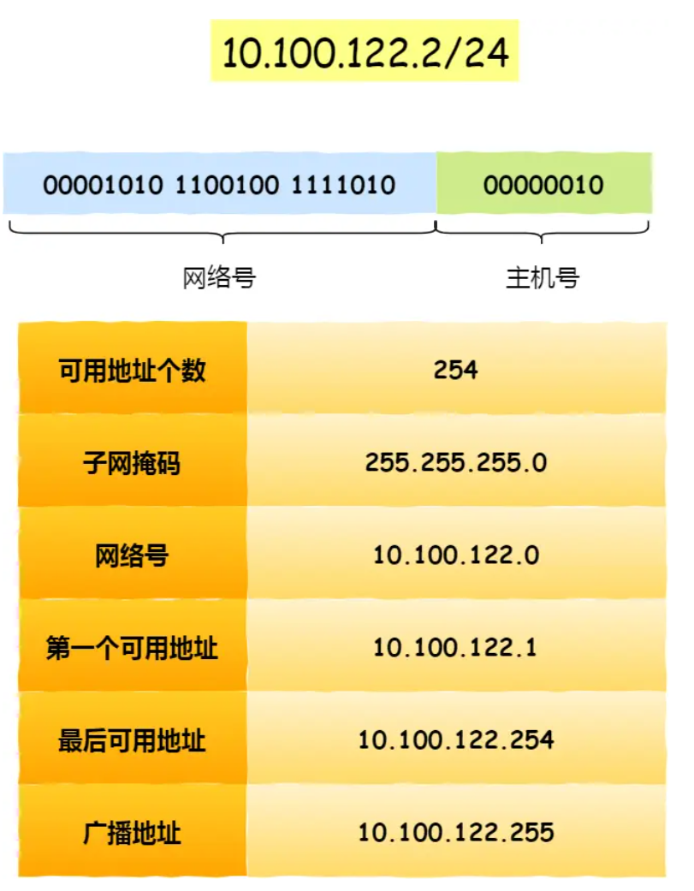
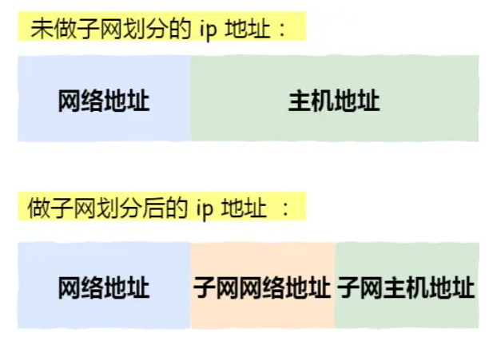
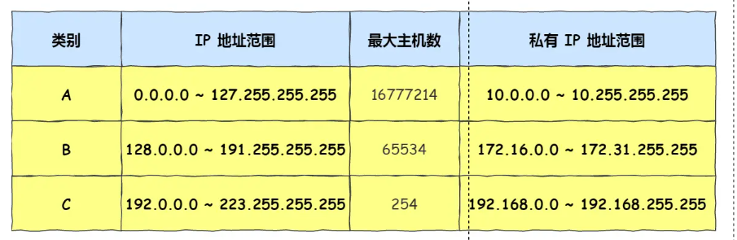
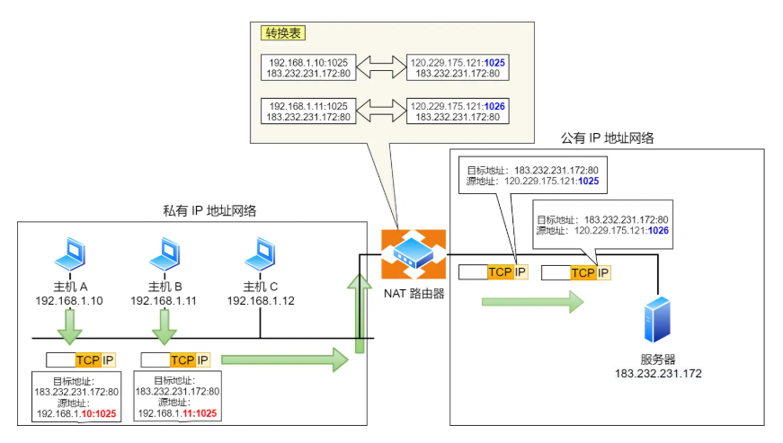
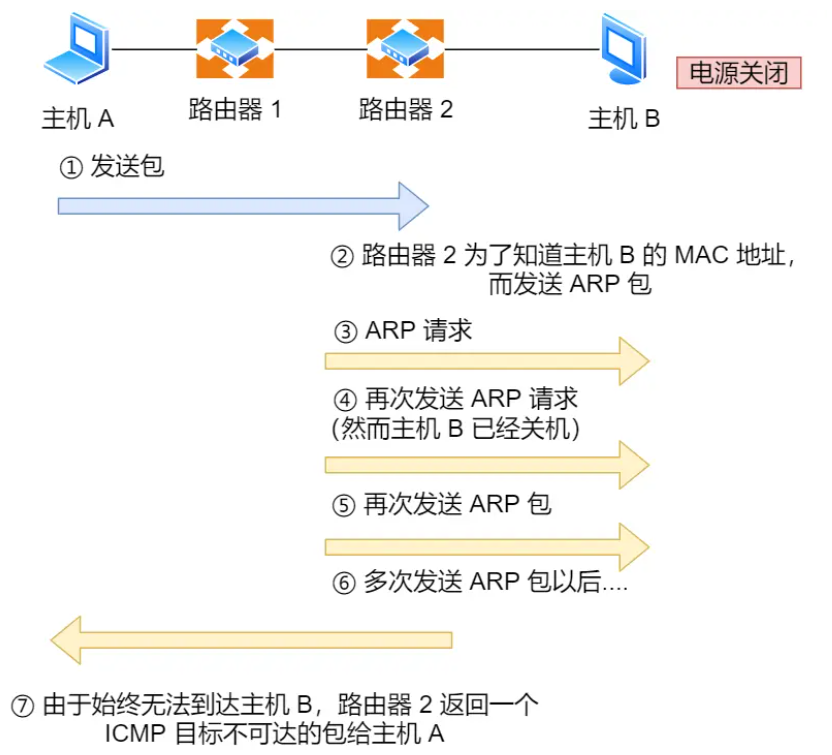

# IP基本认知

* IP 在 TCP/IP 参考模型中处于网络层
* 网络层主要作用：实现主机和主机的通信（点对点通信）
* MAC层是实现“直连”的两个设备之间的通信，IP负责在“没有直连”的设备之间通信

# IP基础知识

## IP地址

* IP 地址（IPv4 地址）由 `32` 位正整数来表示，IP 地址在计算机是以二进制的方式处理的。
* 采用点分十进制的标记方式

## IP地址分类

### A、B、C类地址

* A、B、C类地址：分为网络号和主机号
* 最大主机个数=2**主机号位数-2
* 全 1 主机号指定某个网路下的所有主机，用于广播
* 全 0 主机号指定某个网络

### 广播地址

* 用于在**同一个链路中相互连接的主机之间发送数据包**
* 分类
  * 本地广播：在本网络内广播。例如网络地址为 192.168.0.0/24 的情况下，广播地址是 192.168.0.255
  * 直接广播：在不同网络之间的广播。例如网络地址为 192.168.0.0/24 的主机向 192.168.1.255/24 的目标地址发送IP包

### D、E类地址

* 这两类地址没有主机号，不可用于主机IP
* D类通常用于多播、E类是预留的分类，暂未使用
* 多播用于**将包发送给特定组内的所有主机**

### IP分类优缺点

* 优点
  * 简单明了，能够快速定位地址类型，选路简单
* 缺点
  * 同一网络下没有地址层次，缺少地址灵活性
  * 不能很好地和现实网络匹配：C类网络数量太少、B类又太多

## 无分类地址CDIR

### 网络号和主机号

* 32 比特的 IP 地址被划分为两部分，前面是 **网络号** ，后面是**主机号**
* 表示形式 `a.b.c.d/x`，其中 `/x` 表示前 x 位属于 **网络号** ， x 的范围是 `0 ~ 32`
* 子网掩码：子网掩码和IP地址按位与计算可以得到网络号

* 分离网络号和主机号
  * 计算机之间通讯，需要先判断是否处于同一个广播域内（网络地址是否相同），如果处于，可以直接发送数据包到目标主机

### 子网划分

* 将主机地址分为两个部分：子网网络地址和子网主机地址

## 公有IP地址和私有IP地址

* 私有IP地址可以自己管理
* 公有IP地址需要组织统一分配

## IP地址与路由控制

* 在发送 IP 包时，首先要确定 IP 包首部中的目标地址，再从路由控制表中找到与该地址具有**相同网络地址**的记录，根据该记录将 IP 包转发给相应的下一个路由器
* 如果路由控制表中存在多条相同网络地址的记录，就选择相同位数最多的网络地址，也就是最长匹配

## IP分片与重组

* 以太网的 MTU 是 `1500` 字节
* 当 IP 数据包大于 MTU 时，IP数据包就会被分片
* IP重组只能在目标主机进行
* 分片传输中，一旦一个分片丢失，整个IP数据都作废
  * TCP引入了 `MSS`分片
  * 对于UDP则尽量不要发送大于 `MTU`的数据报文

## IPv6

* IPv4 是32位大约可以提供 42 亿个地址，已经被分配完了
* IPv6 是128位
* IPv6优点：
  * 可自动配置，自动分配IP地址
  * 包头首部长度固定位为40字节，取消校验和，提高传输性能
  * 有应对伪造 IP 地址的网络安全功能以及防止线路窃听的功能，安全性提高
* 限制：和IPv4不能兼容，需要电子设备、网络运营商支持

### IPv6地址结构

* IPv6地址类型：
  * 单播地址，用于一对一通信
  * 组播地址，用于一对多通信
  * 任播地址，用于通信最近节点
* IPv6 单播地址类型
  * 链路本地单播地址：在同一链路单播通信，不经过路由器。IPv4 没有此类型
  * 唯一本地地址：在内网里单播通信。相当于 IPv4 的私有 IP
  * 全局单薄地址：在互联网通信。相当于 IPv4 的公有 IP

### IPv4和IPv6首部

* 取消了首部校验和字段：数据链路层和传输层都会校验
* 取消了分片/重组相关字段：IPv6 不允许在中间路由器进行分片与重组
* 取消选项字段

# IP 协议相关技术

## DNS 域名解析

## ARP 和 RARP 协议

* ARP 协议：获取下一跳的MAC地址
* ARP 协议获取 MAC 地址方法
  * 主机广播发送 ARP 请求，请求包含了想知道的MAC地址的主机的IP地址
  * 同一链路的其他设备收到 ARP 请求时，如果包中目标 IP 地址和自己的 IP 地址一致，则设备将自己的 MAC 地址塞入包中返回给主机
  * 操作系统通常会把第一次通过 ARP 获取的 MAC 地址缓存起来
* RARP 协议：已知 MAC 地址求 IP 地址
* 过程
  * （前置）需要架设一台 `RARP` 服务器，在这个服务器上注册设备的 MAC 地址及其 IP 地址
  * 设备发送「我的 MAC 地址是XXXX，请告诉我，我的IP地址应该是什么」的请求信息
  * RARP 服务器接到这个消息后返回「MAC地址为 XXXX 的设备，IP地址为 XXXX」的信息给这个设备

## DHCP 动态获取 IP 地址

* 客户端首先发起 DHCP 发现报文，使用UDP广播通信，目的地址：255.255.255.255:67，源地址：0.0.0.0:68（因为客户端没有ip地址，也不知道 DHCP 服务器地址。）
* DHCP 服务器收到 DHCP 发现报文时，用DHCP 提供报文向客户端做出响应，仍然使用 IP 广播地址 255.255.255.255。报文信息携带服务器提供可租约的 IP 地址、子网掩码、默认网关、DNS 服务器以及  **IP 地址租用期** 。
* 客户端收到一个或多个服务器的 DHCP 提供报文后，从中选择一个服务器，并向选中的服务器发送 **DHCP 请求报文**
* 服务端用 DHCP ACK报文对请求报文响应，应答要求的参数
* 客户端收到 DHCP ACK 后完成交互，客户端能够在租用期内使用 DHCP 服务器分配的 IP 地址
* 如果DHCP服务器和客户端不在一个局域网内，客户端会向DHCP中继代理发送DHCP 请求包，中继代理收到后会单播发送给DHCP服务器

## NAT 网络地址转换

* 将主机对外部通信时，把私有 IP 地址转换成公有 IP 地址
* 对于不同的私有IP地址，可以转换为同一个公有IP地址，用不同的端口号作为区分

* NAT 缺点
  * 外部无法主动与 NAT 内部服务器建立连接
  * 转换表的生成与转换操作都会产生性能开销
  * 通信过程中，如果 NAT 路由器重启了，所有的 TCP 连接都将被重置
* 改进：IPv6，NAT穿透

## ICMP 互联网控制报文协议

* 主要功能：**确认 IP 包是否成功送达目标地址、报告发送过程中 IP 包被废弃的原因和改善网络设置等**
* `IP` 通信中如果某个 `IP` 包因为某种原因未能达到目标地址，具体的原因将**由 ICMP 负责通知**

* ICMP类型
  * 查询报文：用于诊断的消息
  * 差错报文：通知出错原因

