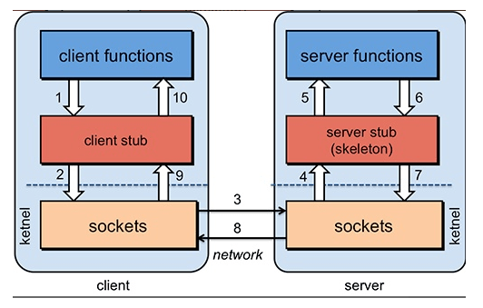

# RPC

* **Remote Procedure Call** ：远程过程调用
* 两个不同服务器上的服务，提供的方法不在一个内存空间，需要通过网络编程来传递方法参数、获取方法结果，手动实现这个过程工作量非常大
* RPC 可以帮助我们调用远程计算机上某个服务的方法，这个过程就像调用本地方法一样简单。并且不需要了解底层细节

## RPC原理

### 主要部分

* 客户端：调用远程方法的一段
* 客户端sub：代理类，将调用方法、类、方法参数等信息传递到服务端
* 网络传输：传递调用方法的信息和方法返回的结果。Socket/Netty
* 服务器stub：接收到客户端执行方法的请求后，去执行对应的方法然后返回结果给客户端的类
* 服务端：提供远程方法的一端、
