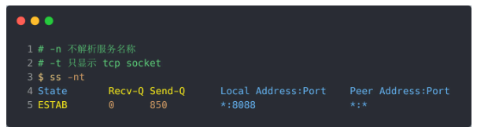

# 半连接队列和全连接队列

* 半连接队列，也称 SYN 队列；
* 全连接队列，也称 accept 队列；

过程：

* 服务端收到客户端发起的 SYN 请求后， **内核会把该连接存储到半连接队列** ，并向客户端响应 SYN+AC
* 接着客户端会返回 ACK
* 服务端收到第三次握手的 ACK 后，**内核会把连接从半连接队列移除，**然后创建新的完全的连接，并将其添加到 accept 队列，**等待进程调用 accept 函数时把连接取出来。******

## TCP全连接队列溢出

### 获取TCP全连接队列大小

* Linux中使 用 `ss`命令，获取 `Recv-Q/Send-Q`，二者在服务端不同状态下的含义不同：
  * LISTEN状态
  * 
    * Recv-Q：当前全连接队列大小
    * Send-Q：当前全连接队列最大长度
  * 非LISTEN状态
  * 
    * Recv-Q：已收到但未被进程读取的字节
    * Send-Q：已发送但未确认收到的字节

### 模拟TCP全连接队列溢出

* 向服务端发送大量请求
* **当超过了 TCP 最大全连接队列，服务端则会丢掉后续进来的 TCP 连接**
* 可以通过参数选择是丢弃还是发送 `reset`包

## TCP半连接队列溢出

### 获取半连接队列长度

`netstat -natp | grep SYN_RECV | wc -l`

### 模拟TCP半连接队列溢出
