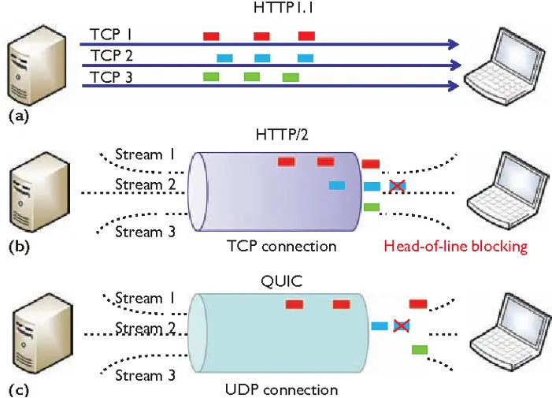
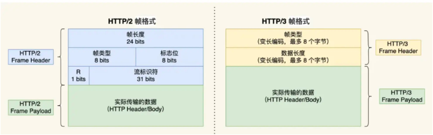

# HTTP/3

## HTTP/2的问题

### 队头阻塞

* TCP丢包时，整个TCP都要重传

### TCP和TLS握手延迟

* TCP三次握手和TLS1.2四次握手需要3个RTT的时延才能发出请求数据
* 刚建立的TCP有一个慢启动的过程

### 网络迁移重连

* 一个TCP连接是由四元组（源 IP 地址，源端口，目标 IP 地址，目标端口）组成的
* 如果 IP 地址或者端口变动，就需要 TCP 和 TLS 重新握手

## QUIC 协议

> 基于UDP的应用层协议

### 无队头阻塞

* UDP不关心数据包的顺序，不怕丢包
* QUIC协议会保证数据包的可靠性
  * 单个流种的数据包丢失了，需要重传
  * 其他流的数据包不受影响
  * 

### 更快的连接建立

* QUIC协议包含了TLS握手只需要 1RTT，握手的目的是为确认双方的「连接 ID」
* 在第二次连接的时候，应用数据包可以和 QUIC 握手信息（连接信息 + TLS 信息）一起发送，达到 0-RTT 的效果

### 连接迁移

* QUIC协议通过**连接 ID** 来标记通信的两个端点

## HTTP/3

