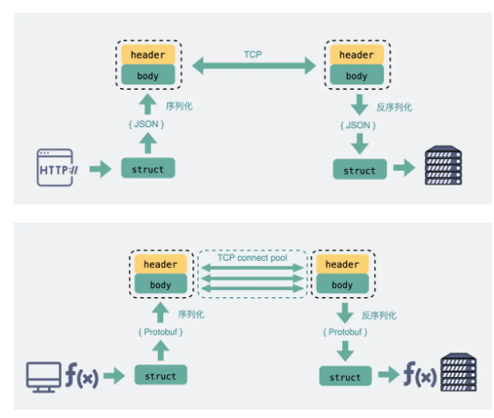
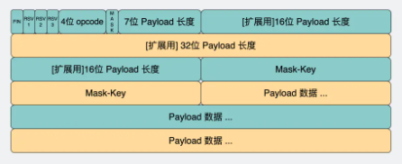

# 裸TCP问题

* TCP特点：面向连接、可靠、基于字节流
* 基于字节流：数据没有边界，粘包问题
* 加入消息头，用于区分消息边界

# HTTP和RPC区别

* HTTP：B/S
* RPC：C/S

## 服务发现

* HTTP：知道服务域名，通过DNS解析IP地址
* RPC：有专门的中间服务保存服务名和IP信息，访问服务需要去中间服务获得IP和端口信息

## 底层连接形式

* HTTP/1.1：建立底层 TCP 连接后会一直保持连接（长连接）
* RPC：存在连接池，请求量大的时候建立多条连接在池内，发数据时从池内取出再放回
* 连接池有助于提升网络请求性能

## 传输的内容

* Header + Body
* HTTP：存在冗余啰嗦数据
* RPC：
  * 定制化程度高，采用体积更小的序列化协议保存结构体数据
  * 不需要考虑浏览器行为
  * 性能更好，公司内部微服务选择RPC
* HTTP/2.0性能改进很多，可能比RPC还好

# HTTP轮询

* 伪服务器推送：
  * 前端代码定时发送请求到服务器
  * 场景：扫码登陆
  * 问题
    * 消耗带宽、增加下游服务器复旦
    * 会卡顿1-2秒，影响用户体验

# 长轮询

* 将HTTP请求超时时间设置的很大，减少请求次数
* 适用简单场景

# WebSocket

## WebSocket连接建立

* 浏览器在 TCP 三次握手之后，发送HTTP协议进行一次通信
  * 升级协议——Connection：Upgrade
  * 升级成WebSocket协议——Upgrade: WebSocket
  * 随机 base64 码
* 服务器用某一个公开的算法将base64码变成字符串，放在HTTP响应的Sec-Websocket-Accept头，并带上101状态码，表示协议转换
* 浏览器使用同样的算法将base64码转化成字符串，验证服务器传回的字符串
* 两次HTTP握手，连接建立完成

## WebSocket消息格式

* opcode：标志数据帧类型
  * 1：text类型
  * 2：二进制数据
  * 8：关闭连接
* payload：传输数据的长度，单位是字节
  * 存在多个存放payload长度的字段
  * WebSocket会用最开始的7bit做标志位
    * 0-125：表示payload的全部长度
    * 126：长度在126-65535之间，需要再读16bit
    * 127：长度≥65536，需要再读64bit
* payload data：存放真正要传输的数据

## 使用场景

* 需要服务器和客户端/浏览器频繁交互
  * 网页/小程序游戏
  * 网页协同办公软件
