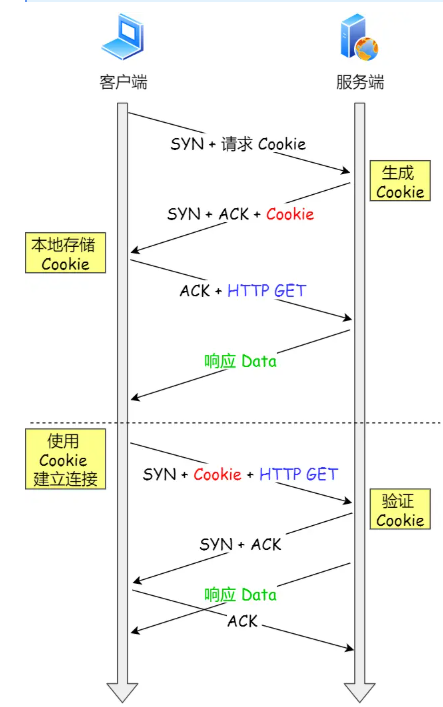
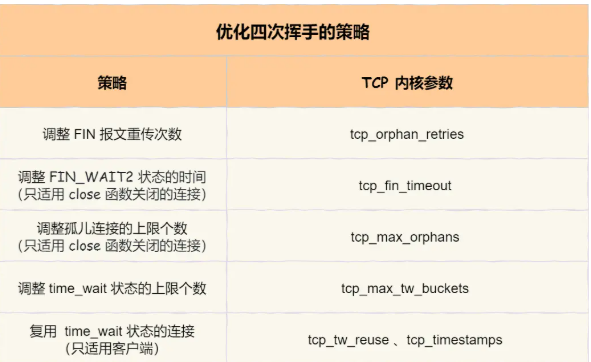

# 三次握手性能提升

背景：

* 三次握手的过程在一个 HTTP 请求的平均时间占比 10% 以上
* 在网络状态不佳、高并发或者遭遇 SYN 攻击等场景中，会对性能产生影响

## 客户端优化

* 修改SYN重传次数，尽快把错误暴露给应用程序

## 服务端优化

* 增大半连接队列大小
* **开启 syncookies 功能：服务器根据当前状态计算出一个值，放在己方发出的SYN+ACK报文，客户端返回ACK报文时，取出该值验证**
* tcp_abort_on_overflow 设为 0，除非TCP全连接队列长期溢出
* 调整全连接队列长度

## 绕过三次握手

### 开启TCP Fast Open功能

客户端首次建立连接：

* 发送SYN报文，该报文含有Fast Open选项，Cookie为空，表示客户端请求Fast Open Cookie
* 服务器生成Cookie，并置于SYN-ACK数据包发给客户端
* 客户端收到SYN-ACK中，缓存选项中的Cookie

客户端再次建立连接：

* 客户端发送SYN报文，包含数据和Cookie
* 服务器收到Cookie，进行校验：Cookie有效则在SYN-ACK报文中对数据表示确认，无效则只确认SYN
* 客户端发送ACK（如果客户端在SYN中的数据没有被确认，则此次会重发）
* 减少一个RTT的时间消耗

# 四次挥手性能提升

## 主动方的优化

* RST报文：直接暴力关闭
* FIN报文：走挥手流程关闭

关闭函数

* close：完全断开连接，无法发送和接收数据，形成“孤儿连接”
* shutdown：可以控制关闭方向

### FIN_WAIT1状态优化

* 但是当迟迟收不到对方返回的 ACK 时，**内核会定时重发 FIN 报文**
* 重传次数超过设定值tcp_orphan_retries时，会直接关掉连接
* 常规情况可以直接调低tcp_orphan_retries，但是遭到恶意攻击则不行，因为FIN报文发不出去：
  * TCP必须有序发送，发送缓冲区还有数据时，FIN无法发送
  * 接收方窗口为0时，发送方也不能发送（攻击者下载大文件）
* **调整 tcp_max_orphans 参数，它定义了「孤儿连接」的最大数量** 。超过这个数量，新增的孤儿连接会直接走RST强制关闭

### FIN_WAIT2状态优化

主动方收到 ACK 报文后，会处于 FIN_WAIT2 状态，等待对方发送FIN报文：

* shutdown关闭，连接还能发送或者接收数据
* close关闭，连接不能再发送或接收数据，这个状态不能持续太久（控制参数tcp_fin_timeout ）

### TIME_WAIT状态优化

* 调整tcp_max_tw_buckets 参数：当TIME_WAIT连接数量超过参数时，新关闭的连接就不会走TIME_WAIT状态而是直接关闭
* （只针对客户端）**打开 tcp_tw_reuse 参数**：建立新连接时，复用处于TIME_WAIT状态的连接
* （只针对客户端）设置socket选项，调用close后立即发送RST，跳过四次挥手

## 被动方的优化

### 双方同时关闭连接

* 两边都认为自己是主动方，都进入FIN_WAIT_1
* 双方都收到FIN报文，进入CLOSEINT的新情况
* 双方发送并收到对方的ACK，进入TIME_WAIT状态，等待2MSL后关闭连接

# TCP传输数据的性能提升

* 连接的内存过小，无法充分使用贷款，传输效率降低
* 连接的内存过大，容易把服务器资源耗尽

## 滑动窗口

* TCP报文发出后，不会马上从内存中删除，因为可能要重传
* 选项字段定义了窗口扩大因子，窗口最大可以到1GB

## 调整缓冲区大小

* 带宽时延积BDP = 网络时延RTT * 带宽。表示在运输中的TCP报文大小
* 发送缓冲区大小最好是往BDP靠近
  * 超过太多，超出部分没法有效传输，还容易造成网络过载
  * 小于太多，不能很好发挥网络传输效率
