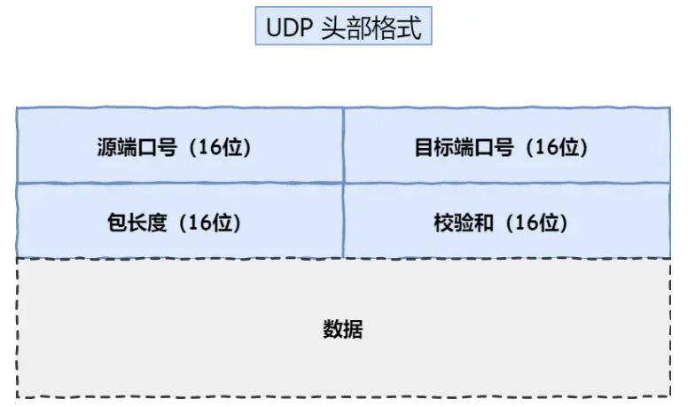
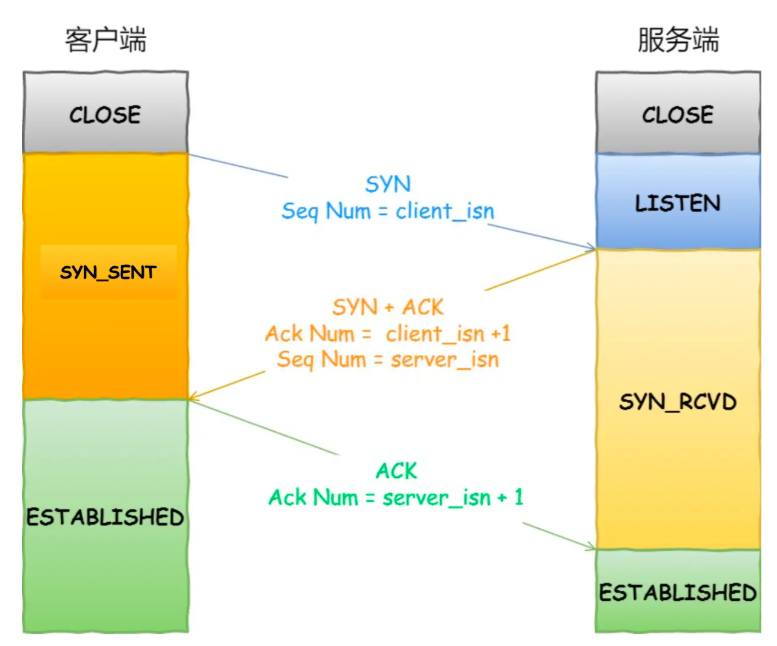
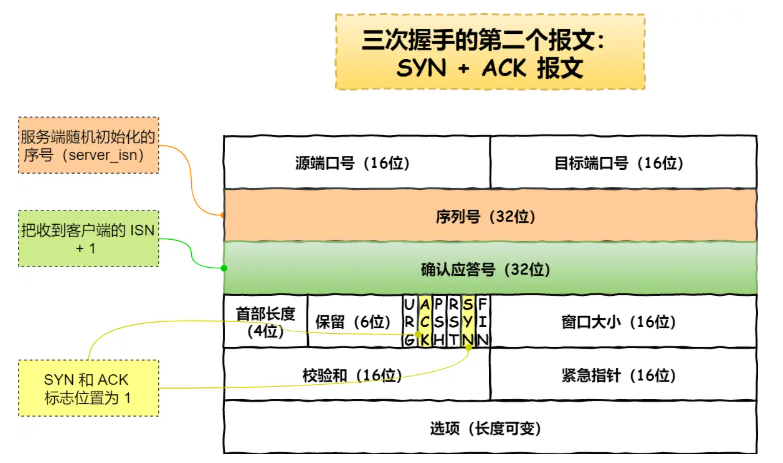
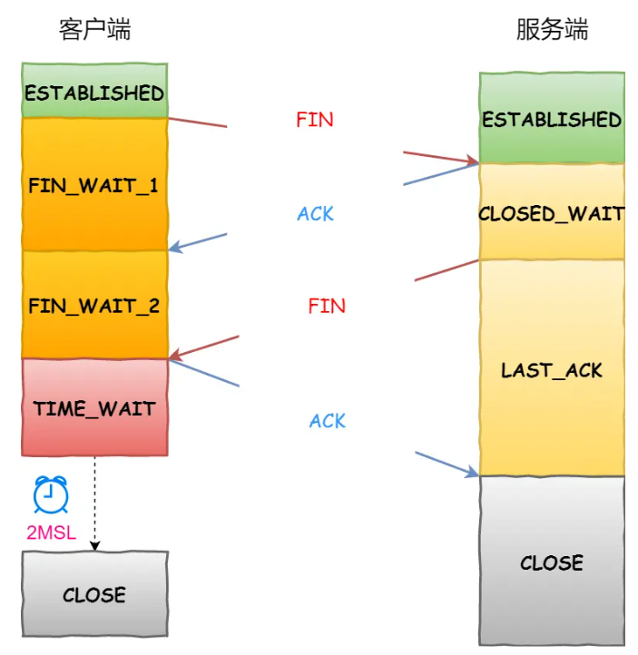
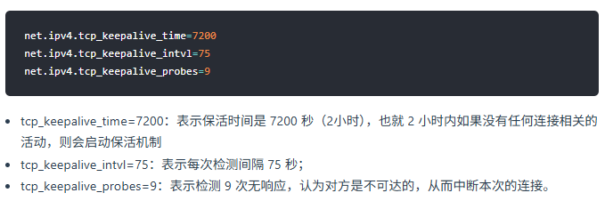

# TCP基础

## TCP头格式

* 序列号：建立连接时随机生成作为初始值，每发送一次数据，就累加一次该数据字节数的大小，**用于解决网络乱序问题**
* 确认应答号：下次期望收到的数据的序列号，**用于解决丢包问题**
* 控制位：
  * ACK：该位为 `1` 时，确认应答的字段变为有效，除了最初建立连接时的 `SYN` 包之外该位必须设置为 `1`
  * RST：该位为 `1` 时，表示 TCP 连接中出现异常必须强制断开连接
  * SYN：该位为 `1` 时，表示希望建立连接，并在其「序列号」的字段进行序列号初始值的设定
  * FIN：该位为 `1` 时，表示今后不会再有数据发送，希望断开连接

## 什么是TCP

* **面向连接的、可靠的、基于字节流**的传输层通信协议
  * 面向连接：一对一连接发送消息
  * 可靠：保证报文一定能够到达接收端
  * 字节流：消息可能会被操作系统分组成多个的 TCP 报文

## 如何确定唯一的TCP连接

* 四元组：源地址、源端口、目标地址、目标端口
* 一个四元组能确定唯一的 TCP 连接
* 理论最大的TCP连接数 = 客户端IP数量 * 客户端端口数量

## UDP格式

* 包长度：保存UDP首部长度和数据的长度之和
* 校验和：防止收到受损的包

## TCP和UDP区别

* 连接
  * TCP 面向连接，传输数据前要建立连接
  * UDP 不需要连接，即时传递数据
* 服务对象
  * TCP 一对一
  * UDP 可以一对多、多对一、多对多
* 可靠性
  * TCP 可靠交付数据的，数据可以无差错、不丢失、不重复、按序到达
  * UDP 尽最大努力交付，不保证可靠，但可以基于UDP实现可靠协议
* 流量控制、拥塞控制
  * TCP 有，保证数据传输安全性
  * UDP 无
* 首部开销
  * TCP 首部较长，没有使用选项字段是20字节，使用会变长
  * UDP 首部只有 8 个字节
* 传输方式
  * TCP 流式传输，没有边界。但保证顺序和可靠
  * UDP 一个包一个包的形式发送，有边界，但可能丢包和乱序
* 分片
  * MSS：最大报文长度段，TCP一次能发送的最大数据量
  * MSS = MTU - IP 头长度 - TCP 头长度
    * IPv4头：20bytes
    * TCP 头：20bytes
  * MTU：链路层一次能传输的最大数据包大小。包含 IP 头 + TCP 头 + TCP 负载
    * 以太网MTU：1500bytes
* 应用场景
  * TCP：FTP 文件传输，HTTP/HTTPS
  * UDP：广播通信，多媒体通信

# TCP连接建立

## 三次握手

* 客户端和服务端都处于CLOSE状态，服务端主动监听端口，处于LISTEN状态
* 客户端随机初始化序号client_isn，填入序号字段中，SYN设置为 1 ，发送给服务器，之后客户端处于 SYN-SENT 状态
* 服务端收到 SYN 报文后，初始化序号server_isn，填入序号字段；确认应答号设为 client_isn + 1。发送给客户端，之后服务端处于 SYN-RCVD 状态
* 客户端收到服务器报文后，回应。将 ACK 设为 1，确认应答号设为server_isn+1，发送给服务端，**此时可以携带数据**。客户端进入ESTABLISHED状态
* 服务端收到应答报文后，也进入ESTABLISHED状态

可以使用`netstat -napt`命令在Linux系统查看TCP状态。

## 为何是三次握手？不是二次四次

* TCP 连接：用于保证可靠性和流量控制维护的某些状态信息。包括 **Socket、序列号和窗口大小**称为连接。
* 为什么三次握手才可以初始化 **Socket、序列号和窗口大小并建立TCP连接**

### 避免历史连接（主要原因）

* 网络拥堵情况下：
  * 客户端发送 SYN 报文（序号为 a）后宕机，又重新发送了 SYN 报文（序号为 b）
  * 旧的 SYN 报文先抵达服务器，服务器恢复 SYN+ACK，确认号是 a + 1
  * 客户端收到后，发现期望值不对，回复RST报文断开连接
  * 服务器收到 RST 报文，断开连接
  * 后续新的 SYN 报文抵达，再重新建立正确的 TCP 连接

* 两次握手情况下
  * **服务端没有中间状态给客户端来阻止历史连接，导致**服务端可能建立一个历史连接，造成资源浪费
  * 服务端收到 SYN 报文就进入 ESTABLISHTED 状态
  * 客户端判断此次连接为历史连接，发送 RST 报文
  * 服务端收到 RST 报文前发送数据都是无效，收到RST后才会断开连接

### 同步初始序列号

* 序列号作用：
  * 接收方去除重复数据
  * 接收方能按序接收数据
  * 表示哪些数据包被对方收到
* 客户端和服务端发送的序列号，都需要得到对方回应表示接收到
* 两次握手只能保证乙方的序列号被接收

### 避免资源浪费

* 缺少三次握手，服务端每次收到 SYN 报文都要建立连接，如果有历史报文就会重复建立连接，导致资源浪费

### 每次连接的初始化序列号不一样

* 防止历史报文被下一个相同四元组接收（主要原因）
* 防止黑客伪造

### IP会分片，为什么TCP还要MSS

* 一个 IP 分片丢失，整个 IP 的所有分片都要重传
* IP 本身没有超时重传机制，由TCP负责超时重传

### 第一次握手丢失

* 客户端接收不到SYN-ACK报文，会超时重传
* 每次重传等待时间都是前一次的两倍
* 超过最大重传次数后，就会断开连接

### 第二次握手丢失

* 客户端和服务器都会重传
  * 客户端认为自己的SYN报文丢失了
  * 服务端收不到第三次握手，触发超时重传机制，重传SYN-ACK报文

### 第三次握手丢失

* 第三次握手是ACK报文，ACK丢失则由对方重传对应报文
* 服务端收不到第三次握手，重传 SYN-ACK 报文

## 如何避免SYN攻击

### TCP全连接和办理按揭队列

* 半连接队列：SYN队列
* 全连接队列：Accept队列
* 流程：
  * 服务端收到SYN报文，将其加入半连接队列
  * 发送SYN+ACK报文
  * 收到ACK报文后，从SYN取出一个半连接对象，新建对象放入全连接队列
  * 调用socket接口，取出连接对象

### 具体方法

* 调大保存数据包队列的最大值
* 增大TCP半连接队列
* 开启net.ipv4.tcp_syncookies
* * SYN队列满后，再次收到SYN包，不会丢弃，而是计算cookie值
  * 将cookie值放到SYN+ACK报文的序列号里面，发送给客户端
  * 收到ACK包后，服务端检查ACK包的合法性，合法则放入全连接队列
* 减少SYN+ACK重传次数

# TCP连接断开

* 客户端和服务端都可以主动断开连接
  * 客户端发送 `FIN`报文，进入 ` FIN_WAIT_1` 状态
  * 服务端收到该报文后，就向客户端发送 `ACK` 应答报文，接着服务端进入 `CLOSE_WAIT` 状态
  * 客户端收到服务端的 `ACK` 应答报文后，之后进入 `FIN_WAIT_2` 状态
  * 等待服务端处理完数据后，也向客户端发送 `FIN` 报文，之后服务端进入 `LAST_ACK` 状态
  * 客户端收到服务端的 `FIN` 报文后，回一个 `ACK` 应答报文，之后进入 `TIME_WAIT` 状态
  * 服务端收到了 `ACK` 应答报文后，就进入了 `CLOSE` 状态，至此服务端已经完成连接的关闭
  * 客户端在经过 `2MSL` 一段时间后，自动进入 `CLOSE` 状态，至此客户端也完成连接的关闭
* 每个方向都需要**一个 FIN 和一个 ACK**
* **主动关闭连接的，才有 TIME_WAIT 状态**

### 第一次挥手丢失

* 客户端进行超时重传，规则和建立连接时一样
* 超过最大次数限制还没收到，则自动断开连接

### 第二次挥手丢失

* 客户端和服务器都会进行超时重传，规则和建立连接时一样
* 客户端如果超过最大次数限制还没收到，则自动断开连接

### 第三次挥手丢失

* 服务端进行超时重传
* 服务端超过最大次数限制还没收到，则自动断开连接，进入close状态
* 客户端超过最大时间限制还没收到，则自动断开连接，进入close状态

### 第四次挥手丢失

* 服务端进行重传，如果超过最大次数限制还没收到，则自动断开连接，进入close状态
* 客户端收到第三次挥手，进入TIME_WAIT状态，等待2MSL，如果中途再次收到三次挥手，会重置等待时间

## TIME_WAIT

### TIME_WAIT等待时间

* MSL是报文最大生存时间，超时则丢包
* MSL需要大于等于TTL消耗为0的使劲按
* TIME_WAIT为2MSL，允许一次丢包。连续两次丢包的概率非常小
* Liunx系统下MSL默认为30s

### 为何需要TIME_WAIT

* 防止历史连接中的数据被后面相同四元组错误接收
  * 如果TIME_WAIT过短或者没有
  * 第一次连接时延迟的数据，在第二次连接到达对方并被接收，会导致数据错乱
* 保证被动关闭的一方能被正确关闭
  * 等待足够时间确保最后的ACK能让被动关闭方接收
  * 如果主动方发送ACK报文后直接CLOSE，但是被动方没有收到，会重传FIN，但此时主动方会回复RST

### TIME_WAIT过长危害

* 占用系统资源
* 占用端口资源
* 客户端TIME_WAIT过多，占满了端口资源
* 服务端TIME_WAIT过多，占用系统资源

### 服务器出现大量TIME_WAIT的原因

* 服务器是被动方，出现大量TIME_WAIT说明服务器主动断开了很多连接

#### HTTP没有使用长连接

* 任意一方没有开启长连接，都导致服务器会主动断开连接，出现大量TIME_WAIT
* 解决方法：双方都开启长连接 HTTP Keep-Alive

#### HTTP 长连接超时

* 大量客户端建立完TCP连接后没有发送数据
* 解决方法：排查网络问题

#### HTTP长连接请求数量达到上限

### 服务器出现大量CLOSE_WAIT的原因

* 说明服务端的程序没有调用 close 函数关闭连接
* 

## 已经建立连接，但是客户端崩溃

* TCP保活机制，每隔一个时间段，发送一个探测报文（数据非常少），若连续几个报文都没有响应，认为TCP已经死亡，将错误信息返回给上层
* 

## 已经建立连接，但是服务器进程崩溃

* 服务端会发送FIN报文，即使进行崩溃也能完成四次挥手，回收过程在内核进行

# Socket编程
