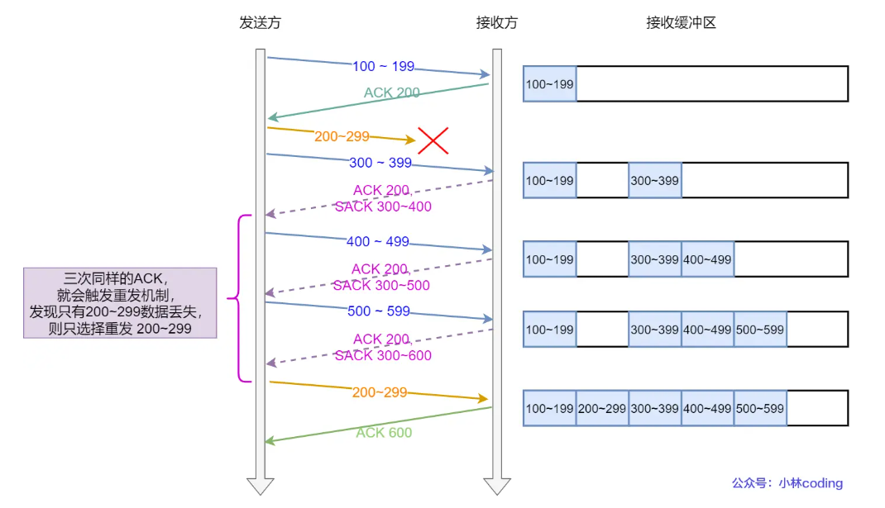
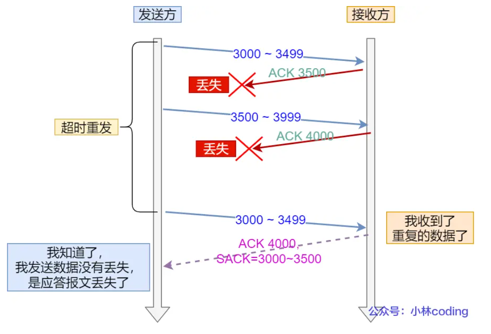
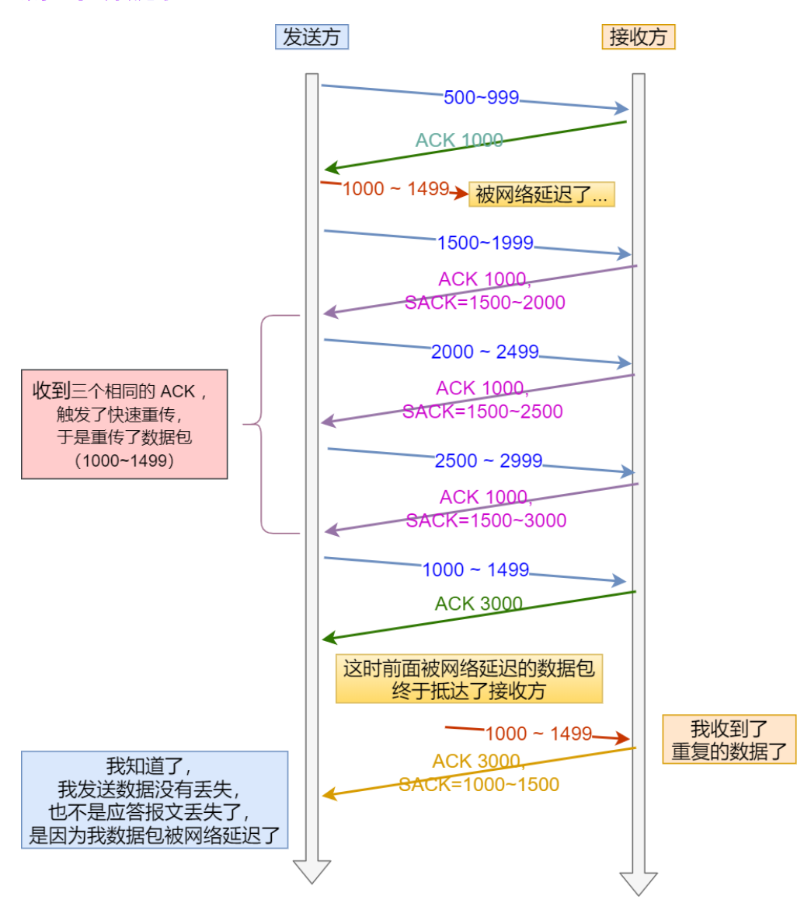
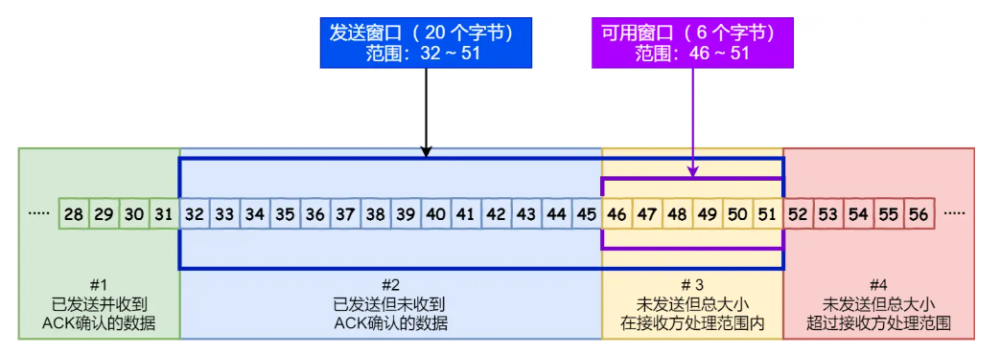
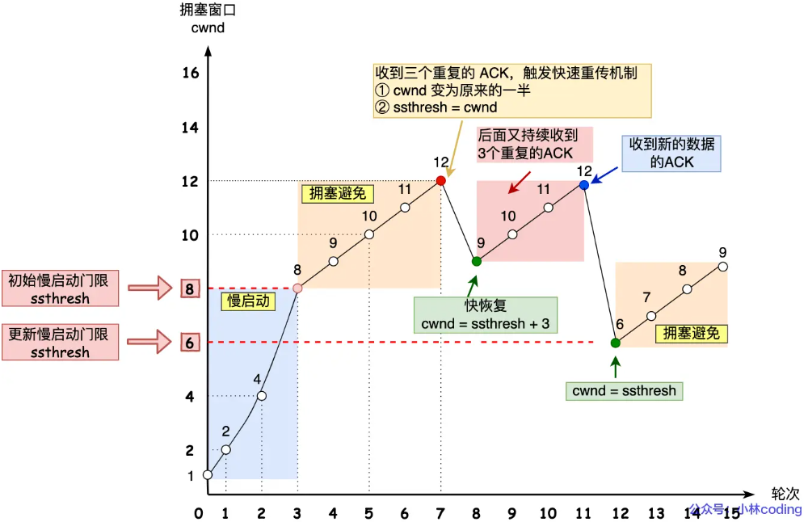

# 重传机制

## 超时重传

* 发送数据时设定一个定时器，超过时间没有收到ACK则重发数据
* 何时发生：
  * 数据包丢失
  * 确认应答丢失

### 超时时间设置

* RTT：往返时延，数据发送时刻到接受时刻的差值
* RTO：超时重传时间
  * 时间较大：重发速度慢，效率低
  * 时间较小：实际并没有丢失也会重发，增加网络拥塞
* **RTO应该略大于RTT的值**
* 实际网络中，RTT的值会经常变化，所以RTO也是动态变化的
* Linux计算RTT：
  * 采样RTT时间，进行加权平均，算出平滑的RTT值
  * 采样RTT的波动范围

## 快速重传

* **不以时间为驱动，而是以数据驱动重传**

* 发送方连续收到三个相同的ACK确认，就会在定时器过期之前重传丢失的报文段
* 缺点：
  * **不知道是重传一个报文还是重传所有报文**
  * 重传一个，效率很低
  * 重传多个，浪费资源

## SACK（选择性确认）方法

* 在TCP头部**选项字段**里面，添加一个SACK，**用于将已经收到的数据信息发送给发送方**。用于让发送方确认哪些数据收到了
* Linux可以通过 `net.ipv4.tcp_sack` 参数打开这个功能

## Duplicate SACK

* **使用了SACK 来告诉「发送方」有哪些数据被重复接收了。**

### 举例1：ACK 丢包

* 接收方发给发送方的两个ACK都丢失了，发送方超时，重传数据包
* 接收方收到了重复的数据，回复SACK = 3000-3500，表示这部分数据已经被接收
* 发送方知晓数据没有丢失，而是ACK丢失了

### 举例2：网络延时

* 数据包被网络延迟，导致发送方收不到确认报文
* 后面收到相同的ACK发生快速重传，重传后发送相同的数据
* 接收方回复SACK = 1000-1500，表示收到了重复的包
* 发送方知道快速重传的原因是因为网络延迟，而不是丢包或者ACK丢失

### D-SACK的好处

* 可以让发送方知道，是数据丢包了还是ACK丢包了
* 可以知道是不是发送方的数据包被网络延迟了
* 可以知道网络是不是把发送方的数据包复制了

# 滑动窗口

* 避免因为数据包往返时间过长导致通信效率低
* 窗口大小就是指**无需等待确认应答，而可以继续发送数据的**最大值
* 窗口的实现是操作系统开辟的一个缓存空间
* 通常，窗口大小由**接收方**窗口确定

## 累计确认

* 图中 ACK 600确认报文丢失，发送方不会立即重传。只要后续收到了 ACK 700，说明700之前的数据也被收到了

## 发送方的滑动窗口

* 分为四个部分：
  * 绿色：已经发送并收到ACK确认的数据
  * 蓝色：已经发送但未收到ACK的数据
  * 黄色：未发送但总大小**在**接收方处理范围内的数据
  * 红色：未发送且总大小**不在**接收方处理范围内的数据
* 程序表示：三个指针跟踪四种类别
  * `SND.WND`：表示发送窗口的大小
  * `SND.UNA`：指向第一个已发送但未收到确认的字节序列号（蓝色部分的第一个
  * `SND.NXT`：指向第一个未发送但在可发送范围的字节序列号（黄色部分的第一个
  * 指向第一个未发送且不在可发送范围内的指针可以通过  `SND.WND`+`SND.UNA` 获得
  * **可用窗口大小 = SND.WND -（SND.NXT - SND.UNA）**

## 接收方的滑动窗口

* 分为三个部分：
  * 绿色：已经接收并确认的数据
  * 蓝色：未收到但可以接收的数据
  * 红色：未收到且不可以接收的数据
* 程序表示：两个指针跟踪三种类别
  * `SND.WND`：表示接收窗口的大小，会告诉发送方
  * `SND.NXT`：指向期望从发送方传来的下个字节的序列号（蓝色部分的第一个
  * 指向第一个未接收且不在接收范围内的指针可以通过  `SND.WND`+`SND.NXT` 获得

## 二者窗口大小

* 由于网络延迟，接收窗口的大小**约等于**发送窗口大小，**不是完全相等的**

# 流量控制

* **让「发送方」根据「接收方」的实际接收能力控制发送的**机制

## OS缓冲区和滑动窗口

* 发送窗口和接收窗口中所存放的字节数放在OS的缓冲区，而操作系统的缓冲区会**被操作系统调整**
* 如果接收端繁忙，收到数据但是没有读取完整的数据，未读取的数据会占用缓冲区，导致接收窗口收缩，并在发送确认信息时反馈给发送方
* 如果接收端非常繁忙，操作系统直接减少接收缓存，此时发送端并不知道，**如果发送了大于接收缓存的数据**，会被接收端直接丢失，**导致丢包**
  * 因此，TCP不允许同时减少缓存和收缩窗口，而是先收缩窗口，过段时间再减少缓存

## 窗口关闭

* 定义：窗口大小为0，阻止发送方发送数据，直到窗口非0为止

### 危害

* 发生窗口关闭时，接收方处理完数据后，会向发送方通告一个窗口非 0 的 ACK 报文
* 如果这个报文丢失了：
  * 发送方一直等待接收方的非0窗口通知
  * 接收方也在等待发送方传来的数据
  * **导致死锁**

### TCP解决方案

* **只要 TCP 连接一方收到对方的零窗口通知，就启动持续计时器。**
* 如果持续计时器超时，就会发送**窗口探测 ( Window probe ) 报文，对方在确认这个探测报文时，给出自己现在的接收窗口大小。**
  * 如果接收窗口是 0，则重启计时器
  * 如果不为 0，死锁情况被打破

## 糊涂窗口

* 由于接收方太忙了，来不及取走接收窗口里的数据，导致发送窗口越来越小
* **如果接收方腾出几个字节**就告诉发送方，发送方也发送数据，但是 `TCP + IP` 头有 `40` 个字节，代价太大
* 发生的原因
  * 接收方可以通告小的窗口
  * 发送方可以发送小数据
* 解决方案
  * 接收方不通告小窗口
  * 发送方避免发送小数据

### 接收方不通告小窗口

* 当「窗口大小」小于 min( MSS，缓存空间/2 )时，就会向发送方通告窗口为 `0`，也就阻止了发送方再发数据过来
* 等到接收方处理了一些数据后，窗口大小 >= MSS，或者接收方缓存空间有一半可以使用，再打开窗口

### 避免发送小数据

* 使用 Nagle 算法，该算法的思路是延时处理，只有满足下面两个条件中的任意一个条件，才可以发送数据
  * 窗口大小 ＞=MSS 且 数据大小＞=MSS
  * 收到之前发送数据的ack回包
* 如果接收方不能满足“不通告小窗口给发送方”，发送方也无法避免糊涂窗口

# 拥塞控制

* **避免发送方的数据填满整个网络**

## 拥塞窗口

* **拥塞窗口 cwnd**是发送方维护的一个的状态变量，根据网络拥塞程度动态变化
* 发送窗口 `swnd` 和接收窗口 `rwnd` 是约等于的关系
* 加入拥塞窗口后，发送窗口的值是swnd = min(cwnd, rwnd)，拥塞窗口和接收窗口的最小值
* 发生“超时重传”时，认为网络出现了拥塞

## 慢启动

* 一点一点的提高发送数据包的数量
* **当发送方每收到一个 ACK，拥塞窗口 cwnd 的大小就会加 1**
* 发包个数呈现**指数增长**
* 慢启动门限 `ssthresh` （slow start threshold）状态变量
  * 当 `cwnd` < `ssthresh` 时，使用慢启动算法
  * 当 `cwnd` >= `ssthresh` 时，使用「拥塞避免算法」

## 拥塞避免算法

* 一般来说 `ssthresh` 的大小是 `65535` 字节
* 拥塞避免算法规则：**每当收到一个 ACK 时，cwnd 增加 1/cwnd（是一个ACK，不是一个轮次）**
* 发包个数呈现**线性增长**
* 当触发“重传机制”时，进入「拥塞发生算法」

## 拥塞发生算法

* 重传情况有两种，拥塞发生算法也有两种

### 超时重传的拥塞发生

* `ssthresh` 设为 `cwnd/2`
* `cwnd` 重置为 `cwnd` 初始化值（Linux默认为10，可以使用ss -nli 命令查看）
* 慢启动会突然减少数据流，也会造成网络卡顿

### 快速重传的拥塞发生

TCP 认为这种情况不严重，因为大部分没丢，只丢了一小部分

* `cwnd = cwnd/2` ，也就是设置为原来的一半
* `ssthresh = cwnd`
* 进入快速恢复算法

## 快速恢复算法

* 还能收到 3 个重复 ACK 说明网络也不那么糟糕（嘻嘻）

步骤：

* `cwnd = cwnd/2`
* `ssthresh = cwnd`
* `cwnd = ssthresh + 3`（有三个数据包被收到）
* 重传丢失的数据包
  * 如果再收到重复的ACK，则 `cwnd=cwnd+1`
  * 如果收到新数据的ACK，把 cwnd 设置为第一步中的 ssthresh 的值，再次进入拥塞避免状态
