# 设计模式

可以理解为⼀套在特定场景下，针对软件设计中常⻅问题的、可复⽤的解决⽅案。

## SOLID原则

* 单一职责原则(Single Responsibility Principle, SRP)
  * 核⼼思想：⼀个类或模块应该有且只有⼀个引起它变化的原因。
  * 通俗来说：⼀个类只做⼀件相关的事情。
* 开闭原则 (Open-Closed Principle, OCP)
  * 核⼼思想：软件实体（类、模块、函数等）应该对扩展开放，对修改关闭。
  * 通俗来说：当需要增加新功能时，我们应该通过增加新的代码（例如新的⼦类或实现类）来实现，⽽不是去修改已有的、⼯作良好的代码。
  * **这是⾯向对象设计中最重要的⼀条原则，是实现系统可复⽤性和可维护性的基⽯**。
* ⾥⽒替换原则 (Liskov Substitution Principle, LSP)
  * 核⼼思想：所有引⽤基类的地⽅，都必须能够透明地使⽤其⼦类的对象。
  * 通俗来说：⼦类应当可以完全替换⽗类，并且程序的⾏为不会产⽣任何错误或异常。这意味着⼦类在继承⽗类时，不应该改变⽗类预期的⾏为。它是实现开闭原则的重要⽅式之⼀。
* 接⼝隔离原则 (Interface Segregation Principle, ISP)
  * 核⼼思想：客户端不应该被强迫依赖它不需要的接⼝。⼀个类对另⼀个类的依赖应该建⽴在最⼩的接⼝之上。
  * 通俗来说：接⼝的设计要“专”，不要设计⼤⽽全的“胖接⼝”，⽽应该根据功能设计多个细粒度的接⼝。这样可以避免⼀个类为了实现接⼝中的某⼀个功能，⽽不得不实现所有其他它并不需要的功能。
* 依赖倒置原则 (Dependency Inversion Principle, DIP)
  * 核⼼思想：⾼层模块不应该依赖于低层模块，两者都应该依赖于抽象；抽象不应该依赖于细节，细节应该依赖于抽象。
  * 通俗来说：我们要⾯向接⼝编程，⽽不是⾯向实现编程。代码的依赖关系应该通过抽象
    （如接⼝或抽象类）来建⽴，⽽不是具体的实现类。这样可以⼤⼤降低模块间的耦度，
    ⽅便系统的升级和扩展

## 其他原则

* 合成/聚合复⽤原则 (Composite/Aggregate Reuse Principle, CARP)
  * 核⼼思想：尽量使⽤对象组合（合成/聚合）的⽅式，⽽不是继承来达到代码复⽤的⽬的。
  * 通俗来说：“has-a” 关系通常⽐ “is-a” 关系更灵活。继承是⼀种强耦合关系（⽩盒复⽤），⽽组合是⼀种弱耦合关系（⿊盒复⽤），后者更容易维护和扩展。
* 迪⽶特法则 (Law of Demeter, LoD) / 最少知识原则 (Least Knowledge Principle, LKP)
  * 核⼼思想：⼀个软件实体应当尽可能少地与其他实体发⽣相互作⽤
  * 通俗来说：⼀个对象应该对其他对象有尽可能少的了解，即“只和你的直接朋友交谈”。这有助于降低类之间的耦合度，让每个模块更加独⽴

## 设计模式的分类

### 创建型模式

* 关注点：对象的创建过程。这类模式将对象的创建和使⽤解耦，使得程序在创建对象时更
  具灵活性。它们隐藏了对象创建的复杂逻辑，使得我们⽆需直接使⽤ new 关键字。
* 核⼼思想：提供⼀种机制，使得客户端代码不必关⼼它所需要的具体是哪个类的实例，也
  不必关⼼这些实例是如何被创建和组织的。
* 常⻅模式：
  * 单例模式 (Singleton)
  * ⼯⼚⽅法模式 (Factory Method)
  * 抽象⼯⼚模式 (Abstract Factory)
  * 建造者模式 (Builder)
  * 原型模式 (Prototype)

### 结构性模式

* 关注点：类和对象的组合。这类模式研究如何将类和对象组合在⼀起，形成更⼤、更复杂
  的结构，同时保持结构的灵活性和效率。
* 核⼼思想：通过继承、组合等⽅式，在不改变原有类的情况下，为其增加新的功能或适配
  不同的接⼝。
* 常⻅模式：
  * 适配器模式 (Adapter)
  * 桥接模式 (Bridge)
  * 组合模式 (Composite)
  * 装饰器模式 (Decorator)
  * 外观模式 (Facade)
  * 享元模式 (Flyweight)
  * 代理模式 (Proxy)

### 行为型模式

* 关注点：对象之间的通信和职责分配。这类模式专⻔处理对象之间的交互和协作，以及算法和责任的分配。
* 核⼼思想：通过定义对象间的通信模式来降低它们之间的耦合度，使得系统中的对象可以
  独⽴地变化。
* 常⻅模式：
  * 责任链模式 (Chain of Responsibility)
  * 命令模式 (Command)
  * 迭代器模式 (Iterator)
  * 中介者模式 (Mediator)
  * 备忘录模式 (Memento)
  * 观察者模式 (Observer)
  * 状态模式 (State)
  * 策略模式 (Strategy)
  * 模板⽅法模式 (Template Method)
  * 访问者模式 (Visitor)
  * 解释器模式 (Interpreter)

## 工厂模式

### 介绍

主要解决的是对象的创建问题，将对象的创建和使⽤过程进⾏解耦。根据其复杂度和应⽤场景的不同，通常分为三种：

* 简单⼯⼚模式
* ⼯⼚⽅法模式
* 抽象⼯⼚模式

UML类图：

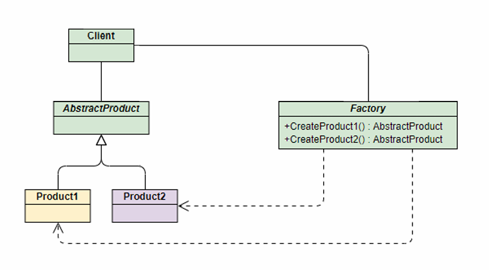

角色构成：

* ⼯⼚ (Factory)：负责实现创建所有实例的内部逻辑。
* 抽象产品 (AbstractProduct)：所有被创建对象的⽗类或接⼝。
* 具体产品 (ConcreteProduct)：⼯⼚类创建的⽬标实例。

解决的问题：将客户端代码与具体产品的实现类解耦。客户端只需“消费”产品，⽽⽆需关⼼产品是如何被创建的。

优缺点：

* 优点：
  * 结构简单，将创建逻辑集中管理，实现了职责分离。
  * 避免创作者和具体产品之间的紧密耦合
  * 遵守单一责任原则
  * 遵守开闭原则
* 缺点：引入新的子类，代码可能变得复杂

实例：

* Java 的Calendar.getInstance() ⽅法，内部会根据时区、地区等参数创建具体的⽇历对象。
* Spring 的BeanFactory 在概念上就是⼀个强⼤的简单⼯⼚，你通过⼀个 bean 的名字
  （ID）就能获取到对应的实例，⽽⽆需关⼼这个 bean 是如何被创建和配置的。

```java
// 抽象产品：电⼦设备
interface Device {
 void operate(); // 操作设备
}
// 具体产品：⼿机
class Phone implements Device {
 @Override
 public void operate() {
  System.out.println("⼿机操作：开机 -> 显示主界⾯ -> 关机\n");
 }
}
// 具体产品：电脑
class Computer implements Device {
 @Override
 public void operate() {
  System.out.println("电脑操作：开机 -> 加载系统 -> 关机\n");
 }
}
 // 简单⼯⼚：设备⼯⼚
class DeviceFactory {
 // 根据类型创建设备
 public static Device createDevice(String type) {
  if (type.equalsIgnoreCase("PHONE")) {
   return new Phone();
  }
  else if (type.equalsIgnoreCase("COMPUTER")) {
   return new Computer();
  }
  return null;
 }
}
public class SimpleFactoryDemo {
 public static void main(String[] args) {
  // 通过⼯⼚创建设备
  Device phone = DeviceFactory.createDevice("PHONE");
  Device computer = DeviceFactory.createDevice("COMPUTER");
  // 使⽤设备
  phone.operate();
  computer.operate();
  }
}

```

### 静态工厂

静态⼯⼚（Static Factory） 是⼀种基于类的静态⽅法创建对象的⽅式

上⾯的简单⼯⼚模式代码⽤静态⼯⼚改写如下：

```java
// 抽象产品：电⼦设备
interface Device {
 void operate(); // 操作设备
}

// 具体产品：⼿机（包含静态⼯⼚⽅法）
class Phone implements Device {
 // 私有构造函数，强制通过静态⼯⼚创建
 private Phone() {}
 
 // 静态⼯⼚⽅法：创建⼿机实例
 public static Phone createPhone() {
  return new Phone();
 }
 
 @Override
 public void operate() {
  System.out.println("⼿机操作：开机 -> 显示主界⾯ -> 关机\n");
 }
}

// 具体产品：电脑（包含静态⼯⼚⽅法）
class Computer implements Device {
 // 私有构造函数，强制通过静态⼯⼚创建
 private Computer() {}
 
 // 静态⼯⼚⽅法：创建电脑实例
 public static Computer createComputer() {
  return new Computer();
 }
 
 @Override
 public void operate() {
  System.out.println("电脑操作：开机 -> 加载系统 -> 关机\n");
 }
}

// 客户端使⽤
public class StaticFactoryDemo {
 public static void main(String[] args) {
  // 通过静态⼯⼚⽅法直接创建设备
  Device phone = Phone.createPhone();
  Device computer = Computer.createComputer();
  // 使⽤设备
  phone.operate();
  computer.operate();
 }
}
```

### 静态工厂和简单工厂对比


### 工厂方法模式

* 为了解决简单⼯⼚模式违反开闭原则的问题，⼯⼚⽅法模式将创建具体对象的任务下放给⼦类。
* 它定义了⼀个⽤于创建对象的抽象⽅法，但由⼦类来决定要实例化哪⼀个类。
* UML类图：

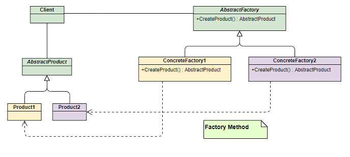

* 角色组成

  * 抽象⼯⼚ (AbstractFactory)：声明了创建产品的抽象⽅法。
  * 具体⼯⼚ (ConcreteFactory)：实现抽象⽅法，负责创建具体的产品。
  * 抽象产品 (AbstractProduct)：与简单⼯⼚模式相同。
  * 具体产品 (ConcreteProduct)：与简单⼯⼚模式相同。
* 解决的问题：在不修改现有⼯⼚类的情况下，轻松扩展新的产品。如果想增加⼀个新产品，只
  需增加⼀个新的具体产品类和⼀个对应的具体⼯⼚类即可，完全符合开闭原则
* 优缺点

  * 优点：完美遵循开闭原则，扩展性好。符合单⼀职责原则。
  * 缺点：每增加⼀个产品，就需要增加⼀个具体⼯⼚类

### 抽象工厂模式

* 创建的不是单一产品，而是一个产品族
* 它提供⼀个接⼝，⽤于创建⼀系列相关或相互依赖的对象，⽽⽆需指定它们具体的
  类。可以理解为它是“⼯⼚的⼯⼚”。
* 产品等级结构：同⼀类产品的不同实现（如按钮可以有 Windows 按钮、Mac 按钮，这构成⼀
  个产品等级结构）
  产品族：同⼀品牌或⻛格下的不同产品（如 Windows ⻛格下的按钮、⽂本框、复选框，构成
  ⼀个产品族）

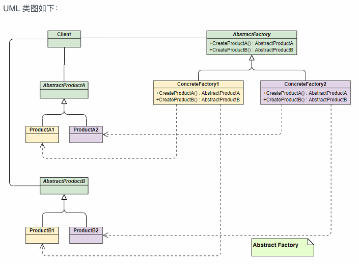

* 角色组成
  * 抽象⼯⼚ (AbstractFactory)：定义了创建⼀系列不同产品（⼀个产品族）的接⼝。
  * 具体⼯⼚ (ConcreteFactory)：实现接⼝，创建特定主题或⻛格的产品族。
  * 抽象产品 (AbstractProduct)：为产品族中的每⼀种产品定义接⼝。
  * 具体产品 (ConcreteProduct)：实现抽象产品接⼝，是具体⼯⼚创建的⽬标。
* 解决的问题：解决创建⼀整个产品家族的问题，保证客户端在切换不同产品族时，能获得⼀整
  套相互兼容和匹配的对象。
* 优缺点：
  * 优点：⾮常适合⽤于创建⼀系列相互匹配的产品。切换整个产品族⾮常⽅便，只需更换具
    体的⼯⼚即可。
  * 缺点：扩展新的产品等级结构困难。例如，如果产品族需要增加⼀个“⿏标”，那么 `AbstractFactory `接⼝就需要增加⼀个 `createMouse() `⽅法，所有已经实现的具体⼯⼚类也都要跟着修改，这违反了开闭原则。

### 简单工厂、工厂方法、抽象工厂

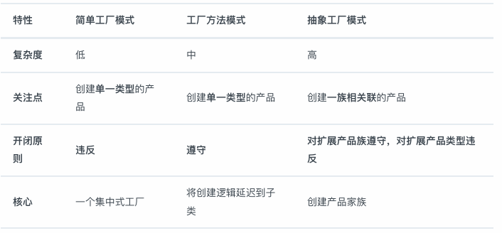

## 建造者模式（Builder）

* 使用多个“小型”工厂来最终创建出一个完整对象
* 使用Builder模式时，适用于创建的对象比较复杂，最好一步一步创建出“零件”，最后再装配起来
* 解决问题：在软件系统中，一个复杂对象的创建通常由多个部分组成，这些部分的组合经常变化，但组合的算法相对稳定。
* 使用场景：当一些基本部件不变，而其组合经常变化时
* 角色组成

  * **产品（Product）** ：要构建的复杂对象。产品类通常包含多个部分或属性。
  * **抽象建造者（Builder）** ：定义了构建产品的抽象接口，包括构建产品的各个部分的方法。
  * **具体建造者（Concrete Builder）** ：实现抽象建造者接口，具体确定如何构建产品的各个部分，并负责返回最终构建的产品。
  * **指导者（Director）** ：负责调用建造者的方法来构建产品，指导者并不了解具体的构建过程，只关心产品的构建顺序和方式。
* 优点：

  * 分离构建过程和表示，使得构建过程更加灵活，可以构建不同的表示。
  * 可以更好地控制构建过程，隐藏具体构建细节。
  * 代码复用性高。
* 缺点：

  * 产品属性较少时可能导致代码冗余
  * 增加了系统类和对象的数量

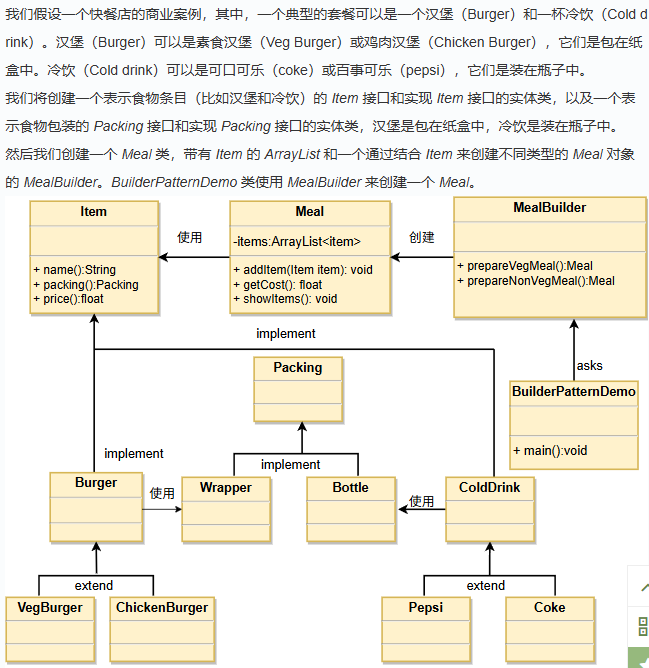

## 原型模式（Prototype）

* 是指创建新对象的时候，根据现有的一个原型来创建。
* 解决问题：在运行时动态简历和删除原型
* 使用场景：需要在运行时指定实例化的类，例如通过动态加载
* 角色组成：

  * **原型接口（Prototype Interface）** ：定义一个用于克隆自身的接口，通常包括一个 `clone()` 方法。
  * **具体原型类（Concrete Prototype）** ：实现原型接口的具体类，负责实际的克隆操作。这个类需要实现 `clone()` 方法，通常使用浅拷贝或深拷贝来复制自身。
  * **客户端（Client）** ：使用原型实例来创建新的对象。客户端调用原型对象的 `clone()` 方法来创建新的对象，而不是直接使用构造函数。
* 优点：提高性能，避免构造函数约束
* 缺点：配备克隆方法需要全面考虑类的功能，对已有类可能较难实现，特别是处理不支持串行化的间接对象或含有循环结构的引用时。必须实现 `Cloneable` 接口。

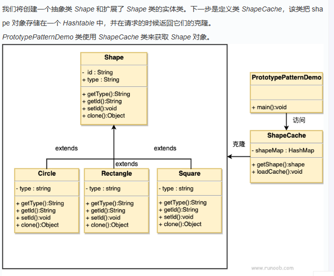

## 单例模式

* ⼀个单例类在任何情况下都只存在⼀个实例，构造⽅法必须是私有的、
  由⾃⼰创建⼀个静态变量存储实例，对外提供⼀个静态公有⽅法获取实例。
* 主要成员：
  * 单例类：包含单例实例的类，通常将构造函数声明为私有。
  * 静态成员变量：用于存储单例实例的静态成员变量。
  * 获取实例方法：静态方法，用于获取单例实例。
  * 私有构造函数：防止外部直接实例化单例类。
  * 线程安全处理：确保在多线程环境下单例实例的创建是安全的。
* 优点：
  * 节省资源
  * 全局控制
* 缺点
  * 扩展性差
  * 有点违背单一职责原则
  * 测试困难

### 饿汉式（线程安全）

* 优点：类⼀加载就创建对象，天生线程安全，效率高。
* 缺点：不是懒加载。如果这个实例从未使⽤过，会造成内存浪费。
* 懒加载 （lazy loading）：使⽤的时候再创建对象

```java
public class Singleton {  
    private static Singleton instance = new Singleton();  
    private Singleton (){}  
    public static Singleton getInstance() {  
    return instance;  
    }  
}
```

### 懒汉式（线程不安全）

第⼀次被使⽤时才创建实例，但是基础写法式不安全的，会被多线程破坏

* 优点：实现了懒加载。
* 缺点：线程不安全。在多线程环境下，可能创建出多个实例。

  ```java
  public class Singleton {  
      private static Singleton instance;  
      private Singleton (){}  

      public static Singleton getInstance() {  
          if (instance == null) {  
              instance = new Singleton();  
          }  
          return instance;  
      }  
  }
  ```

### 懒汉式（同步，线程安全）

* 优点：第一次调用才初始化，避免内存浪费。
* 缺点：必须加锁 synchronized 才能保证单例，但加锁会影响效率。

```java
public class Singleton {  
    private static Singleton instance;  
    private Singleton (){}  
    public static synchronized Singleton getInstance() {  
        if (instance == null) {  
            instance = new Singleton();  
        }  
        return instance;  
    }  
}
```

### 懒汉式（双重检查锁）

采用双锁机制，安全且在多线程情况下能保持高性能。`getInstance() `的性能对应用程序很关键。

* 优点：懒加载、线程安全、性能较⾼。
* 缺点：实现相对复杂，需要正确理解 volatile 的作⽤

```java
public class Singleton {  
    private volatile static Singleton singleton;  
    private Singleton (){}  
    public static Singleton getSingleton() {  
    if (singleton == null) {  
        synchronized (Singleton.class) {  
            if (singleton == null) {  
                singleton = new Singleton();  
            }  
        }  
    }  
    return singleton;  
    }  
}
```

* 双重检查的必要性：
  * 外层检查：当实例已创建时，所有线程可直接返回结果，避免不必要的同步开销，是性能优化的关键。
  * 内层检查：解决并发竞争问题 —— 当多个线程同时通过外层检查时，同步块保证有⼀个线程进⼊创建逻辑，后续线程会被内层检查拦截，确保仅创建⼀个实例
* volatile 关键字的作⽤：instance 采⽤volatile 关键字修饰也是很有必要的，`instance = new Singleton();`为三步执⾏：
  * 为instance 分配内存空间
  * 初始化instance
  * 将instance 指向分配的内存地址
* 由于 JVM 具有指令重排的特性，执⾏顺序有可能变成 1->3->2。指令重排在单线程环境下不会出现问题，但是在多线程环境下会导致⼀个线程获得还没有初始化的实例。例如，线程 T1 执⾏了1 和 3，此时 T2 调⽤getInstance () 后发现instance 不为空，因此返回instance ，但此时instance 还未被初始化。在并发场景下可能导致不可预期的行为（难以重现的 Bug）

### 静态内部类

* JVM在加载外部类时，不会加载内部类。只有内部类属性/方法被调用才会被加载
* 保证只被实例化一次、并且严格保证实例化顺序

```java
public class Singleton {  
    private static class SingletonHolder {  
    private static final Singleton INSTANCE = new Singleton();  
    }  
    private Singleton (){}  
    public static final Singleton getInstance() {  
        return SingletonHolder.INSTANCE;  
    }  
}
```

### 枚举单例

* 优点：
  * 实现极其简单。
  * 天⽣线程安全，由 JVM 从语⾔层⾯保证。
  * 能有效防⽌通过反射和反序列化来破坏单例。Java 规定，不能通过反射来创建枚举实例，并且在反序列化时，JVM 会特殊处理，保证返回的是同⼀个枚举实例。
* 缺点：不是懒加载。

```java
public enum Singleton {  
    INSTANCE;  
    public void whateverMethod() {  
    }  
}
```

## 适配器模式

### 介绍

* 它的核⼼作⽤是将⼀个类的接⼝转换成客户端所期望的另⼀个接⼝，从⽽使原本因接⼝不兼容⽽不能在⼀起⼯作的类可以协同⼯作。
* 类比：电源适配器（bushi）
* 核心角色组成：
  * **Target (⽬标接⼝)：**客户端（Client）期望和它直接交互的接⼝。在上⾯的例⼦⾥，就是那个三孔插座。
  * **Adaptee (被适配者)：**已存在的、但接⼝与Target 不兼容的类。也就是那个两脚插头。
  * **Adapter (适配器)**：模式的核⼼。它实现了Target 接⼝，同时内部包装了⼀个Adaptee 类的实例，负责将对Target 接⼝的调⽤转换为对Adaptee 接⼝的调⽤。它就是那个转换头。
* 优点：
  * 增强类的复用性
  * 提高了拓展性和灵活性
  * 解耦
* 缺点
  * 增加系统复杂性
  * （针对类适配器）限制较多

### 实现方式

* 类适配器：
  * 原理：通过类继承来实现。Adapter 类同时继承并实现Target 接⼝.
  * 特点：由于 Java 是单继承，这意味着Adaptee 类并实现Target 接⼝。Adapter 只能适配⼀个Adaptee 类。它的耦合度相对较⾼。

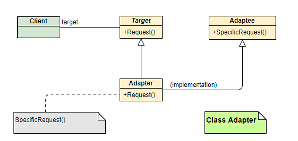

* 对象适配器：
  * 原理：通过对象组合/关联来实现。Adapter 类实现Target 接⼝，并在内部持有⼀个Adaptee 类的实例。
  * 特点：这种⽅式更加灵活，因为Adapter 可以适配Adaptee 的任何⼦类。它遵循了“合成/聚合复⽤原则”，更推荐、更常⽤

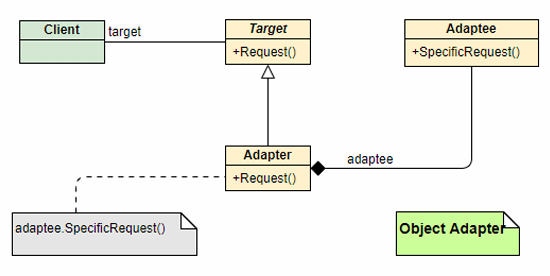

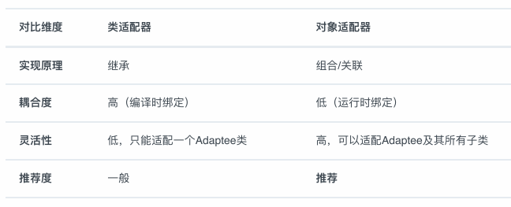

## 桥接模式

### 介绍

* 用于将抽象部分与实现部分分离，使得它们可以独立地变化。
* 避免使用继承导致的类爆炸问题，提供更灵活的扩展方式。
* 使用场景：当系统可能从多个角度进行分类，且每个角度都可能独立变化时，桥接模式是合适的。
* 核心角色

  * 抽象（Abstraction）：定义抽象接口，通常包含对实现接口的引用。
  * 扩展抽象（Refined Abstraction）：对抽象的扩展，可以是抽象类的子类或具体实现类。
  * 实现（Implementor）：定义实现接口，提供基本操作的接口。
  * 具体实现（Concrete Implementor）：实现实现接口的具体类。
* 优点：

  * 抽象和实现分离
  * 拓展能力强
  * 实现细节透明
* 缺点：

  * 设计难度大
  * 需要在抽象层进行设计和编程

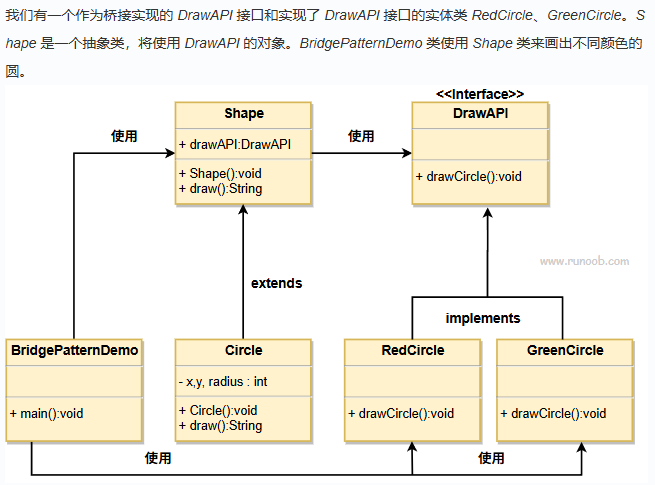

## 观察者模式

### 介绍

* 当⼀个对象（我们称之为“被观察者”或“主题”）的状态发⽣改变时，所有依赖于它的对象（即
  “观察者”）都会⾃动收到通知并进⾏相应的更新。
* 这种模式的本质是解耦，它将被观察者和观察者分离开来，使得它们可以独⽴地变化和复⽤，⽽不
  需要知道对⽅的具体实现细节

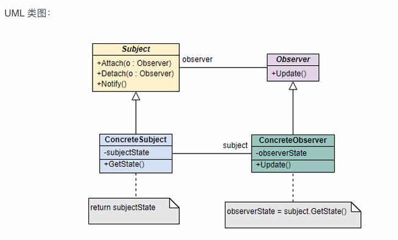

* 核心角色：
  * **主题/被观察者 (Subject):** 这是⼀个接⼝或抽象类，它负责维护⼀个观察者列表，并提供添加、
    删除观察者的接⼝。最关键的是，**它还定义了通知所有观察者的 notify() ⽅法**。
  * **具体主题/具体被观察者 (ConcreteSubject):** 它是Subject的具体实现。它包含了业务逻辑，并
    在⾃身状态发⽣变化时，调⽤继承⾃Subject的 notify() ⽅法，通知所有已注册的观察者。
  * **观察者 (Observer):** 同样是⼀个接⼝或抽象类，它定义了⼀个 update() ⽅法。当观察者接收到
    来⾃主题的通知时，这个⽅法就会被调⽤。
  * **具体观察者 (ConcreteObserver):** 它是Observer的具体实现。在 update() ⽅法中，它会根据
    收到的通知，完成具体的业务逻辑，⽐如更新⾃身状态、执⾏某个操作等
* 优点
  * **⾼度解耦：** 这是它最⼤的优点。主题和观察者之间是松耦合的，主题只知道它有⼀系列观
    察者，但不需要知道它们是谁、做什么。这为系统带来了极⼤的灵活性。
  * **符合开闭原则：** 系统是“对扩展开放，对修改关闭”的。当需要增加新的响应⾏为时，我们
    只需要创建⼀个新的具体观察者类并注册它即可，完全不需要修改主题的代码。
  * **⽀持⼴播通信：** 主题可以向所有注册的观察者⼴播通知，这在很多场景下⾮常⾼效。
* 缺点
  * **潜在的性能问题：**如果观察者数量⾮常多，或者某个观察者的update ⽅法逻辑复杂、耗时较⻓，那么通知过程可能会导致主线程阻塞，影响性能。在某些场景下，可以考虑使⽤异步通知来优化。
  * **可能导致意外的级联或循环：** 如果观察者之间存在复杂的依赖关系，⼀个观察者的更新可
    能会触发另⼀个观察者（它同时也是另⼀个主题）的更新，形成复杂的调⽤链。如果设计
    不当，甚⾄可能导致循环调⽤，造成系统崩溃。
  * **调试困难：** 由于其松耦合的特性，当程序出现问题时，有时很难追踪到⼀个事件发⽣后，
    具体是哪个观察者的⾏为导致了问题。

## 装饰器模式

### 介绍

* 装饰器模式是⼀种结构型模式，它的核⼼思想是在不改变原有对象结构和代码的前提下，动态地为
  该对象添加额外的功能。
* 装饰器模式是开闭原则的典范应⽤，它让我们在不修改既有代码的情况下，为对象赋予了⽆限的扩
  展可能。

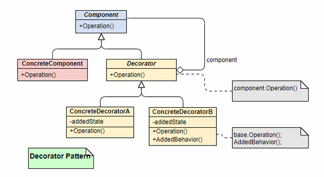

* 核心角色：
  * **Component (抽象构件):** 这是⼀个接⼝或抽象类，它定义了原始对象和装饰器对象所共有的接
    ⼝，确保它们可以被⼀致地对待。
  * **ConcreteComponent (具体构件):** 这就是我们的“裸对象”，即被装饰的原始对象，它实现了
    Component 接⼝。
  * **Decorator (抽象装饰器):** 它也实现了Component 接⼝，并且内部持有⼀个Component 类型的引⽤（即它要装饰的对象）。它的存在是为了将装饰逻辑与基础组件分离开。
  * **ConcreteDecorator (具体装饰器):** 这是实际的“⾐服”。它继承⾃Decorator ，负责向被装饰的对象添加具体的新功能。在实现Component 接⼝的⽅法时，它除了调⽤原始对象（通过持有的引⽤）的相应⽅法外，还会加上⾃⼰的“装饰”逻辑。

### 使用场景

* 运⾏时动态扩展功能。 当我们希望在运⾏时根据不同条件为对象增添不同功能时，装饰器模式是绝佳选择。最经典的例⼦就是Java的I/O流。
* 场景⼆：当继承⽅案不可⾏或不适⽤时。 如果⼀个类被 final 修饰，我们⽆法通过继承来扩展它。此时，装饰器模式就成了“救星”。

## 组合模式

### 介绍

* 将对象组合成树形结构以表示"部分-整体"的层次结构。组合模式使得用户对单个对象和组合对象的使用具有一致性。
* 使用场景：

  * 当需要表示对象的层次结构时，如文件系统或组织结构。
  * 当希望客户端代码能够以一致的方式处理树形结构中的所有对象时。
* 优点

  * 简化客户端代码，易于扩展
* 缺点

  * 违反依赖倒置原则：组件的声明是基于具体类而不是接口，这可能导致代码的灵活性降低。
* 核心角色

  * **组件（Component）:**
    * 定义了组合中所有对象的通用接口，可以是抽象类或接口。它声明了用于访问和管理子组件的方法，包括添加、删除、获取子组件等。
  * **叶子节点（Leaf）:**
    * 表示组合中的叶子节点对象，叶子节点没有子节点。它实现了组件接口的方法，但通常不包含子组件。
  * **复合节点（Composite）:**
    * 表示组合中的复合对象，复合节点可以包含子节点，可以是叶子节点，也可以是其他复合节点。它实现了组件接口的方法，包括管理子组件的方法。
  * **客户端（Client）:**
    * 通过组件接口与组合结构进行交互，客户端不需要区分叶子节点和复合节点，可以一致地对待整体和部分。

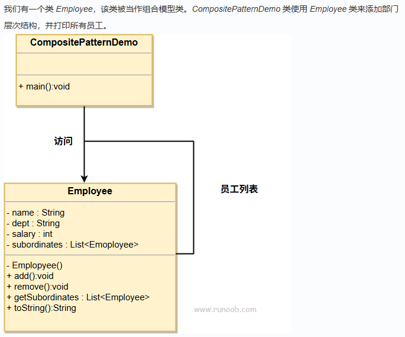

## 外观模式

### 介绍

* 为一个复杂的子系统提供一个一致的高层接口。这样，客户端代码就可以通过这个简化的接口与子系统交互，而不需要了解子系统内部的复杂性。
* 使用场景
  * 当客户端不需要了解系统内部的复杂逻辑和组件交互时。
  * 当需要为整个系统定义一个清晰的入口点时。
* 优点
  * 减少依赖
  * 提高灵活性
  * 增强安全性
* 缺点
  * 违反开闭原则
* 核心角色
  * **外观（Facade）:**
    * 提供一个简化的接口，封装了系统的复杂性。外观模式的客户端通过与外观对象交互，而无需直接与系统的各个组件打交道。
  * **子系统（Subsystem）:**
    * 由多个相互关联的类组成，负责系统的具体功能。外观对象通过调用这些子系统来完成客户端的请求。
  * **客户端（Client）:**
    * 使用外观对象来与系统交互，而不需要了解系统内部的具体实现。

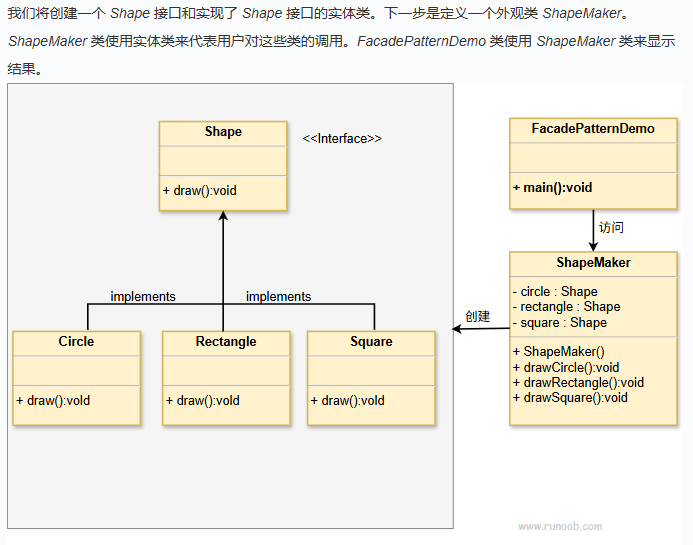
