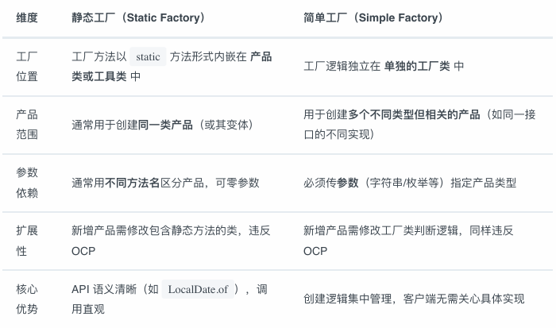

# 设计模式

可以理解为⼀套在特定场景下，针对软件设计中常⻅问题的、可复⽤的解决⽅案。

## SOLID原则

* 单一职责原则(Single Responsibility Principle, SRP)
  * 核⼼思想：⼀个类或模块应该有且只有⼀个引起它变化的原因。
  * 通俗来说：⼀个类只做⼀件相关的事情。
* 开闭原则 (Open-Closed Principle, OCP)
  * 核⼼思想：软件实体（类、模块、函数等）应该对扩展开放，对修改关闭。
  * 通俗来说：当需要增加新功能时，我们应该通过增加新的代码（例如新的⼦类或实现类）来实现，⽽不是去修改已有的、⼯作良好的代码。
  * **这是⾯向对象设计中最重要的⼀条原则，是实现系统可复⽤性和可维护性的基⽯**。
* ⾥⽒替换原则 (Liskov Substitution Principle, LSP)
  * 核⼼思想：所有引⽤基类的地⽅，都必须能够透明地使⽤其⼦类的对象。
  * 通俗来说：⼦类应当可以完全替换⽗类，并且程序的⾏为不会产⽣任何错误或异常。这意味着⼦类在继承⽗类时，不应该改变⽗类预期的⾏为。它是实现开闭原则的重要⽅式之⼀。
* 接⼝隔离原则 (Interface Segregation Principle, ISP)
  * 核⼼思想：客户端不应该被强迫依赖它不需要的接⼝。⼀个类对另⼀个类的依赖应该建⽴在最⼩的接⼝之上。
  * 通俗来说：接⼝的设计要“专”，不要设计⼤⽽全的“胖接⼝”，⽽应该根据功能设计多个细粒度的接⼝。这样可以避免⼀个类为了实现接⼝中的某⼀个功能，⽽不得不实现所有其他它并不需要的功能。
* 依赖倒置原则 (Dependency Inversion Principle, DIP)
  * 核⼼思想：⾼层模块不应该依赖于低层模块，两者都应该依赖于抽象；抽象不应该依赖于细节，细节应该依赖于抽象。
  * 通俗来说：我们要⾯向接⼝编程，⽽不是⾯向实现编程。代码的依赖关系应该通过抽象
    （如接⼝或抽象类）来建⽴，⽽不是具体的实现类。这样可以⼤⼤降低模块间的耦度，
    ⽅便系统的升级和扩展

## 其他原则

* 合成/聚合复⽤原则 (Composite/Aggregate Reuse Principle, CARP)
  * 核⼼思想：尽量使⽤对象组合（合成/聚合）的⽅式，⽽不是继承来达到代码复⽤的⽬的。
  * 通俗来说：“has-a” 关系通常⽐ “is-a” 关系更灵活。继承是⼀种强耦合关系（⽩盒复⽤），⽽组合是⼀种弱耦合关系（⿊盒复⽤），后者更容易维护和扩展。
* 迪⽶特法则 (Law of Demeter, LoD) / 最少知识原则 (Least Knowledge Principle, LKP)
  * 核⼼思想：⼀个软件实体应当尽可能少地与其他实体发⽣相互作⽤
  * 通俗来说：⼀个对象应该对其他对象有尽可能少的了解，即“只和你的直接朋友交谈”。这有助于降低类之间的耦合度，让每个模块更加独⽴

## 设计模式的分类

### 创建型模式

* 关注点：对象的创建过程。这类模式将对象的创建和使⽤解耦，使得程序在创建对象时更
  具灵活性。它们隐藏了对象创建的复杂逻辑，使得我们⽆需直接使⽤ new 关键字。
* 核⼼思想：提供⼀种机制，使得客户端代码不必关⼼它所需要的具体是哪个类的实例，也
  不必关⼼这些实例是如何被创建和组织的。
* 常⻅模式：
  * 单例模式 (Singleton)
  * ⼯⼚⽅法模式 (Factory Method)
  * 抽象⼯⼚模式 (Abstract Factory)
  * 建造者模式 (Builder)
  * 原型模式 (Prototype)

### 结构性模式

* 关注点：类和对象的组合。这类模式研究如何将类和对象组合在⼀起，形成更⼤、更复杂
  的结构，同时保持结构的灵活性和效率。
* 核⼼思想：通过继承、组合等⽅式，在不改变原有类的情况下，为其增加新的功能或适配
  不同的接⼝。
* 常⻅模式：
  * 适配器模式 (Adapter)
  * 桥接模式 (Bridge)
  * 组合模式 (Composite)
  * 装饰器模式 (Decorator)
  * 外观模式 (Facade)
  * 享元模式 (Flyweight)
  * 代理模式 (Proxy)

### 行为型模式

* 关注点：对象之间的通信和职责分配。这类模式专⻔处理对象之间的交互和协作，以及算法和责任的分配。
* 核⼼思想：通过定义对象间的通信模式来降低它们之间的耦合度，使得系统中的对象可以
  独⽴地变化。
* 常⻅模式：
  * 责任链模式 (Chain of Responsibility)
  * 命令模式 (Command)
  * 迭代器模式 (Iterator)
  * 中介者模式 (Mediator)
  * 备忘录模式 (Memento)
  * 观察者模式 (Observer)
  * 状态模式 (State)
  * 策略模式 (Strategy)
  * 模板⽅法模式 (Template Method)
  * 访问者模式 (Visitor)
  * 解释器模式 (Interpreter)

## 工厂模式

### 介绍

主要解决的是对象的创建问题，将对象的创建和使⽤过程进⾏解耦。根据其复杂度和应⽤场景的不同，通常分为三种：

* 简单⼯⼚模式
* ⼯⼚⽅法模式
* 抽象⼯⼚模式

UML类图：


角色构成：

* ⼯⼚ (Factory)：负责实现创建所有实例的内部逻辑。
* 抽象产品 (AbstractProduct)：所有被创建对象的⽗类或接⼝。
* 具体产品 (ConcreteProduct)：⼯⼚类创建的⽬标实例。

解决的问题：将客户端代码与具体产品的实现类解耦。客户端只需“消费”产品，⽽⽆需关⼼产品是如何被创建的。

优缺点：

* 优点：
  * 结构简单，将创建逻辑集中管理，实现了职责分离。
  * 避免创作者和具体产品之间的紧密耦合
  * 遵守单一责任原则
  * 遵守开闭原则
* 缺点：引入新的子类，代码可能变得复杂

实例：

* Java 的Calendar.getInstance() ⽅法，内部会根据时区、地区等参数创建具体的⽇历对象。
* Spring 的BeanFactory 在概念上就是⼀个强⼤的简单⼯⼚，你通过⼀个 bean 的名字
  （ID）就能获取到对应的实例，⽽⽆需关⼼这个 bean 是如何被创建和配置的。

```java
// 抽象产品：电⼦设备
interface Device {
 void operate(); // 操作设备
}
// 具体产品：⼿机
class Phone implements Device {
 @Override
 public void operate() {
  System.out.println("⼿机操作：开机 -> 显示主界⾯ -> 关机\n");
 }
}
// 具体产品：电脑
class Computer implements Device {
 @Override
 public void operate() {
  System.out.println("电脑操作：开机 -> 加载系统 -> 关机\n");
 }
}
 // 简单⼯⼚：设备⼯⼚
class DeviceFactory {
 // 根据类型创建设备
 public static Device createDevice(String type) {
  if (type.equalsIgnoreCase("PHONE")) {
   return new Phone();
  }
  else if (type.equalsIgnoreCase("COMPUTER")) {
   return new Computer();
  }
  return null;
 }
}
public class SimpleFactoryDemo {
 public static void main(String[] args) {
  // 通过⼯⼚创建设备
  Device phone = DeviceFactory.createDevice("PHONE");
  Device computer = DeviceFactory.createDevice("COMPUTER");
  // 使⽤设备
  phone.operate();
  computer.operate();
  }
}

```

## 静态工厂

静态⼯⼚（Static Factory） 是⼀种基于类的静态⽅法创建对象的⽅式

上⾯的简单⼯⼚模式代码⽤静态⼯⼚改写如下：

```java
// 抽象产品：电⼦设备
interface Device {
 void operate(); // 操作设备
}

// 具体产品：⼿机（包含静态⼯⼚⽅法）
class Phone implements Device {
 // 私有构造函数，强制通过静态⼯⼚创建
 private Phone() {}
 
 // 静态⼯⼚⽅法：创建⼿机实例
 public static Phone createPhone() {
  return new Phone();
 }
 
 @Override
 public void operate() {
  System.out.println("⼿机操作：开机 -> 显示主界⾯ -> 关机\n");
 }
}

// 具体产品：电脑（包含静态⼯⼚⽅法）
class Computer implements Device {
 // 私有构造函数，强制通过静态⼯⼚创建
 private Computer() {}
 
 // 静态⼯⼚⽅法：创建电脑实例
 public static Computer createComputer() {
  return new Computer();
 }
 
 @Override
 public void operate() {
  System.out.println("电脑操作：开机 -> 加载系统 -> 关机\n");
 }
}

// 客户端使⽤
public class StaticFactoryDemo {
 public static void main(String[] args) {
  // 通过静态⼯⼚⽅法直接创建设备
  Device phone = Phone.createPhone();
  Device computer = Computer.createComputer();
  // 使⽤设备
  phone.operate();
  computer.operate();
 }
}
```

## 静态工厂和简单工厂对比



## 工厂方法模式

* 为了解决简单⼯⼚模式违反开闭原则的问题，⼯⼚⽅法模式将创建具体对象的任务下放给⼦类。
* 它定义了⼀个⽤于创建对象的抽象⽅法，但由⼦类来决定要实例化哪⼀个类。
* UML类图：


* 角色组成

  * 抽象⼯⼚ (AbstractFactory)：声明了创建产品的抽象⽅法。
  * 具体⼯⼚ (ConcreteFactory)：实现抽象⽅法，负责创建具体的产品。
  * 抽象产品 (AbstractProduct)：与简单⼯⼚模式相同。
  * 具体产品 (ConcreteProduct)：与简单⼯⼚模式相同。
* 解决的问题：在不修改现有⼯⼚类的情况下，轻松扩展新的产品。如果想增加⼀个新产品，只
  需增加⼀个新的具体产品类和⼀个对应的具体⼯⼚类即可，完全符合开闭原则
* 优缺点

  * 优点：完美遵循开闭原则，扩展性好。符合单⼀职责原则。
  * 缺点：每增加⼀个产品，就需要增加⼀个具体⼯⼚类

## 抽象工厂模式 

* 创建的不是单一产品，而是一个产品族
* 它提供⼀个接⼝，⽤于创建⼀系列相关或相互依赖的对象，⽽⽆需指定它们具体的
  类。可以理解为它是“⼯⼚的⼯⼚”。
* 产品等级结构：同⼀类产品的不同实现（如按钮可以有 Windows 按钮、Mac 按钮，这构成⼀
  个产品等级结构）
  产品族：同⼀品牌或⻛格下的不同产品（如 Windows ⻛格下的按钮、⽂本框、复选框，构成
  ⼀个产品族）


* 角色组成
  * 抽象⼯⼚ (AbstractFactory)：定义了创建⼀系列不同产品（⼀个产品族）的接⼝。
  * 具体⼯⼚ (ConcreteFactory)：实现接⼝，创建特定主题或⻛格的产品族。
  * 抽象产品 (AbstractProduct)：为产品族中的每⼀种产品定义接⼝。
  * 具体产品 (ConcreteProduct)：实现抽象产品接⼝，是具体⼯⼚创建的⽬标。
* 解决的问题：解决创建⼀整个产品家族的问题，保证客户端在切换不同产品族时，能获得⼀整
  套相互兼容和匹配的对象。
* 优缺点：
  * 优点：⾮常适合⽤于创建⼀系列相互匹配的产品。切换整个产品族⾮常⽅便，只需更换具
    体的⼯⼚即可。
  * 缺点：扩展新的产品等级结构困难。例如，如果产品族需要增加⼀个“⿏标”，那么`AbstractFactory `接⼝就需要增加⼀个`createMouse() `⽅法，所有已经实现的具体⼯⼚类也都要跟着修改，这违反了开闭原则。

## 简单工厂、工厂方法、抽象工厂


