# 类图

## 类的表示方式

* 可见性表示：
  * +：public
  * -：private
  * #：protected
* 属性：可见性 名称 : 类型 [= 缺省值]
* 方法：可见性 名称(参数列表) [:  返回类型]

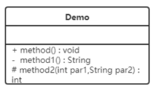

## 类之间的关系表示

### 关联关系

#### 单向关联

* 单箭头的实线
* 一方存在另一方类型的成员变量

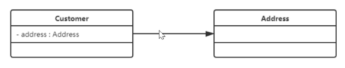

#### 双向关联

* 不带箭头的实现
* 双方各自持有对方类型的成员变量

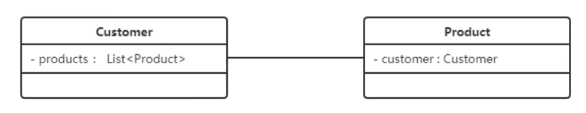

#### 自关联

* 指向自身的箭头

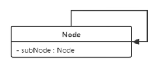

### 聚合关系

* 带空心菱形的实现表示，菱形指向整体
* 成员对象可以脱离整体对象独立存在

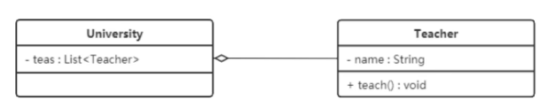

### 组合关系

* 带实心菱形的实现表示，菱形指向整体
* 成员对象不可以脱离整体对象独立存在
* 整体对象可以控制部分对象的生命周期

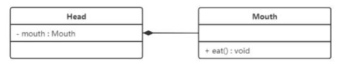

### 依赖关系

* 带箭头的虚线表示
* 耦合度最弱，是临时性的关联

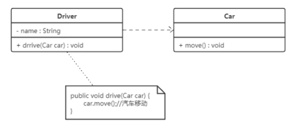

### 继承关系

* 带空心三角箭头的实线表示，箭头指向父类
* 父类和子类关系，继承

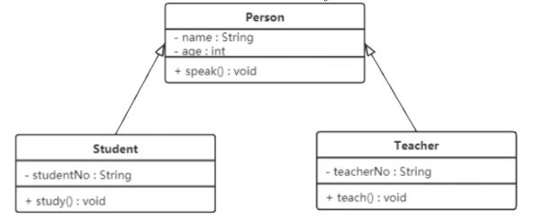

### 实现关系

* 带空心三角箭头的虚线表示，箭头从实现类指向接口
* 接口和实现类的关系

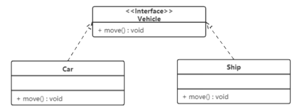

# 软件设计原则

## 开闭原则

* 对扩展开放，对修改关闭。不能修改原有代码
* 使用接口和抽象类（灵活性好）

## 里氏替换原则

* 任何基类可以出现的地方，子类一定可以出现
* 子类可以扩展父类功能，但是不能改变父类原有功能，尽量不要重写父类方法

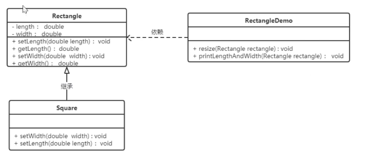

改进

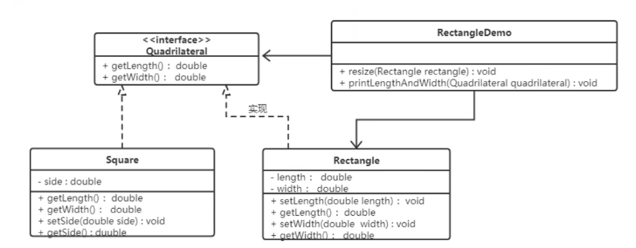

## 依赖倒转原则

* ⾼层模块不应该依赖于低层模块，两者都应该依赖于抽象；抽象不应该依赖于细节，细节应该依赖于抽象。
* 我们要⾯向接⼝编程，⽽不是⾯向实现编程。代码的依赖关系应该通过抽象
  （如接⼝或抽象类）来建⽴，⽽不是具体的实现类。
* 反例：
* 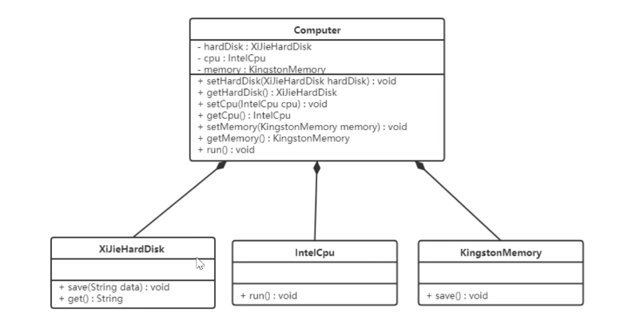
* 改进
* 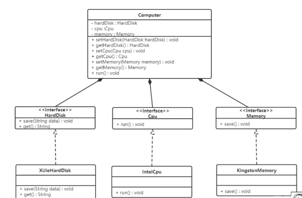

## 接口隔离原则

* 客户端不应该被强迫依赖它不需要的接⼝。⼀个类对另⼀个类的依赖应该建⽴在最⼩的接⼝之上。

## 迪米特原则

* ⼀个软件实体应当尽可能少地与其他实体发⽣相互作⽤，只和最直接的部分交互

## 合成复用原则

* 尽量使⽤对象组合（合成/聚合）的⽅式，⽽不是继承来达到代码复⽤的⽬的。

# 创建者模式

将对象的创建和使用分离，降低系统的耦合度，使用者不需要关注对象的创建细节

## 单例模式

* 涉及到一个单一的类，负责创建自己的对象，提供一个访问其对象的唯一方式

### 角色

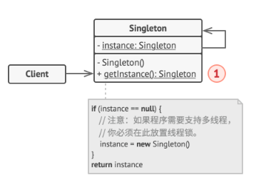

* 单例类：只能创建一个实例
* 访问类：使用单例类

### 实现方式

* 饿汉式：类加载时单例就创建
* 懒汉式：类加载时单例不会被创建，首次使用才会创建
* 饿汉式

  * 方式1：静态成员变量
  * 方式2：静态代码块
  * 优点：类⼀加载就创建对象，天生线程安全，效率高。
  * 缺点：不是懒加载。如果这个实例从未使⽤过，会造成内存浪费。
* 懒汉式

  * 方式1：静态变量
  * 方式2：静态变量+加锁
  * 方式3：双重检查锁
  * 方式4：静态内部类
  * 方式5：枚举类

### 存在的问题

* 破坏了单例模式（序列化和反射）

### 应用场景

* 程序对于客户端只有一个可用的实例
* 需要严格地控制全局变量

## 工厂模式

### 简单工厂模式

* 优点
  * 可以通过参数直接获取对象
  * 避免修改客户端代码
  * 新产品只需要直接修改工厂类
* 缺点
  * 违背开闭原则

### 工厂方法

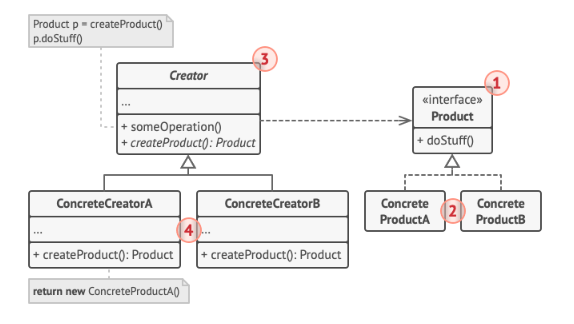

* 角色组成

  * 抽象⼯⼚ (AbstractFactory)：声明了创建产品的抽象⽅法。
  * 具体⼯⼚ (ConcreteFactory)：实现抽象⽅法，负责创建具体的产品
  * 抽象产品 (AbstractProduct)：与简单⼯⼚模式相同
  * 具体产品 (ConcreteProduct)：与简单⼯⼚模式相同。
* 优缺点

  * 优点：完美遵循开闭原则，扩展性好。符合单⼀职责原则。
  * 缺点：每增加⼀个产品，就需要增加⼀个具体⼯⼚类

### 抽象工厂

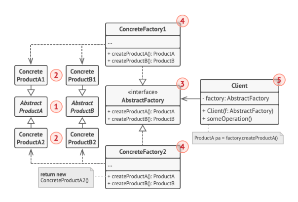

* 角色组成
  * 抽象⼯⼚ (AbstractFactory)：定义了创建⼀系列不同产品（⼀个产品族）的接⼝。
  * 具体⼯⼚ (ConcreteFactory)：实现接⼝，创建特定主题或⻛格的产品族。
  * 抽象产品 (AbstractProduct)：为产品族中的每⼀种产品定义接⼝。
  * 具体产品 (ConcreteProduct)：实现抽象产品接⼝，是具体⼯⼚创建的⽬标。

## 原型模式

* 用一个已经创建的实例作为原型，通过复制该原型对象创建一个相同的新对象

### 角色

* 抽象原型类：规定clone方法
* 具体原型类：实现clone方法
* 访问类：使用clone复制新对象

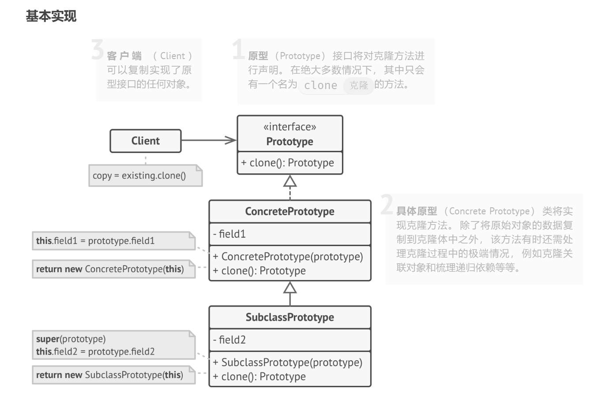

### 浅克隆和深克隆

* 浅克隆：新对象属性和源对象属性相同，非基本类型属性，二者指向对象的内存地址相同
* 深克隆：新对象中属性中引用的其他对象也会被克隆，不再实现原有对象地址
* **Java中的 `clone`属于浅克隆**
* 使用深克隆需要使用对象流

### 使用场景

* 对象创建复杂
* 性能和安全要求比较高

## 建造者模式

* 将复杂对象的创建和表示分离，同样的创建过程可以创建不同的表示

### 角色

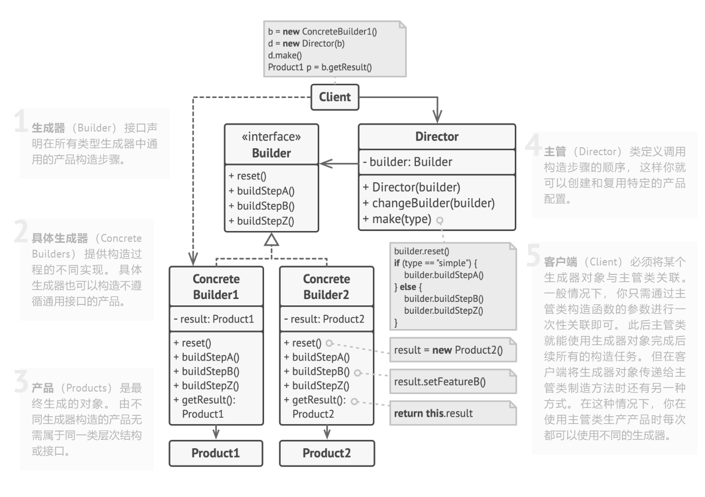

* 生成器：规定产品的创建步骤
* 具体生成器：提供不同的创建实现，也可以创建不遵守通用步骤的产品
* 产品：要创建的对象
* 主管：调用构造步骤的顺序

（有时会将主管和生成器类合并）

### 优缺点

* 优点
  * 封装性好，产品和建造者类比较稳定
  * 解耦产品本身和产品创建
  * 可以精细地控制产品创建
  * 容易进行扩展
* 缺点
  * 建造者创建的产品一般有较多共同点，若产品差异较大，则不适合用

### 使用场景

* 创建对象较复杂，由多个部件构成，各部件变化大，但部件的构造顺序稳定
* 产品的构建和最终的表示是独立的

# 结构性模式

* 描述如何将类或对象按某种布局组成更大的结构
* 分为类结构性模式和对象结构性模式

## 代理模式

* 提供对象的替代品或其占位符。代理控制着对于原对象的访问， 并允许在将请求提交给对象前后进行一些处理。
* 分为静态代理和动态代理
  * 静态：编译时就生成
    * JDK
    * 
  * 动态：在Java运行时动态生成

### 角色

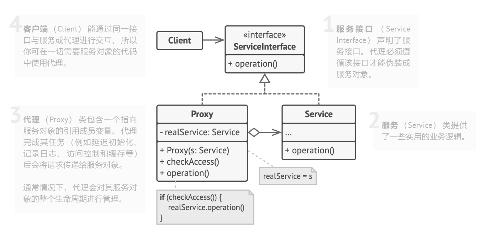

### 静态代理和动态代理

* 动态代理中，接口声明的所有方法都被转移到调用处理器的一个集中的方法处理（invoke）
* 如果接口增加一个方法，静态代理模式中，所有实现类和代理类都要实现新方法，增加了代码维护的复杂性。动态代理则没有这个问题、

### 优缺点

* 优点
  * 保护目标对象
  * 扩展目标对象功能
  * 将客户端与目标对象分离，降低系统耦合度
* 缺点
  * 增加系统复杂度
  * 可能导致响应延迟

### 使用场景

* 远程代理
  * 本地服务通过网络请求远程服务
* 防火墙代理
  * VPN，防火墙将浏览器请求转给互联网；互联网返回响应时再返回浏览器
* 保护代理

## 适配器模式

* 使接口不兼容的对象能够相互合作

### 角色

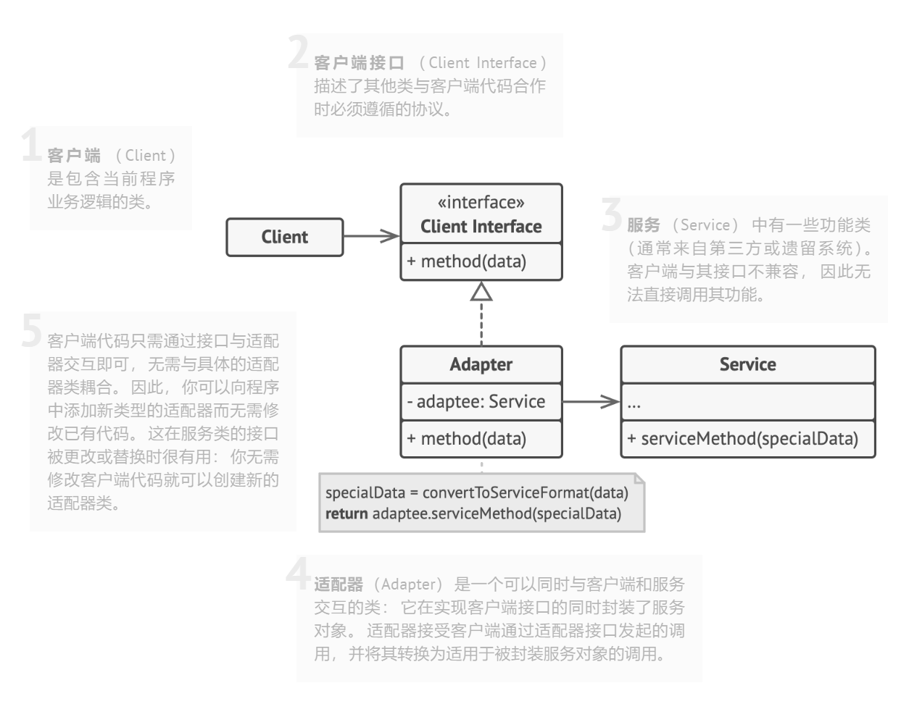

### 类适配器

* 适配器同时继承两个对象的接口。
* 这种方式仅能在支持多重继承的编程语言中实现，**例如 C++**
* 违背了合成复用原则

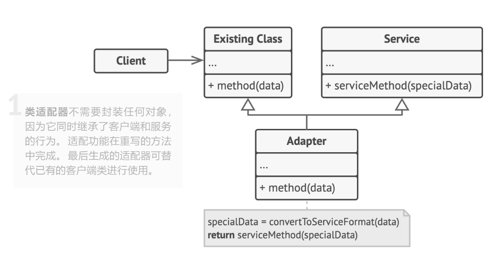

### 对象适配器

### 优缺点

* 优点
  * 单一职责原则：将接口/数据转化代码从程序主要业务逻辑中分离
  * 开闭原则：客户端代码通过适配器进行交互，可以不修改现有代码添加新的适配器
* 缺点
  * 代码整体复杂度增加。有时候直接更改服务类使其兼容更简单

### 应用场景

* 以前开发的系统存在满足新系统功能需求的类，但是接口不一致
* 使用第三方组件，但组件接口定义和自己要求的不同

## 装饰模式

* 在不改变现有对象结构的情况下，动态的给对象增加职责（额外功能）的模式

### 角色

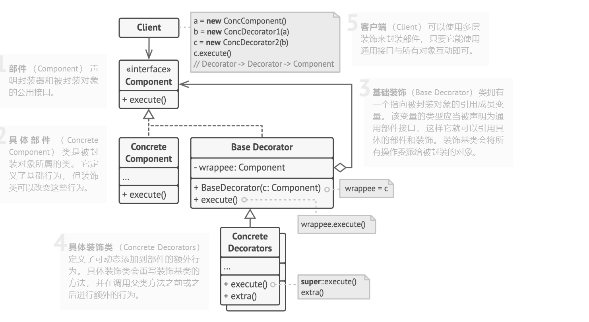

### 优缺点

* 优点
  * 灵活的扩展性能，遵循了开闭原则
  * 装饰者类和被装饰者类可以独立发展
  * 单一职责原则
* 缺点
  * 实现行为不受装饰栈顺序影响的装饰比较困难

### 使用场景

* 不能采用继承对系统进行扩充
  * 类被定义为final
  * 系统中存在大量独立扩展，添加新的子类会导致子类数目爆炸式增长
* 不影响其他类的情况下添加新功能
* 对象的功能可以动态添加和撤销

### 静态代理和装饰模式的区别

* 相同点
  * 都要实现与目标类相同的业务接口
  * 在两个类中都需要声明目标对象
  * 都可以在不修改目标类的前提下增强目标方法
* 不同点
  * 目的不同
    * 装饰者是为了增强目标对象
    * 静态代理是为了保护和隐藏目标对象
  * 获取目标对象构建的地方不同
    * 装饰者是由外界传递，可以通过构造方法传递
    * 静态代理是在代理内部创建，以此来隐藏目标对象

## 桥接模式

* 可将一个大类或一系列紧密相关的类拆分为抽象和实现两个独立的层次结构，从而能在开发时分别使用
* 将抽象和实现分离，使用组合代替继承

### 角色

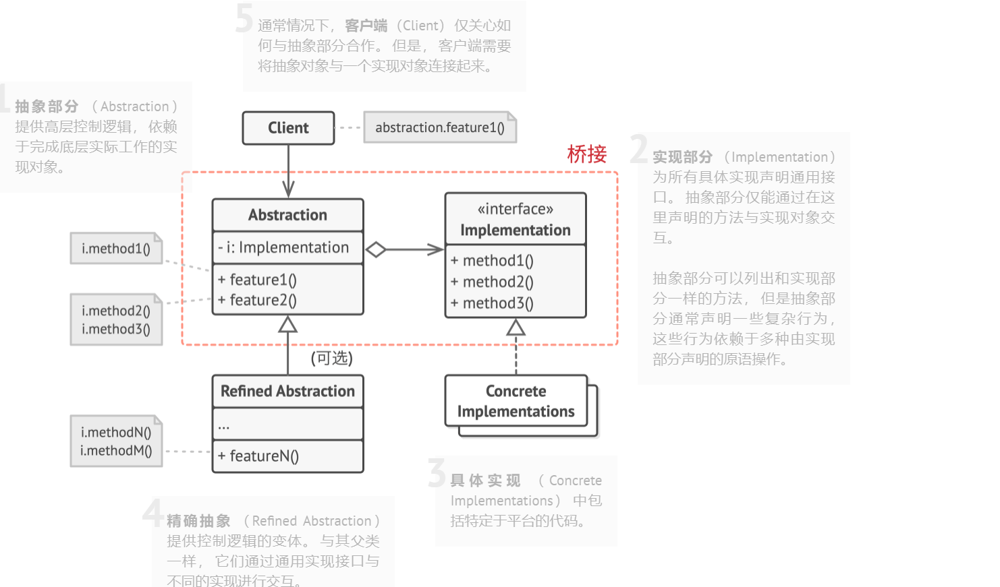

### 优缺点

* 优点
  * 开闭原则，可以新增其中一个部分而不会影响其他部分
  * 实现细节对客户透明
* 缺点
  * 可能导致代码复杂

### 使用场景

* 类存在两个独立变化的维度，且这两个维度都需要扩展‘
* 拆分/重组一个具有多重功能的复杂类
* 运行时切换不同实现方法

## 外观模式

### 角色

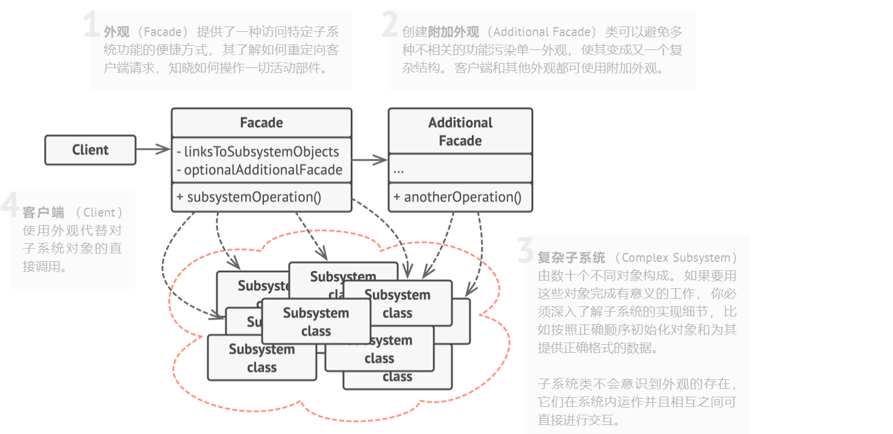

### 优缺点

* 优点
  * 代码独立于复杂的子系统
* 缺点
  * 外观可能导致高耦合

### 使用场景

* 客户端和子系统存在很大联系，引入外观可以分离
* 为系统设计简单的接口供外界访问

## 组合模式

* 将对象组合成树状结构，并且能像使用独立对象一样使用它们。

### 角色

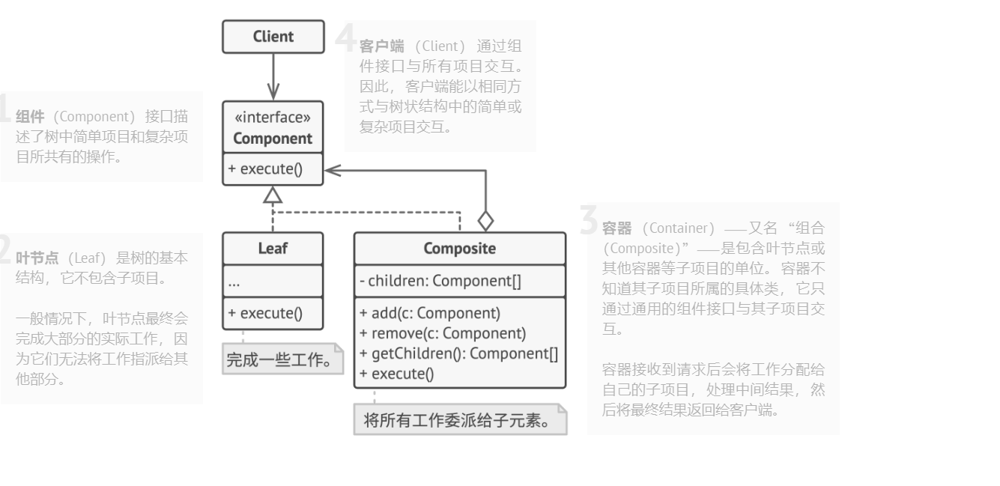

### 透明组合模式

* 组合模式的标准形式，抽象根节点中声明了所有管理成员对象的方法
* 优点：确保所有的构建类都有相同的接口
* 缺点：不安全，叶子对象不会包含成员对象，因此部分方法是没有意义的，调用这些方法可能出错

### 安全组合模式

* 不在抽象节点中声明管理成员对象的方法，而是在树枝节点声明并实现这些方法
* 优点：安全
* 缺点：不够透明，客户端能不能完全面向抽象编程，需要有区别地对待叶子构件和容器构件

### 优缺点

* 优点：
  * 清楚定义复杂的分层对象，让客户端忽略了层次的差异
  * 客户端可以一致使用组合结构或者单个对象
  * 增加新的树枝节点和叶子节点方便
* 缺点
  * 对于功能差异较大的类，提供公共接口或许会有困难

### 使用场景

* 需要实现树状对象结构
* 希望客户端代码以相同方式处理简单和复杂元素

## 享元模式

* 运用共享技术来有效的支持大量细粒度对象的复用
* 共享已存在的对象，大幅减少需要创建的对象数量，提高对象利用率

### 角色

* 内部状态：不会随着环境改变而改变的可共享部分
* 外部状态：会随着环境改变而改变的不可共享部分

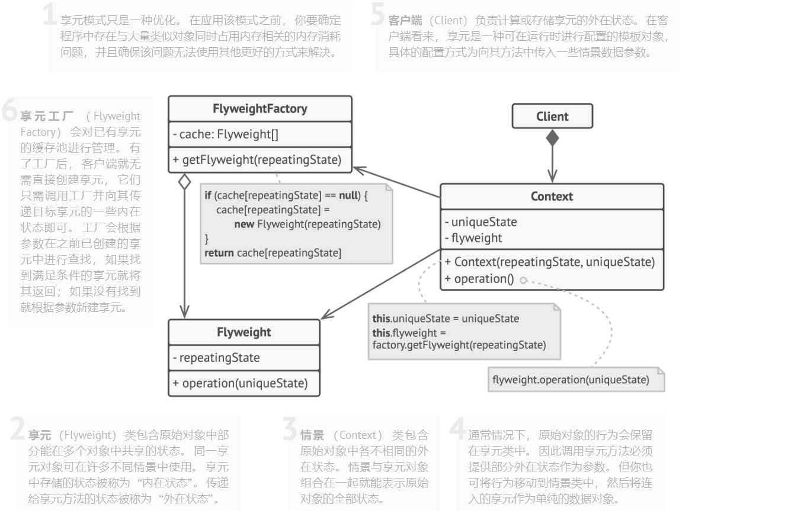

### 优缺点

* 优点
  * 极大减少内存中相似或者相同对象的数量
  * 外部状态相对独立，且不影响内部状态
* 缺点
  * 为了使对象可以共享，需要将享元对象的部分状态外部化，分离内部和外部状态，程序会变得复杂

### 使用场景

* 系统存在大量相同或相似的对象
* 对象的大部分状态都可以外部化
